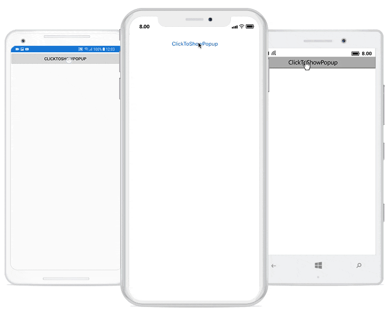
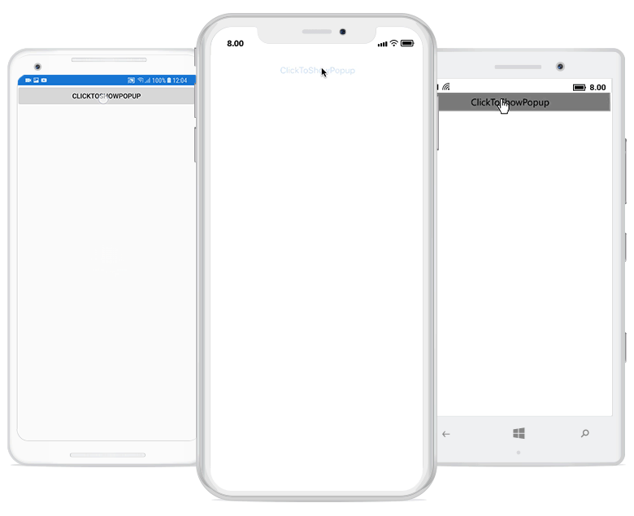
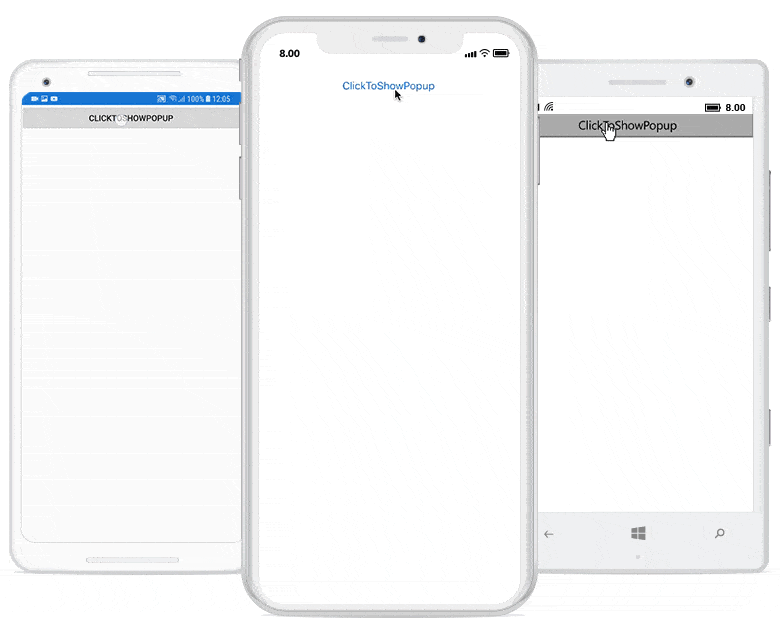

---
layout: post
title: Popup Animations | SfPopupLayout |Xamarin| Syncfusion
description: Explains the various built-in animation modes and easing effects available in Xamarin.Forms PopupLayout.
platform: Xamarin
control: SfPopupLayout
documentation: ug
--- 

# Popup Animations

## Animation Modes

Built-in animations are available in SfPopupLayout, which is applied when the PopupView opens and closes in the screen.
The SfPopupLayout has different animation modes as listed below:

* [Zoom](https://help.syncfusion.com/cr/xamarin/Syncfusion.XForms.PopupLayout.AnimationMode.html)
* [Fade](https://help.syncfusion.com/cr/xamarin/Syncfusion.XForms.PopupLayout.AnimationMode.html)
* [SlideOnLeft](https://help.syncfusion.com/cr/xamarin/Syncfusion.XForms.PopupLayout.AnimationMode.html)
* [SlideOnRight](https://help.syncfusion.com/cr/xamarin/Syncfusion.XForms.PopupLayout.AnimationMode.html)
* [SlideOnTop](https://help.syncfusion.com/cr/xamarin/Syncfusion.XForms.PopupLayout.AnimationMode.html)
* [SlideOnBottom](https://help.syncfusion.com/cr/xamarin/Syncfusion.XForms.PopupLayout.AnimationMode.html)
* [None](https://help.syncfusion.com/cr/xamarin/Syncfusion.XForms.PopupLayout.AnimationMode.html)

N> Setting of AnimationMode is same for both `Displaying popup when the SfPopupLayout is set as root view` and `Displaying popup on the go`. 

### Zoom 

Zoom-out animation will be applied when the PopupView opens and Zoom-in animation will be applied when the PopupView closes.





<sfPopup:SfPopupLayout x:Name="popUpLayout">
    <sfPopup:SfPopupLayout.PopupView>
        <sfPopup:PopupView AnimationMode="Zoom" />
    </sfPopup:SfPopupLayout.PopupView>
</sfPopup:SfPopupLayout>





//MainPage.cs

public MainPage()
{
    ....
    InitializeComponent();
    popupLayout.PopupView.AnimationMode = AnimationMode.Zoom;
    ....
}





### Fade 

Fade-out animation will be applied when the PopupView opens and Fade-in animation will be applied when the PopupView closes.





<sfPopup:SfPopupLayout x:Name="popUpLayout">
    <sfPopup:SfPopupLayout.PopupView>
        <sfPopup:PopupView AnimationMode="Fade" />
    </sfPopup:SfPopupLayout.PopupView>
</sfPopup:SfPopupLayout>





//MainPage.cs

public MainPage()
{
    ....
    InitializeComponent();
    popupLayout.PopupView.AnimationMode = AnimationMode.Fade;
    ....
}





### SlideOnLeft 

PopupView will be animated from left-to-right when it opens and from right-to-left when it closes.





<sfPopup:SfPopupLayout x:Name="popUpLayout">
    <sfPopup:SfPopupLayout.PopupView>
        <sfPopup:PopupView AnimationMode="SlideOnLeft" />
    </sfPopup:SfPopupLayout.PopupView>
</sfPopup:SfPopupLayout>





//MainPage.cs

public MainPage()
{
    ....
    InitializeComponent();
    popupLayout.PopupView.AnimationMode = AnimationMode.SlideOnLeft;
    ....
}





### SlideOnRight

PopupView will be animated from right-to-left when it opens and from left-to-right when it closes.





<sfPopup:SfPopupLayout x:Name="popUpLayout">
    <sfPopup:SfPopupLayout.PopupView>
        <sfPopup:PopupView AnimationMode="SlideOnRight" />
    </sfPopup:SfPopupLayout.PopupView>
</sfPopup:SfPopupLayout>





//MainPage.cs

public MainPage()
{
    ....
    InitializeComponent();
    popupLayout.PopupView.AnimationMode = AnimationMode.SlideOnRight;
    ....
}





### SlideOnTop 

PopupView will be animated from top-to-bottom when it opens and from bottom-to-top when it closes.





<sfPopup:SfPopupLayout x:Name="popUpLayout">
    <sfPopup:SfPopupLayout.PopupView>
        <sfPopup:PopupView AnimationMode="SlideOnTop" />
    </sfPopup:SfPopupLayout.PopupView>
</sfPopup:SfPopupLayout>





//MainPage.cs

public MainPage()
{
    ....
    InitializeComponent();
    popupLayout.PopupView.AnimationMode = AnimationMode.SlideOnTop;
    ....
}





### SlideOnBottom

PopupView will be animated from bottom-to-top when it opens and from top-to-bottom when it closes.





<sfPopup:SfPopupLayout x:Name="popUpLayout">
    <sfPopup:SfPopupLayout.PopupView>
        <sfPopup:PopupView AnimationMode="SlideOnBottom" />
    </sfPopup:SfPopupLayout.PopupView>
</sfPopup:SfPopupLayout>





//MainPage.cs

public MainPage()
{
    ....
    InitializeComponent();
    popupLayout.PopupView.AnimationMode = AnimationMode.SlideOnBottom;
    ....
}





### None

Animation will not be applied.





<sfPopup:SfPopupLayout x:Name="popUpLayout">
    <sfPopup:SfPopupLayout.PopupView>
        <sfPopup:PopupView AnimationMode="None" />
    </sfPopup:SfPopupLayout.PopupView>
</sfPopup:SfPopupLayout>





//MainPage.cs

public MainPage()
{
    ....
    InitializeComponent();
    popupLayout.PopupView.AnimationMode = AnimationMode.None;
    ....
}





## Animation Easing Effects

The `SfPopupLayout` allows to show the `PopupView` with various easing effects for all available `SfPopupLayout.PopupView.AnimationMode` using the [SfPopupLayout.PopupView.AnimationEasing](https://help.syncfusion.com/cr/xamarin/Syncfusion.XForms.PopupLayout.AnimationEasing.html) property .