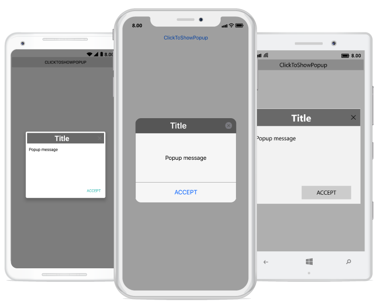
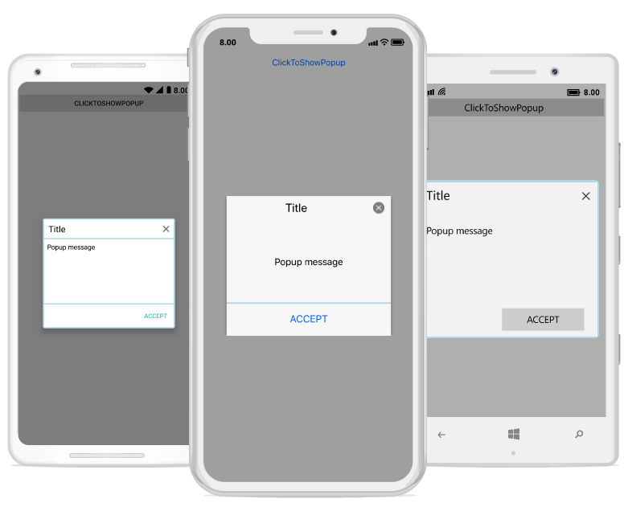
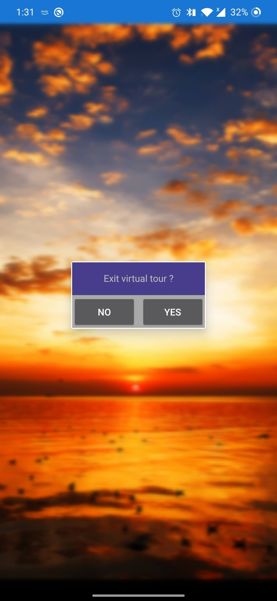

---
layout: post
title: Styles | SfPopupLayout |Xamarin | Syncfusion
description: Apply styles for all the elements in Xamarin.Forms PopupLayout(SfPopupLayout). Customize the Border, Popup Header and  Footer in the PopupLayout.
platform: Xamarin
control: SfPopupLayout
documentation: ug
--- 

# Styling in Xamarin.Forms Popup(SfPopupLayout)

The SfPopupLayout applies style to all of its elements by using the [SfPopupLayout.PopupView.PopupStyle](https://help.syncfusion.com/cr/xamarin/Syncfusion.XForms.PopupLayout.PopupView.html#Syncfusion_XForms_PopupLayout_PopupView_PopupStyle) property.

## Styling popup header

The SfPopupLayout allows customizing the header elements with various header customizations as follows:

<table>
<tr>
<th> Property </th>
<th> Description </th>
</tr>
<tr>
<td> {{'[SfPopupLayout.PopupView.PopupStyle.HeaderBackgroundColor](https://help.syncfusion.com/cr/xamarin/Syncfusion.XForms.PopupLayout.PopupStyle.html#Syncfusion_XForms_PopupLayout_PopupStyle_HeaderBackgroundColor)'| markdownify }} </td>
<td>  Gets or sets the background color for the header.</td>
</tr>
<tr>
<td> {{'[SfPopupLayout.PopupView.PopupStyle.HeaderFontAttribute](https://help.syncfusion.com/cr/xamarin/Syncfusion.XForms.PopupLayout.PopupStyle.html#Syncfusion_XForms_PopupLayout_PopupStyle_HeaderFontAttribute)'| markdownify }} </td>
<td>  Gets or sets the font attribute for the header title.</td>
</tr>
<tr>
<td> {{'[SfPopupLayout.PopupView.PopupStyle.HeaderFontFamily](https://help.syncfusion.com/cr/xamarin/Syncfusion.XForms.PopupLayout.PopupStyle.html#Syncfusion_XForms_PopupLayout_PopupStyle_HeaderFontFamily)'| markdownify }} </td>
<td>  Gets or sets the font style for the header title.</td>
</tr>
<tr>
<td> {{'[SfPopupLayout.PopupView.PopupStyle.HeaderFontSize](https://help.syncfusion.com/cr/xamarin/Syncfusion.XForms.PopupLayout.PopupStyle.html#Syncfusion_XForms_PopupLayout_PopupStyle_HeaderFontSize)'| markdownify }} </td>
<td> Gets or sets the font size for the header title.</td>
</tr>
<tr>
<td> {{'[SfPopupLayout.PopupView.PopupStyle.HeaderTextAlignment](https://help.syncfusion.com/cr/xamarin/Syncfusion.XForms.PopupLayout.PopupStyle.html#Syncfusion_XForms_PopupLayout_PopupStyle_HeaderTextAlignment)'| markdownify }} </td>
<td>  Gets or sets the text alignment for the header.</td>
</tr>
<tr>
<td> {{'[SfPopupLayout.PopupView.PopupStyle.HeaderTextColor](https://help.syncfusion.com/cr/xamarin/Syncfusion.XForms.PopupLayout.PopupStyle.html#Syncfusion_XForms_PopupLayout_PopupStyle_HeaderTextColor)'| markdownify }} </td>
<td>  Gets or sets the text color to be applied for the header title.</td>
</tr>
</table>

Refer to the following code example for customizing the header elements.





<sfPopup:SfPopupLayout x:Name="popUpLayout">
    <sfPopup:SfPopupLayout.PopupView>
        <sfPopup:PopupView>
            <sfPopup:PopupView.PopupStyle>
                <sfPopup:PopupStyle HeaderBackgroundColor="DimGray"
                                    HeaderFontAttribute="Bold"
                                    HeaderFontFamily="Helvetica-Bold"
                                    HeaderFontSize="25"
                                    HeaderTextAlignment="Center"
                                    HeaderTextColor="White"/>
            </sfPopup:PopupView.PopupStyle>
        </sfPopup:PopupView>
    </sfPopup:SfPopupLayout.PopupView>
</sfPopup:SfPopupLayout>





//MainPage.cs

public MainPage()
{
    ....
    InitializeComponent();
    popupLayout.PopupView.PopupStyle.HeaderBackgroundColor = Color.FromRgb(105,105,105);
    popupLayout.PopupView.PopupStyle.HeaderFontAttribute = FontAttributes.Bold;
    popupLayout.PopupView.PopupStyle.HeaderFontFamily = "Helvetica-Bold";
    popupLayout.PopupView.PopupStyle.HeaderFontSize = 25;
    popupLayout.PopupView.PopupStyle.HeaderTextAlignment = TextAlignment.Center;
    popupLayout.PopupView.PopupStyle.HeaderTextColor = Color.White;
    ....
}





Executing the above codes renders the following output in iOS, Android and Windows Phone devices respectively.

## Styling popup footer

The SfPopupLayout allows customizing the footer elements with various footer customizations as follows:

<table>
<tr>
<th> Property </th>
<th> Description </th>
</tr>
<tr>
<td> {{'[SfPopupLayout.PopupView.PopupStyle.FooterBackgroundColor](https://help.syncfusion.com/cr/xamarin/Syncfusion.XForms.PopupLayout.PopupStyle.html#Syncfusion_XForms_PopupLayout_PopupStyle_FooterBackgroundColor)'| markdownify }} </td>
<td>  Gets or sets the background color for the footer.</td>
</tr>
<tr>
<td> {{'[SfPopupLayout.PopupView.PopupStyle.AcceptButtonBackgroundColor](https://help.syncfusion.com/cr/xamarin/Syncfusion.XForms.PopupLayout.PopupStyle.html#Syncfusion_XForms_PopupLayout_PopupStyle_AcceptButtonBackgroundColor)'| markdownify }} </td>
<td>  Gets or sets the background color for the Accept button in the footer.</td>
</tr>
<tr>
<td> {{'[SfPopupLayout.PopupView.PopupStyle.AcceptButtonTextColor](https://help.syncfusion.com/cr/xamarin/Syncfusion.XForms.PopupLayout.PopupStyle.html#Syncfusion_XForms_PopupLayout_PopupStyle_AcceptButtonTextColor)'| markdownify }} </td>
<td>  Gets or sets the foreground color for the Accept button in the footer.</td>
</tr>
<tr>
<td> {{'[SfPopupLayout.PopupView.PopupStyle.DeclineButtonBackgroundColor](https://help.syncfusion.com/cr/xamarin/Syncfusion.XForms.PopupLayout.PopupStyle.html#Syncfusion_XForms_PopupLayout_PopupStyle_DeclineButtonBackgroundColor)'| markdownify }} </td>
<td> Gets or sets the background color for the Decline button in the footer.</td>
</tr>
<tr>
<td> {{'[SfPopupLayout.PopupView.PopupStyle.DeclineButtonTextColor](https://help.syncfusion.com/cr/xamarin/Syncfusion.XForms.PopupLayout.PopupStyle.html#Syncfusion_XForms_PopupLayout_PopupStyle_DeclineButtonTextColor)'| markdownify }} </td>
<td>  Gets or sets the foreground color for the Decline button in the footer.</td>
</tr>
</table>

Refer to the following code example for customizing the footer elements.





<sfPopup:SfPopupLayout x:Name="popUpLayout">
    <sfPopup:SfPopupLayout.PopupView>
        <sfPopup:PopupView AppearanceMode="TwoButton">
                <sfPopup:PopupView.PopupStyle>
                    <sfPopup:PopupStyle FooterBackgroundColor="LightGray"
                                        AcceptButtonBackgroundColor ="DimGray"
                                        AcceptButtonTextColor="White"
                                        DeclineButtonBackgroundColor="DimGray"
                                        DeclineButtonTextColor="White"
                                        />
                </sfPopup:PopupView.PopupStyle>
            </sfPopup:PopupView>
    </sfPopup:SfPopupLayout.PopupView>
</sfPopup:SfPopupLayout>





//MainPage.cs

public MainPage()
{
    ....
    InitializeComponent();

    // Setting the AppearanceMode as TwoButton
    popupLayout.PopupView.AppearanceMode = Syncfusion.XForms.PopupLayout.AppearanceMode.TwoButton;

    // Footer customization
    popupLayout.PopupView.PopupStyle.FooterBackgroundColor = Color.LightGray;
    popupLayout.PopupView.PopupStyle.AcceptButtonBackgroundColor = Color.FromRgb(105, 105, 105);
    popupLayout.PopupView.PopupStyle.AcceptButtonTextColor = Color.White;
    popupLayout.PopupView.PopupStyle.DeclineButtonBackgroundColor = Color.FromRgb(105, 105, 105);
    popupLayout.PopupView.PopupStyle.DeclineButtonTextColor = Color.White;
    ....
}





Executing the above codes renders the following output in iOS, Android and Windows Phone devices respectively.

## Border customization

The SfPopupLayout allows customizing the border appearance with various border customizations as follows:

<table>
<tr>
<th> Property </th>
<th> Description </th>
</tr>
<tr>
<td> {{'[SfPopupLayout.PopupView.PopupStyle.BorderColor](https://help.syncfusion.com/cr/xamarin/Syncfusion.XForms.PopupLayout.PopupStyle.html#Syncfusion_XForms_PopupLayout_PopupStyle_BorderColor)'| markdownify }} </td>
<td>  Gets or sets the border color for the PopupView.</td>
</tr>
<tr>
<td> {{'[SfPopupLayout.PopupView.PopupStyle.BorderThickness](https://help.syncfusion.com/cr/xamarin/Syncfusion.XForms.PopupLayout.PopupStyle.html#Syncfusion_XForms_PopupLayout_PopupStyle_BorderThickness)'| markdownify }} </td>
<td>  Gets or sets the border thickness for the PopupView.</td>
</tr>
<tr>
<td> {{'[SfPopupLayout.PopupView.PopupStyle.CornerRadius](https://help.syncfusion.com/cr/xamarin/Syncfusion.XForms.PopupLayout.PopupStyle.html#Syncfusion_XForms_PopupLayout_PopupStyle_CornerRadius)'| markdownify }} </td>
<td>  Gets or sets the corner radius for the PopupView.</td>
</tr>
</table>

Refer to the following code example for customizing the border elements.





<sfPopup:SfPopupLayout x:Name="popUpLayout">
    <sfPopup:SfPopupLayout.PopupView>
        <sfPopup:PopupView>
            <sfPopup:PopupView.PopupStyle>
                <sfPopup:PopupStyle BorderColor="LightBlue"
                                    BorderThickness="3"
                                    CornerRadius="5"
                                    />
            </sfPopup:PopupView.PopupStyle>
        </sfPopup:PopupView>
    </sfPopup:SfPopupLayout.PopupView>
<sfPopup:SfPopupLayout>





//MainPage.cs

public MainPage()
{
    ....
    InitializeComponent();
    popupLayout.PopupView.PopupStyle.BorderColor = Color.LightBlue;
    popupLayout.PopupView.PopupStyle.BorderThickness = 3;
    popupLayout.PopupView.PopupStyle.CornerRadius = 5;
    ....
}





Executing the above codes renders the following output in iOS, Android and Windows Phone devices respectively.

## Styling overlay background

The SfPopupLayout allows to customize the opacity and the background color of overlay using the `SfPopupLayout.PopupView.PopupStyle.OverlayOpacity` and `SfPopupLayout.PopupView.PopupStyle.OverlayColor` properties, respectively.

Refer to the following code example for customizing the overlay opacity and the background color.




        <sfPopup:SfPopupLayout x:Name="popUpLayout">
            <sfPopup:SfPopupLayout.PopupView>
                <sfPopup:PopupView>
                    <sfPopup:PopupView.PopupStyle>
                        <sfPopup:PopupStyle OverlayColor="Red" OverlayOpacity="0.2">
                        </sfPopup:PopupStyle>
                    </sfPopup:PopupView.PopupStyle>
                </sfPopup:PopupView>
            </sfPopup:SfPopupLayout.PopupView>
			</sfPopup:SfPopupLayout>




		    popUpLayout.PopupView.PopupStyle.OverlayColor = Color.Red;
            popUpLayout.PopupView.PopupStyle.OverlayOpacity = 0.2;





Executing the above codes renders the following output in Android devices.

### Blurred background

The SfPopupLayout allows to blur the background using SfPopupLayout.OverlayMode and SfPopupLayout.PopupView.PopupStyle.BlurIntensity properties, respectively.





<?xml version="1.0" encoding="utf-8" ?>
<ContentPage xmlns="http://xamarin.com/schemas/2014/forms"
             xmlns:x="http://schemas.microsoft.com/winfx/2009/xaml"
             x:Class="GettingStarted.MainPage"
             xmlns:sfPopup="clr-namespace:Syncfusion.XForms.PopupLayout;assembly=Syncfusion.SfPopupLayout.XForms">

    <sfPopup:SfPopupLayout x:Name="popupLayout" OverlayMode="Blur">
        <sfPopup:SfPopupLayout.PopupView>
            <sfPopup:PopupView>
                <sfPopup:PopupView.PopupStyle>
                    <sfPopup:PopupStyle HeaderBackgroundColor="DimGray"
                                        BlurIntensity="ExtraLight" />
                </sfPopup:PopupView.PopupStyle>
            </sfPopup:PopupView>
        </sfPopup:SfPopupLayout.PopupView>
        <sfPopup:SfPopupLayout.Content>
            <StackLayout x:Name="layout">
               <Image Source="Blurred_Background.png" Aspect="Fill" VerticalOptions="FillAndExpand" HorizontalOptions="FillAndExpand">
                    <Image.GestureRecognizers>
                        <TapGestureRecognizer Tapped="TapGestureRecognizer_Tapped"/>
                    </Image.GestureRecognizers>
                </Image>
            </StackLayout>
        </sfPopup:SfPopupLayout.Content>
    </sfPopup:SfPopupLayout>

</ContentPage>





using Syncfusion.XForms.PopupLayout;
using System;
using Xamarin.Forms;

namespace GettingStarted
{
    public partial class MainPage : ContentPage
    {
        SfPopupLayout popupLayout;
        public MainPage()
        {
            InitializeComponent();
            popupLayout = new SfPopupLayout();
            popupLayout.OverlayMode = OverlayMode.Blur;
            popupLayout.PopupView.PopupStyle.BlurIntensity = BlurIntensity.ExtraLight;
            popupLayout.PopupView.PopupStyle.HeaderBackgroundColor = Color.DimGray;
            var layout = new StackLayout();
            var image = new Image() { Source = "Blurred_Background.png", Aspect = Aspect.Fill, VerticalOptions = LayoutOptions.FillAndExpand, HorizontalOptions = LayoutOptions.FillAndExpand };
            TapGestureRecognizer tapGestureRecognizer = new TapGestureRecognizer();
            tapGestureRecognizer.Tapped += TapGestureRecognizer_Tapped;
            image.GestureRecognizers.Add(tapGestureRecognizer);
            layout.Children.Add(image);
            Content = popupLayout;
            popupLayout.Content = layout;
        }

        private void TapGestureRecognizer_Tapped(object sender, System.EventArgs e)
        {
            popupLayout.Show();
        }
    }
}





Executing the above codes renders the following output in Android devices

