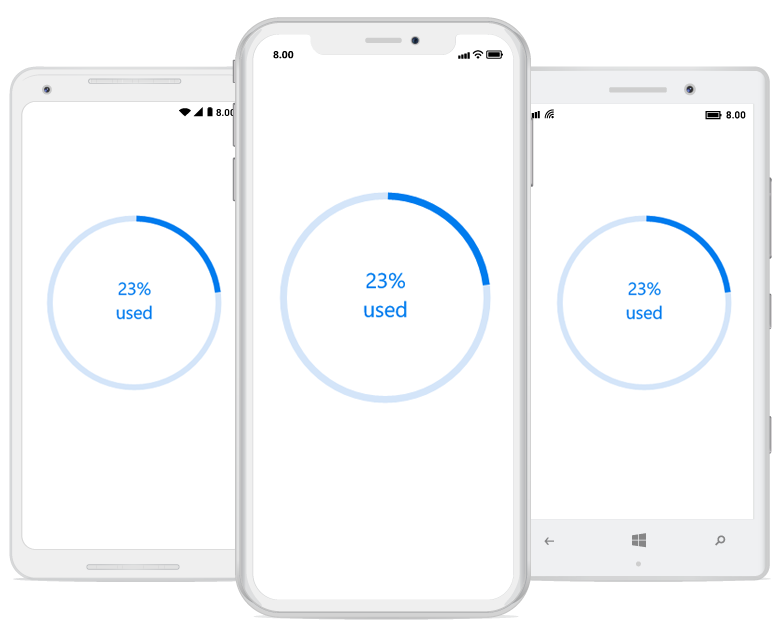

# Custom Content

In the circular progress bar, you can add any view to the center using the [`Content`](https://help.syncfusion.com/cr/xamarin/Syncfusion.XForms.ProgressBar.SfCircularProgressBar.html#Syncfusion_XForms_ProgressBar_SfCircularProgressBar_Content) property. 

For example, you can include add, start, or pause button to control the progress. You can also add an image that indicates the actual task in progress or add custom text that conveys how far the task is completed. 

The following code sample demonstrates how to add custom text content.

 



<progressBar:SfCircularProgressBar x:Name="CustomContentCircularProgressBar" Progress="23" HorizontalOptions="Center" >

 <progressBar:SfCircularProgressBar.Content>

   <Grid>

        <Grid.RowDefinitions>

            <RowDefinition Height="3*"/>

            <RowDefinition Height="*"/>

        </Grid.RowDefinitions>

        <Label x:Name="CustomContentProgressBarLabel" Grid.Row="0"

                TextColor="#007cee" Text="{Binding Progress,StringFormat='{0}%'}" BindingContext="{x:Reference CustomContentCircularProgressBar}"  HorizontalTextAlignment="Center" VerticalTextAlignment="End">                        

        </Label>

        <Label Grid.Row="1" TextColor="#007cee" Text="used" VerticalOptions="Start" Margin="0,-5,0,0" HorizontalTextAlignment="Center" VerticalTextAlignment="Start">

        </Label>

    </Grid>

 </progressBar:SfCircularProgressBar.Content>

</progressBar:SfCircularProgressBar>




SfCircularProgressBar circularProgressBar = new SfCircularProgressBar();

circularProgressBar.Progress = 23;

Grid grid = new Grid();

grid.RowDefinitions.Add(new RowDefinition() { Height = new GridLength(3, GridUnitType.Star) });

grid.RowDefinitions.Add(new RowDefinition() { Height = new GridLength(1, GridUnitType.Star) });

Label label = new Label();

label.BindingContext = circularProgressBar;

Binding binding = new Binding();

binding.Path = "Progress";

binding.StringFormat = "{0}%";

label.SetBinding(Label.TextProperty, binding);

label.HorizontalTextAlignment = TextAlignment.Center;

label.VerticalOptions = LayoutOptions.End;

label.FontSize = 10;

label.TextColor = Color.FromHex("007cee");

Grid.SetRow(label, 0);

grid.Children.Add(label);

Label textLabel = new Label();

textLabel.Text = "used";

textLabel.HorizontalTextAlignment = TextAlignment.Center;

textLabel.VerticalOptions = LayoutOptions.Start;

textLabel.FontSize = 10;

textLabel.TextColor = Color.FromHex("007cee");

Grid.SetRow(textLabel, 1);

grid.Children.Add(textLabel);

circularProgressBar.Content = grid;



 

By default, the progress value will be displayed at the center. You can hide the label in the circular progress bar by setting the [`ShowProgressValue`](https://help.syncfusion.com/cr/xamarin/Syncfusion.XForms.ProgressBar.SfCircularProgressBar.html#Syncfusion_XForms_ProgressBar_SfCircularProgressBar_ShowProgressValue) property to false. 

