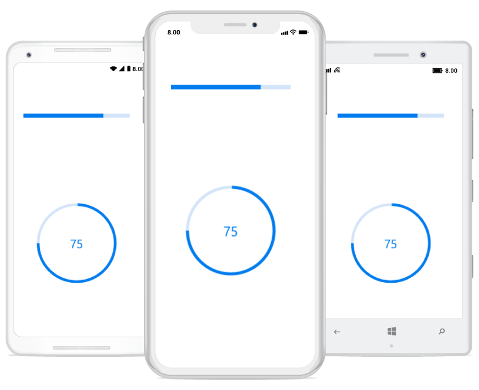
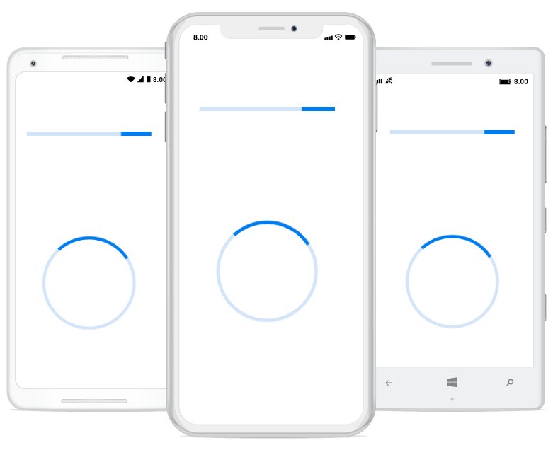
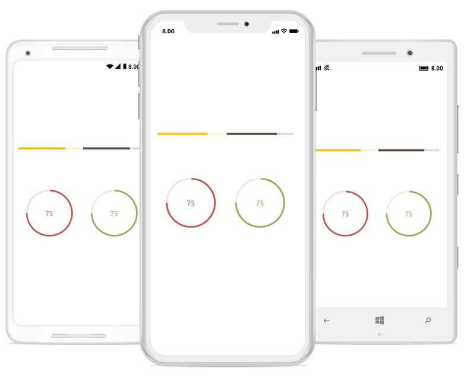

# Getting Started

This section explains the steps required to work with the progress bar control for Xamarin.Forms.

## Adding SfProgressBar reference

You can add SfProgressBar reference using one of the following methods:

**Method 1: Adding SfProgressBar reference from nuget.org**

Syncfusion Xamarin components are available in [nuget.org](https://www.nuget.org/). To add SfProgressBar to your project, open the NuGet package manager in Visual Studio, search for [Syncfusion.Xamarin.SfProgressBar](https://www.nuget.org/packages/Syncfusion.Xamarin.SfProgressBar), and then install it.

N> Install the same version of SfProgressBar NuGet in all the projects.

**Method 2: Adding SfProgressBar reference from toolbox**

Syncfusion also provides Xamarin Toolbox. Using this toolbox, you can drag the SfProgressBar control to the XAML page. It will automatically install the required NuGet packages and add the namespace to the page. To install Syncfusion Xamarin Toolbox, refer to [Toolbox](https://help.syncfusion.com/xamarin/utility#toolbox).

**Method 3: Adding SfProgressBar assemblies manually from the installed location**

If you prefer to manually reference the assemblies instead referencing from NuGet, add the following assemblies in respective projects.

Location: {Installed location}/{version}/Xamarin/lib

<table>
<tr>
<td>PCL</td>
<td>Syncfusion.SfProgressBar.XForms.dll Syncfusion.Core.XForms.dll Syncfusion.Licensing.dll </td>
</tr>
<tr>
<td>Android</td>
<td>Syncfusion.SfProgressBar.XForms.Android.dll Syncfusion.SfProgressBar.XForms.dll Syncfusion.Core.XForms.dll Syncfusion.Core.XForms.Android.dll Syncfusion.Licensing.dll </td>
</tr>
<tr>
<td>iOS</td>
<td>Syncfusion.SfProgressBar.XForms.iOS.dll Syncfusion.SfProgressBar.XForms.dll Syncfusion.Core.XForms.dll Syncfusion.Core.XForms.iOS.dll Syncfusion.Licensing.dll </td>
</tr>
<tr>
<td>UWP</td>
<td>Syncfusion.SfProgressBar.XForms.UWP.dll Syncfusion.SfProgressBar.XForms.dll Syncfusion.Core.XForms.dll Syncfusion.Core.XForms.UWP.dll Syncfusion.Licensing.dll </td>
</tr>
</table>

N> To know more about obtaining our components, refer to these links for [Mac](https://help.syncfusion.com/xamarin/introduction/download-and-installation/mac/) and [Windows](https://help.syncfusion.com/xamarin/introduction/download-and-installation/windows/).

I> Starting with v16.2.0.x, if you reference Syncfusion assemblies from the trial setup or from the NuGet feed, you also have to include a license key in your projects. Please refer to [Syncfusion license key](https://help.syncfusion.com/common/essential-studio/licensing/license-key/) to know about registering Syncfusion license key in your Xamarin application to use our components.

## Launching the application on each platform with progress bar

To use the progress bar in an application, each platform requires some additional configurations. The configurations vary from platform to platform and is discussed in the following sections:

N> If you are adding the references from toolbox, this step is not needed.

### iOS

To launch the progress bar in iOS, call the SfLinearProgressBarRenderer.Init() or SfCircularProgressBarRenderer.Init() in the FinishedLaunching overridden method of the AppDelegate class after the Xamarin.Forms framework has been initialized and before the LoadApplication is called as demonstrated in the following code sample.

 

public override bool FinishedLaunching(UIApplication app, NSDictionary options) 
{ 
    … 
    global::Xamarin.Forms.Forms.Init();

    // Add the below line if you are using SfLinearProgressBar.
    Syncfusion.XForms.iOS.ProgressBar.SfLinearProgressBarRenderer.Init();

    // Add the below line if you are using SfCircularProgressBar.  
    Syncfusion.XForms.iOS.ProgressBar.SfCircularProgressBarRenderer.Init();

    LoadApplication(new App()); 
    …
}



### Universal Windows Platform (UWP)

To launch the progress bar in UWP, initialize the progress bar assemblies in App.xaml.cs in UWP project as demonstrated in the following code samples. This is required to deploy the application with progress bar in `Release` mode in UWP platform.

 

// In App.xaml.cs 
protected override void OnLaunched(LaunchActivatedEventArgs e)
{ 
   … 
   if (rootFrame == null) 
   { 
      List<Assembly> assembliesToInclude = new List<Assembly>();

      // Add the below line if you are using SfLinearProgressBar.
      assembliesToInclude.Add(typeof(Syncfusion.XForms.UWP.ProgressBar.SfLinearProgressRenderer).GetTypeInfo().Assembly);

      // Add the below line if you are using SfCircularProgressBar. 
      assembliesToInclude.Add(typeof(Syncfusion.XForms.UWP.ProgressBar.SfCircularProgressBarRenderer).GetTypeInfo().Assembly);

      Xamarin.Forms.Forms.Init(e, assembliesToInclude); 
   } 
… 
}



### Android

The Android platform does not require any additional configuration to render the progress bar.

## Initializing the progress bar

Import the progress bar namespace as demonstrated in the following code sample in your respective page.

 

 
xmlns:progressBar="clr-namespace:Syncfusion.XForms.ProgressBar;assembly=Syncfusion.SfProgressBar.XForms"



 

using Syncfusion.XForms.ProgressBar;



 

The progress bar control has two variants: SfLinearProgressBar and SfCircularProgressBar. Each renders the progress in its own shape, such as rectangle and circle, respectively. Initialize both the progress bars with a progress value using the Progress property as demonstrated in the following code sample.

 

 
<!--Using linear progress bar-->
<progressBar:SfLinearProgressBar Progress="75"/>

<!--Using circular progress bar-->
<progressBar:SfCircularProgressBar Progress="75"/>


 

// Using linear progress bar. 
SfLinearProgressBar linearProgressBar = new SfLinearProgressBar { Progress = 75 };

// Using circular progress bar.
SfCircularProgressBar circularProgressBar = new SfCircularProgressBar { Progress = 75 };



 

N> By default, the value of progress should be specified between 0 and 100. To specify progress value between 0 and 1, specify the Minimum property to 0 and Maximum property to 1.

Run the project, and check if you get following output to make sure that the project has been configured properly to add the progress bar.

## Enabling indeterminate state

When the progress of a task cannot be shown determinately, you can enable the indeterminate state using the [IsIndeterminate](https://help.syncfusion.com/cr/xamarin/Syncfusion.XForms.ProgressBar.ProgressBarBase.html#Syncfusion_XForms_ProgressBar_ProgressBarBase_IsIndeterminate) property to know that any progress is happening in the background.

 

 

<!--Using linear progress bar-->
<progressBar:SfLinearProgressBar IsIndeterminate="True"/>

<!--Using circular progress bar-->
<progressBar:SfCircularProgressBar IsIndeterminate="True"/>



 

// Using linear progress bar.
SfLinearProgressBar linearProgressBar = new SfLinearProgressBar { IsIndeterminate = true };

// Using circular progress bar.
SfCircularProgressBar circularProgressBar = new SfCircularProgressBar { IsIndeterminate = true };


 

## Enable segments

To visualize the progress of a multiple sequential task, split the progress bar into the multiple segments by defining the [SegmentCount](https://help.syncfusion.com/cr/xamarin/Syncfusion.XForms.ProgressBar.ProgressBarBase.html#Syncfusion_XForms_ProgressBar_ProgressBarBase_SegmentCount) property as demonstrated in the following code sample.

 

 
<!--Using linear progress bar-->
<progressBar:SfLinearProgressBar SegmentCount="4" Progress="75"/>

<!--Using circular progress bar-->
<progressBar:SfCircularProgressBar SegmentCount="4" Progress="75"/>


 

// Using linear progress bar.
SfLinearProgressBar linearProgressBar = new SfLinearProgressBar { Progress = 75, SegmentCount = 4 };

// Using circular progress bar.
SfCircularProgressBar circularProgressBar = new SfCircularProgressBar { Progress = 75, SegmentCount = 4 };


 

## Apply colors

You can customize the color of the progress indicator and track by defining the [ProgressColor](https://help.syncfusion.com/cr/xamarin/Syncfusion.XForms.ProgressBar.ProgressBarBase.html#Syncfusion_XForms_ProgressBar_ProgressBarBase_ProgressColor) and [TrackColor](https://help.syncfusion.com/cr/xamarin/Syncfusion.XForms.ProgressBar.ProgressBarBase.html#Syncfusion_XForms_ProgressBar_ProgressBarBase_TrackColor) properties, respectively.

 

 

<!--Using linear progress bar-->
<progressBar:SfLinearProgressBar Progress="75" TrackColor="#33ffbe06" ProgressColor="#FFffbe06"/>
<progressBar:SfLinearProgressBar Progress="75"  TrackColor="#3351483a" ProgressColor="#FF51483a"/>

<!--Using circular progress bar-->
 <progressBar:SfCircularProgressBar Progress="75" TrackColor="#33c15244" ProgressColor="#FFc15244"/>
<progressBar:SfCircularProgressBar Progress="75" TrackColor="#3390a84e" ProgressColor="#FF90a84e"/>


 

// Using linear progress bar.
SfLinearProgressBar linearProgressBar = new SfLinearProgressBar{Progress = 75,TrackColor = Color.FromHex("#33ffbe06"),ProgressColor = Color.FromHex("#FFffbe06")};
SfLinearProgressBar sfLinearProgressBar = new SfLinearProgressBar{Progress = 75,TrackColor = Color.FromHex("#3351483a"),ProgressColor = Color.FromHex("#FF51483a")};

// Using circular progress bar.
SfCircularProgressBar circularProgressBar = new SfCircularProgressBar{Progress = 75,TrackColor = Color.FromHex("#33c15244"),ProgressColor = Color.FromHex("#FFc15244")};
SfCircularProgressBar sfCircularProgressBar = new SfCircularProgressBar{Progress = 75,TrackColor = Color.FromHex("#3390a84e"),ProgressColor = Color.FromHex("#FF90a84e")};


 

You can find the complete getting started sample here: [Getting started](http://www.syncfusion.com/downloads/support/directtrac/general/ze/ProgressBar-717653110.zip).
