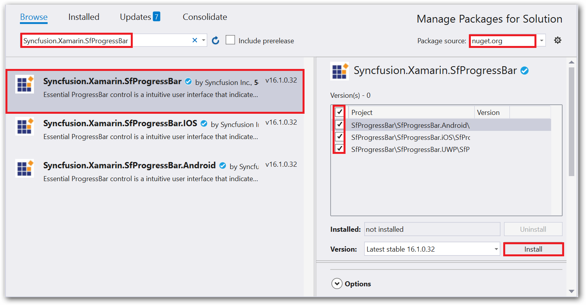

# Getting Started

This section explains the steps required to work with progress bar in Xamarin.Forms.

## Add progress bar reference

Syncfusion Xamarin components are available in [nuget.org](https://www.nuget.org/). To add progress bar to your project, open the NuGet package manager in Visual Studio, and search for [Syncfusion.Xamarin.SfProgressBar](https://www.nuget.org/packages/Syncfusion.Xamarin.SfProgressBar/), and then install it.

To know more about obtaining our components, refer to these links: [Mac](https://help.syncfusion.com/xamarin/introduction/download-and-installation/mac#) and [Windows](https://help.syncfusion.com/xamarin/introduction/download-and-installation/windows#). Also, if you prefer to manually refer the assemblies instead of NuGet, refer to this [link](https://help.syncfusion.com/xamarin/introduction/control-dependencies#progress-bar) to know about the dependent assemblies for progress bar.

N>Install the same version of the progress bar NuGet in all the projects.

## Launching the application on each platform with progress bar 

To use the progress bar inside an application, each platform application requires some additional configurations. The configurations vary from platform to platform and is discussed in the following sections:

### iOS

To launch the progress bar in iOS, call the SfLinearProgressBarRenderer.Init() or SfCircularProgressBarRenderer.Init() in the FinishedLaunching overridden method of the AppDelegate class after the Xamarin.Forms framework initialization and before the LoadApplication is called as demonstrated in the following code sample.

 

public override bool FinishedLaunching(UIApplication app, NSDictionary options) 
{ 
    … 
    global::Xamarin.Forms.Forms.Init();

    // Add the below line if you are using SfLinearProgressBar.
    Syncfusion.XForms.iOS.ProgressBar.SfLinearProgressBarRenderer.Init();

    // Add the below line if you are using SfCircularProgressBar.  
    Syncfusion.XForms.iOS.ProgressBar.SfCircularProgressBarRenderer.Init();

    LoadApplication(new App()); 
    …
}



### Universal Windows Platform (UWP)

To launch the progress bar in UWP, initialize the SfLinearProgressRenderer() or SfCircularProgressBarRenderer()  based on your requirement in the MainPage constructor before the LoadApplication is called as demonstrated in the following code sample.

 

public MainPage() 
{ 
    … 

  // Add the below line if you are using SfLinearProgressBar. 
  new Syncfusion.XForms.UWP.ProgressBar.SfLinearProgressRenderer(); 

  // Add the below line if you are using SfCircularProgressBar. 
  new Syncfusion.XForms.UWP.ProgressBar.SfCircularProgressBarRenderer();

  LoadApplication (new App ()); 
  … 
}



In addition to the above configurations, you need to initialize the progress bar assemblies in App.xaml.cs in UWP project as shown in the below code snippets. This is required to deploy application with progress bar in `Release` mode in UWP platform.

 

// In App.xaml.cs 
protected override void OnLaunched(LaunchActivatedEventArgs e)
{ 
   … 
   if (rootFrame == null) 
   { 
      List<Assembly> assembliesToInclude = new List<Assembly>();

      // Add the below line if you are using SfLinearProgressBar.
      assembliesToInclude.Add(typeof(Syncfusion.XForms.UWP.ProgressBar.SfLinearProgressRenderer).GetTypeInfo().Assembly);

      // Add the below line if you are using SfCircularProgressBar. 
      assembliesToInclude.Add(typeof(Syncfusion.XForms.UWP.ProgressBar.SfCircularProgressBarRenderer).GetTypeInfo().Assembly);

      Xamarin.Forms.Forms.Init(e, assembliesToInclude); 
   } 
… 
}



### Android

The Android platform does not require any additional configuration to render the progress bar.

## Initialize the progress bar

Import the progress bar namespace as shown in the following codes in your respective page,

 

 
xmlns:progressBar="clr-namespace:Syncfusion.XForms.ProgressBar;assembly=Syncfusion.SfProgressBar.XForms"



 

using Syncfusion.XForms.ProgressBar;



 

There are two variants of progress bar: SfLinearProgressBar and SfCircularProgressBar. Each render the progress in its own shape such as rectangle and circle respectively. Initialize both the progress bar with a progress value using Progress property as shown in the following code snippet.

 

 
<!--Using linear progress bar-->
<progressBar:SfLinearProgressBar Progress="75"/>

<!--Using circular progress bar-->
<progressBar:SfCircularProgressBar Progress="75"/>


 

// Using linear progress bar. 
SfLinearProgressBar linearProgressBar = new SfLinearProgressBar { Progress = 75 };

// Using circular progress bar.
SfCircularProgressBar circularProgressBar = new SfCircularProgressBar { Progress = 75 };



 

N>By default, the value of progress should be specified between 0 and 100. If you need to specify progress value between 0 and 1, you should specify Minimum property to 0 and Maximum property to 1.

Run the project, and check if you get following output to make sure that you have configured your project properly to add the progress bar.

## Enable indeterminate state

When the progress of a task cannot be shown determinately, you can enable indeterminate state using [IsIndeterminate](https://help.syncfusion.com/cr/cref_files/xamarin/Syncfusion.SfProgressBar.XForms~Syncfusion.XForms.ProgressBar.ProgressBarBase~IsIndeterminate.html) property to let user know that some progress is happening in the background.

 

 

<!--Using linear progress bar-->
<progressBar:SfLinearProgressBar IsIndeterminate="True"/>

<!--Using circular progress bar-->
<progressBar:SfCircularProgressBar IsIndeterminate="True"/>



 

// Using linear progress bar.
SfLinearProgressBar linearProgressBar = new SfLinearProgressBar { IsIndeterminate = true };

// Using circular progress bar.
SfCircularProgressBar circularProgressBar = new SfCircularProgressBar { IsIndeterminate = true };


 

## Enable segments

To visualize the progress of a multiple sequential task, split the progress bar into the multiple segments by defining the [SegmentCount](https://help.syncfusion.com/cr/cref_files/xamarin/Syncfusion.SfProgressBar.XForms~Syncfusion.XForms.ProgressBar.ProgressBarBase~SegmentCount.html) property as shown in the following code.

 

 
<!--Using linear progress bar-->
<progressBar:SfLinearProgressBar SegmentCount="4" Progress="75"/>

<!--Using circular progress bar-->
<progressBar:SfCircularProgressBar SegmentCount="4" Progress="75"/>


 

// Using linear progress bar.
SfLinearProgressBar linearProgressBar = new SfLinearProgressBar { Progress = 75, SegmentCount = 4 };

// Using circular progress bar.
SfCircularProgressBar circularProgressBar = new SfCircularProgressBar { Progress = 75, SegmentCount = 4 };


 

## Apply colors

You can customize the color of the progress indicator and track by defining the [ProgressColor](https://help.syncfusion.com/cr/cref_files/xamarin/Syncfusion.SfProgressBar.XForms~Syncfusion.XForms.ProgressBar.ProgressBarBase~ProgressColor.html) and [TrackColor](https://help.syncfusion.com/cr/cref_files/xamarin/Syncfusion.SfProgressBar.XForms~Syncfusion.XForms.ProgressBar.ProgressBarBase~TrackColor.html) properties respectively.

 

 

<!--Using linear progress bar-->
<progressBar:SfLinearProgressBar Progress="75" TrackColor="#33ffbe06" ProgressColor="#FFffbe06"/>
<progressBar:SfLinearProgressBar Progress="75"  TrackColor="#3351483a" ProgressColor="#FF51483a"/>

<!--Using circular progress bar-->
 <progressBar:SfCircularProgressBar Progress="75" TrackColor="#33c15244" ProgressColor="#FFc15244"/>
<progressBar:SfCircularProgressBar Progress="75" TrackColor="#3390a84e" ProgressColor="#FF90a84e"/>


 

// Using linear progress bar.
SfLinearProgressBar linearProgressBar = new SfLinearProgressBar{Progress = 75,TrackColor = Color.FromHex("#33ffbe06"),ProgressColor = Color.FromHex("#FFffbe06")};
SfLinearProgressBar sfLinearProgressBar = new SfLinearProgressBar{Progress = 75,TrackColor = Color.FromHex("#3351483a"),ProgressColor = Color.FromHex("#FF51483a")};

// Using circular progress bar.
SfCircularProgressBar circularProgressBar = new SfCircularProgressBar{Progress = 75,TrackColor = Color.FromHex("#33c15244"),ProgressColor = Color.FromHex("#FFc15244")};
SfCircularProgressBar sfCircularProgressBar = new SfCircularProgressBar{Progress = 75,TrackColor = Color.FromHex("#3390a84e"),ProgressColor = Color.FromHex("#FF90a84e")};


 

You can find the complete getting started sample from this [link](http://www.syncfusion.com/downloads/support/directtrac/general/ze/ProgressBar-929614915.zip).
