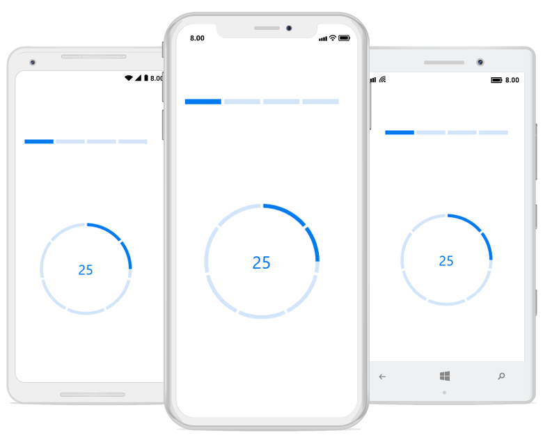
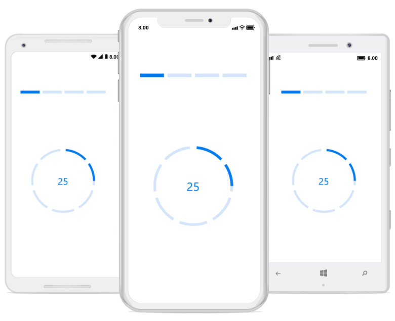

# Segments

To visualize the progress of multiple sequential tasks, split the progress bar into multiple segments by setting the [`SegmentsCount`](https://help.syncfusion.com/cr/xamarin/Syncfusion.XForms.ProgressBar.ProgressBarBase.html#Syncfusion_XForms_ProgressBar_ProgressBarBase_SegmentCount) property as demonstrated in the following code sample.

 


<!--Using linear progress bar-->

<progressBar:SfLinearProgressBar x:Name="LinearProgressBar" Progress="25" SegmentCount="4" />

<!--Using circular progress bar-->

<progressBar:SfCircularProgressBar x:Name="CircularProgressBar" Progress="25" SegmentCount="7" />





// Using linear progress bar.

this.LinearProgressBar.SegmentCount = 4;

// Using circular progress bar.

this.CircularProgressBar.SegmentCount = 7;



 

**Gap customization**

You can also customize the default spacing between the segments using the [`GapWidth`](https://help.syncfusion.com/cr/xamarin/Syncfusion.XForms.ProgressBar.ProgressBarBase.html#Syncfusion_XForms_ProgressBar_ProgressBarBase_GapWidth) property as demonstrated in following code sample.

 

<!--Using linear progress bar-->

<progressBar:SfLinearProgressBar x:Name="LinearProgressBar" Progress="25" SegmentCount="4" GapWidth="5" />

<!--Using circular progress bar-->

<progressBar:SfCircularProgressBar x:Name="CircularProgressBar" Progress="25" SegmentCount="7" GapWidth="10" />




// Using linear progress bar.

this.LinearProgressBar.GapWidth = 5;

// Using circular progress bar.

this.CircularProgressBar.GapWidth = 10;



 

