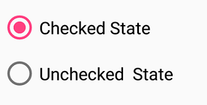
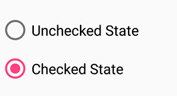

# Event of SfRadioButton

## StateChanged event

Occurs when the value(state) of the `IsChecked` property is changed by either touching the check box or setting the value to the `IsChecked` property using XAML or C# code. The event arguments are of type `StateChangedEventArgs` and expose the following property:

* `IsChecked`: The new value(state) of the `IsChecked` property.



<syncfusion:SfRadioGroup x:Name="radioGroup">
<syncfusion:SfRadioButton x:Name="check" Text="Checked State" IsChecked="True" StateChanged="RadioButton_StateChanged"/>
<syncfusion:SfRadioButton x:Name="uncheck" Text="Unchecked  State" StateChanged="RadioButton_StateChanged"/>
</syncfusion:SfRadioGroup>

private void RadioButton_StateChanged(object sender, StateChangedEventArgs e)
 {
    if (e.IsChecked.HasValue && e.IsChecked.Value)
    {
        (sender as SfRadioButton).Text = "Checked State";
    }
    else if (e.IsChecked.HasValue && !e.IsChecked.Value)
    {
        (sender as SfRadioButton).Text = "Unchecked State";
    }
 }


SfRadioGroup radioGroup = new SfRadioGroup();
SfRadioButton check = new SfRadioButton();
check.Text = "Checked State";
check.IsChecked = true;
check.StateChanged += RadioButton_StateChanged;
SfRadioButton uncheck = new SfRadioButton();
uncheck.Text = "Unchecked State";
uncheck.StateChanged += RadioButton_StateChanged;
radioGroup.Children.Add(check);
radioGroup.Children.Add(uncheck);

private void RadioButton_StateChanged(object sender, StateChangedEventArgs e)
 {
    if (e.IsChecked.HasValue && e.IsChecked.Value)
    {
        (sender as SfRadioButton).Text = "Checked State";
    }
    else if (e.IsChecked.HasValue && !e.IsChecked.Value)
    {
        (sender as SfRadioButton).Text = "Unchecked State";
    }
 }
 



This demo can be downloaded from this [link](http://www.syncfusion.com/downloads/support/directtrac/general/ze/RadioButton_Event1787482656 ).

## See also

[How to notify the selection changes in Xamarin.Forms radio button (SfRadioButton)](https://www.syncfusion.com/kb/11037/how-to-notify-the-selection-changes-in-xamarin-forms-radiobutton-sfradiobutton)
 
[How to get the selected Xamarin.Forms radio button (SfRadioButton)](https://www.syncfusion.com/kb/10914/how-to-get-the-selected-xamarin-forms-radiobutton)