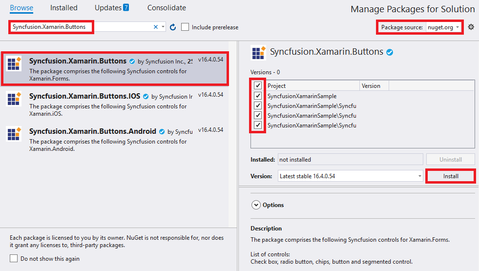
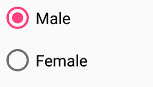

# Getting Started in Xamarin Charts (SfRadioButton)

This section explains the steps required to configure the `SfRadioButton` control in a real-time scenario and provides a walk-through on some of the customization features available in `SfRadioButton` control.

## Adding SfRadioButton reference

You can add SfRadioButton reference using one of the following methods:

**Method 1: Adding SfRadioButton reference from nuget.org**

Syncfusion Xamarin components are available in [nuget.org](https://www.nuget.org/). To add SfRadioButton to your project, open the NuGet package manager in Visual Studio, search for [Syncfusion.Xamarin.Buttons](https://www.nuget.org/packages/Syncfusion.Xamarin.Buttons), and then install it.

N> 
* Install the same version of SfRadioButton NuGet in all the projects.
* In addition, you need to install the [Syncfusion.Xamarin.Buttons.WPF]() package for Xamarin.Forms WPF platform only.

**Method 2: Adding SfRadioButton reference from toolbox**

Syncfusion also provides Xamarin Toolbox. Using this toolbox, you can drag the SfRadioButton control to the XAML page. It will automatically install the required NuGet packages and add the namespace to the page. To install Syncfusion Xamarin Toolbox, refer to [Toolbox](https://help.syncfusion.com/xamarin/utility#toolbox).

**Method 3: Adding SfRadioButton assemblies manually from the installed location**

If you prefer to manually reference the assemblies instead referencing from NuGet, add the following assemblies in respective projects.

Location: {Installed location}/{version}/Xamarin/lib

<table>
<tr>
<td>PCL</td>
<td>Syncfusion.Buttons.XForms.dll Syncfusion.Core.XForms.dll Syncfusion.Licensing.dll </td>
</tr>
<tr>
<td>Android</td>
<td>Syncfusion.Buttons.XForms.dll Syncfusion.Buttons.XForms.Android.dll Syncfusion.Core.XForms.dll Syncfusion.Core.XForms.Android.dll Syncfusion.Licensing.dll </td>
</tr>
<tr>
<td>iOS</td>
<td>Syncfusion.Buttons.XForms.dll Syncfusion.Buttons.XForms.iOS.dll Syncfusion.Core.XForms.dll Syncfusion.Core.XForms.iOS.dll Syncfusion.Licensing.dll </td>
</tr>
<tr>
<td>UWP</td>
<td>Syncfusion.Buttons.XForms.dll Syncfusion.Buttons.XForms.UWP.dll Syncfusion.Core.XForms.dll Syncfusion.Core.XForms.UWP.dll Syncfusion.Licensing.dll </td>
</tr>
<tr>
<td>WPF</td>
<td>Syncfusion.Buttons.XForms.dll Syncfusion.Buttons.XForms.WPF.dll Syncfusion.Core.XForms.dll Syncfusion.Core.XForms.WPF.dll Syncfusion.Licensing.dll </td>
</tr>
</table>

N> To know more about obtaining our components, refer to these links for [Mac](https://help.syncfusion.com/xamarin/introduction/download-and-installation/mac/) and [Windows](https://help.syncfusion.com/xamarin/introduction/download-and-installation/windows/).

I> Starting with v16.2.0.x, if you reference Syncfusion assemblies from the trial setup or from the NuGet feed, you also have to include a license key in your projects. Please refer to [Syncfusion license key](https://help.syncfusion.com/common/essential-studio/licensing/license-key/) to know about registering Syncfusion license key in your Xamarin application to use our components.

N> After adding the assembly reference, an additional step is required for iOS and UWP projects. If you are adding the references from toolbox, this step is not needed.

### Additional step for iOS
To launch `SfRadioButton` in iOS, call the `SfRadioButtonRenderer.Init()` in `FinishedLaunching` overridden method of `AppDelegate` class in iOS Project, as demonstrated in the following code example.



public override bool FinishedLaunching(UIApplication app, NSDictionary options)
{
    global::Xamarin.Forms.Forms.Init();
    LoadApplication(new App());
    Syncfusion.XForms.iOS.Buttons.SfRadioButtonRenderer.Init();
    return base.FinishedLaunching(app, options);
}



### Additional step for UWP
This step is required only if the application is deployed in Release mode with .NET native tool chain enabled. It is for resolving the known Framework issue “Custom controls not rendering in Release mode” in UWP platform. Initializing the `SfRadioButton` assembly at `OnLaunched` overridden method of the `App` class in UWP project is the suggested work around, as demonstrated in the following code example.



protected override void OnLaunched(LaunchActivatedEventArgs e)
{
    ..... 
    rootFrame.NavigationFailed += OnNavigationFailed;
    // Add `using System.Reflection;` 
    List<Assembly> assembliesToInclude = new List<Assembly>();
    //Now, add all the assemblies that your app uses 
    assembliesToInclude.Add(typeof(SfRadioButtonRenderer).GetTypeInfo().Assembly);
    // replaces Xamarin.Forms.Forms.Init(e);
    Xamarin.Forms.Forms.Init(e, assembliesToInclude);
    ..... 
}



### Additional step for WPF

To launch the radio button in WPF, call the SfRadioButtonRenderer.Init() method in the MainWindow constructor of the MainWindow class after the Xamarin.Forms framework has been initialized and before the LoadApplication method is called as demonstrated in the following code sample.


 

public partial class MainWindow : FormsApplicationPage
{
     public MainWindow()
     { 
            InitializeComponent();
            
            Forms.Init();
            
            Syncfusion.XForms.WPF.Buttons.SfRadioButtonRenderer.Init();
            
            LoadApplication(new App());
     }
}




## Create a Simple SfRadioButton
The `SfRadioButton` control is configured entirely in C# code or by using XAML markup. The following steps explain how to create a `SfRadioButton` and configure its elements.

### Add namespace for referred assemblies



xmlns:syncfusion="clr-namespace:Syncfusion.XForms.Buttons;assembly=Syncfusion.Buttons.XForms"


using Syncfusion.XForms.Buttons;



### Refer SfRadioButton control with declared suffix name for Namespace



<?xml version="1.0" encoding="utf-8">
<ContentPage xmlns="http://xamarin.com/schemas/2014/forms"
             xmlns:x="http://schemas.microsoft.com/winfx/2009/xaml"
             xmlns:local="clr-namespace:GettingStarted"
	     xmlns:syncfusion="clr-namespace:Syncfusion.XForms.Buttons;assembly=Syncfusion.Buttons.XForms" 
	     x:Class="GettingStarted.MainPage">
<ContentPage.Content>
  <StackLayout>
     <syncfusion:SfRadioButton x:Name="radioButton"/>        
</StackLayout>
</ContentPage.Content>
</ContentPage>



using Syncfusion.XForms.Buttons;
using Xamarin.Forms;
namespace GettingStarted
{
    public partial class MainPage : ContentPage
    {
        public MainPage()
        {
            InitializeComponent();
            StackLayout stackLayout = new StackLayout();
            SfRadioButton radioButton = new SfRadioButton();
            stackLayout.Children.Add(radioButton);
            this.Content = stackLayout;
        }
    }
}



## Setting caption

The radio button caption can be defined using the `Text` property of `SfRadioButton`. This caption normally describes the meaning of the radio button and it displays next to radio button.
 


<syncfusion:SfRadioButton x:Name="radioButton" Text="RadioButton"/>


SfRadioButton radioButton = new SfRadioButton();
radioButton.Text = "RadioButton";



This demo can be downloaded from this [link](http://www.syncfusion.com/downloads/support/directtrac/general/ze/RadioButton_GettingStarted1836860411).

## Change the radio button state

The two different visual states of the `SfRadioButton` are:

* Checked
* Unchecked

You can change the state of the radio button using the `IsChecked` property of `SfRadioButton`. In the checked state, an inner circle is added to the visualization of radio button.
The radio buttons are used when there is a list of two or more options or group that are mutually exclusive and the user must select exactly one choice, such as “Select Gender” or “Choose the best option!”.



<syncfusion:SfRadioGroup x:Name="radioGroup">
     <syncfusion:SfRadioButton x:Name="male" Text="Male" IsChecked="True"/>
     <syncfusion:SfRadioButton x:Name="female" Text="Female"/>
</syncfusion:SfRadioGroup>


SfRadioGroup radioGroup = new SfRadioGroup();
SfRadioButton male = new SfRadioButton();
male.IsChecked = true;
male.Text = "Male";
SfRadioButton female = new SfRadioButton();
female.Text = "Female";
radioGroup.Children.Add(male);
radioGroup.Children.Add(female);



N>`SfRadioButtons` are mutually exclusive among them when they are defined within `SfRadioGroup`.

This demo can be downloaded from this [link](http://www.syncfusion.com/downloads/support/directtrac/general/ze/RadioButton_StateChanging-1078509445).

## See also

[How to create a Xamarin.Forms radio button (SfRadioButton)](https://www.syncfusion.com/kb/10918/how-to-create-a-xamarin-forms-radiobutton)