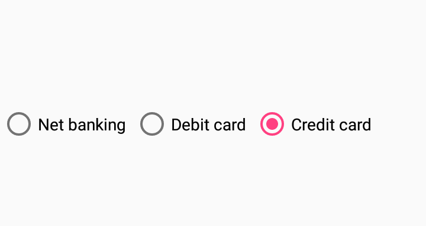

# Grouping in Xamarin Radio Button (SfRadioButton)

## Group Key

The [`GroupKey`](https://help.syncfusion.com/cr/xamarin/Syncfusion.XForms.Buttons.SfRadioButton.html#Syncfusion_XForms_Buttons_SfRadioButton_GroupKey) property in [`SfRadioButton`](https://help.syncfusion.com/cr/xamarin/Syncfusion.XForms.Buttons.SfRadioButton.html) allows you to group a set of radio buttons within any layout. Grouping enables the selection of only one radio button that falls under the same `GroupKey` at any given time.

* [`CheckedItem`](https://help.syncfusion.com/cr/xamarin/Syncfusion.XForms.Buttons.SfRadioGroupKey.html#Syncfusion_XForms_Buttons_SfRadioGroupKey_CheckedItem): Retrieves the currently selected item from the radio group.




<ContentPage.Resources>
    <syncfusion:SfRadioGroupKey x:Key="carBrand" />
</ContentPage.Resources>

<FlexLayout Wrap="Wrap" AlignItems="Start" AlignContent="Start">
    <syncfusion:SfRadioButton Text="Honda" GroupKey="{StaticResource carBrand}"/>
    <syncfusion:SfRadioButton Text="Hyundai" GroupKey="{StaticResource carBrand}"/>
    <syncfusion:SfRadioButton Text="Volkswagen" GroupKey="{StaticResource carBrand}"/>
    <syncfusion:SfRadioButton Text="Toyota" GroupKey="{StaticResource carBrand}"/>
    <syncfusion:SfRadioButton Text="Volvo" GroupKey="{StaticResource carBrand}"/>
</FlexLayout>




SfRadioGroupKey carBrand = new SfRadioGroupKey();

SfRadioButton honda = new SfRadioButton(){Text = "Honda", GroupKey = carBrand};
SfRadioButton hyundai = new SfRadioButton(){Text = "Hyundai", GroupKey = carBrand};
SfRadioButton volkswagen = new SfRadioButton(){Text = "Volkswagen", GroupKey = carBrand};
SfRadioButton toyota = new SfRadioButton(){Text = "Toyota", GroupKey = carBrand};
SfRadioButton volvo = new SfRadioButton(){Text = "Volvo", GroupKey = carBrand};

FlexLayout flexLayout = new FlexLayout()
{
    Wrap = FlexWrap.Wrap,
    AlignContent = FlexAlignContent.Start,
    AlignItems = FlexAlignItems.Start
};
flexLayout.Children.Add(honda);
flexLayout.Children.Add(hyundai);
flexLayout.Children.Add(volkswagen);
flexLayout.Children.Add(toyota);
flexLayout.Children.Add(volvo);




### CheckedChanged Event

The [`CheckedChanged`](https://help.syncfusion.com/cr/xamarin/Syncfusion.XForms.Buttons.SfRadioGroupKey.html#Syncfusion_XForms_Buttons_SfRadioGroupKey_CheckedChanged) event of [`SfRadioGroupKey`](https://help.syncfusion.com/cr/xamarin/Syncfusion.XForms.Buttons.SfRadioGroupKey.html) occurs when the selected item changes. The argument includes:

* [`PreviousItem`](https://help.syncfusion.com/cr/xamarin/Syncfusion.XForms.Buttons.CheckedChangedEventArgs.html#Syncfusion_XForms_Buttons_CheckedChangedEventArgs_PreviousItem): Retrieves the previously selected radio button from the group.
* [`CurrentItem`](https://help.syncfusion.com/cr/xamarin/Syncfusion.XForms.Buttons.CheckedChangedEventArgs.html#Syncfusion_XForms_Buttons_CheckedChangedEventArgs_CurrentItem): Retrieves the currently selected radio button from the group.

## SfRadioGroup

[`SfRadioGroup`](https://help.syncfusion.com/cr/xamarin/Syncfusion.XForms.Buttons.SfRadioGroup.html) is a container that houses a set of radio buttons. Selecting a radio button in a group will automatically deselect all other items, allowing only one selected option at a time. It also features the [`CheckedChanged`](https://help.syncfusion.com/cr/xamarin/Syncfusion.XForms.Buttons.SfRadioGroup.html#Syncfusion_XForms_Buttons_SfRadioGroup_CheckedChanged) event and the [`CheckedItem`](https://help.syncfusion.com/cr/xamarin/Syncfusion.XForms.Buttons.SfRadioGroup.html#Syncfusion_XForms_Buttons_SfRadioGroup_CheckedItem) property.




<syncfusion:SfRadioGroup>
    <syncfusion:SfRadioButton Text="Net banking" />
    <syncfusion:SfRadioButton Text="Debit card" />
    <syncfusion:SfRadioButton Text="Credit card" />
</syncfusion:SfRadioGroup>




SfRadioGroup radioGroup = new SfRadioGroup();
SfRadioButton netBanking = new SfRadioButton() {Text = "Net banking"};
SfRadioButton debitCard = new SfRadioButton() {Text = "Debit card"};
SfRadioButton creditCard = new SfRadioButton() {Text = "Credit card"};

radioGroup.Children.Add(netBanking);
radioGroup.Children.Add(debitCard);
radioGroup.Children.Add(creditCard);




### Orientation in SfRadioGroup

[`SfRadioGroup`](https://help.syncfusion.com/cr/xamarin/Syncfusion.XForms.Buttons.SfRadioGroup.html) supports both horizontal and vertical orientations. By default, it is rendered in vertical orientation. You can change the orientation using the [`Orientation`](https://help.syncfusion.com/cr/xamarin/Syncfusion.XForms.Buttons.SwitchOrientation.html) property.




<SyncfusionButton:SfRadioGroup Orientation="Horizontal">
    <SyncfusionButton:SfRadioButton Text="Net banking" />
    <SyncfusionButton:SfRadioButton Text="Debit card" />
    <SyncfusionButton:SfRadioButton Text="Credit card" />
</SyncfusionButton:SfRadioGroup>




SfRadioGroup radioGroup = new SfRadioGroup(){Orientation = StackOrientation.Horizontal};
SfRadioButton netBanking = new SfRadioButton() {Text = "Net banking"};
SfRadioButton debitCard = new SfRadioButton() {Text = "Debit card"};
SfRadioButton creditCard = new SfRadioButton() {Text = "Credit card"};

radioGroup.Children.Add(netBanking);
radioGroup.Children.Add(debitCard);
radioGroup.Children.Add(creditCard);




## See Also

- [How to get the selected Xamarin.Forms radio button (SfRadioButton)](https://support.syncfusion.com/kb/article/9506/how-to-get-the-selected-xamarin-forms-radiobutton)
