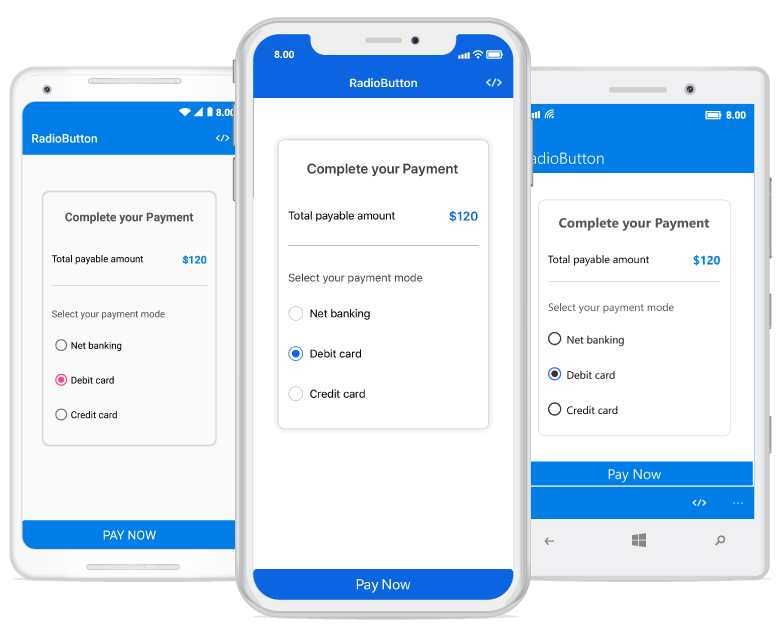

# Xamarin Radio Button (SfRadioButton) Overview

The radio button is a selection control that allows users to select one option from a set. The two states of radio button are checked and unchecked.

##  Key features

* Allow users to select and clear the control by tapping.
* Supports radio button color and label text customization.

