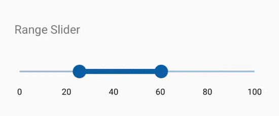

# Range in SfRangeSlider

The SfRangeSlider control supports to select range of value by using two Thumbs.

## Set Show Range

The `ShowRange` property should be set to true for displaying two thumbs in track with range of values.

N> When this property is set to false, single thumb is displayed without any range 





	<range:SfRangeSlider x:Name="rangeslider" ShowRange="true"/>
	




	rangeSlider.ShowRange= true;





## Set Range values

This section explains about setting Range start and end value.

### RangeStart

Gets and sets the start value of the range.





	<range:SfRangeSlider x:Name="rangeslider"  RangeStart="4" />
	




	rangeSlider.RangeStart=0;





### RangeEnd

Gets and sets the end value of the range.





	<range:SfRangeSlider x:Name="rangeslider" RangeEnd="20" />
	




	rangeSlider.RangeEnd=10;





## ValueChangeMode

The ValueChangeMode property changes the value based on the touch of the `SfRangeSlider` control. It consists of the following two types

* Default
* OnThumbPress

N> The default value of the ValueChangeMode property is `Default`.

### Default

The value is updated when you touch inside the control.





	<range:SfRangeSlider x:Name="rangeslider"  ValueChangeMode="Default" />
	




	rangeSlider.ValueChangeMode = ValueChangeMode.Default;





### OnThumb

The value is updated when you touch or move the thumb/knob.





	<range:SfRangeSlider x:Name="rangeslider"  ValueChangeMode="OnThumb" />
	




	rangeSlider.ValueChangeMode = ValueChangeMode.OnThumb;





## Value

Gets or sets the range value, which ranges between Minimum and Maximum. The default value of RangeSlider is 0.





	<range:SfRangeSlider x:Name="rangeslider" Minimum="0" Maximum="100" Value="30"/>
	




            rangeslider.Value = 30;





## Allow drag range.

Enable or disable the drag options to change a value of the ranges by using `AllowDragRange` property.





<range:SfRangeSlider x:Name="rangeslider" AllowDragRange = "True" ShowRange = "True"  Minimum="0" Maximum="100" Value="30"/>
	




rangeslider.AllowDragRange = true;





