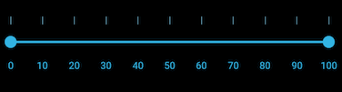

# Ticks Customization in Xamarin Range Slider (SfRangeSlider)

Tick marks can be uniformly placed along the track, or you can customize their position according to your needs.

## Tick Placement

The [`TickPlacement`](https://help.syncfusion.com/cr/xamarin/Syncfusion.SfRangeSlider.XForms.SfRangeSlider.html#Syncfusion_SfRangeSlider_XForms_SfRangeSlider_TickPlacement) property determines where tick marks will appear relative to the track. Options are:

- [`BottomRight`](https://help.syncfusion.com/cr/xamarin/Syncfusion.SfRangeSlider.XForms.TickPlacement.html#Syncfusion_SfRangeSlider_XForms_TickPlacement_BottomRight)
- [`Inline`](https://help.syncfusion.com/cr/xamarin/Syncfusion.SfRangeSlider.XForms.TickPlacement.html#Syncfusion_SfRangeSlider_XForms_TickPlacement_Inline)
- [`None`](https://help.syncfusion.com/cr/xamarin/Syncfusion.SfRangeSlider.XForms.TickPlacement.html#Syncfusion_SfRangeSlider_XForms_TickPlacement_None)
- [`Outside`](https://help.syncfusion.com/cr/xamarin/Syncfusion.SfRangeSlider.XForms.TickPlacement.html#Syncfusion_SfRangeSlider_XForms_TickPlacement_Outside)
- [`TopLeft`](https://help.syncfusion.com/cr/xamarin/Syncfusion.SfRangeSlider.XForms.TickPlacement.html#Syncfusion_SfRangeSlider_XForms_TickPlacement_TopLeft)

> **Note**: The default setting is [`Inline`](https://help.syncfusion.com/cr/xamarin/Syncfusion.SfRangeSlider.XForms.TickPlacement.html#Syncfusion_SfRangeSlider_XForms_TickPlacement_Inline).

### BottomRight

Place tick marks either below the track in horizontal orientation or to the right of the track in vertical orientation.





	<range:SfRangeSlider x:Name="rangeslider" TickPlacement="BottomRight"/>
	




	rangeSlider.TickPlacement=TickPlacement.BottomRight;





### TopLeft

Place tick marks either above the track in horizontal orientation or to the left of the track in vertical orientation.





	<range:SfRangeSlider x:Name="rangeslider" TickPlacement="TopLeft"/>
	




	rangeSlider.TickPlacement=TickPlacement.TopLeft;





### Inline

[`Ticks`](https://help.syncfusion.com/cr/xamarin/Syncfusion.SfRangeSlider.XForms.SnapsTo.html#Syncfusion_SfRangeSlider_XForms_SnapsTo_Ticks) are placed along the track.





	<range:SfRangeSlider x:Name="rangeslider" TickPlacement="Inline"/>
	




	rangeSlider.TickPlacement=TickPlacement.Inline;





### Outside

Place tick marks on both sides of the track for either horizontal or vertical orientation.





	<range:SfRangeSlider x:Name="rangeslider" TickPlacement="Outside"/>
	




	rangeSlider.TickPlacement=TickPlacement.Outside;





## Customizing Tick Color

Customize the tick color using the [`TickColor`](https://help.syncfusion.com/cr/xamarin/Syncfusion.SfRangeSlider.XForms.SfRangeSlider.html#Syncfusion_SfRangeSlider_XForms_SfRangeSlider_TickColor) property.





<ContentPage xmlns="http://xamarin.com/schemas/2014/forms"
xmlns:x="http://schemas.microsoft.com/winfx/2009/xaml" 
xmlns:range="clr-namespace:Syncfusion.SfRangeSlider.XForms;assembly=Syncfusion.SfRangeSlider.XForms"
x:Class="GettingStarted.RangeSliderSample">
	<ContentPage.Content>
		<range:SfRangeSlider x:Name="rangeslider" Orientation="Horizontal"  TickColor="#FFFFFF"/>
	</ContentPage.Content>
</ContentPage>
	




using Syncfusion.XForms.SfRangeSlider;
using Xamarin.Forms;
namespace GettingStarted
{
	/// 

    /// Range slider sample.
    /// 

    public partial class RangeSliderSample : ContentPage
    {
        public RangeSliderSample()
        {
            InitializeComponent();
			SfRangeSlider rangeSlider = new SfRangeSlider(){ TickColor = Color.FromHex("#FFFFFF"),Orientation=Orientation.Horizontal};
			this.Content = rangeSlider;
        }
    }
}





