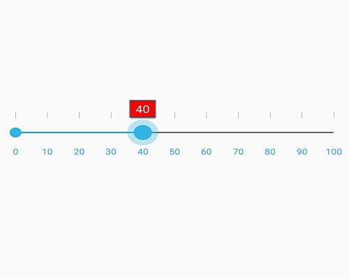

# ToolTip Support

The ToolTip shows the current value based on thumb position.

## Set ToolTip Precision

The `ToolTipPrecision` property is used to define the precision of the value displayed in the ToolTip.





	<range:SfRangeSlider x:Name="rangeslider" ToolTipPrecision="2"/>
	




	rangeSlider.ToolTipPrecision = 2;
	




## Set ToolTip Placement

The position of the ToolTip in relation to the thumb can be controlled by the `ToolTipPlacement` property. It has the following options.

1. BottomRight
2. TopLeft
3. None

### BottomRight

The ToolTip will be placed either below the Thumb in horizontal orientation or right of the Thumb in vertical orientation.





	<range:SfRangeSlider x:Name="rangeslider" ToolTipPlacement="BottomRight"/>
	




	rangeSlider.ToolTipPlacement = ToolTipPlacement.BottomRight;
	




### TopLeft

the ToolTip will be placed either above the Thumb in horizontal orientation or left of the Thumb in vertical orientation.





	<range:SfRangeSlider x:Name="rangeslider" ToolTipPlacement="TopLeft"/>
	




	rangeSlider.ToolTipPlacement = ToolTipPlacement.TopLeft;
	




### None

ToolTip will be collapsed.





	<range:SfRangeSlider x:Name="rangeslider" ToolTipPlacement="None"/>
	




	rangeSlider.ToolTipPlacement = ToolTipPlacement.None;
	




## Tooltip color

`TooltipTextColor` - Changes the text color of tooltip.
`TooltipBackgroundColor` - Changes the background color of tooltip.

