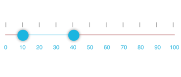

# TrackBar Customization in Xamarin Range Slider (SfRangeSlider)

### Customizing Track Height

The thickness of the track bar can be customized by setting the [`TrackThickness`](https://help.syncfusion.com/cr/xamarin/Syncfusion.SfRangeSlider.XForms.SfRangeSlider.html#Syncfusion_SfRangeSlider_XForms_SfRangeSlider_TrackThickness) property of the [`SfRangeSlider`](https://help.syncfusion.com/cr/xamarin/Syncfusion.SfRangeSlider.XForms.SfRangeSlider.html).




<ContentPage xmlns="http://xamarin.com/schemas/2014/forms" 
             xmlns:x="http://schemas.microsoft.com/winfx/2009/xaml"
             xmlns:local="clr-namespace:TrackCustomization" 
             xmlns:slider="clr-namespace:Syncfusion.SfRangeSlider.XForms;assembly=Syncfusion.SfRangeSlider.XForms"
             x:Class="TrackCustomization.MainPage">
               <slider:SfRangeSlider Orientation="Horizontal"
                                    TrackThickness="10"
                                    RangeStart="0"
                                    RangeEnd="2"/>
</ContentPage>
	




using Syncfusion.SfRangeSlider.XForms; 
using Xamarin.Forms;

namespace TrackCustomization
{
    public partial class MainPage : ContentPage
    {
        public MainPage()
        {
            InitializeComponent();
            SfRangeSlider slider = new SfRangeSlider();
            slider.Orientation = Orientation.Horizontal;
            slider.RangeStart = 0;
            slider.RangeEnd = 2;
            slider.TrackThickness = 10;
            Content = slider;
        }
    }
}





### Customizing Dragged Area Height

The thickness of the selected range or portion of the track bar can be customized by setting the [`TrackSelectionThickness`](https://help.syncfusion.com/cr/xamarin/Syncfusion.SfRangeSlider.XForms.SfRangeSlider.html#Syncfusion_SfRangeSlider_XForms_SfRangeSlider_TrackSelectionThickness) property.





<ContentPage xmlns="http://xamarin.com/schemas/2014/forms" 
             xmlns:x="http://schemas.microsoft.com/winfx/2009/xaml"
             xmlns:local="clr-namespace:TrackCustomization" 
             xmlns:slider="clr-namespace:Syncfusion.SfRangeSlider.XForms;assembly=Syncfusion.SfRangeSlider.XForms"
             x:Class="TrackCustomization.MainPage">
      <slider:SfRangeSlider Orientation="Horizontal"
                            TrackSelectionThickness="10"
                            RangeStart="10"
                            RangeEnd="30"/>
</ContentPage>





using Syncfusion.SfRangeSlider.XForms;
using Xamarin.Forms;

namespace TrackCustomization
{
    public partial class MainPage : ContentPage
    {
        public MainPage()
        {
            InitializeComponent();
            SfRangeSlider slider = new SfRangeSlider();
            slider.Orientation = Orientation.Horizontal;
            slider.TrackSelectionThickness = 10;
            slider.RangeStart = 10;
            slider.RangeEnd = 30;
            Content = slider;
        }
    }
}





### Customizing Track Color

The color of the track bar can be customized using the [`TrackColor`](https://help.syncfusion.com/cr/xamarin/Syncfusion.SfRangeSlider.XForms.SfRangeSlider.html#Syncfusion_SfRangeSlider_XForms_SfRangeSlider_TrackColor) property.





<ContentPage xmlns="http://xamarin.com/schemas/2014/forms" 
             xmlns:x="http://schemas.microsoft.com/winfx/2009/xaml"
             xmlns:local="clr-namespace:TrackCustomization" 
             xmlns:slider="clr-namespace:Syncfusion.SfRangeSlider.XForms;assembly=Syncfusion.SfRangeSlider.XForms"
             x:Class="TrackCustomization.MainPage">
       <slider:SfRangeSlider Orientation="Horizontal"
                             TrackColor="Maroon"
                             RangeStart="10"
                             RangeEnd="40"/>
</ContentPage>





using Syncfusion.SfRangeSlider.XForms;
using Xamarin.Forms;

namespace TrackCustomization
{
    public partial class MainPage : ContentPage
    {
        public MainPage()
        {
            InitializeComponent();
            SfRangeSlider slider = new SfRangeSlider();
            slider.Orientation = Orientation.Horizontal;
            slider.TrackColor = Color.Maroon;
            slider.RangeStart = 10;
            slider.RangeEnd = 40;
            Content = slider;
        }
    }
}





### Customizing Dragged Area Color

Customize the color of the selected range or portion of the track bar by using the [`TrackSelectionColor`](https://help.syncfusion.com/cr/xamarin/Syncfusion.SfRangeSlider.XForms.SfRangeSlider.html#Syncfusion_SfRangeSlider_XForms_SfRangeSlider_TrackSelectionColor) property.





<ContentPage xmlns="http://xamarin.com/schemas/2014/forms" 
             xmlns:x="http://schemas.microsoft.com/winfx/2009/xaml"
             xmlns:local="clr-namespace:TrackCustomization" 
             xmlns:slider="clr-namespace:Syncfusion.SfRangeSlider.XForms;assembly=Syncfusion.SfRangeSlider.XForms"
             x:Class="TrackCustomization.MainPage">
      <slider:SfRangeSlider Orientation="Horizontal"
                          TrackSelectionColor="Red"
                          RangeStart="10"
                          RangeEnd="40"/>
</ContentPage>
	 




using Syncfusion.SfRangeSlider.XForms;
using Xamarin.Forms;

namespace TrackCustomization
{
    public partial class MainPage : ContentPage
    {
        public MainPage()
        {
            InitializeComponent();
            SfRangeSlider slider = new SfRangeSlider();
            slider.Orientation = Orientation.Horizontal;
            slider.TrackSelectionColor = Color.Red;
            slider.RangeStart = 10;
            slider.RangeEnd = 40;
            Content = slider;
        }
    }
}





### Customizing Knob Color

The [`KnobColor`](https://help.syncfusion.com/cr/xamarin/Syncfusion.SfRangeSlider.XForms.SfRangeSlider.html#Syncfusion_SfRangeSlider_XForms_SfRangeSlider_KnobColor) property allows you to change the knob color of the [`SfRangeSlider`](https://help.syncfusion.com/cr/xamarin/Syncfusion.SfRangeSlider.XForms.SfRangeSlider.html).





    <range:SfRangeSlider x:Name="rangeslider" KnobColor="Red"  Minimum="0" Maximum="100"/>





 rangeslider.KnobColor = Color.Red;

 



### Customizing Thumb Size

Change the thumb size using the [`ThumbSize`](https://help.syncfusion.com/cr/xamarin/Syncfusion.SfRangeSlider.XForms.SfRangeSlider.html#Syncfusion_SfRangeSlider_XForms_SfRangeSlider_ThumbSize) property.




    <range:SfRangeSlider x:Name="rangeslider" ThumbSize="3" Minimum="0" Maximum="100"/>





 rangeslider.ThumbSize = 3;

 


