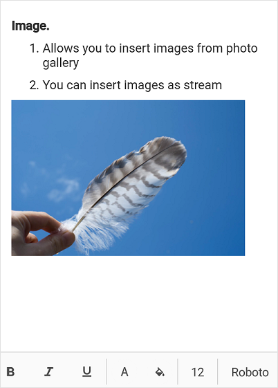

# Image Insertion in Xamarin Rich Text Editor(SfRichTextEditor)

The SfRichTextEditor provides support to insert JPEG and PNG images from a photo gallery, embedded resource, or stream into the Rich Text Editor content. The image can be inserted in the `SfRichTextEditor` using the [`ImageInsertCommand`](https://help.syncfusion.com/cr/xamarin/Syncfusion.XForms.RichTextEditor.SfRichTextEditor.html#Syncfusion_XForms_RichTextEditor_SfRichTextEditor_ImageInsertCommand) property or the [`ImageInserted`](https://help.syncfusion.com/cr/xamarin/Syncfusion.XForms.RichTextEditor.SfRichTextEditor.html) event.

## ImageInsertCommand command

The following code example shows how to insert an image from a photo gallery using the `ImageInsertCommand` property into the Rich Text Editor content.


 

<ContentPage.BindingContext>
    <local:ViewModel/>
</ContentPage.BindingContext>
<ContentPage.Content>
    <StackLayout>
        <richtexteditor:SfRichTextEditor x:Name="rte" VerticalOptions="FillAndExpand" ImageInsertCommand="{Binding ImageInsertCommand}"/>
    </StackLayout>
</ContentPage.Content>




public partial class MainPage : ContentPage
{
    public MainPage()
    {
        InitializeComponent();
    }
}
/// 

/// Represents a view model class of the application
/// 

public class ViewModel : INotifyPropertyChanged
{
    /// 

    /// Insert the image command property
    /// 

    public ICommand ImageInsertCommand { get; set; }

    public ViewModel()
    {
        ImageInsertCommand = new Command<object>(Load);
    }
    /// 

    /// Creates an event args for Image Insert
    /// 

    void Load(object obj)
    {
        ImageInsertedEventArgs imageInsertedEventArgs = (obj as ImageInsertedEventArgs);
        this.GetImage(imageInsertedEventArgs);
    }
    /// 

    /// Gets image stream from picker using the dependency service.
    /// 

    /// <param name="imageInsertedEventArgs">Event args to be passed for dependency service</param>
    async void GetImage(ImageInsertedEventArgs imageInsertedEventArgs)
    {
        Stream imageStream = await DependencyService.Get<IPhotoPickerService>().GetImageStreamAsync();
        Syncfusion.XForms.RichTextEditor.ImageSource imageSource = new Syncfusion.XForms.RichTextEditor.ImageSource();
        imageSource.ImageStream = imageStream;
        imageInsertedEventArgs.ImageSourceCollection.Add(imageSource);
    }
    /// 

    /// Property changed event of the NotifyPropertyChanged interface
    /// 

    public event PropertyChangedEventHandler PropertyChanged;

    /// 

    ///  Property changed raise method of the NotifyPropertyChanged interface
    /// 

    /// <param name="propertyname">Property which has been changed</param>
    public void RaisePropertyChange([CallerMemberName] string propertyname = null)
    {
        if (PropertyChanged != null)
        {
            PropertyChanged(this, new PropertyChangedEventArgs(propertyname));
        }
    }
}



To open a gallery, you must use the platform specific photo picker. To achieve this, the DependencyService for the photo picker must be defined in all Xamarin.Forms platforms.

### Xamarin.Forms
 

 
public interface IPhotoPickerService
{
    Task<Stream> GetImageStreamAsync();
}



### Xamarin.Forms Android
 
 

using System.IO;
using System.Threading.Tasks;
using Android.Content;
using Sample.Droid;
using Xamarin.Forms;

[assembly: Dependency(typeof(PhotoPickerService))]
namespace Sample.Droid
{
    public class PhotoPickerService : IPhotoPickerService
    {
        public Task<Stream> GetImageStreamAsync()
        {
            // Define the Intent for getting images
            Intent intent = new Intent();
            intent.SetType("image/*");
            intent.SetAction(Intent.ActionGetContent);

            // Start the picture-picker activity (resumes in MainActivity.cs)
            MainActivity.Instance.StartActivityForResult(
                Intent.CreateChooser(intent, "Select Picture"),
                MainActivity.PickImageId);

            // Save the TaskCompletionSource object as a MainActivity property
            MainActivity.Instance.PickImageTaskCompletionSource = new TaskCompletionSource<Stream>();

            // Return Task object
            return MainActivity.Instance.PickImageTaskCompletionSource.Task;
        }
    }
}



### Xamarin.Forms iOS
 

 

using System;
using System.IO;
using System.Threading.Tasks;
using Foundation;
using Sample.iOS;
using UIKit;
using Xamarin.Forms;

[assembly: Dependency(typeof(PhotoPickerService))]
namespace Sample.iOS
{
    public class PhotoPickerService : IPhotoPickerService
    {
        TaskCompletionSource<Stream> taskCompletionSource;
        UIImagePickerController imagePicker;

        public Task<Stream> GetImageStreamAsync()
        {
            // Create and define UIImagePickerController
            imagePicker = new UIImagePickerController
            {
                SourceType = UIImagePickerControllerSourceType.PhotoLibrary,
                MediaTypes = UIImagePickerController.AvailableMediaTypes(UIImagePickerControllerSourceType.PhotoLibrary)
            };

            // Set event handlers
            imagePicker.FinishedPickingMedia += OnImagePickerFinishedPickingMedia;
            imagePicker.Canceled += OnImagePickerCancelled;

            // Present UIImagePickerController;
            UIWindow window = UIApplication.SharedApplication.KeyWindow;
            var viewController = window.RootViewController;
            viewController.PresentModalViewController(imagePicker, true);

            // Return to Task object
            taskCompletionSource = new TaskCompletionSource<Stream>();
            return taskCompletionSource.Task;
        }
        void OnImagePickerFinishedPickingMedia(object sender, UIImagePickerMediaPickedEventArgs args)
        {
            UIImage image = args.EditedImage ?? args.OriginalImage;

            if (image != null)
            {
                // Convert UIImage to .NET Stream object
                NSData data;
                if (args.ReferenceUrl.PathExtension.Equals("PNG") || args.ReferenceUrl.PathExtension.Equals("png"))
                {
                    data = image.AsPNG();
                }
                else
                {
                    data = image.AsJPEG(1);
                }
                Stream stream = data.AsStream();

                UnregisterEventHandlers();

                // Set the Stream to the completion of the Task
                taskCompletionSource.SetResult(stream);
            }
            else
            {
                UnregisterEventHandlers();
                taskCompletionSource.SetResult(null);
            }
            imagePicker.DismissModalViewController(true);
        }

        void OnImagePickerCancelled(object sender, EventArgs args)
        {
            UnregisterEventHandlers();
            taskCompletionSource.SetResult(null);
            imagePicker.DismissModalViewController(true);
        }

        void UnregisterEventHandlers()
        {
            imagePicker.FinishedPickingMedia -= OnImagePickerFinishedPickingMedia;
            imagePicker.Canceled -= OnImagePickerCancelled;
        }
    }
}



### Xamarin.Forms UWP
 

 

using Sample.UWP;
using System;
using System.IO;
using System.Threading.Tasks;
using Windows.Storage;
using Windows.Storage.Pickers;
using Windows.Storage.Streams;
using Xamarin.Forms;

[assembly: Dependency(typeof(PhotoPickerService))]
namespace Sample.UWP
{
    public class PhotoPickerService : IPhotoPickerService
    {
        public async Task<Stream> GetImageStreamAsync()
        {
            // Create and initialize the FileOpenPicker
            FileOpenPicker openPicker = new FileOpenPicker
            {
                ViewMode = PickerViewMode.Thumbnail,
                SuggestedStartLocation = PickerLocationId.PicturesLibrary,
            };

            openPicker.FileTypeFilter.Add(".jpg");
            openPicker.FileTypeFilter.Add(".jpeg");
            openPicker.FileTypeFilter.Add(".png");

            // Get a file and return a Stream
            StorageFile storageFile = await openPicker.PickSingleFileAsync();

            if (storageFile == null)
            {
                return null;
            }

            IRandomAccessStreamWithContentType raStream = await storageFile.OpenReadAsync();
            //(RTE_Localization.App.Current.BindingContext as ViewModel).Stream1 = raStream.AsStream();
            return raStream.AsStream();
        }
    }
}




You can download the sample [here](https://www.syncfusion.com/downloads/support/directtrac/general/ze/Image_Insertion-739142540).

## ImageInserted Event

The following code example shows how to insert an image using the `ImageInserted` event.

 

 
<ContentPage.Content>
    <StackLayout>
        <richtexteditor:SfRichTextEditor x:Name="rte" VerticalOptions="FillAndExpand" ImageInserted="rte_ImageInserted"/>
    </StackLayout>
</ContentPage.Content>


 
private void rte_ImageInserted(object sender, ImageInsertedEventArgs e)
{
    Syncfusion.XForms.RichTextEditor.ImageSource imgSrc = new Syncfusion.XForms.RichTextEditor.ImageSource();
    Assembly assembly = typeof(MainPage).GetTypeInfo().Assembly;
    Stream image = assembly.GetManifestResourceStream("Sample.InsertImage.png");

    imgSrc.ImageStream = image;            
    rte.InsertImage(imgSrc);
}



## Save Image as Base64 in the HtmlText

The following code example shows how to insert an image as base64 and retrieve in the HtmlText.

 

 
<ContentPage.Content>
    <StackLayout>
        <richtexteditor:SfRichTextEditor x:Name="rte" VerticalOptions="FillAndExpand" ImageInserted="rte_ImageInserted"/>
        <richtexteditor:SfRichTextEditor Text="{Binding Source= {x:Reference rte}, Path=HtmlText}" />
    </StackLayout>
</ContentPage.Content>


 
private void rte_ImageInserted(object sender, ImageInsertedEventArgs e)
{
    Syncfusion.XForms.RichTextEditor.ImageSource imgSrc = new Syncfusion.XForms.RichTextEditor.ImageSource();
    Assembly assembly = typeof(MainPage).GetTypeInfo().Assembly;
    Stream image = assembly.GetManifestResourceStream("Sample.InsertImage.png");

    imgSrc.ImageStream = image;     
    imgSrc.SaveOption = ImageSaveOption.Base64;	
    rte.InsertImage(imgSrc);
}


