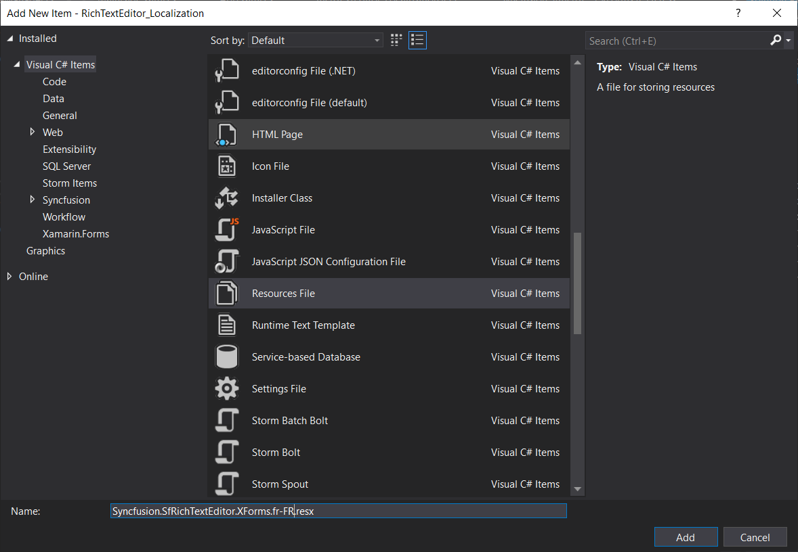
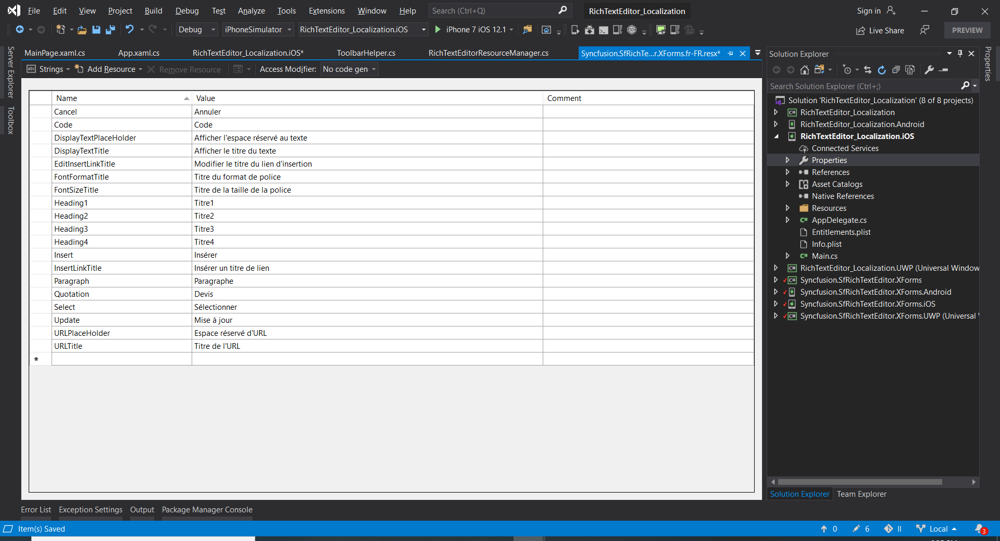
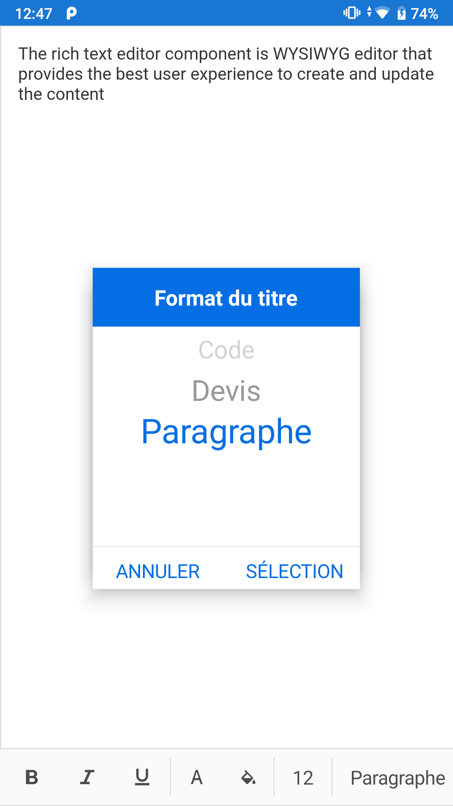

# Localization 

Localization is the process of translating application resources into different languages for specific cultures. SfRichTextEditor uses the following static text that can be localized in application level:

* Cancel
* Code
* DisplayTextPlaceHolder
* DisplayTextTitle
* EditInsertLinkTitle
* FontFormatTitle
* FontSizeTitle
* Heading1
* Heading2
* Heading3
* Heading4
* Insert
* InsertLinkTitle
* Paragraph
* Quotation
* Select
* Update
* URLPlaceHolder
* URLTitle

To localize the SfRichTextEditor, follow the steps in application level:

1. Add a .resx file.
2. Apply the converted format.

## Add a .resx file

In the portable project of your application, add a `.resx` file inside the resources folder with **Build Action -> EmbeddedResource**. File name should be `Syncfusion control's Namespace + language code` format.

For example, to set the culture to French, the file should be named as **Syncfusion.SfRichTextEditor.XForms.fr-FR.resx**.

Based on the language, set the appropriate equivalent text to the static text in the .resx file.

N> You should create and add separate .resx files for the individual languages.

Implementation of the interface is not required for UWP project since the resources automatically recognizes the selected language.

## Apply the converted format 




public partial class App : Application
{
    public App()
    {
        InitializeComponent();

        MainPage = new GettingStarted.MainPage();
        
        if (Device.RuntimePlatform == Device.iOS || Device.RuntimePlatform == Device.Android)
        {
            RichTextEditorResourceManager.Manager = new ResourceManager("RichTextEditor_Localization.Resources.Syncfusion.SfRichTextEditor.XForms", Application.Current.GetType().Assembly);
            // the ResourceManager class constructor has two parameters.
            // 1. ResXPath => Full path of the resx file in the application. Here in the above line GettingStarted refers to the namespace of the Application
            // 2. Assembly => Application assembly (PCL)
    
            // Sets the required culture to the static texts in the control.		
            if (Device.RuntimePlatform != Device.UWP)
            {
                Thread.CurrentThread.CurrentUICulture = new CultureInfo("fr-FR");
            }
            else 
            {
                CultureInfo.CurrentUICulture = new CultureInfo("fr-FR");
            }
        }
    }
} 




You can download the sample [here](https://www.syncfusion.com/downloads/support/directtrac/general/ze/RTE_Localization1779356607.zip).
