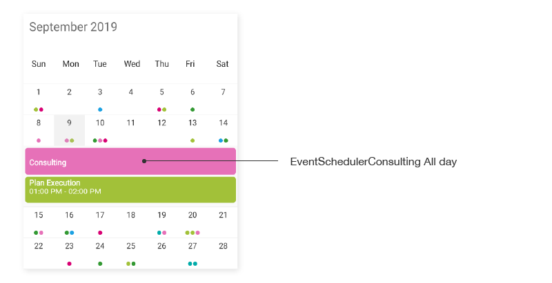
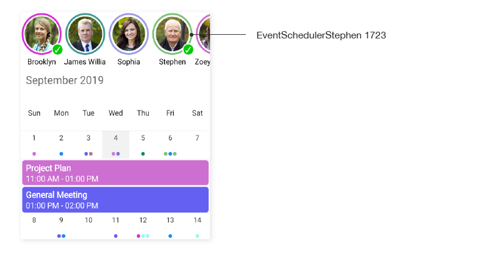
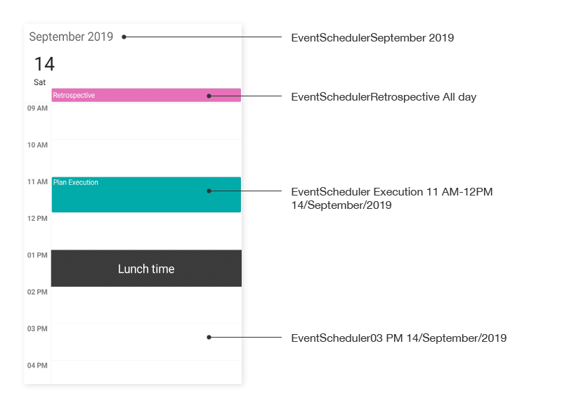
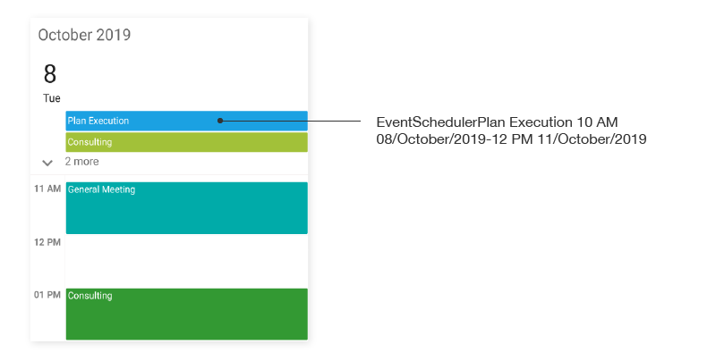
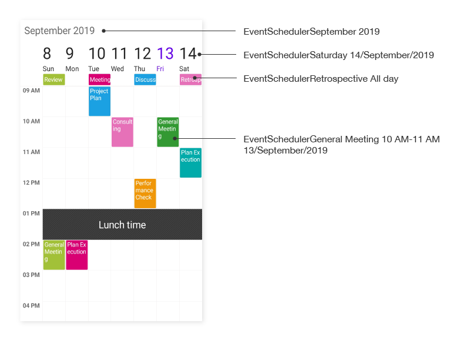
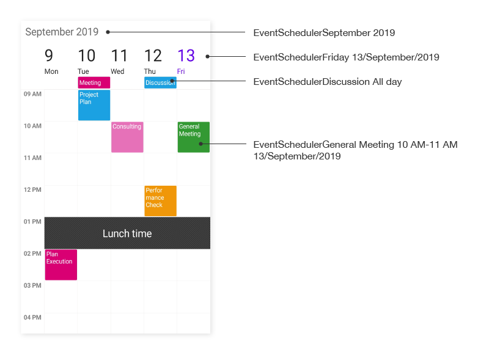
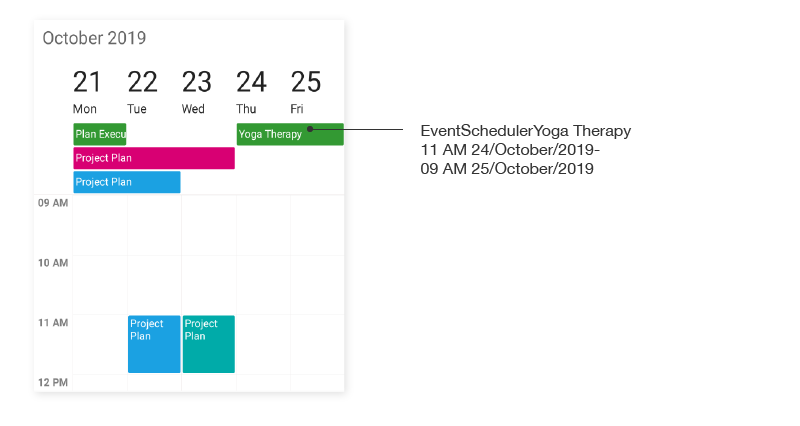
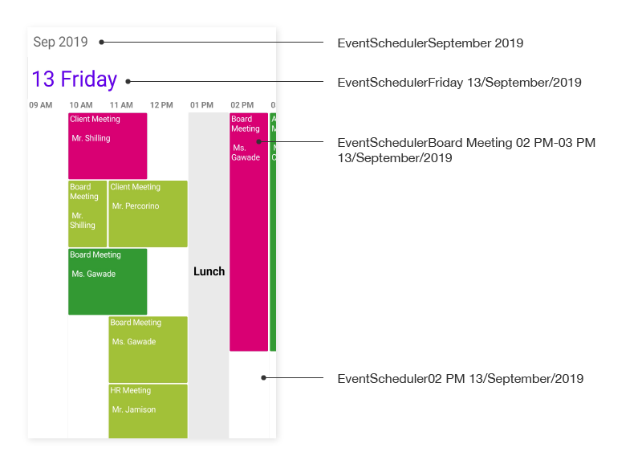
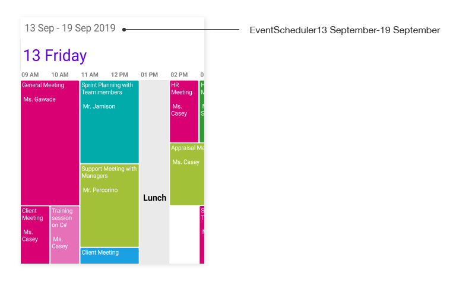

# AutomationId for Xamarin.Forms Schedule

The `SfSchedule` control has built-in `AutomationId` for inner elements. Please find the following table of Automation IDs for inner elements. To keep unique `AutomationId`, these inner elements’ AutomationIds are updated based on the control’s `AutomationId`.  For example, if you set `SfSchedule` `AutomationId` as `SfSchedule.AutomationId = EventScheduler`, then the Automation framework will interact with the month header as `EventSchedulerAugust 2019`. The following screenshots denote the AutomationIds for inner elements.

## Month view

<table>
<tr>
<th align="center" >View</th>
<th align="center" >AutomationId Format</th>
<th align="center" >Example</th>
</tr>

<tr>
<td>MonthCell</td>
<td>dddd dd/MMMM/yyyy</td>
<td>Tuesday 01/July/2019</td>
</tr>

<tr>
<td>Month Header</td>
<td>MMMM yyyy</td>
<td>August 2019</td>
</tr>

<tr>
<td>Inline View appointment</td>
<td>Subject hh tt-hh tt dd/MMMM/yyyy</td>
<td>Consulting 10 AM-12 PM 01/July/2019</td>
</tr>

<tr>
<td>Agenda View appointment</td>
<td>Subject hh tt-hh tt dd/MMMM/yyyy</td>
<td>Planning 10 AM-11 AM 01/July/2019</td>
</tr>

<tr>
<td>All day appointment</td>
<td>Subject All day</td>
<td>Consulting All day</td>
</tr>

<tr>
<td>Spanning Appointment</td>
<td>Subject hh tt dd/MMMM/yyyy-hh tt dd/MMMM/yyyy</td>
<td>Planning 10 AM 12/August/2019-02 PM 18/August/2019</td>
</tr>

<tr>
<td>Resources</td>
<td>Name ResourceID</td>
<td>John 1501</td>
</tr>

<tr>
<td>No Events</td>
<td>No Events text</td>
<td>No Events</td>
</tr>

</table>

### Day, week and workweek views

<table>
<tr>
<th align="center" >View</th>
<th align="center" >AutomationId Format</th>
<th align="center" >Example</th>
</tr>

<tr>
<td>TimeslotView(Only for DayView)</td>
<td>hh a dd/MMMM/yyyy</td>
<td>09 AM 22/August/2019</td>
</tr>

<tr>
<td>Appointment</td>
<td>Subject hh tt-hh tt dd/MMMM/yyyy</td>
<td>Planning 10 AM-12 PM 01/July/2019</td>
</tr>

<tr>
<td>Header</td>
<td>MMMM yyyy</td>
<td>August 2019</td>
</tr>

<tr>
<td>ViewHeader</td>
<td>dddd dd/MMMM/yyyy</td>
<td>Sunday 22/August/2019</td>
</tr>

<tr>
<td>AllDay</td>
<td>Subject All day</td>
<td>Consulting All day</td>
</tr>

<tr>
<td>Spanning Appointment</td>
<td>Subject hh tt dd/MMMM/yyyy-hh tt dd/MMMM/yyyy</td>
<td>Planning 10 AM 12/August/2019-02 PM 18/August/2019</td>
</tr>

<tr>
<td>Resources</td>
<td>Name ResourceID</td>
<td>Brooklyn 6343</td>
</tr>

</table>

### Timeline view

<table>
<tr>
<th align="center" >View</th>
<th align="center" >AutomationId Format</th>
<th align="center" >Example</th>
</tr>

<tr>
<td>TimeslotView(Only applicable if days count is 1)</td>
<td>hh a dd/MMMM/yyyy</td>
<td>09 AM 22/August/2019</td>
</tr>

<tr>
<td>Appointment</td>
<td>Subject hh tt-hh tt dd/MMMM/yyyy</td>
<td>Planning 10 AM-12PM 01/July/2019</td>
</tr>

<tr>
<td>Resources</td>
<td>Name ResourceID</td>
<td>Sophia 7456</td>
</tr>

<tr>
<td>Header</td>
<td>MMMM yyyy</td>
<td>August 2019</td>
</tr>

<tr>
<td>Header - DaysCount</td>
<td>dd MMMM - dd MMMM yyyy</td>
<td>04 December - 08 December 2018</td>
</tr>

<tr>
<td>ViewHeader</td>
<td>dddd dd/MMMM/yyyy</td>
<td>Sunday 22/August/2019</td>
</tr>

</table>

## Keyboard
`SfSchedule` supports selection using keyboard interactions.

>**NOTE**
Keyboard interaction is applicable only for UWP and WPF platforms.

### Day, Week and WorkWeek views
<table>
<tr>
<th>
Key
</th>
<th>
Description
</th>
</tr>
<tr>
<td>
DownArrow
</td>
<td>
Moves selection to the next time slot directly below the currently selected time slot.
</td>
</tr>
<tr>
<td>
UpArrow
</td>
<td>
Moves selection to the previous time slot directly above the currently selected time slot.
</td>
</tr>
<tr>
<td>
RightArrow
</td>
<td>
Moves selection to the same time slot on the next day.
</td>
</tr>
<tr>
<td>
LeftArrow
</td>
<td>
Moves selection to the same time slot on the previous day.
</td>
</tr>
</table>

### Timeline view
<table>
<tr>
<th>
Key
</th>
<th>
Description
</th>
</tr>
<tr>
<td>
RightArrow
</td>
<td>
Moves selection to the next time slot of the currently selected time slot.
</td>
</tr>
<tr>
<td>
LeftArrow
</td>
<td>
Moves selection to the previous time slot of the currently selected time slot.
</td>
</tr>
</table>

### Month view
<table>
<tr>
<th>
Key
</th>
<th>
Description
</th>
</tr>
<tr>
<td>
DownArrow
</td>
<td>
Moves selection to the date directly below the currently selected date on the next row.
</td>
</tr>
<tr>
<td>
UpArrow
</td>
<td>
Moves selection to the date directly above the currently selected date on the previous row.
</td>
</tr>
<tr>
<td>
RightArrow
</td>
<td>
Moves selection to the next date of the currently selected date.
</td>
</tr>
<tr>
<td>
LeftArrow
</td>
<td>
Moves selection to the previous date of the currently selected date.
</td>
</tr>
</table>

### Appointments
<table>
<tr>
<th>
Key or Key combinations
</th>
<th>
Description
</th>
</tr>
<tr>
<td>
Tab
</td>
<td>
Moves selection to the next appointment of the currently selected appointment.
</td>
</tr>
<tr>
<td>
Shift + Tab
</td>
<td>
Moves selection to the previous appointment of the currently selected appointment.
</td>
</tr>
<tr>
<td>
Delete
</td>
<td>
Deletes the selected appointment from appointments collection.
</td>
</tr>
</table>

### View navigations
<table>
<tr>
<th>
Key combinations
</th>
<th>
Description
</th>
</tr>
<tr>
<td>
Ctrl + Plus
</td>
<td>
Schedule view changes in the order of Day, Week, Work week, Month, and Timeline.
</td>
</tr>
<tr>
<td>
Ctrl + Minus
</td>
<td>
Schedule view changes in the order of Day, Timeline, Month, Work week, and Week.
</td>
</tr>
</table>