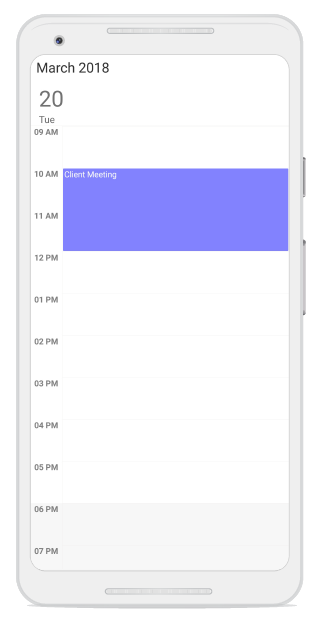
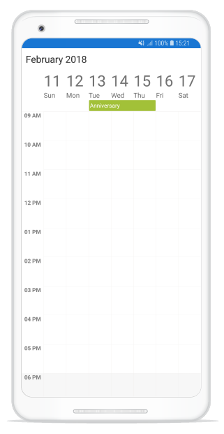
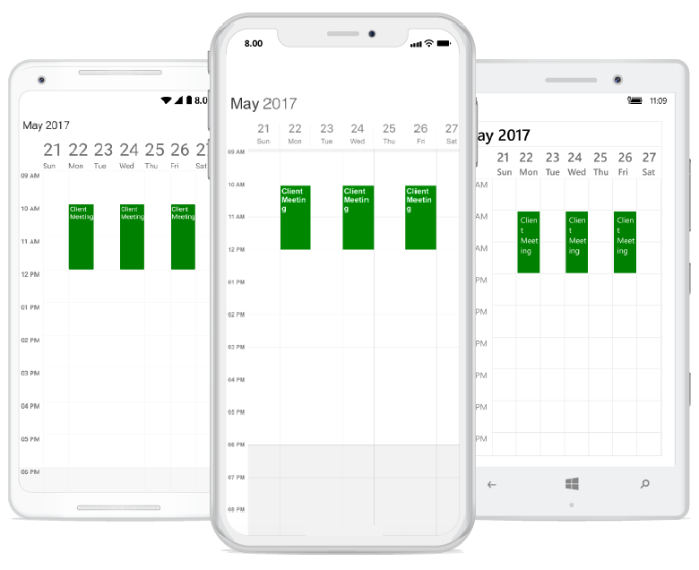
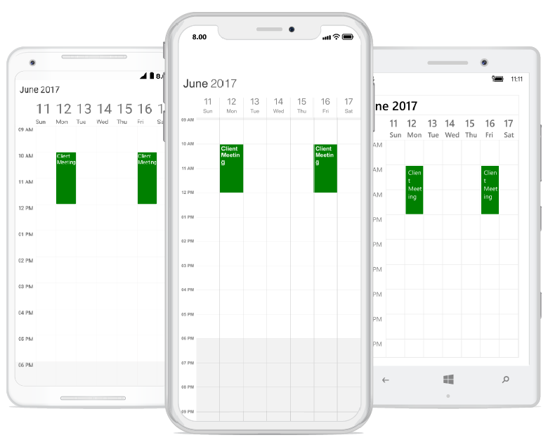
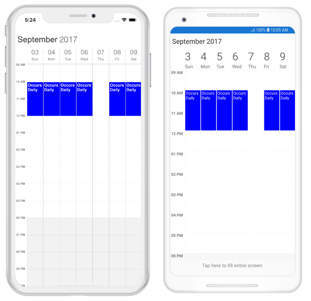
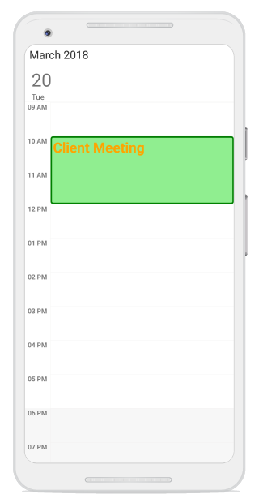
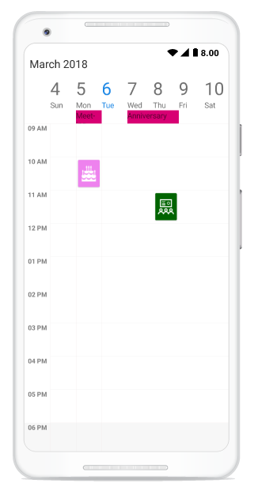

---

layout: post
title: Appointments | SfSchedule | Xamarin | Syncfusion
description: Learn how to schedule and customize different kinds of appointments in Xamarin.Forms SfSchedule control.
platform: xamarin
control: SfSchedule
documentation: ug

---

# Appointments in Xamarin Scheduler (SfSchedule)

[SfSchedule](https://help.syncfusion.com/cr/xamarin/sfschedule) control has a built-in capability to handle the appointment arrangement internally based on the [ScheduleAppointmentCollection](https://help.syncfusion.com/cr/xamarin/Syncfusion.SfSchedule.XForms.ScheduleAppointmentCollection.html). [ScheduleAppointment](https://help.syncfusion.com/cr/xamarin/Syncfusion.SfSchedule.XForms.ScheduleAppointment.html) is a class, which holds the details about the appointment to be rendered in schedule.



// Creating an instance for schedule appointment collection
ScheduleAppointmentCollection scheduleAppointmentCollection = new ScheduleAppointmentCollection();
//Adding schedule appointment in schedule appointment collection 
scheduleAppointmentCollection.Add(new ScheduleAppointment()
{ 
	StartTime = new DateTime(2017, 05, 08, 10, 0, 0), 
	EndTime = new DateTime(2017, 05, 08, 12, 0, 0), 
	Subject = "Meeting", 
	Location = "Hutchison road", 
}); 

//Adding schedule appointment collection to DataSource of SfSchedule
schedule.DataSource=scheduleAppointmentCollection;



## Mapping
Schedule supports full data binding to any type of IEnumerable source. Specify the [ScheduleAppointmentMapping](https://help.syncfusion.com/cr/xamarin/Syncfusion.SfSchedule.XForms.ScheduleAppointmentMapping.html) attributes to map the properties in the underlying data source to the schedule appointments.

| Property Name | Description |
|-------------------------------------------------------------------------------------------------------------------------------------------------------------------------------------------------------|--------------------------------------------------------------------------------------------------------------------------|
| [StartTimeMapping](https://help.syncfusion.com/cr/xamarin/Syncfusion.SfSchedule.XForms.ScheduleAppointmentMapping.html#Syncfusion_SfSchedule_XForms_ScheduleAppointmentMapping_StartTimeMapping) | This property is to map the property name of custom class which is equivalent for StartTime of ScheduleAppointment. |
| [StartTimeZoneMapping](https://help.syncfusion.com/cr/xamarin/Syncfusion.SfSchedule.XForms.ScheduleAppointmentMapping.html#Syncfusion_SfSchedule_XForms_ScheduleAppointmentMapping_StartTimeZoneMapping) | This property is to map the property name of custom class which is equivalent for Start time zone of ScheduleAppointment. |
| [EndTimeMapping](https://help.syncfusion.com/cr/xamarin/Syncfusion.SfSchedule.XForms.ScheduleAppointmentMapping.html#Syncfusion_SfSchedule_XForms_ScheduleAppointmentMapping_EndTimeMapping) | This property is to map the property name of custom class which is equivalent for EndTime of ScheduleAppointment. |
| [EndTimeZoneMapping](https://help.syncfusion.com/cr/xamarin/Syncfusion.SfSchedule.XForms.ScheduleAppointmentMapping.html#Syncfusion_SfSchedule_XForms_ScheduleAppointmentMapping_EndTimeZoneMapping) | This property is to map the property name of custom class which is equivalent for End time zone of ScheduleAppointment. |
| [SubjectMapping](https://help.syncfusion.com/cr/xamarin/Syncfusion.SfSchedule.XForms.ScheduleAppointmentMapping.html#Syncfusion_SfSchedule_XForms_ScheduleAppointmentMapping_SubjectMapping) | This property is to map the property name of custom class which is equivalent for Subject of ScheduleAppointment. |
| [ColorMapping](https://help.syncfusion.com/cr/xamarin/Syncfusion.SfSchedule.XForms.ScheduleAppointmentMapping.html#Syncfusion_SfSchedule_XForms_ScheduleAppointmentMapping_ColorMapping) | This property is to map the property name of custom class which is equivalent for Color of ScheduleAppointment. |
| [IsAllDayMapping](https://help.syncfusion.com/cr/xamarin/Syncfusion.SfSchedule.XForms.ScheduleAppointmentMapping.html#Syncfusion_SfSchedule_XForms_ScheduleAppointmentMapping_IsAllDayMapping) | This property is to map the property name of custom class which is equivalent for IsAllDay of ScheduleAppointment. |
| [RecurrenceRuleMapping](https://help.syncfusion.com/cr/xamarin/Syncfusion.SfSchedule.XForms.ScheduleAppointmentMapping.html#Syncfusion_SfSchedule_XForms_ScheduleAppointmentMapping_RecurrenceRuleMapping) | This property is to map the property name of custom class which is equivalent for RecurrenceRule of ScheduleAppointment. |
| [NotesMapping](https://help.syncfusion.com/cr/xamarin/Syncfusion.SfSchedule.XForms.ScheduleAppointmentMapping.html#Syncfusion_SfSchedule_XForms_ScheduleAppointmentMapping_NotesMapping) | This property is to map the property name of custom class which is equivalent for Notes of ScheduleAppointment. |
| [LocationMapping](https://help.syncfusion.com/cr/xamarin/Syncfusion.SfSchedule.XForms.ScheduleAppointmentMapping.html#Syncfusion_SfSchedule_XForms_ScheduleAppointmentMapping_LocationMapping) | This property is to map the property name of custom class which is equivalent for Location of ScheduleAppointment. |
| [IsRecursiveMapping](https://help.syncfusion.com/cr/xamarin/Syncfusion.SfSchedule.XForms.ScheduleAppointmentMapping.html#Syncfusion_SfSchedule_XForms_ScheduleAppointmentMapping_IsRecursiveMapping) | This property is to map the property name of custom class which is equivalent for IsRecursive of ScheduleAppointment. |
| [MinHeightMapping](https://help.syncfusion.com/cr/xamarin/Syncfusion.SfSchedule.XForms.ScheduleAppointmentMapping.html#Syncfusion_SfSchedule_XForms_ScheduleAppointmentMapping_MinHeightMapping) | This property is to map the property name of custom class which is equivalent for MinHeight of ScheduleAppointment. |
| [ResourceIdsMapping](https://help.syncfusion.com/cr/xamarin/Syncfusion.SfSchedule.XForms.ScheduleAppointmentMapping.html#Syncfusion_SfSchedule_XForms_ScheduleAppointmentMapping_ResourceIdsMapping) | This property is to map the property name of custom class which is equivalent for ResourceIds of ScheduleAppointment. |

N> CustomAppointment class should contain two DateTime fields and a string field as mandatory.

### Creating custom Appointments
You can create a custom class `Meeting` with mandatory fields `From`, `To` and `EventName`.



/// 
   
/// Represents custom data properties.   
/// 
 
public class Meeting
{
	public string EventName { get; set; }
	public DateTime From { get; set; }
	public DateTime To { get; set; }
	public Color Color { get; set; }
} 



N> You can inherit this class from `INotifyPropertyChanged` for dynamic changes in custom data.

You can map those properties of `Meeting` class with our SfSchedule control by using [AppointmentMapping](https://help.syncfusion.com/cr/xamarin/Syncfusion.SfSchedule.XForms.SfSchedule.html#Syncfusion_SfSchedule_XForms_SfSchedule_AppointmentMapping).

 
<syncfusion:SfSchedule x:Name="schedule" ScheduleView="DayView" DataSource="{Binding Meetings}">
	<syncfusion:SfSchedule.AppointmentMapping>
		<syncfusion:ScheduleAppointmentMapping
			SubjectMapping="EventName" 
			ColorMapping="Color"
			StartTimeMapping="From"
			EndTimeMapping="To">
		</syncfusion:ScheduleAppointmentMapping>
	</syncfusion:SfSchedule.AppointmentMapping>
</syncfusion:SfSchedule> 


//Schedule data mapping for custom appointments
ScheduleAppointmentMapping dataMapping = new ScheduleAppointmentMapping();
dataMapping.SubjectMapping = "EventName";
dataMapping.StartTimeMapping = "From";
dataMapping.EndTimeMapping = "To";
dataMapping.ColorMapping = "Color";
schedule.AppointmentMapping = dataMapping;

 

You can schedule meetings for a day by setting `From` and `To` of `Meeting` class. Create meetings of type `ObservableCollection <Meeting>` and assign those appointments collection `Meetings` to the `DataSource` property which is of `IEnumerable` type.



// Creating instance for custom appointment class
Meeting meeting = new Meeting();
// Setting start time of an event
meeting.From = new DateTime(2017,05,08, 10, 0, 0);
// Setting end time of an event
meeting.To = meeting.From.AddHours(1);
// Setting start time for an event
meeting.EventName = "Anniversary";
// Setting color for an event
meeting.Color = Color.Green; 
// Creating instance for collection of custom appointments
var Meetings = new ObservableCollection<Meeting>();
// Adding a custom appointment in CustomAppointmentCollection
Meetings.Add(meeting);
// Adding custom appointments in DataSource of SfSchedule
schedule.DataSource = Meetings;
 


## Spanned Appointments
Spanned Appointment is an appointment which lasts more than 24 hours. It doesn’t block out time slots in `SfSchedule`, it will render in [All-Day appointment](https://help.syncfusion.com/xamarin/sfschedule/data-bindings#all-day-appointment-panel) panel exclusively.



public ObservableCollection<Meeting> Meetings { get; set; } 
// Creating instance for collection of custom appointments
Meetings = new ObservableCollection<Meeting>();
// Creating instance for custom appointment class
Meeting meeting = new Meeting();
// Setting start time of an event
meeting.From = new DateTime(2017,05,08, 10, 0, 0);
// Setting end time of an event
meeting.To = meeting.From.AddDays(2).AddHours(1);
// Setting start time for an event
meeting.EventName = "Anniversary";
// Setting color for an event
meeting.Color = Color.Green;
// Adding a custom appointment in CustomAppointmentCollection
Meetings.Add(meeting);

//Adding schedule appointment collection to DataSource of SfSchedule
schedule.DataSource= Meetings ; 
 


## All Day Appointments
All-Day appointment is an appointment which is scheduled for a whole day. It can be set by using `IsAllDay` property in the `ScheduleAppointment`.



// Creating an instance for schedule appointment collection
ScheduleAppointmentCollection scheduleAppointmentCollection = new ScheduleAppointmentCollection();
//Adding schedule appointment in schedule appointment collection 
scheduleAppointmentCollection.Add(new ScheduleAppointment()
{
	StartTime = new DateTime(2017, 05, 08, 10, 0, 0),
	EndTime = new DateTime(2017, 05, 10, 12, 0, 0),
	Subject = "Meeting",
	Location = "Hutchison road",
	IsAllDay = true
}); 
//Adding schedule appointment collection to DataSource of SfSchedule
schedule.DataSource=scheduleAppointmentCollection;
 


>**NOTE**
Appointment which lasts through an entire day (exact 24 hours) will be considered as all day appointment without setting `IsAllDay` property. For example  06/09/2018 12:00AM to 06/10/2018 12:00AM.

### All-Day Appointment Panel
The all-day appointment and spanned appointment does not block out an entire-time slot in SfSchedule, rather it will render in separate layout exclusively for the all-day appointment. It can be enabled by setting the [ShowAllDay](https://help.syncfusion.com/cr/xamarin/Syncfusion.SfSchedule.XForms.DayViewSettings.html#Syncfusion_SfSchedule_XForms_DayViewSettings_ShowAllDay) property of [DayViewSettings](https://help.syncfusion.com/cr/xamarin/Syncfusion.SfSchedule.XForms.DayViewSettings.html), [WeekViewSettings](https://help.syncfusion.com/cr/xamarin/Syncfusion.SfSchedule.XForms.WeekViewSettings.html), and [WorkWeekViewSettings](https://help.syncfusion.com/cr/xamarin/Syncfusion.SfSchedule.XForms.WorkWeekViewSettings.html) of `DayView`, `WeekView`, and `WorkWeekView` respectively.



schedule.ScheduleView = ScheduleView.WeekView;
WeekViewSettings weekViewSeetings = new WeekViewSettings();
weekViewSeetings.ShowAllDay = true;
schedule.WeekViewSettings = weekViewSeetings;
 


>**NOTE**
Appointments which lasts less than 24 hours with different start date and end date will be rendered in time slot.

All-Day panel background can be customized by setting [AllDayAppointmentLayoutColor](https://help.syncfusion.com/cr/xamarin/Syncfusion.SfSchedule.XForms.WeekViewSettings.html#Syncfusion_SfSchedule_XForms_WeekViewSettings_AllDayAppointmentLayoutColor) of the respective view settings.



weekViewSeetings.AllDayAppointmentLayoutColor = Color.Silver; 
 


## Recurrence Appointment
Recurring appointment on a daily, weekly, monthly, or yearly interval. Recurring appointments can be created by setting `RecurrenceRule` property in Schedule appointments.

### Recurrence Rule
The `RecurrenceRule` is a string value, that contains the details of the recurrence appointments like repeat type - daily/weekly/monthly/yearly, how many times it needs to be repeated, the interval duration and also the time period to render the appointment, etc.
[RecurrenceRule](https://help.syncfusion.com/cr/xamarin/Syncfusion.SfSchedule.XForms.RecurrenceProperties.html#Syncfusion_SfSchedule_XForms_RecurrenceProperties_RecurrenceRule) has the following properties and based on this property value, the recurrence appointments are rendered in the SfSchedule control with its respective time period.

| PropertyName | Purpose |
|--------------|----------------------------------------------------------------------------------------------------------------------------------------------------------------------------------------------------------------------------------------------------------------------------------------------------------------------------------------------------------------------------------------------------------------------------------------------------|
| FREQ | Maintains the Repeat type value of the appointment. (Example: Daily, Weekly, Monthly, Yearly, Every week day) Example: FREQ=DAILY;INTERVAL=1 |
| INTERVAL | Maintains the interval value of the appointments. For example, when you create the daily appointment at an interval of 2, the appointments are rendered on the days Monday, Wednesday and Friday. (creates the appointment on all days by leaving the interval of one day gap) Example: FREQ=DAILY;INTERVAL=1 |
| COUNT | It holds the appointment’s count value. For example, when the recurrence appointment count value is 10, it means 10 appointments are created in the recurrence series. Example: FREQ=DAILY;INTERVAL=1;COUNT=10 |
| UNTIL | This property is used to store the recurrence end date value. For example, when you set the end date of appointment as 6/30/2014, the UNTIL property holds the end date value when the recurrence actually ends. Example: FREQ=DAILY;INTERVAL=1;UNTIL=8/25/2014 |
| BYDAY | It holds the “DAY” values of an appointment to render.For example, when you create the weekly appointment, select the day(s) from the day options (Monday/Tuesday/Wednesday/Thursday/Friday/Saturday/Sunday).  When Monday is selected, the first two letters of the selected day “MO” is stored in the “BYDAY” property.  When you select multiple days, the values are separated by commas. Example: FREQ=WEEKLY;INTERVAL=1;BYDAY=MO,WE;COUNT=10 |
| BYMONTHDAY | This property is used to store the date value of the Month while creating the Month recurrence appointment. For example, when you create a Monthly recurrence appointment in the date 3, it means the BYMONTHDAY holds the value 3 and creates the appointment on 3rd day of every month. Example: FREQ=MONTHLY;BYMONTHDAY=3;INTERVAL=1;COUNT=10 |
| BYMONTH | This property is used to store the index value of the selected Month while creating the yearly appointments. For example, when you create the yearly appointment in the Month June, it means the index value for June month is 6 and it is stored in the BYMONTH field.  The appointment is created on every 6th month of a year. Example: FREQ=YEARLY;BYMONTHDAY=16;BYMONTH=6;INTERVAL=1;COUNT=10 |
| BYSETPOS | This property is used to store the index value of the week. For example, when you create the monthly appointment in second week of the month, the index value of the second week (2) is stored in BYSETPOS. Example: FREQ=MONTHLY;BYDAY=MO;BYSETPOS=2;UNTIL=8/11/2014. **NOTE:** If the property value is set to -1,the appointment will be added to the last week of the month|

### Recurrence Pattern
Recurrence pattern used in the control are in iCal standard. Schedule control supports all four types of [recurrence patterns](https://help.syncfusion.com/cr/xamarin/Syncfusion.SfSchedule.XForms.RecurrenceType.html). You can set the recurrence pattern using [RecurrenceType](https://help.syncfusion.com/cr/xamarin/Syncfusion.SfSchedule.XForms.RecurrenceProperties.html#Syncfusion_SfSchedule_XForms_RecurrenceProperties_RecurrenceType) property of `RecurrenceRule`.

| RecurrenceType | RecurrenceProperties | Description                                                                                 |
|----------------|----------------------|---------------------------------------------------------------------------------------------|
| Daily          | [Interval](https://help.syncfusion.com/cr/xamarin/Syncfusion.SfSchedule.XForms.RecurrenceProperties.html#Syncfusion_SfSchedule_XForms_RecurrenceProperties_Interval) | Gets or sets the day interval on which recurrence has to be set.                            |
| Weekly         | [Interval](https://help.syncfusion.com/cr/xamarin/Syncfusion.SfSchedule.XForms.RecurrenceProperties.html#Syncfusion_SfSchedule_XForms_RecurrenceProperties_Interval) | Gets or sets the day interval on which recurrence has to be set.                            |
|                | [DayOfWeek](https://help.syncfusion.com/cr/xamarin/Syncfusion.SfSchedule.XForms.RecurrenceProperties.html#Syncfusion_SfSchedule_XForms_RecurrenceProperties_DayOfWeek)  | Gets or sets the day of week on which recurrence has to be set.                             |
|                | [WeekDays](https://help.syncfusion.com/cr/xamarin/Syncfusion.SfSchedule.XForms.RecurrenceProperties.html)   | Gets or sets the [day/days](https://help.syncfusion.com/cr/xamarin/Syncfusion.SfSchedule.XForms.WeekDays.html) in a week on which recurrence has to be set.                      |
|				 | [Week](https://help.syncfusion.com/cr/xamarin/Syncfusion.SfSchedule.XForms.RecurrenceProperties.html#Syncfusion_SfSchedule_XForms_RecurrenceProperties_Week)					| Gets or sets the week of month on which recurrence has to be set.							  |
| Monthly        | [Interval](https://help.syncfusion.com/cr/xamarin/Syncfusion.SfSchedule.XForms.RecurrenceProperties.html#Syncfusion_SfSchedule_XForms_RecurrenceProperties_Interval) | Gets or sets the day interval on which  recurrence has to be set.                           |
|                | [DayOfWeek](https://help.syncfusion.com/cr/xamarin/Syncfusion.SfSchedule.XForms.RecurrenceProperties.html#Syncfusion_SfSchedule_XForms_RecurrenceProperties_DayOfWeek) | Gets or sets the day of week on which  recurrence has to be set.                            |
|				 | [Week](https://help.syncfusion.com/cr/xamarin/Syncfusion.SfSchedule.XForms.RecurrenceProperties.html#Syncfusion_SfSchedule_XForms_RecurrenceProperties_Week)					| Gets or sets the week of month on which recurrence has to be set.							  |
|                | [DayOfMonth](https://help.syncfusion.com/cr/xamarin/Syncfusion.SfSchedule.XForms.RecurrenceProperties.html#Syncfusion_SfSchedule_XForms_RecurrenceProperties_DayOfMonth) | Gets or sets the day on which recurrence has to be set for every month.                     |
| Yearly         | [Interval](https://help.syncfusion.com/cr/xamarin/Syncfusion.SfSchedule.XForms.RecurrenceProperties.html#Syncfusion_SfSchedule_XForms_RecurrenceProperties_Interval)  | Gets or sets the day interval on which recurrence has to be set.                            |
|                | [DayOffMonth](https://help.syncfusion.com/cr/xamarin/Syncfusion.SfSchedule.XForms.RecurrenceProperties.html#Syncfusion_SfSchedule_XForms_RecurrenceProperties_DayOfMonth)  | Gets or sets the day on which recurrence has to be set for every month.                     |
|                | [DayOfWeek](https://help.syncfusion.com/cr/xamarin/Syncfusion.SfSchedule.XForms.RecurrenceProperties.html#Syncfusion_SfSchedule_XForms_RecurrenceProperties_DayOfWeek) | Gets or sets the day of week on which  recurrence has to be set.                            |
|				 | [Month](https://help.syncfusion.com/cr/xamarin/Syncfusion.SfSchedule.XForms.RecurrenceProperties.html#Syncfusion_SfSchedule_XForms_RecurrenceProperties_Month)				| Gets or sets the specific month of year on which recurrence has to be set.				  |
|				 | [Week](https://help.syncfusion.com/cr/xamarin/Syncfusion.SfSchedule.XForms.RecurrenceProperties.html#Syncfusion_SfSchedule_XForms_RecurrenceProperties_Week)					| Gets or sets the week of month on which recurrence has to be set.							  |
| Common         | [RecurrenceRange](https://help.syncfusion.com/cr/xamarin/Syncfusion.SfSchedule.XForms.RecurrenceProperties.html#Syncfusion_SfSchedule_XForms_RecurrenceProperties_RecurrenceRange) | Gets or sets the type of the [recurrence range](https://help.syncfusion.com/cr/xamarin/Syncfusion.SfSchedule.XForms.RecurrenceRange.html) for the time limit of recurrence appointment. |
|                | [RecurrenceCount](https://help.syncfusion.com/cr/xamarin/Syncfusion.SfSchedule.XForms.RecurrenceProperties.html#Syncfusion_SfSchedule_XForms_RecurrenceProperties_RecurrenceCount) | Gets or sets the count for recurring appointment.                                           |
|                | [StartDate](https://help.syncfusion.com/cr/xamarin/Syncfusion.SfSchedule.XForms.RecurrenceProperties.html#Syncfusion_SfSchedule_XForms_RecurrenceProperties_StartDate) | Gets or sets the date to start the recurrence appointment.                                  |
|                | [EndDate](https://help.syncfusion.com/cr/xamarin/Syncfusion.SfSchedule.XForms.RecurrenceProperties.html#Syncfusion_SfSchedule_XForms_RecurrenceProperties_EndDate)  | Gets or sets the date to end the recurrence appointment.                                    |

Find the following `RecurrenceRule` possibilities available in the Schedule control while creating the recurrence appointment.

| PossibilityType | Description | RecurrenceProperties | Examples |
|-----------------|----------------------------------------------------------------|----------------------------------------------------------------------------------------------------------------------------------------------------------------------------------------------------------------------------------------------------------|-----------------------------------------------------------------------|
| Daily | Appointment is created with Ends Never | RecurrenceType = RecurrenceType.Daily, Interval = 1, RecurrenceRange = RecurrenceRange.NoEndDate | FREQ=DAILY; INTERVAL=1 |
|  | Appointment is created with Ends After | RecurrenceType = RecurrenceType.Daily, Interval = 1, RecurrenceRange = RecurrenceRange.Count, RecurrenceCount = 15 | FREQ=DAILY; INTERVAL=1; COUNT=5 |
|  | Appointment is created with Ends On | RecurrenceType = RecurrenceType.Daily, Interval = 1, RecurrenceRange = RecurrenceRange.EndDate, EndDate = new DateTime(2017, 06, 20) | FREQ=DAILY; INTERVAL=1; UNTIL=06/20/2017 |
|  | Appointment is created with Every (Interval) | RecurrenceType = RecurrenceType.Daily, Interval = 2, RecurrenceRange = RecurrenceRange.Count, RecurrenceCount = 10 | FREQ=DAILY; INTERVAL=2; COUNT=10 |
| Weekly | Appointment is created with Ends Never | RecurrenceType = RecurrenceType.Weekly, Interval = 1, WeekDays = WeekDays.Monday `|`WeekDays.Wednesday`|`WeekDays.Friday,RecurrenceRange  = RecurrenceRange.NoEndDate | FREQ=WEEKLY; INTERVAL=1; BYDAY=MO, WE, FR |
|  | Appointment is created with Ends After | RecurrenceType = RecurrenceType.Weekly, Interval = 1, WeekDays = WeekDays.Thursday, RecurrenceRange = RecurrenceRange.Count, RecurrenceCount = 10 | FREQ=WEEKLY; INTERVAL=1; BYDAY=TH; COUNT=10 |
|  | Appointment is created with Ends On | RecurrenceType = RecurrenceType.Weekly, Interval = 1, WeekDays = WeekDays.Monday, RecurrenceRange = RecurrenceRange.EndDate, EndDate = new DateTime(2017, 07, 20) | FREQ=WEEKLY; INTERVAL=1; BYDAY=MO; UNTIL=07/20/2017 |
|  | Appointment is created with selecting multiple day | RecurrenceType = RecurrenceType.Weekly, Interval = 2, WeekDays = WeekDays.Monday`|`WeekDays.Wednesday`|`WeekDays.Friday, RecurrenceRange = RecurrenceRange.Count, RecurrenceCount = 10 | FREQ=WEEKLY; INTERVAL=2; BYDAY=MO, WE, FR; COUNT=10 |
| Every Day | Appointment is created with Ends Never | RecurrenceType = RecurrenceType.Weekly, Interval = 1, WeekDays = WeekDays.Monday`|`WeekDays.Tuesday`|`WeekDays.Wednesday`|`WeekDays.Thursday`|`WeekDays.Friday, RecurrenceRange = RecurrenceRange.NoEndDate | FREQ=WEEKLY; BYDAY=MO, TU, WE, TH, FR |
|  | Appointment is created with Ends After | RecurrenceType = RecurrenceType.Weekly, Interval = 1, WeekDays = WeekDays.Monday`|`WeekDays.Tuesday`|`WeekDays.Wednesday`|`WeekDays.Thursday`|`WeekDays.Friday, RecurrenceRange = RecurrenceRange.Count, RecurrenceCount = 10 | FREQ=WEEKLY; BYDAY=MO, TU, WE, TH, FR; COUNT=10 |
|  | Appointment is created with Ends On | RecurrenceType = RecurrenceType.Weekly, Interval = 1, WeekDays = WeekDays.Monday`|`WeekDays.Tuesday`|`WeekDays.Wednesday`|`WeekDays.Thursday`|`WeekDays.Friday, RecurrenceRange = RecurrenceRange.EndDate, EndDate = new DateTime(2017, 07, 15) | FREQ=WEEKLY; BYDAY=MO, TU, WE, TH, FR; UNTIL=07/15/2017 |
| Monthly | Appointment is created with selected date Ends Never | RecurrenceType = RecurrenceType.Monthly, Interval = 1, DayOfMonth = 15, RecurrenceRange = RecurrenceRange.NoEndDate | FREQ=MONTHLY; BYMONTHDAY=15; INTERVAL=1 |
|  | Appointment is created with selected date and Ends After | RecurrenceType = RecurrenceType.Monthly, Interval = 1, DayOfMonth = 16, RecurrenceRange = RecurrenceRange.Count, RecurrenceCount = 10 | FREQ=MONTHLY; BYMONTHDAY=16; INTERVAL=1; COUNT=10 |
|  | Appointment is created with selected date and Ends On | RecurrenceType = RecurrenceType.Monthly, Interval = 1, DayOfMonth = 16, RecurrenceRange = RecurrenceRange.EndDate, EndDate = new DateTime(2018, 06, 11) | FREQ=MONTHLY; BYMONTHDAY=17; INTERVAL=1; UNTIL=06/11/2018 |
|  | Appointment is created with selected day Ends Never | RecurrenceType = RecurrenceType.Monthly, Interval = 1, Week = 2, DayOfWeek = 6, RecurrenceRange = RecurrenceRange.NoEndDate | FREQ=MONTHLY; BYDAY=FR; BYSETPOS=2; INTERVAL=1 |
|  | Appointment is created with selected day and Ends After | RecurrenceType = RecurrenceType.Monthly, Interval = 1, Week = 4, DayOfWeek = 4, RecurrenceRange = RecurrenceRange.Count, RecurrenceCount = 10 | FREQ=MONTHLY; BYDAY=WE; BYSETPOS=4; INTERVAL=1; COUNT=10 |
|  | Appointment is created with selected day and Ends On | RecurrenceType = RecurrenceType.Monthly, Interval = 1, Week = 4, DayOfWeek = 6, RecurrenceRange = RecurrenceRange.EndDate, EndDate = new DateTime(2018, 06, 11) | FREQ=MONTHLY; BYDAY=FR; BYSETPOS=4; INTERVAL=1; UNTIL=06/11/2018 |
| Yearly | Appointment is created with selected date and month Ends Never | RecurrenceType = RecurrenceType.Yearly, Interval = 1, Month = 12, DayOfMonth = 15, RecurrenceRange = RecurrenceRange.NoEndDate | FREQ=YEARLY; BYMONTHDAY=15; BYMONTH=12; INTERVAL=1 |
|  | Appointment is created with selected date and month Ends After | RecurrenceType = RecurrenceType.Yearly, Interval = 1, Month = 12, DayOfMonth = 10, RecurrenceRange = RecurrenceRange.Count, RecurrenceCount = 10 | FREQ=YEARLY; BYMONTHDAY=10; BYMONTH=12; INTERVAL=1; COUNT=10 |
|  | Appointment is created with selected date and month Ends On | RecurrenceType = RecurrenceType.Yearly, Interval = 1, Month = 12, DayOfMonth = 12, RecurrenceRange = RecurrenceRange.EndDate, EndDate = new DateTime(2018, 06, 11) | FREQ=YEARLY; BYMONTHDAY=12; BYMONTH=12; INTERVAL=1; UNTIL=06/11//2018 |

### Adding Recurrence Appointment using Recurrence Builder
Schedule appointment [RecurrenceRule](https://help.syncfusion.com/cr/xamarin/Syncfusion.SfSchedule.XForms.ScheduleAppointment.html#Syncfusion_SfSchedule_XForms_ScheduleAppointment_RecurrenceRule) is used to populate the required recurring appointment collection in a specific pattern. `RRULE` can be easily created through `RecurrenceBuilder` engine by using [RRuleGenerator](https://help.syncfusion.com/cr/xamarin/Syncfusion.SfSchedule.XForms.SfSchedule.html#Syncfusion_SfSchedule_XForms_SfSchedule_RRuleGenerator_Syncfusion_SfSchedule_XForms_RecurrenceProperties_System_DateTime_System_DateTime_) method in schedule.



// Creating an instance for schedule appointment collection
ScheduleAppointmentCollection scheduleAppointmentCollection = new ScheduleAppointmentCollection();
//Adding schedule appointment in schedule appointment collection 
var scheduleAppointment = new ScheduleAppointment()
{
	StartTime = new DateTime(2017, 05, 08, 10, 0, 0),
	EndTime = new DateTime(2017, 05, 08, 12, 0, 0),
	Subject = "Occurs every alternate day",
};

//Adding schedule appointment in schedule appointment collection
scheduleAppointmentCollection.Add(scheduleAppointment);

//Adding schedule appointment collection to DataSource of SfSchedule
schedule.DataSource=scheduleAppointmentCollection; 

// Creating recurrence rule
RecurrenceProperties recurrenceProperties = new RecurrenceProperties();
recurrenceProperties.RecurrenceType = RecurrenceType.Daily;
recurrenceProperties.RecurrenceRange = RecurrenceRange.Count;
recurrenceProperties.Interval = 2;
recurrenceProperties.RecurrenceCount = 10;
scheduleAppointment.RecurrenceRule = schedule.RRuleGenerator(recurrenceProperties, scheduleAppointment.StartTime, scheduleAppointment.EndTime);




### Creating Custom Recurrence Appointment using Recurrence Builder
For creating custom recurrence appointment you need to create a custom class `Meeting` with mandatory fields `From`, `To`, `EventName` and `RecurrenceRule`.



/// 

/// Represents custom data properties.
/// 

public class Meeting
{
	public string EventName { get; set; }
	public DateTime From { get; set; }
	public DateTime To { get; set; }
	public Color Color { get; set; }
	public string RecurrenceRule { get; set; }
}



N> You can inherit this class from `INotifyPropertyChanged` for dynamic changes in custom data.

You can map those properties of `Meeting` class with our SfSchedule control by using `ScheduleAppointmentMapping`.



<syncfusion:SfSchedule x:Name="schedule" ScheduleView="DayView" DataSource="{Binding Meetings}">
	<syncfusion:SfSchedule.AppointmentMapping>
		<syncfusion:ScheduleAppointmentMapping
			SubjectMapping="EventName"
			ColorMapping="Color"
			StartTimeMapping="From"
			EndTimeMapping="To"
			RecurrenceRuleMapping="RecurrenceRule">
		</syncfusion:ScheduleAppointmentMapping>
	</syncfusion:SfSchedule.AppointmentMapping>
</syncfusion:SfSchedule>


// Schedule data mapping for custom appointments
ScheduleAppointmentMapping dataMapping = new ScheduleAppointmentMapping();
dataMapping.SubjectMapping = "EventName";
dataMapping.StartTimeMapping = "From";
dataMapping.EndTimeMapping = "To";
dataMapping.ColorMapping = "Color";
dataMapping.RecurrenceRuleMapping = "RecurrenceRule";
schedule.AppointmentMapping = dataMapping;



You can schedule recurring meetings for daily, weekly, monthly, or yearly interval by setting  `RecurrenceRule` of `Meeting` class. Create meetings of type `ObservableCollection <Meeting>` and assign those appointments collection `Meetings` to the `DataSource` property which is of `IEnumerable` type.



// Creating instance for custom appointment class
Meeting meeting = new Meeting();
// Setting start time of an event
meeting.From = new DateTime(2017, 06, 11, 10, 0, 0);
// Setting end time of an event
meeting.To = meeting.From.AddHours(2);
// Setting start time for an event
meeting.EventName = "Client Meeting";
// Setting color for an event
meeting.Color = Color.Green;

// Creating recurrence rule
RecurrenceProperties recurrenceProperties = new RecurrenceProperties();
recurrenceProperties.RecurrenceType = RecurrenceType.Weekly;
recurrenceProperties.RecurrenceRange = RecurrenceRange.Count;
recurrenceProperties.Interval = 1;
recurrenceProperties.WeekDays = WeekDays.Monday|WeekDays.Wednesday|WeekDays.Friday;
recurrenceProperties.RecurrenceCount = 10;
recurrenceProperties.RecurrenceRule = schedule.RRuleGenerator(recurrenceProperties, meeting.From, Meeting.To);

// Setting recursive rule for an event
meeting.RecurrenceRule = recurrenceProperties.RecurrenceRule;

// Creating instance for collection of custom appointments
var Meetings = new ObservableCollection<Meeting>();
// Adding a custom appointment in CustomAppointmentCollection
Meetings.Add(meeting);

// Adding custom appointments in DataSource of SfSchedule
schedule.DataSource = Meetings;



You can download the entire source code of this demo for Xamarin.Forms from
here [Recurrence_Appointment](http://www.syncfusion.com/downloads/support/directtrac/general/ze/Recurrence_Appointment-1708142299.zip).

>**NOTE**
In Schedule "Xamarin.Forms UWP", there is no need to set IsRecursive property for recurrence appointments. When a RecurrenceRule is set to schedule appointment, value of IsRecursive property will be set as true automatically for these appointments. So even if IsRecursive is set as false, there will be no effect on recurring appointments.

### How to get the Recurrence editor field values from RRULE?
You can get the Recurrence properties from `RRULE` using the [RRuleParser](https://help.syncfusion.com/cr/xamarin/Syncfusion.SfSchedule.XForms.SfSchedule.html#Syncfusion_SfSchedule_XForms_SfSchedule_RRuleParser_System_String_System_DateTime_) method of `SfSchedule`.



DateTime dateTime = new DateTime(2018,5,7,9,0,0);
RecurrenceProperties recurrenceProperties = schedule.RRuleParser("FREQ=DAILY;INTERVAL=1;COUNT=3", dateTime);



Recurrence properties retrieved from above method,
recurrenceProperties.RecurrenceType = RecurrenceType.Daily;
recurrenceProperties.Interval = 1;
recurrenceProperties.RecurrenceCount = 3;
recurrenceProperties.RecurrenceRange = RecurrenceRange.Count;

### How to get the occurrences date time list of recurring appointment from RRULE?
You can get the occurrences date time list of recurring appointment from `RRULE` using the [GetRecurrenceDateTimeCollection](https://help.syncfusion.com/cr/xamarin/Syncfusion.SfSchedule.XForms.SfSchedule.html#Syncfusion_SfSchedule_XForms_SfSchedule_GetRecurrenceDateTimeCollection_System_String_System_DateTime_System_Nullable_System_DateTime__System_Nullable_System_DateTime__) method of `SfSchedule`.



DateTime dateTime = new DateTime(2018,5,7,9,0,0);
IEnumerable<DateTime> dateCollection = schedule.GetRecurrenceDateTimeCollection("FREQ=DAILY;INTERVAL=1;COUNT=3", dateTime);



Following occurrence dates can be retrieved from the given `RRULE`,
var date0 = 5/7/2018;
var date1 = 5/8/2018;
var date2 = 5/9/2018;

## Recurrence Pattern Exceptions 
You can delete or change any recurrence pattern appointment by handling exception dates and exception appointments to that recurring appointment.

### Recurrence Exception Dates
You can delete any occurrence appointment which is exception from the recurrence pattern appointment by adding exception dates to the recurring appointment.  

### Recurrence Exception appointment
You can also change any occurrence appointment which is exception from recurrence pattern appointment by adding the recurrence exception appointment in the schedule `DataSource`.

### Create recurrence exceptions for schedule appointment
You can add/remove the recurrence exception appointments and recurrence exception dates to `ScheduleAppointment` by using its property, [RecurrenceExceptionDates](https://help.syncfusion.com/cr/xamarin/Syncfusion.SfSchedule.XForms.ScheduleAppointment.html#Syncfusion_SfSchedule_XForms_ScheduleAppointment_RecurrenceExceptionDates), [RecurrenceId](https://help.syncfusion.com/cr/xamarin/Syncfusion.SfSchedule.XForms.ScheduleAppointment.html#Syncfusion_SfSchedule_XForms_ScheduleAppointment_RecurrenceId), [ExceptionOccurrenceActualDate](https://help.syncfusion.com/cr/xamarin/Syncfusion.SfSchedule.XForms.ScheduleAppointment.html#Syncfusion_SfSchedule_XForms_ScheduleAppointment_ExceptionOccurrenceActualDate).

#### Delete occurrence from recurrence pattern appointment or adding exception dates to recurrence pattern appointment
You can delete any of occurrence which is exception from recurrence pattern appointment by using `RecurrenceExceptionDates` property of `ScheduleAppointment`.The deleted occurrence date will be considered as recurrence exception dates.


// Create the new exception date.
var exceptionDate = new DateTime(2017, 09, 07);
var recurrenceAppointment = new ScheduleAppointment()
{
	StartTime = new DateTime(2017, 09, 01, 10, 0, 0),
	EndTime = new DateTime(2017, 09, 01, 12, 0, 0),
	Subject = "Occurs Daily",
	Color=Color.Blue
};

// Creating recurrence rule
	recurrenceAppointment.RecurrenceRule = "FREQ=DAILY;COUNT=20";
	
// Add RecurrenceExceptionDates to appointment.
recurrenceAppointment.RecurrenceExceptionDates = new ObservableCollection<DateTime>()
{
	exceptionDate 
};



>**NOTE**
•	Exception dates should be Universal Time Coordinates (UTC) time zone.
•	You can also update the RecurrenceExceptionDates collection dynamically.

#### Delete occurrence from recurrence pattern dynamically or add exception dates to recurrence pattern dynamically
You can also delete any occurrence from the recurrence pattern appointment by adding exception date to the `RecurrenceExceptionDates` collection.



var recurrenceAppointment = scheduleAppointmentCollection[0];
recurrenceAppointment.RecurrenceExceptionDates.Add(new DateTime(2017, 09, 05));



#### Add deleted occurrence to recurrence pattern dynamically or remove exception dates from recurrence pattern dynamically
You can also add the deleted occurrence to the recurrence pattern appointment by removing exception date from the `RecurrenceExceptionDates` collection.



var recurrenceAppointment = scheduleAppointmentCollection[0];
recurrenceAppointment.RecurrenceExceptionDates.RemoveAt(0);



>**NOTE**
If you add the deleted occurrence to the recurrence pattern by removing exception date when any [exception appointment](#recurrence-exception-appointment) has been created for the mentioned exception date, the respective exception appointment will be deleted by matching with `RecurrenceId` and `ExceptionOccurrenceActualDate` from Schedule `DataSource` and recurrence pattern appointment created for that exception date.

#### Add all deleted occurrences to recurrence pattern dynamically or clear exception dates from recurrence pattern dynamically
You can also add all deleted occurrences to the recurrence pattern appointment by clearing the exception dates from the `RecurrenceExceptionDates` collection.



var recurrenceAppointment = scheduleAppointmentCollection[0];
recurrenceAppointment.RecurrenceExceptionDates.Clear();



#### Add exception appointment to recurrence pattern

You can change any occurrence appointment which is an exception from the recurrence pattern appointment by using the `RecurrenceId` property which is used to map the exception appointment with recurrence pattern appointment and `ExceptionOccurrenceActualDate` property which is used to mention the actual pattern occurrence date of exception appointment of `ScheduleAppointment`.
You should add the created exception recurrence appointment to the schedule [DataSource](https://help.syncfusion.com/cr/xamarin/Syncfusion.SfSchedule.XForms.SfSchedule.html#Syncfusion_SfSchedule_XForms_SfSchedule_DataSource).


// Create the new exception date.
var exceptionDate = new DateTime(2017, 09, 07);
var recurrenceAppointment = new ScheduleAppointment()
{
	StartTime = new DateTime(2017, 09, 01, 10, 0, 0),
	EndTime = new DateTime(2017, 09, 01, 12, 0, 0),
	Subject = "Occurs Daily",
	Color = Color.Blue
};

// Creating recurrence rule
recurrenceAppointment.RecurrenceRule = "FREQ=DAILY;COUNT=20";

// Add RecurrenceExceptionDates to appointment.
recurrenceAppointment.RecurrenceExceptionDates = new ObservableCollection<DateTime>()
{
	exceptionDate 
};

// Add exception appointment to the current recurrence pattern
var exceptionAppointment = new ScheduleAppointment()
{
	StartTime = new DateTime(2017, 09, 07, 12, 0, 0),
	EndTime = new DateTime(2017, 09, 07, 14, 0, 0),
	Subject = "Meeting",
	Color = Color.Red,
	// Recurrence Id should be parent appointment object
	RecurrenceId = recurrenceAppointment, 
	//Actual occurrence date
	ExceptionOccurrenceActualDate = exceptionDate
};



>**NOTE**
•	`RecurrenceId` should be a recurrence pattern appointment object.
•	Exception appointment should be a normal appointment and should not be created as recurring appointment, since its occurrence is from recurrence pattern.
•	`ExceptionOccurrenceActualDate` should be in Universal Time Coordinates (UTC) time zone.

#### Add exception appointment to recurrence pattern dynamically
You can also add exception appointment dynamically for added exception date by adding exception appointment to the schedule `DataSource` which is exception from the recurrence pattern appointment by using the `RecurrenceId` property which is used to map the exception appointment with recurrence pattern appointment and [ExceptionOccurrenceActualDate](https://help.syncfusion.com/cr/xamarin/Syncfusion.SfSchedule.XForms.ScheduleAppointment.html#Syncfusion_SfSchedule_XForms_ScheduleAppointment_ExceptionOccurrenceActualDate) property which is used to mention the actual pattern occurrence date of exception appointment of the `ScheduleAppointment` class.



var recurrenceAppointment = scheduleAppointmentCollection[0];
var exceptionDate = new DateTime(2017, 09, 07);

// Add exception appointment to the current recurrence series
var exceptionAppointment = new ScheduleAppointment()
{
	StartTime = new DateTime(2017, 09, 07, 12, 0, 0),
	EndTime = new DateTime(2017, 09, 07, 14, 0, 0),
	Subject = "Meeting",
	Color = Color.Red,
	RecurrenceId = recurrenceAppointment, // set the parent appointment to recurrence Id
	//Actual occurrence date
	ExceptionOccurrenceActualDate = exceptionDate
};

//Adding exception appointment in schedule appointment collection
scheduleAppointmentCollection.Add(exceptionAppointment);


>**NOTE**
•	`RecurrenceId` should be a recurrence pattern appointment object.
•	Exception appointment should be a normal appointment and should not be created as recurring appointment, since its occurrence from recurrence pattern.
•	`ExceptionOccurrenceActualDate` should be in Universal Time Coordinates (UTC) time zone.

#### Remove exception appointment from recurrence pattern
You can directly remove the added exception appointment for recurrence pattern by removing it from schedule `DataSource`.



var exceptionAppointment = scheduleAppointmentCollection[1];
//Remove exception appointment from schedule appointment collection
scheduleAppointmentCollection.Remove(exceptionAppointment);



You can download the entire source code of this demo for Xamarin.Forms from
here [RecurrenceExceptions](https://github.com/SyncfusionExamples/Create-Recurrence-Exceptions-to-schedule-recurring-appointments-in-Xamarin.Forms).

### Create recurrence exceptions for custom appointment

You can add/remove the recurrence exception appointments and recurrence exception dates to the CustomAppointment, You can create a custom class `Meeting`(refer [DataBinding](#mapping)) with mandatory fields `RecurrenceExceptionDates`, `ActualDate`, `RecurrenceId`.

#### Delete occurrence from recurrence pattern appointment or adding exception dates to recurrence pattern appointment
You can delete any occurrence which is exception from the recurrence pattern appointment by using the [RecurrenceExceptionDatesMapping](https://help.syncfusion.com/cr/xamarin/Syncfusion.SfSchedule.XForms.ScheduleAppointmentMapping.html#Syncfusion_SfSchedule_XForms_ScheduleAppointmentMapping_RecurrenceExceptionDatesMapping) property of `ScheduleAppointmentMapping` class which is used to map the exception dates to the schedule recurrence appointment. The deleted occurrence date will be considered as recurrence exception dates.
To add the exception dates in the recurrence series of custom appointment, add the RecurrenceExceptionDates property to custom class `Meeting`.



 public ObservableCollection<DateTime> RecurrenceExceptionDates { get; set; } = new ObservableCollection<DateTime>();



You should map this custom property `RecurrenceExceptionDates` of custom class with the `RecurrenceExceptionDatesMapping` property of    `ScheduleAppointmentMapping` class to map the exception dates to the schedule appointment.



// data mapping for custom appointments.
dataMapping.RecurrenceExceptionDatesMapping = "RecurrenceExceptionDates";

// Create the new exception date.
var exceptionDate = new DateTime(2017, 09, 07);
var recurrenceAppointment = new Meeting()
{
	From = new DateTime(2017, 09, 01, 10, 0, 0),
	To = new DateTime(2017, 09, 01, 12, 0, 0),
	EventName = "Occurs Daily",
	EventColor = Color.Blue
};

// Creating recurrence rule
recurrenceAppointment.RecurrenceRule = "FREQ=DAILY;COUNT=20";

// Add RecurrenceExceptionDates to appointment.
recurrenceAppointment.RecurrenceExceptionDates = new ObservableCollection<DateTime>()
{
  exceptionDate
};



>**NOTE**
•	Exception dates should be in Universal Time Coordinates (UTC) time zone.
•	You can also dynamically update the custom property RecurrenceExceptionDates collection.

#### Delete occurrence from recurrence pattern dynamically or add exception dates to recurrence pattern dynamically
You can also delete any occurrence from the recurrence pattern appointment by adding exception date to the `RecurrenceExceptionDates` custom property collection.



var recurrenceAppointment = eventCollection[0];
recurrenceAppointment.RecurrenceExceptionDates.Add(new DateTime(2017, 09, 05));



#### Add deleted occurrence to recurrence pattern dynamically or remove exception dates from recurrence pattern dynamically
You can also add the deleted occurrence to the recurrence pattern appointment by removing exception date from the `RecurrenceExceptionDates` custom property collection.



var recurrenceAppointment = eventCollection[0];
recurrenceAppointment.RecurrenceExceptionDates.RemoveAt(0);



>**NOTE**
If you add the deleted occurrence to the recurrence pattern by removing exception date when any [exception appointment](#recurrence-exception-appointment) has been created for the mentioned exception date, the respective exception appointment will be deleted by matching with `RecurrenceId` and `ActualDate` from the schedule `DataSource` and recurrence pattern appointment created for that exception date.

#### Add all deleted occurrence to recurrence pattern dynamically or clear exception dates from recurrence pattern dynamically
You can also add all deleted occurrence to the recurrence pattern appointment by clearing the exception dates from the `RecurrenceExceptionDates` custom property collection.



var recurrenceAppointment = eventCollection[0];
recurrenceAppointment.RecurrenceExceptionDates.Clear();



#### Add exception appointment to recurrence pattern
You can change any occurrence appointment which is exception from the recurrence pattern appointment by using the [RecurrenceIdMapping](https://help.syncfusion.com/cr/xamarin/Syncfusion.SfSchedule.XForms.ScheduleAppointmentMapping.html#Syncfusion_SfSchedule_XForms_ScheduleAppointmentMapping_RecurrenceIdMapping) property of `ScheduleAppointmentMapping` class which is used to map the custom exception appointment with schedule recurrence series appointment and [ExceptionOccurrenceActualDateMapping](https://help.syncfusion.com/cr/xamarin/Syncfusion.SfSchedule.XForms.ScheduleAppointmentMapping.html#Syncfusion_SfSchedule_XForms_ScheduleAppointmentMapping_ExceptionOccurrenceActualDateMapping) property of `ScheduleAppointmentMapping` class which is used to mention the actual series occurrence date of exception appointment of schedule recurrence appointment.
For adding custom exception appointment to the recurrence series, add the `ActualDate` and `RecurrenceID` properties to custom class `Meeting`.



public DateTime ActualDate { get; set; }
public object RecurrenceId { get; set; }



You should map this custom property `RecurrenceId` of `Meeting` with the `RecurrenceIdMapping` property of `ScheduleAppointmentMapping` class which is used to map the exception appointment with schedule recurrence series appointment `Meeting`.
You should also map this custom property `ActualDate` of `Meeting` with the `ExceptionOccurrenceActualDateMapping` property of `ScheduleAppointmentMapping` class which is used to mention the actual series occurrence date of exception appointment with schedule recurrence appointment.
You should add the created exception recurrence appointment to the schedule `DataSource`.



// Create the new exception date.
var exceptionDate = new DateTime(2017, 09, 07);

//Adding schedule appointment in schedule appointment collection 
var recurrenceAppointment = new Meeting()
{
	From = new DateTime(2017, 09, 01, 10, 0, 0),
	To = new DateTime(2017, 09, 01, 12, 0, 0),
	EventName = "Occurs Daily",
	EventColor = Color.Blue
};
recurrenceAppointment.RecurrenceRule = "FREQ=DAILY;COUNT=20";

// Add RecurrenceExceptionDates to appointment.
recurrenceAppointment.RecurrenceExceptionDates = new ObservableCollection<DateTime>()
{
exceptionDate 
};

// Add exception appointment to the current recurrence series
var exceptionAppointment = new Meeting()
{
	From = new DateTime(2017, 09, 07, 12, 0, 0),
	To = new DateTime(2017, 09, 07, 14, 0, 0),
	EventName = "Meeting",
	EventColor = Color.Red,
	RecurrenceID = recurrenceAppointment,
	ActualDate = exceptionDate
}; 



>**NOTE**
•	`RecurrenceId` should be a recurrence pattern appointment object.
•	Exception appointment should be a normal appointment and should not be created as recurring appointment, since its occurrence from recurrence pattern.
•	`ActualDate` should be in Universal Time Coordinates (UTC) time zone.

#### Add exception appointment to recurrence pattern dynamically

You can also add exception appointment dynamically for added exception date by adding exception appointment to the schedule `DataSource` by using the `RecurrenceIdMapping` property of `ScheduleAppointmentMapping` class which is used to map the custom exception appointment with schedule recurrence series appointment and `ExceptionOccurrenceActualDateMapping` property of the `ScheduleAppointmentMapping` class which is used to mention the actual series occurrence date of exception appointment of schedule recurrence appointment.



var recurrenceAppointment = eventCollection[0];
var exceptionDate = new DateTime(2017, 09, 07);

// Add exception appointment to the current recurrence series
var exceptionAppointment = new Meeting()
{
	From = new DateTime(2017, 09, 07, 12, 0, 0),
	To = new DateTime(2017, 09, 07, 14, 0, 0),
	EventName = "Meeting",
	EventColor = Color.Red,
	RecurrenceID = recurrenceAppointment, // set the parent appointment to recurrence Id.
	//Actual occurrence date
	ActualDate = exceptionDate
};
eventCollection.Add(exceptionAppointment);



>**NOTE**
•	`RecurrenceId` should be a recurrence pattern appointment object.
•	Exception appointment should be a normal appointment and should not be created as recurring appointment, since its occurrence from recurrence pattern.
•	`ActualDate` should be in Universal Time Coordinates (UTC) time zone.

#### Remove exception appointment from recurrence pattern
You can directly remove the added exception appointment for recurrence pattern by removing from the schedule `DataSource`.



var exceptionAppointment = eventCollection[1];
eventCollection.Remove(exceptionAppointment);



You can download the entire source code of this demo for Xamarin.Forms from
here [RecurrenceExceptions](https://github.com/SyncfusionExamples/Create-Recurrence-Exceptions-to-schedule-for-custom-recurring-appointments-in-Xamarin.Forms).

## Get visible appointments
You can get the list of visible appointments by using [GetVisibleAppointments](https://help.syncfusion.com/cr/xamarin/Syncfusion.SfSchedule.XForms.SfSchedule.html#Syncfusion_SfSchedule_XForms_SfSchedule_GetVisibleAppointments_System_DateTime_System_Nullable_System_DateTime__) method available in schedule. It is applicable for all schedule views.

### Get visible appointments from given date time range
You can get the visible appointments in schedule by passing the start and end `DateTime` range to `GetVisibleAppointments` method.



List<ScheduleAppointment> visibleAppointments = schedule.GetVisibleAppointments(new DateTime(2017, 05, 08, 10, 0, 0), new DateTime(2017, 05, 12, 10, 0, 0)); 



### Get visible appointments from date time
You can get the visible appointments in schedule by passing `DateTime` to `GetVisibleAppointments` method.



List<ScheduleAppointment> visibleAppointments = schedule.GetVisibleAppointments(new DateTime(2017, 05, 08, 10, 0, 0)); 



>**NOTE**
•	You can get the visible appointments after rendering the schedule only. 
•	The specified start/end Time ranges should lie on schedule current visible dates range.
•	`GetVisibleAppointments` method will always returns the `List<ScheduleAppointment>` even if it has a custom appointment collection.

## Suspend and resume the appointment update
Schedule allows you to suspend and resume the appointment UI update while performing collection changes (Add/Remove/Reset). [SuspendAppointmentUpdate](https://help.syncfusion.com/cr/xamarin/Syncfusion.SfSchedule.XForms.SfSchedule.html#Syncfusion_SfSchedule_XForms_SfSchedule_SuspendAppointmentUpdate) method will suspend appointment UI rendering until you resume it when large number of data added dynamically in schedule `DataSource` to avoid each time updating UI when collection changes. After data added dynamically in schedule, you can call [ResumeAppointmentUpdate](https://help.syncfusion.com/cr/xamarin/Syncfusion.SfSchedule.XForms.SfSchedule.html#Syncfusion_SfSchedule_XForms_SfSchedule_ResumeAppointmentUpdate) to update the appointment UI rendering.



// Creating an instance for schedule appointment collection
ScheduleAppointmentCollection scheduleAppointmentCollection = new ScheduleAppointmentCollection();
//Adding schedule appointment in schedule appointment collection 
var scheduleAppointment = new ScheduleAppointment()
{
    StartTime = new DateTime(2017, 05, 08, 10, 0, 0),
    EndTime = new DateTime(2017, 05, 08, 12, 0, 0),
    Subject = "Project Discussion",
    Color=Color.Red
};
scheduleAppointmentCollection.Add(scheduleAppointment);
schedule.DataSource = scheduleAppointmentCollection; 

//Trigger the visible dates changed event. 
schedule.VisibleDatesChangedEvent+= Schedule_VisibleDatesChangedEvent; 

private void Schedule_VisibleDatesChangedEvent(object sender, VisibleDatesChangedEventArgs e)
{
    // Suspends the Appointment Update.
    schedule.SuspendAppointmentUpdate();
    for (int i = 0; i < e.visibleDates.Count; i++)
    {
        var visibleDate = e.visibleDates[i].Date;
        var scheduleAppointment = new ScheduleAppointment()
        {
            StartTime = visibleDate.AddHours(10),
            EndTime = visibleDate.AddHours(12),
            Subject = visibleDate.ToString("dd/MM/yyyy"),
            Color = Color.Red
        };
    scheduleAppointmentCollection.Add(scheduleAppointment);
    }
    // Resumes the Appointment Update.
    schedule.ResumeAppointmentUpdate();
} 



## Appearance Customization
The default appearance of the appointment can be customized by using the [AppointmentStyle](https://help.syncfusion.com/cr/xamarin/Syncfusion.SfSchedule.XForms.SfSchedule.html#Syncfusion_SfSchedule_XForms_SfSchedule_AppointmentStyle) property and [AppointmentLoadedEvent](https://help.syncfusion.com/cr/xamarin/Syncfusion.SfSchedule.XForms.AppointmentLoadedEventArgs.html). The event and property is used to customize or override the default template of the Appointments.

* [Customize appearance using Style](https://help.syncfusion.com/xamarin/sfschedule/data-bindings#customize-appearance-using-style) 
* [Customize appearance using Event](https://help.syncfusion.com/xamarin/sfschedule/data-bindings#customize-appearance-using-event) 
* [Customize appearance using Custom View](https://help.syncfusion.com/xamarin/sfschedule/data-bindings#customize-appearance-using-custom-view)
* [Customize appearance using DataTemplate](https://help.syncfusion.com/xamarin/sfschedule/data-bindings#customize-appearance-using-datatemplate)
* [Customize appearance using DataTemplateSelector](https://help.syncfusion.com/xamarin/sfschedule/data-bindings#customize-appearance-using-datatemplateselector)

### Customize appearance using Style
Schedule appointment can be customized by setting appointment style properties such as [TextColor](https://help.syncfusion.com/cr/xamarin/Syncfusion.SfSchedule.XForms.AppointmentStyle.html#Syncfusion_SfSchedule_XForms_AppointmentStyle_TextColor), [FontFamily](https://help.syncfusion.com/cr/xamarin/Syncfusion.SfSchedule.XForms.AppointmentStyle.html#Syncfusion_SfSchedule_XForms_AppointmentStyle_FontFamily), [FontSize](https://help.syncfusion.com/cr/xamarin/Syncfusion.SfSchedule.XForms.AppointmentStyle.html#Syncfusion_SfSchedule_XForms_AppointmentStyle_FontSize), [FontAttributes](https://help.syncfusion.com/cr/xamarin/Syncfusion.SfSchedule.XForms.AppointmentStyle.html#Syncfusion_SfSchedule_XForms_AppointmentStyle_FontAttributes), [BorderColor](https://help.syncfusion.com/cr/xamarin/Syncfusion.SfSchedule.XForms.AppointmentStyle.html#Syncfusion_SfSchedule_XForms_AppointmentStyle_BorderColor), [BorderCornerRadius](https://help.syncfusion.com/cr/xamarin/Syncfusion.SfSchedule.XForms.AppointmentStyle.html#Syncfusion_SfSchedule_XForms_AppointmentStyle_BorderCornerRadius), [BorderWidth](https://help.syncfusion.com/cr/xamarin/Syncfusion.SfSchedule.XForms.AppointmentStyle.html#Syncfusion_SfSchedule_XForms_AppointmentStyle_BorderWidth) to the [AppointmentStyle](https://help.syncfusion.com/cr/xamarin/Syncfusion.SfSchedule.XForms.AppointmentStyle.html) property of `SfSchedule`.



<syncfusion:SfSchedule x:Name="schedule" ScheduleView="DayView" DataSource="{Binding Meetings}">
		<syncfusion:SfSchedule.AppointmentStyle>
			<syncfusion:AppointmentStyle
				BorderWidth="10"
				TextColor="Red"
				BorderCornerRadius="10"
				FontSize = "25"
				FontAttributes = "Bold"
				FontFamily = "Arial"
				BorderColor="Blue">
		</syncfusion:AppointmentStyle>
	</syncfusion:SfSchedule.AppointmentStyle>
</syncfusion:SfSchedule>


//Creating Appointment style
AppointmentStyle appointmentStyle = new AppointmentStyle();
appointmentStyle.TextColor = Color.Red;
appointmentStyle.FontSize = 25;
appointmentStyle.FontAttributes = FontAttributes.Bold;
appointmentStyle.FontFamily = "Arial";
appointmentStyle.BorderColor = Color.Blue;
appointmentStyle.BorderCornerRadius = 12;
appointmentStyle.BorderWidth = 10;

//Setting Appointment Style
schedule.AppointmentStyle = appointmentStyle;

 

### Customize appearance using Event
Schedule appointment can be customized during runtime using [OnAppointmentLoadedEvent](https://help.syncfusion.com/cr/xamarin/Syncfusion.SfSchedule.XForms.SfSchedule.html). `ScheduleAppointment` style can be customized using the `appointmentStyle` property.

[AppointmentLoadedEventArgs](https://help.syncfusion.com/cr/xamarin/Syncfusion.SfSchedule.XForms.AppointmentLoadedEventArgs.html) has below properties,

•	[appointment](https://help.syncfusion.com/cr/xamarin/Syncfusion.SfSchedule.XForms.AppointmentLoadedEventArgs.html#Syncfusion_SfSchedule_XForms_AppointmentLoadedEventArgs_appointment) – Contains the appointments values.
•	[appointmentStyle](https://help.syncfusion.com/cr/xamarin/Syncfusion.SfSchedule.XForms.AppointmentLoadedEventArgs.html#Syncfusion_SfSchedule_XForms_AppointmentLoadedEventArgs_appointmentStyle) – Gets and sets the appointments style.
•	[view](https://help.syncfusion.com/cr/xamarin/Syncfusion.SfSchedule.XForms.AppointmentLoadedEventArgs.html#Syncfusion_SfSchedule_XForms_AppointmentLoadedEventArgs_view) -  Sets the Custom UI for Appointments.
•	[Bounds](https://help.syncfusion.com/cr/xamarin/Syncfusion.SfSchedule.XForms.AppointmentLoadedEventArgs.html#Syncfusion_SfSchedule_XForms_AppointmentLoadedEventArgs_Bounds) – Contains the UI bounds of appointment.



schedule.OnAppointmentLoadedEvent += Schedule_OnAppointmentLoadedEvent;

...

private void Schedule_OnAppointmentLoadedEvent(object sender, AppointmentLoadedEventArgs args)
{
	if (args.appointment != null && (args.appointment as Meeting) != null && (args.appointment as Meeting).IsAllDay)
	{
		args.appointmentStyle.BorderColor = Color.Red;
		args.appointmentStyle.TextColor  = Color.White
		args.appointmentStyle.BorderCornerRadius = 12;
		args.appointmentStyle.BorderWidth = 10;
	}
	else 
	{
		args.appointmentStyle.BorderColor = Color.Blue;
		args.appointmentStyle.TextColor = Color.Red;
		args.appointmentStyle.BorderCornerRadius = 12;
		args.appointmentStyle.BorderWidth = 10;
	}
}



>**NOTE**
FontAttributes and FontFamily are native to the platform. Custom font and the font which are not available in the specified platform will not be applied.

## Customize appearance using Custom View
Default appointment UI can be changed using `view` property passed through `AppointmentLoadedEventArgs`.


 
schedule.OnAppointmentLoadedEvent += Schedule_OnAppointmentLoadedEvent;

private void Schedule_OnAppointmentLoadedEvent(object sender, AppointmentLoadedEventArgs args)
{
	if(args.appointment == null  || (args.appointment as Meeting) == null)
		return;
	if ((args.appointment as Meeting).IsAllDay)
	{
		Label label = new Label();
		label.BackgroundColor = (args.appointment as Meeting).Color;
		label.Text = (args.appointment as Meeting).EventName;
		args.view = label;
	}
	else if ((args.appointment as Meeting).EventName == "Retrospective" )
	{
		Button button = new Button();
		button.Image = "Meeting.png";
		button.BackgroundColor = (args.appointment as Meeting).EventName;
		args.view = button;
	}
	else 
	{
		Button button = new Button();
		button.Image = "Cake.png";
		button.BackgroundColor = (args.appointment as Meeting).EventName;
		args.view = button;
	}
}



## Customize appearance using DataTemplate
The default appearance of the Appointment can be customized by using the [AppointmentTemplate](https://help.syncfusion.com/cr/xamarin/Syncfusion.SfSchedule.XForms.SfSchedule.html#Syncfusion_SfSchedule_XForms_SfSchedule_AppointmentTemplate) property of the Schedule.



<schedule:SfSchedule
        x:Name="schedule"
        AppointmentTemplate="{Binding AppointmentTemplate}">
        <schedule:SfSchedule.BindingContext>
            <samplelocal:DayAppointmentDataTemplate />
        </schedule:SfSchedule.BindingContext>
</schedule:SfSchedule>



### Creating a DataTemplate



public class DayAppointmentDataTemplate : DataTemplate
{
    public DataTemplate AppointmentTemplate { get; set; }

    public DayAppointmentDataTemplate()
    {
        AppointmentTemplate = new DataTemplate(() =>
        {
            return new Button
            {
                Text = "Template",
                TextColor = Color.White,
                BackgroundColor = Color.LightGreen
            };
        });
    }
}



## Customize appearance using DataTemplateSelector
`DataTemplateSelector` can be used to choose a `DataTemplate` at runtime based on the value of a data-bound to Schedule appointment property through `AppointmentTemplate`. It provides multiple DataTemplates to be enabled for Schedule appointments, to customize the appearance of particular Appointment.



<ContentPage.Resources>
    <ResourceDictionary>
        <samplelocal:AppointmentDataTemplateSelector x:Key="appointmentDataTemplateSelector" />
    </ResourceDictionary>
</ContentPage.Resources>

<ContentPage.Content>
    <schedule:SfSchedule
            AppointmentTemplate="{StaticResource appointmentDataTemplateSelector}">
            <schedule:SfSchedule.BindingContext>
                <samplelocal:AppointmentDataTemplateSelector />
            </schedule:SfSchedule.BindingContext>
    </schedule:SfSchedule>
</ContentPage.Content>




### Creating a DataTemplateSelector




public class AppointmentDataTemplateSelector : DataTemplateSelector
{
    public DataTemplate DayAppointmentTemplate { get; set; }
    public DataTemplate AllDayAppointmentTemplate { get; set; }

    public AppointmentDataTemplateSelector()
    {
        DayAppointmentTemplate = new DataTemplate(typeof(DayAppointmentTemplate));
        AllDayAppointmentTemplate = new DataTemplate(typeof(AllDayAppointmentTemplate));
    }

    protected override DataTemplate OnSelectTemplate(object item, BindableObject container)
    {
        if ((item as ScheduleAppointment).IsAllDay)
            return AllDayAppointmentTemplate;
        else
            return DayAppointmentTemplate;
    }
}




Used button to display day appointment and Label to display all day appointment.




<?xml version="1.0" encoding="UTF-8"?>
<!--<Button as Template for day Appointment>-->
<Button xmlns="http://xamarin.com/schemas/2014/forms"
        xmlns:x="http://schemas.microsoft.com/winfx/2009/xaml"
        x:Class="ScheduleUG.DayAppointmentTemplate"
        BackgroundColor="{Binding Color}"
        HorizontalOptions="FillAndExpand"
        VerticalOptions="FillAndExpand"
        Text="{Binding Subject}"
        TextColor="White"
        Image="{Binding Subject}">
</Button>

    .......

<?xml version="1.0" encoding="UTF-8"?>
<!--<Label as Template for all day Appointment>-->
<Label xmlns="http://xamarin.com/schemas/2014/forms"
        xmlns:x="http://schemas.microsoft.com/winfx/2009/xaml"
        x:Class="ScheduleUG.AllDayAppointmentTemplate"
        BackgroundColor="{Binding Color}"
        Text="{Binding Subject}"
        HorizontalOptions="FillAndExpand"
        VerticalOptions="CenterAndExpand"
        TextColor="White" FontSize="15"
        HorizontalTextAlignment="Center"
        VerticalTextAlignment="Center">
</Label>




### Customize Font Appearance

you can change the appearance of Font by setting the  [FontFamily](https://help.syncfusion.com/cr/xamarin/Syncfusion.SfSchedule.XForms.AppointmentStyle.html#Syncfusion_SfSchedule_XForms_AppointmentStyle_FontFamily) property of [AppointmentStyle](https://help.syncfusion.com/cr/xamarin/Syncfusion.SfSchedule.XForms.AppointmentStyle.html) property in Schedule.



<schedule:AppointmentStyle.FontFamily>
	 <OnPlatform x:TypeArguments="x:String" iOS="Lobster-Regular" Android="Lobster-Regular.ttf" WinPhone="Assets/Lobster-Regular.ttf#Lobster" />
</schedule:AppointmentStyle.FontFamily>


appointmentStyle.FontFamily = Device.OnPlatform("Lobster-Regular", "Lobster-Regular.ttf", "Assets/Lobster-Regular.ttf#Lobster");

 

Refer [this](https://help.syncfusion.com/xamarin/sfschedule/monthview#custom-font-setting-in-xamarinforms-android) to configure the custom fonts in Xamarin.Forms.

## Selection
Schedule control has built-in events to handle tapped, double tapped and long pressed touch actions.

•	[CellTapped](https://help.syncfusion.com/cr/xamarin/Syncfusion.SfSchedule.XForms.SfSchedule.html)
•	[CellDoubleTapped](https://help.syncfusion.com/cr/xamarin/Syncfusion.SfSchedule.XForms.SfSchedule.html)
•	[CellLongPressed](https://help.syncfusion.com/cr/xamarin/Syncfusion.SfSchedule.XForms.SfSchedule.html)

These events will be triggered while perform respective touch actions in timeslots, month cells and in appointments. All the three events contain the same argument [CellTappedEventArgs](https://help.syncfusion.com/cr/xamarin/Syncfusion.SfSchedule.XForms.CellTappedEventArgs.html) which holds selected appointment and date time details in it.

• [Appointment](https://help.syncfusion.com/cr/xamarin/Syncfusion.SfSchedule.XForms.CellTappedEventArgs.html#Syncfusion_SfSchedule_XForms_CellTappedEventArgs_Appointment) - Contains the selected appointment value when tapped on the appointment. It will be null when tapped on the timeslot. Selected occurrence of a recurring appointment's value will be same as the master appointment, except the date values. So selected occurrence's date can be obtained from the args.DateTime value.
• [Appointments](https://help.syncfusion.com/cr/xamarin/Syncfusion.SfSchedule.XForms.CellTappedEventArgs.html#Syncfusion_SfSchedule_XForms_CellTappedEventArgs_Appointments) - Contains appointments value of Tapped month cell.
• [DateTime](https://help.syncfusion.com/cr/xamarin/Syncfusion.SfSchedule.XForms.CellTappedEventArgs.html#Syncfusion_SfSchedule_XForms_CellTappedEventArgs_Datetime) - Contains selected time slot DateTime value.
• [Resource](https://help.syncfusion.com/cr/xamarin/Syncfusion.SfSchedule.XForms.CellTappedEventArgs.html#Syncfusion_SfSchedule_XForms_CellTappedEventArgs_Resource) - Contains the resource value of the selected time slot when the `ScheduleView` is `TimelineView` and the `ResourceViewMode` is `Absolute`. Otherwise, it returns null.

>N Occurrences can be handled from tapped event when single occurrence remains unmodified.



schedule.CellTapped += Schedule_CellTapped;
schedule.CellDoubleTapped += Schedule_CellDoubleTapped;
schedule.CellLongPressed += Schedule_CellLongPressed;

...

private void Schedule_CellTapped(object sender, CellTappedEventArgs e)
{
}
private void Schedule_CellDoubleTapped(object sender, CellTappedEventArgs e)
{
}
private void Schedule_CellLongPressed(object sender, CellTappedEventArgs e)
{
}



### Commands
Schedule commands allow data bindings to make method calls directly to a ViewModel, which supports tapped, double tapped, long pressed touch actions and visible date changed action.

•    [CellTappedCommand](https://help.syncfusion.com/cr/xamarin/Syncfusion.SfSchedule.XForms.SfSchedule.html#Syncfusion_SfSchedule_XForms_SfSchedule_CellTappedCommand)
•    [CellDoubleTappedCommand](https://help.syncfusion.com/cr/xamarin/Syncfusion.SfSchedule.XForms.SfSchedule.html#Syncfusion_SfSchedule_XForms_SfSchedule_CellDoubleTappedCommand)
•    [CellLongPressedCommand](https://help.syncfusion.com/cr/xamarin/Syncfusion.SfSchedule.XForms.SfSchedule.html#Syncfusion_SfSchedule_XForms_SfSchedule_CellLongPressedCommand)
•    [VisibleDatesChangedCommand](https://help.syncfusion.com/cr/xamarin/Syncfusion.SfSchedule.XForms.SfSchedule.html#Syncfusion_SfSchedule_XForms_SfSchedule_VisibleDatesChangedCommand)



<schedule:SfSchedule
	CellTappedCommand="{Binding ScheduleCellTapped}"
	CellDoubleTappedCommand="{Binding ScheduleCellDoubleTapped}"
	CellLongPressedCommand="{Binding ScheduleCellLongPressed}"
	VisibleDatesChangedCommand="{Binding ScheduleVisibleDatesChanged}">
	<schedule:SfSchedule.BindingContext>
		<samplelocal:ScheduleViewModel />
	</schedule:SfSchedule.BindingContext>
</schedule:SfSchedule>






public class ScheduleViewModel
{
	public ICommand ScheduleCellTapped { get; set; }
	public ICommand ScheduleCellDoubleTapped { get; set; }
	public ICommand ScheduleCellLongPressed { get; set; }
	public ICommand ScheduleVisibleDatesChanged { get; set; }

	public ScheduleViewModel()
	{
		ScheduleCellTapped = new Command<CellTappedEventArgs>(CellTapped);
		ScheduleCellDoubleTapped = new Command<CellTappedEventArgs>(DoubleTapped);
		ScheduleCellLongPressed = new Command<CellTappedEventArgs>(LongPressed);
		ScheduleVisibleDatesChanged = new Command<VisibleDatesChangedEventArgs>(VisibleDatesChanged);
	}

	private void CellTapped(CellTappedEventArgs args)
	{
		var selectedDateTime = args.Datetime;
	}

	private void DoubleTapped(CellTappedEventArgs args)
	{
		var selectedDateTime = args.Datetime;
	}

	private void LongPressed(CellTappedEventArgs args)
	{
		var selectedDateTime = args.Datetime;
	}

	private void VisibleDatesChanged(VisibleDatesChangedEventArgs args)
	{
		var visibleDates = args.visibleDates;
	}
}




### Selection customization
The default selection of an appointment can be customized by using [SelectionBorderColor](https://help.syncfusion.com/cr/xamarin/Syncfusion.SfSchedule.XForms.AppointmentStyle.html#Syncfusion_SfSchedule_XForms_AppointmentStyle_SelectionBorderColor), [SelectionTextColor](https://help.syncfusion.com/cr/xamarin/Syncfusion.SfSchedule.XForms.AppointmentStyle.html#Syncfusion_SfSchedule_XForms_AppointmentStyle_SelectionTextColor) properties in `AppointmentStyle` property of `SfSchedule`. The property is used to customize or override the default selection of the appointments.

N> `BorderWidth` value must be set to highlight `SelectionBorderColor`.


 
<syncfusion:SfSchedule x:Name="schedule" ScheduleView="DayView" DataSource="{Binding Meetings}">
	<syncfusion:SfSchedule.AppointmentStyle>
		<syncfusion:AppointmentStyle 
			SelectionTextColor="Yellow" 
			SelectionBorderColor="Yellow">
		</syncfusion:AppointmentStyle>
	</syncfusion:SfSchedule.AppointmentStyle>    
</syncfusion:SfSchedule> 


//Creating an appointment style
AppointmentStyle appointmentStyle = new AppointmentStyle();
appointmentStyle.SelectionBorderColor = Color.Yellow;
appointmentStyle.SelectionTextColor = Color.Yellow;

//Setting an appointment style
schedule.AppointmentStyle = appointmentStyle;

 

### How to raise schedule events while using custom view for appointments?
You can raise schedule events such as `CellTapped`, `CellDoubleTapped`, `CellLongPressed` by using the `InputTransparent` property of custom view.



// Raise cell tapped event.
schedule.CellTapped += Schedule_CellTapped;
// Raise Appointment Loaded event.
schedule.OnAppointmentLoadedEvent += Schedule_OnAppointmentLoadedEvent;

...

private void Schedule_OnAppointmentLoadedEvent(object sender, AppointmentLoadedEventArgs e)
{
var button = new Button { Text = "CustomView", BackgroundColor = Color.Blue };
// Set input transparent to `true` to raise schedule inbuilt event.
button.InputTransparent = true;
e.view = button;
}

private void Schedule_CellTapped(object sender, CellTappedEventArgs e)
{
    DisplayAlert("", "Cell Tapping Raised", "ok");
}



>**NOTE**
`InputTransparent` default value is false, custom view event will be raised by default.

## Minimum Appointment Height

[MinHeight](https://help.syncfusion.com/cr/xamarin/Syncfusion.SfSchedule.XForms.ScheduleAppointment.html#Syncfusion_SfSchedule_XForms_ScheduleAppointment_MinHeight) of an appointment is to set an arbitrary height to appointments when it has minimum duration, so that the subject can be readable.



schedule.ScheduleView = ScheduleView.DayView;
ScheduleAppointmentCollection scheduleAppointmentCollection = new ScheduleAppointmentCollection();
scheduleAppointmentCollection.Add(new ScheduleAppointment()
{
    StartTime = new DateTime(2018, 2, 13, 09, 0, 0),
    EndTime = new DateTime(2018, 2, 13, 09, 0, 0),
    Subject = "Client Meeting",
    MinHeight = 30,
    Color = Color.FromHex("#FFD80073")
});
scheduleAppointmentCollection.Add(new ScheduleAppointment()
{
    StartTime = new DateTime(2018, 2, 13, 11, 0, 0),
    EndTime = new DateTime(2018, 2, 13, 12, 0, 0),
    Subject = "Anniversary",
    Color = Color.FromHex("#FFA2C139")
});
schedule.DataSource = scheduleAppointmentCollection;

this.Content = schedule;



 

>**NOTE**
* `MinHeight` value will be set, when the an appointment height (duration) value lesser than MinHeight. 
* Appointment height (duration) value will be set, when the appointment height (duration) value greater than `MinHeight`.
* TimeInterval value will be set, when Minimum Height greater than TimeInterval with lesser appointment height (duration).
* `MinHeight` has ScheduleAppointmentMapping Support.
* All day Appointment does not support `MinHeight`.

## See also

[How to get visible appointments in Xamarin.Forms Schedule (SfSchedule)](https://www.syncfusion.com/kb/11106/how-to-get-visible-appointments-in-xamarin-forms-schedule-sfschedule)

[How to add additional attributes for your appointments ?](https://www.syncfusion.com/kb/6695/how-to-add-additional-attributes-for-your-appointments)

[How to design and configure your custom appointment editor ?](https://www.syncfusion.com/kb/6696/how-to-design-and-configure-your-custom-appointment-editor)* 

[How to bind appointments in Xamarin.Forms Schedule (SfSchedule) using Prism framework](https://www.syncfusion.com/kb/11038/how-to-bind-appointments-in-xamarin-forms-schedule-sfschedule-using-prism-framework)

[How to get visible appointments in Xamarin.Forms Schedule (SfSchedule)](https://www.syncfusion.com/kb/11106/how-to-get-visible-appointments-in-xamarin-forms-schedule-sfschedule)

[How to import and export schedule appointments with Outlook calendar?](https://www.syncfusion.com/kb/9311/how-to-import-and-export-schedule-appointments-with-outlook-calendar)

[How to load the data from SQLite offline database into SfSchedule?](https://www.syncfusion.com/kb/9125/how-to-load-the-data-from-sqlite-offline-database-into-sfschedule)

[How to bind JSON data to Schedule?](https://www.syncfusion.com/kb/9657/how-to-bind-json-data-to-schedule)

[How to bind appointments in Xamarin.Forms Schedule using MVVMCross	](https://www.syncfusion.com/kb/10081/how-to-bind-appointments-in-xamarin-forms-schedule-using-mvvmcross)