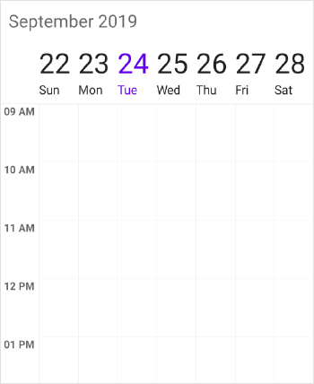
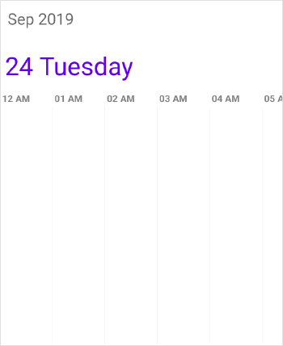
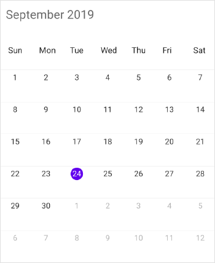

---   
layout: post   
title: Getting Started | SfSchedule | Xamarin | Syncfusion   
description: Learn here about getting started with Syncfusion Xamarin Schedule (SfSchedule) control and more details. 
platform: xamarin   
control: SfSchedule   
documentation: ug   
---   
    
# Getting Started with Xamarin Scheduler (SfSchedule)   
    
This section provides you an overview for working with SfSchedule for Xamarin.Forms and also provides a walk through to configure SfSchedule control in real time scenario.   

## Adding SfSchedule reference

You can add SfSchedule reference using one of the following methods:

**Method 1: Adding SfSchedule reference from nuget.org**

Syncfusion Xamarin components are available in [nuget.org](https://www.nuget.org/). To add SfSchedule to your project, open the NuGet package manager in Visual Studio, search for [Syncfusion.Xamarin.SfSchedule](https://www.nuget.org/packages/Syncfusion.Xamarin.SfSchedule), and then install it.

N> When there is mismatch between the Syncfusion NuGet packages among the projects, `System.IO.FileLoadException` will occur. To overcome this exception, install the same version of the SfSchedule assemblies in all the projects.

**Method 2: Adding SfSchedule reference from toolbox**

Syncfusion also provides Xamarin Toolbox. Using this toolbox, you can drag the SfSchedule control to the XAML page. It will automatically install the required NuGet packages and add the namespace to the page. To install Syncfusion Xamarin Toolbox, refer to [Toolbox](https://help.syncfusion.com/xamarin/utility#toolbox).

**Method 3: Adding SfSchedule assemblies manually from the installed location**

If you prefer to manually reference the assemblies instead referencing from NuGet, add the following assemblies in respective projects.

Location: {Installed location}/{version}/Xamarin/lib

<table>
<tr>
<td>PCL</td>
<td>Syncfusion.SfSchedule.XForms.dll Syncfusion.Core.XForms.dll Syncfusion.Licensing.dll </td>
</tr>
<tr>
<td>Android</td>
<td>Syncfusion.SfSchedule.XForms.Android.dll Syncfusion.SfSchedule.XForms.dll Syncfusion.Core.XForms.dll Syncfusion.Core.XForms.Android.dll Syncfusion.Licensing.dll </td>
</tr>
<tr>
<td>iOS</td>
<td>Syncfusion.SfSchedule.XForms.iOS.dll Syncfusion.SfSchedule.XForms.dll Syncfusion.Core.XForms.dll Syncfusion.Core.XForms.iOS.dll Syncfusion.Licensing.dll </td>
</tr>
<tr>
<td>UWP</td>
<td>Syncfusion.SfSchedule.XForms.UWP.dll Syncfusion.SfSchedule.XForms.dll Syncfusion.Core.XForms.dll Syncfusion.Core.XForms.UWP.dll Syncfusion.Licensing.dll </td>
</tr>
<tr>
<td>WPF</td>
<td>Syncfusion.SfSchedule.XForms.WPF.dll Syncfusion.SfSchedule.XForms.dll Syncfusion.Core.XForms.dll Syncfusion.Core.XForms.WPF.dll Syncfusion.Licensing.dll </td>
</tr>
</table>

N> To know more about obtaining our components, refer to these links for [Mac](https://help.syncfusion.com/xamarin/introduction/download-and-installation/mac/) and [Windows](https://help.syncfusion.com/xamarin/introduction/download-and-installation/windows/).

I> Starting with v16.2.0.x, if you reference Syncfusion assemblies from the trial setup or from the NuGet feed, you also have to include a license key in your projects. Please refer to [Syncfusion license key](https://help.syncfusion.com/common/essential-studio/licensing/license-key/) to know about registering Syncfusion license key in your Xamarin application to use our components.

### Launching SfSchedule on each platform 
 
To use SfSchedule inside an application, each platform application must initialize the SfScheduleRenderer. This initialization step varies from platform to platform and it is discussed in the following sections.   
    
#### Android 
    
Android application launches SfSchedule without any initialization.

N> If you are adding the references from toolbox, this step is not needed.
    
#### iOS

To launch SfSchedule in iOS, you need to call `SfScheduleRenderer.Init()` in the FinishedLaunching overridden method of the AppDelegate class after the Xamarin.Forms Framework initialization.   

       
   
public override bool FinishedLaunching(UIApplication app, NSDictionary options)
{
	global::Xamarin.Forms.Forms.Init();
	Syncfusion.SfSchedule.XForms.iOS.SfScheduleRenderer.Init();
	LoadApplication(new App());
}
   
   

#### Universal Windows Platform (UWP)
 
UWP application launches SfSchedule without any initialization.  

##### ReleaseMode issue in UWP platform

There is a known Framework issue in UWP platform. The custom controls will not render when deployed the application in `Release Mode`.

The above problem can be resolved by initializing the SfSchedule assemblies in `App.xaml.cs` in UWP project as like in below code snippet.

   

// In App.xaml.cs
protected override void OnLaunched(LaunchActivatedEventArgs e)
{
	rootFrame.NavigationFailed += OnNavigationFailed;
	// you'll need to add `using System.Reflection;`
	List<Assembly> assembliesToInclude = new List<Assembly>();
	//Now, add all the assemblies your app uses 
	assembliesToInclude.Add(typeof(Syncfusion.SfSchedule.XForms.UWP.SfScheduleRenderer).GetTypeInfo().Assembly);
	// replaces Xamarin.Forms.Forms.Init(e);        
	Xamarin.Forms.Forms.Init(e, assembliesToInclude);
}

   

#### Windows Presentation Foundation (WPF)

To launch the schedule in WPF SfScheduleRenderer.Init() method in the MainWindow constructor of the MainWindow class after the Xamarin.Forms Framework has been initialized and before the LoadApplication method is called as demonstrated in the following code sample.

   

// In App.xaml.cs
public partial class MainWindow : FormsApplicationPage
{
     public MainWindow()
     { 
            InitializeComponent();

            Forms.Init();

            Syncfusion.SfSchedule.XForms.WPF.SfScheduleRenderer.Init();

            LoadApplication(new App());
     }
}

  

## Supported platforms

* Android
* iOS
* Windows (UWP and WPF)

## Create a simple application with SfSchedule  
    
This section explains how to create a simple application using SfSchedule control. SfSchedule control can be configured entirely in C# code or by using XAML markup. This is how the final output will look like on iOS, Android and Windows Phone devices.  
    
   

You can download the entire source code of this demo for Xamarin.Forms from
here [ScheduleGettingStarted](https://github.com/SyncfusionExamples/xamarin-schedule-getting-started)
    
This section provides a walks through to create `MeetingRoomScheduler` using our Schedule control.  
    
* [Creating a new project](#creating-a-new-project)   
* [Adding SfSchedule to the project](#adding-sfschedule-to-the-project)        
* [Changing Schedule Views](#changing-schedule-views)     
* [Binding data to SfSchedule control](#binding-data-to-sfschedule-control)  

## Creating a new project  
    
Create a new Blank App (Xamarin.Forms) application in Xamarin Studio or Visual Studio.  
    
Add the required assembly references to the .NET Standard and renderer projects as discussed in the [Assembly Configuration](#assembly-configuration) section.   
    
Import SfSchedule control namespace `Syncfusion.SfSchedule.XForms`.   
    
## Adding SfSchedule to the project   
    
Set the SfSchedule control as content to the ContentPage.   
    
   
   
<?xml version="1.0" encoding="utf-8" ?>
<ContentPage
        x:Class="GettingStarted.Sample"
        xmlns="http://xamarin.com/schemas/2014/forms"
        xmlns:x="http://schemas.microsoft.com/winfx/2009/xaml"
        xmlns:local="clr-namespace:GettingStarted;assembly=GettingStarted"
        xmlns:syncfusion="clr-namespace:Syncfusion.SfSchedule.XForms;assembly=Syncfusion.SfSchedule.XForms">
    <ContentPage.Content>
        <syncfusion:SfSchedule x:Name="schedule" />
    </ContentPage.Content>
</ContentPage>
   
   
using Syncfusion.SfSchedule.XForms;
using Xamarin.Forms;

namespace GettingStarted
{
    public class App : Application
    {
        SfSchedule schedule;
        public App()
        {
            InitializeComponent();
            //Creating new instance for SfSchedule   
            schedule = new SfSchedule();
            MainPage = new ContentPage { Content = schedule };
        }
    }
}
   
   

You can download the source code for rendering of schedule for Xamarin.Forms from
here [ScheduleProject](http://www.syncfusion.com/downloads/support/directtrac/general/ze/ScheduleSample933334592.zip)

## Changing Schedule Views   
    
SfSchedule control provides five different types of views to display dates and it can be assigned to the control by using [ScheduleView](https://help.syncfusion.com/cr/xamarin/Syncfusion.SfSchedule.XForms.SfSchedule.html#Syncfusion_SfSchedule_XForms_SfSchedule_ScheduleView) property. By default the control is assigned with `DayView`. Current date will be displayed initially for all the Schedule views.  

Schedule control will be rendered with `Sunday` as the first day of the week, but you can customize to any day by using [FirstDayOfWeek](https://help.syncfusion.com/cr/xamarin/Syncfusion.SfSchedule.XForms.SfSchedule.html#Syncfusion_SfSchedule_XForms_SfSchedule_FirstDayOfWeek) property of `SfSchedule`.
    
  

<syncfusion:SfSchedule x:Name="schedule" FirstDayOfWeek="3"/>   
   

//setting first day of the week    
schedule.FirstDayOfWeek = (int)DayOfWeek.Tuesday;   
  
   
    
   

### Day View   
    
DayView is used to display a single day, current day will be visible by default. Appointments on a specific day will be arranged in respective timeslots based on its duration.   
    
   

<syncfusion:SfSchedule x:Name="schedule" ScheduleView="DayView" />   
   

schedule.ScheduleView = ScheduleView.DayView;   
   
   
    
   

### Week View   
 
`WeekView` is to view all days of a particular week. Appointments will be arranged based on the dates on the week in respective timeslots.  
    
   

<syncfusion:SfSchedule x:Name="schedule" ScheduleView="WeekView" />   
   

schedule.ScheduleView = ScheduleView.WeekView;   
   
   
    
  

### Work Week View   
 
`WorkWeekView` is to view only working days of a particular week. By default, Saturday and Sunday are the non-working days. You can be customize it with any days of a Week. Appointments arranged in timeslots based on its duration with respective day of the week.  
    
   

<syncfusion:SfSchedule x:Name="schedule" ScheduleView="WorkWeekView" />   
   

schedule.ScheduleView = ScheduleView.WorkWeekView;   
   
   
    
   

>**NOTE**
Appointments in non-working days will not be displayed.

### Timeline view   
 
`TimelineView` displays the dates in horizontal time axis with the desired day's count. You can see the past or future dates by scrolling to the right or left. Each view displays events accurately across the time slots with an intuitive drag-and-drop feature.  
    
   

<syncfusion:SfSchedule x:Name="schedule" ScheduleView="TimelineView" />   
   

schedule.ScheduleView = ScheduleView.TimelineView;   
   
   
    
	

### Month View   
    
`MonthView` in Schedule control is to view entire dates of a particular month. Appointments can be viewed in inline by setting [ShowAppointmentsInline](https://help.syncfusion.com/cr/xamarin/Syncfusion.SfSchedule.XForms.SfSchedule.html#Syncfusion_SfSchedule_XForms_SfSchedule_ShowAppointmentsInline) property of `SfSchedule` as true.    
    
   

<syncfusion:SfSchedule
	x:Name="schedule"
	ScheduleView="MonthView"
	ShowAppointmentsInline="True">
</syncfusion:SfSchedule>
  

schedule.ScheduleView = ScheduleView.MonthView;  
//view appointments in inline  
schedule.ShowAppointmentsInline = true;  
   
   
    

## Binding data to SfSchedule control   
  
Schedule control has a built-in capability to handle the appointment arrangement internally based on the ScheduleAppointment collections. You need to assign the created collection to the [DataSource](https://help.syncfusion.com/cr/xamarin/Syncfusion.SfSchedule.XForms.SfSchedule.html#Syncfusion_SfSchedule_XForms_SfSchedule_DataSource) property of `SfSchedule`.  
  
### Adding Appointments   
  
[ScheduleAppointment](http://help.syncfusion.com/cr/xamarin/Syncfusion.SfSchedule.XForms.ScheduleAppointment.html) is a class, which holds the details about the appointment to be rendered in schedule. It has some basic properties such as [StartTime](https://help.syncfusion.com/cr/xamarin/Syncfusion.SfSchedule.XForms.ScheduleAppointment.html#Syncfusion_SfSchedule_XForms_ScheduleAppointment_StartTime), [EndTime](https://help.syncfusion.com/cr/xamarin/Syncfusion.SfSchedule.XForms.ScheduleAppointment.html#Syncfusion_SfSchedule_XForms_ScheduleAppointment_EndTime), [Subject](https://help.syncfusion.com/cr/xamarin/Syncfusion.SfSchedule.XForms.ScheduleAppointment.html#Syncfusion_SfSchedule_XForms_ScheduleAppointment_Subject) and some additional information about the appointment can be added using [Color](https://help.syncfusion.com/cr/xamarin/Syncfusion.SfSchedule.XForms.ScheduleAppointment.html#Syncfusion_SfSchedule_XForms_ScheduleAppointment_Color), [Notes](https://help.syncfusion.com/cr/xamarin/Syncfusion.SfSchedule.XForms.ScheduleAppointment.html#Syncfusion_SfSchedule_XForms_ScheduleAppointment_Notes), [Location](https://help.syncfusion.com/cr/xamarin/Syncfusion.SfSchedule.XForms.ScheduleAppointment.html#Syncfusion_SfSchedule_XForms_ScheduleAppointment_Location), [IsAllDay](https://help.syncfusion.com/cr/xamarin/Syncfusion.SfSchedule.XForms.ScheduleAppointment.html#Syncfusion_SfSchedule_XForms_ScheduleAppointment_IsAllDay), [IsRecursive](https://help.syncfusion.com/cr/xamarin/Syncfusion.SfSchedule.XForms.ScheduleAppointment.html#Syncfusion_SfSchedule_XForms_ScheduleAppointment_IsRecursive) properties.    
  
     

ScheduleAppointmentCollection appointmentCollection = new ScheduleAppointmentCollection();   
//Creating new event   
ScheduleAppointment clientMeeting = new ScheduleAppointment();   
DateTime currentDate = DateTime.Now;   
DateTime startTime = new DateTime (currentDate.Year,currentDate.Month,currentDate.Day, 10, 0, 0);    
DateTime endTime = new DateTime (currentDate.Year, currentDate.Month,currentDate.Day, 12, 0, 0);   
clientMeeting.StartTime = startTime;   
clientMeeting.EndTime = endTime;   
clientMeeting.Color = Color.Blue;   
clientMeeting.Subject = "ClientMeeting";   
appointmentCollection.Add(clientMeeting);   
schedule.DataSource = appointmentCollection;
   
   

You can download the source code for rendering of schedule appointment using `ScheduleAppointmentCollection` for Xamarin.Forms from
here [ScheduleAppointment](http://www.syncfusion.com/downloads/support/directtrac/general/ze/ScheduleAppointment-62423344.zip)

### Adding Custom Appointments   
  
You can also map custom appointments data to our schedule.   
  
>**NOTE**
CustomAppointment class should contain two DateTime fields and a string field as mandatory.
 
Here steps to render `MeetingRoomScheduler` using SfSchedule control with respective custom data properties created in a class Meeting.  
  
* [Creating custom class for appointments](#creating-custom-class-for-appointments) 
* [Creating view model](#creating-view-model)
* [Mapping custom class](#mapping-custom-class)  
* [Setting data source for SfSchedule](#setting-data-source-for-sfschedule)  

#### Creating custom class for appointments
 
You can create a custom class `Meeting` with mandatory fields "From", "To" and "EventName". 
 
   

/// 
   
/// Represents custom data properties.   
/// 
   
public class Meeting
{
	public string EventName { get; set; }
	public string Organizer { get; set; }
	public string ContactID { get; set; }
	public int Capacity { get; set; }
	public DateTime From { get; set; }
	public DateTime To { get; set; }
	public Color color { get; set; }
	public bool AllDay { get; set; }
}
   
   
    
>**NOTE**
You can inherit this class from `INotifyPropertyChanged` for dynamic changes in custom data.

#### Creating view model 

You can schedule meetings for a particular day by setting `From` and `To` of `Meeting` class.Also you can change subject and color of appointment using `EventName` and `color` of Meeting class. In a separate ViewModel class you can describe the collection of custom appointments.  

   

/// 
   
/// Represents collection of appointments.   
/// 
 
public class ViewModel
{
	public ObservableCollection<Meeting> Meetings { get; set; }
	List<string> eventNameCollection;
	List<Color> colorCollection;
	public ViewModel()
	{
		Meetings = new ObservableCollection<Meeting>();
		CreateEventNameCollection();
		CreateColorCollection();
		CreateAppointments();
	}

	/// 

	/// Creates meetings and stores in a collection.  
	/// 

	private void CreateAppointments()
	{
		Random randomTime = new Random();
		List<Point> randomTimeCollection = GettingTimeRanges();
		DateTime date;
		DateTime DateFrom = DateTime.Now.AddDays(-10);
		DateTime DateTo = DateTime.Now.AddDays(10);
		DateTime dataRangeStart = DateTime.Now.AddDays(-3);
		DateTime dataRangeEnd = DateTime.Now.AddDays(3);

		for (date = DateFrom; date < DateTo; date = date.AddDays(1))
		{
			if ((DateTime.Compare(date, dataRangeStart) > 0) && (DateTime.Compare(date, dataRangeEnd) < 0))
			{
				for (int AdditionalAppointmentIndex = 0; AdditionalAppointmentIndex < 3; AdditionalAppointmentIndex++)
				{
					Meeting meeting = new Meeting();
					int hour = (randomTime.Next((int)randomTimeCollection[AdditionalAppointmentIndex].X, (int)randomTimeCollection[AdditionalAppointmentIndex].Y));
					meeting.From = new DateTime(date.Year, date.Month, date.Day, hour, 0, 0);
					meeting.To = (meeting.From.AddHours(1));
					meeting.EventName = eventNameCollection[randomTime.Next(9)];
					meeting.color = colorCollection[randomTime.Next(9)];
					if (AdditionalAppointmentIndex % 3 == 0)
						meeting.AllDay = true;
					Meetings.Add(meeting);
				}
			}
			else
			{
				Meeting meeting = new Meeting();
				meeting.From = new DateTime(date.Year, date.Month, date.Day, randomTime.Next(9, 11), 0, 0);
				meeting.To = (meeting.From.AddHours(1));
				meeting.EventName = eventNameCollection[randomTime.Next(9)];
				meeting.color = colorCollection[randomTime.Next(9)];
				Meetings.Add(meeting);
			}
		}
	}

	/// 
  
	/// Creates event names collection.  
	/// 
  
	private void CreateEventNameCollection()
	{
		eventNameCollection = new List<string>();
		eventNameCollection.Add("General Meeting");
		eventNameCollection.Add("Plan Execution");
		eventNameCollection.Add("Project Plan");
		eventNameCollection.Add("Consulting");
		eventNameCollection.Add("Performance Check");
		eventNameCollection.Add("Yoga Therapy");
		eventNameCollection.Add("Plan Execution");
		eventNameCollection.Add("Project Plan");
		eventNameCollection.Add("Consulting");
		eventNameCollection.Add("Performance Check");
	}

	/// 
  
	/// Creates color collection.  
	/// 
  
	private void CreateColorCollection()
	{
		colorCollection = new List<Color>();
		colorCollection.Add(Color.FromHex("#FF339933"));
		colorCollection.Add(Color.FromHex("#FF00ABA9"));
		colorCollection.Add(Color.FromHex("#FFE671B8"));
		colorCollection.Add(Color.FromHex("#FF1BA1E2"));
		colorCollection.Add(Color.FromHex("#FFD80073"));
		colorCollection.Add(Color.FromHex("#FFA2C139"));
		colorCollection.Add(Color.FromHex("#FFA2C139"));
		colorCollection.Add(Color.FromHex("#FFD80073"));
		colorCollection.Add(Color.FromHex("#FF339933"));
		colorCollection.Add(Color.FromHex("#FFE671B8"));
		colorCollection.Add(Color.FromHex("#FF00ABA9"));
	}

	/// 

	/// Gets the time ranges.
	/// 

	private List<Point> GettingTimeRanges()
	{
		List<Point> randomTimeCollection = new List<Point>();
		randomTimeCollection.Add(new Point(9, 11));
		randomTimeCollection.Add(new Point(12, 14));
		randomTimeCollection.Add(new Point(15, 17));
		return randomTimeCollection;
	}
}

   

#### Mapping custom class  

You can map those properties of `Meeting` class with our schedule control by using [ScheduleAppointmentMapping](http://help.syncfusion.com/cr/xamarin/Syncfusion.SfSchedule.XForms.ScheduleAppointmentMapping.html).   



<syncfusion:SfSchedule x:Name="schedule">
	<syncfusion:SfSchedule.AppointmentMapping>
		<syncfusion:ScheduleAppointmentMapping
			ColorMapping="color"
			EndTimeMapping="To"
			StartTimeMapping="From"
			SubjectMapping="EventName" 
			IsAllDayMapping="AllDay"/>
	</syncfusion:SfSchedule.AppointmentMapping>
</syncfusion:SfSchedule>

  
ScheduleAppointmentMapping dataMapping = new ScheduleAppointmentMapping(); 
dataMapping.ColorMapping = "color";  
dataMapping.EndTimeMapping = "To";
dataMapping.StartTimeMapping = "From"; 
dataMapping.SubjectMapping = "EventName";
dataMapping.IsAllDayMapping = "AllDay";
schedule.AppointmentMapping = dataMapping;  



#### Setting data source for SfSchedule  

Create meetings of type `ObservableCollection <Meeting>`  and assign those appointments collection `Meetings` to the `DataSource` property of `SfSchedule`.



<syncfusion:SfSchedule x:Name="schedule"
	DataSource = "{Binding Meetings}"
	ScheduleView = "WeekView" >
	<syncfusion:SfSchedule.BindingContext>
		<local:ViewModel/>
	</syncfusion:SfSchedule.BindingContext>
</syncfusion:SfSchedule>


ViewModel viewModel = new ViewModel();
schedule.DataSource = viewModel.Meetings;



You can download the entire source code of this demo for Xamarin.Forms from
here [ScheduleGettingStarted](https://github.com/SyncfusionExamples/xamarin-schedule-getting-started)

## See also

[How to resolve SfSchedule not rendering issue in iOS and UWP ?](https://www.syncfusion.com/kb/7202/how-to-resolve-sfschedule-not-rendering-issue-in-ios-and-uwp)

[How to switch between schedule views ?](https://www.syncfusion.com/kb/8446/how-to-switch-between-schedule-views)
