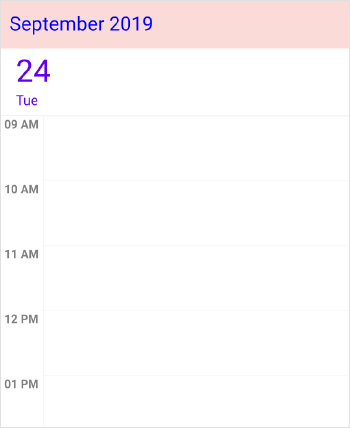
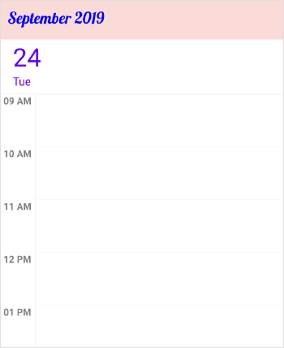

---     
layout: post     
title: Headers | SfSchedule | Xamarin | Syncfusion    
description: Describes how to customize appearance of header view in Schedule (SfSchedule) control in Xamarin.Forms. 
platform: xamarin    
control: SfSchedule     
documentation: ug   
---  

# Headers in Xamarin Scheduler (SfSchedule)

You can customize the header of the Schedule using [HeaderStyle](https://help.syncfusion.com/cr/xamarin/Syncfusion.SfSchedule.XForms.SfSchedule.html#Syncfusion_SfSchedule_XForms_SfSchedule_HeaderStyle) and [HeaderHeight](https://help.syncfusion.com/cr/xamarin/Syncfusion.SfSchedule.XForms.SfSchedule.html#Syncfusion_SfSchedule_XForms_SfSchedule_HeaderHeight) property in schedule.

## Header Height

You can customize the height for the Header in Schedule using `HeaderHeight` in schedule.

 

<syncfusion:SfSchedule x:Name="schedule" HeaderHeight="50" />
 

schedule.HeaderHeight = 50;

 

## Appearance

You can change the header format and style using `HeaderStyle` property in schedule.
You can change the background color, font family, font attributes and font size using properties such as [BackgroundColor](https://help.syncfusion.com/cr/xamarin/Syncfusion.SfSchedule.XForms.HeaderStyle.html#Syncfusion_SfSchedule_XForms_HeaderStyle_BackgroundColor), [FontFamily](https://help.syncfusion.com/cr/xamarin/Syncfusion.SfSchedule.XForms.HeaderStyle.html#Syncfusion_SfSchedule_XForms_HeaderStyle_FontFamily), [FontAttributes](https://help.syncfusion.com/cr/xamarin/Syncfusion.SfSchedule.XForms.HeaderStyle.html#Syncfusion_SfSchedule_XForms_HeaderStyle_FontAttributes), [FontSize](https://help.syncfusion.com/cr/xamarin/Syncfusion.SfSchedule.XForms.HeaderStyle.html#Syncfusion_SfSchedule_XForms_HeaderStyle_FontSize), [TextColor](https://help.syncfusion.com/cr/xamarin/Syncfusion.SfSchedule.XForms.HeaderStyle.html#Syncfusion_SfSchedule_XForms_HeaderStyle_TextColor), of Header using `HeaderStyle` property in schedule.

 

<syncfusion:SfSchedule x:Name="schedule" >
	<syncfusion:SfSchedule.HeaderStyle>
		<syncfusion:HeaderStyle
			BackgroundColor="#FADBD8" 
			TextColor="Blue" 
			FontFamily="Arial"/>
	</syncfusion:SfSchedule.HeaderStyle>
</syncfusion:SfSchedule>


HeaderStyle headerStyle = new HeaderStyle();
headerStyle.BackgroundColor = Color.FromRgb(250, 219, 216);
headerStyle.FontFamily = "Arial";
headerStyle.TextColor=Color.Blue;
schedule.HeaderStyle = headerStyle;

 

 

>**NOTE**
FontAttributes and FontFamily are native to the  platform. Custom font and the font which are not available in the specified platform will not be applied.

### Customize Font Appearance

You can change the appearance of Font by setting the  [FontFamily](https://help.syncfusion.com/cr/xamarin/Syncfusion.SfSchedule.XForms.HeaderStyle.html#Syncfusion_SfSchedule_XForms_HeaderStyle_FontFamilyProperty) property of [HeaderStyle](https://help.syncfusion.com/xamarin/sfschedule/headers#appearance) property in Schedule.

 

<schedule:HeaderStyle.FontFamily>
	<OnPlatform x:TypeArguments="x:String" iOS="Lobster-Regular" Android="Lobster-Regular.ttf" WinPhone="Assets/Lobster-Regular.ttf#Lobster" />
</schedule:HeaderStyle.FontFamily>


headerStyle.FontFamily = Device.OnPlatform("Lobster-Regular", "Lobster-Regular.ttf", "Assets/Lobster-Regular.ttf#Lobster");

 

 

Refer [this](https://help.syncfusion.com/xamarin/sfschedule/monthview#custom-font-setting-in-xamarinforms-android) to configure the custom fonts in Xamarin.Forms.

## Loading Custom Headers

You can collapse the default header of schedule by setting `HeaderHeight` property of `SfSchedule` as 0. Instead you can use your own custom header for it. While navigating views in schedule, text labels available in the header will be changed based on it visible dates, so while using custom header , respective text value can be obtained from the `VisibleDatesChanged` event of `SfSchedule`.

   

//triggering the visible dates changed event.
schedule.VisibleDatesChangedEvent += Schedule_VisibleDatesChangedEvent;

... 

private void Schedule_VisibleDatesChangedEvent(object sender, VisibleDatesChangedEventArgs args)
{
	List<DateTime> dateList = new List<DateTime>();
	dateList = (args.visibleDates);
	var headerString = String.Empty;
	var item = dateList[0];
	if (Schedule.ScheduleView == ScheduleView.DayView)
	{
		item = dateList[0];
		headerString = item.Date.ToString("MMMM, yyyy");
	}
	else
	{
		item = dateList[dateList.Count / 2];
		headerString = item.Date.ToString("MMMM, yyyy");
	}
}

   

You can get the complete sample for customizing the Header of Schedule [here](http://www.syncfusion.com/downloads/support/directtrac/general/ze/Header_Sample-1251673941.zip)

## Header Date Format

You can customize the date format of SfSchedule Header by using [ScheduleHeaderDateFormat](https://help.syncfusion.com/cr/xamarin/Syncfusion.SfSchedule.XForms.SfSchedule.html#Syncfusion_SfSchedule_XForms_SfSchedule_ScheduleHeaderDateFormat) property of `SfSchedule`.



<schedule:SfSchedule x:Name="schedule" ScheduleHeaderDateFormat = "LLL yy" />


//Creating instance of Schedule
SfSchedule schedule = new SfSchedule();
//Customizing date format
schedule.ScheduleHeaderDateFormat = "LLL yy";



## Header Tapped Event

You can handle single tap action of Header by using [HeaderTapped](https://help.syncfusion.com/cr/xamarin/Syncfusion.SfSchedule.XForms.SfSchedule.html) event of `SfSchedule`. This event will be triggered when the Header is Tapped. This event contains [HeaderTappedEventArgs](http://help.syncfusion.com/cr/xamarin/Syncfusion.SfSchedule.XForms.HeaderTappedEventArgs.html) argument which holds [DateTime](https://help.syncfusion.com/cr/xamarin/Syncfusion.SfSchedule.XForms.HeaderTappedEventArgs.html#Syncfusion_SfSchedule_XForms_HeaderTappedEventArgs_DateTime) details in it.



<schedule:SfSchedule x:Name="schedule" HeaderTapped="Handle_HeaderTapped" />


//Creating  new instance of Schedule
SfSchedule schedule = new SfSchedule();
schedule.HeaderTapped += Handle_HeaderTapped;



   

private void Handle_HeaderTapped(object sender, HeaderTappedEventArgs e)
{
    var dateTime = e.DateTime;
}

   

## See also

[How to create custom header and view header in Xamarin.Forms Schedule?](https://www.syncfusion.com/kb/10083/how-to-create-custom-header-and-view-header-in-xamarin-forms-schedule)

