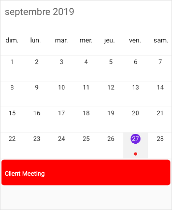

# Localization in Xamarin Scheduler (SfSchedule)

Schedule control is available with complete localization support. Localization can be specified by setting the [Locale](https://help.syncfusion.com/cr/xamarin/Syncfusion.SfSchedule.XForms.SfSchedule.html#Syncfusion_SfSchedule_XForms_SfSchedule_Locale) property of SfSchedule. In the format of `Language code`.

## Change default control language

Based on the `Locale` specified the strings in the control such as Date, time, days are localized accordingly.

By default, schedule control is available with en locale, which is English.

   

<schedule:SfSchedule
	  x:Name="schedule" 
	  ScheduleView="WeekView"
	  Locale="ja">
</schedule:SfSchedule>
   

//creating new instance for schedule
SfSchedule schedule = new SfSchedule();
//setting schedule view 
schedule.ScheduleView = ScheduleView.WeekView;
//setting locale for the control 
schedule.Locale = "ja";
   
   

   

## Change custom texts in the control.

You can localize the custom strings used in the schedule control. For that you need to configure it for each platform separately.

*	Localizing custom text in Android renderer.
*	Localizing custom text in iOS renderer.
*	Localizing custom text in UWP renderer.

You can download the entire source code of this demo for Xamarin.Forms from
here [Localization](http://www.syncfusion.com/downloads/support/directtrac/general/ze/Localization_Forms-1564080177.zip).

### Localizing custom text in Android renderer.

You can localize custom text available in the control by adding equivalent localized string in the string.xml file.



<resources>
	<string name="No_Appointments">Aucun événement</string>
	<string name="No SelectedDate">Aucune date sélectionnée</string>
    <string name="No_Resources">Aucune ressource</string>
</resources>
  
 

Android can select and load resources from different directories, based on the current device configuration and locale, refer [here](https://developer.xamarin.com/guides/android/advanced_topics/localization/). For an example, if an application requires multiple languages you can follow the below steps.

The procedure for creating strings.xml files is as follows:

*	Translate the strings.xml file to each language.
*	Create new folders under resource as values-`ar`, values-`de`, values-`en` and values-`fr` (The original values folder already exists).
*	Place the translated strings.xml files in the respective folders.
 
  

>**NOTE** 
The corresponding Locale values folder updates only when the device language changes.

### Localizing custom text in iOS renderer.

You can localize custom text available in the control by adding equivalent localized string in the Localizable.strings file, refer [here](https://developer.xamarin.com/guides/ios/advanced_topics/localization_and_internationalization/).

 

If an application requires multiple languages you can follow the below steps:

*	Translate the Localizable.Strings file to each language. 
*	Create new `<Language>.lproj` folders under resource as `en.lproj`, `fr.lproj`, `de.lproj`.
*	Place the `Localizable.Strings` file in the respective `<Language>.lproj` folders.

>**NOTE** 
The corresponding `<Language>.lproj` folder updates only when the device language changes.

### Localizing custom text in UWP renderer.

You can localize custom text available in the control by adding equivalent localized string in the Resources(.resw) file. 

>**NOTE** 
Here Resources(.resw) file name should be match with the given locale language code.

The procedure for creating Resources(.resw) file is as follows:

*	Create Resources(.resw) file in sample with C# culture standard name for example fr , de-DE and so.

*	Translate the custom string used in schedule to respective localized culture.

## Localizing custom strings from PCL
You can localize the custom strings (No SelectedDate, No Events, and No Resources) used in the schedule control from PCL. It can be achieved by providing the custom strings to the specific language resx file and handling the required culture with the locale using DependencyService instead of device language. Create a new resource manager based on the resources, and set it to the [Manager](https://help.syncfusion.com/cr/xamarin/Syncfusion.SfSchedule.XForms.ScheduleResourceManager.html#Syncfusion_SfSchedule_XForms_ScheduleResourceManager_Manager) property of [ScheduleResourceManager](https://help.syncfusion.com/cr/xamarin/Syncfusion.SfSchedule.XForms.ScheduleResourceManager.html). In the following code, French has been set as Schedule locale as well as custom strings.




// Here ScheduleSample is a sample name.
ScheduleResourceManager.Manager = new ResourceManager("ScheduleSample.Resources.Syncfusion.SfSchedule.Forms", GetType().GetTypeInfo().Assembly);

if (schedule.Locale == "fr")
{
    if (Device.RuntimePlatform == Device.iOS || Device.RuntimePlatform == Device.Android)
    {
        DependencyService.Get<ILocalize>().SetLocale(new CultureInfo("fr"));
    }
    else
    {
        CultureInfo.DefaultThreadCurrentCulture = new CultureInfo("fr");
    }
}




You can download the entire source code of this demo for Xamarin.Forms from
here [LocaleFromPCL](http://www.syncfusion.com/downloads/support/directtrac/general/ze/LocaleFromPCL635946080.zip).

### Adding resx file
You need to add the required resx files under the Resources folder in the PCL project and the filename should be `Syncfusion.SfSchedule.Forms.LanguageCode.resx`.

Example: For French, `Syncfusion.SfSchedule.Forms.fr.resx`

Now, set the Build Action as EmbeddedResource for `Syncfusion.SfSchedule.Forms.fr.resx` file and Build Action as Compile for `Syncfusion.SfSchedule.Forms.fr.Designer.cs` file.



<data name="NoEvents" xml:space="preserve">
    <value>Pas d'événements</value>
</data>
<data name="NoSelectedDate" xml:space="preserve">
    <value>Aucune date sélectionnée</value>
</data>
<data name="NoResources" xml:space="preserve">
    <value>Aucune ressource</value>
</data>



### Adding ILocalize interface in PCL
You need to add the ILocalize interface to convert the platform-specific locales to a value supported in .NET cultures in the PCL project.



    namespace ScheduleLocale
    {
        public interface ILocalize
        {
                CultureInfo GetCurrentCultureInfo();
                void SetLocale(CultureInfo cultureInfo);
        }
        public class PlatformCulture
        {
            public PlatformCulture(string platformCultureString)
            {
                if (String.IsNullOrEmpty(platformCultureString))
                throw new ArgumentException("Expected culture identifier", "platformCultureString");
                PlatformString = platformCultureString.Replace("_", "-");
                var dashIndex = PlatformString.IndexOf("-", StringComparison.Ordinal);
                if (dashIndex > 0)
                {
                    var parts = PlatformString.Split('-');
                    LanguageCode = parts[0];
                    LocaleCode = parts[1];
                }
                else
                {
                    LanguageCode = PlatformString;
                    LocaleCode = "";
                }
            }
            public string PlatformString { get; private set; }
            public string LanguageCode { get; private set; }
            public string LocaleCode { get; private set; }
            public override string ToString()
            {
                return PlatformString;
            }
        }
    }




### Adding Localize class in Android and iOS project inheriting from ILocalize
You need to add the Localize class in Android and iOS project by inheriting from ILocalize. You can get the CultureInfo and set the same to Schedule Locale by using `GetCurrentCultureInfo` and `SetLocale`.

Localize class for Android project,



    using System.Globalization;
    using System.Threading;
    [assembly: Xamarin.Forms.Dependency(typeof(ScheduleLocale.Droid.Localize))]
    namespace ScheduleLocale.Droid
    {
        public class Localize : ILocalize
        {
            public void SetLocale(CultureInfo cultureInfo)
            {
                Thread.CurrentThread.CurrentCulture = cultureInfo;
                Thread.CurrentThread.CurrentUICulture = cultureInfo;
            }
            public CultureInfo GetCurrentCultureInfo()
            {
                var netLanguage = "en";
                var androidLocale = Java.Util.Locale.Default;
                netLanguage = AndroidToDotnetLanguage(androidLocale.ToString().Replace("_", "-"));
                CultureInfo cultureInfo = null;
                try
                {
                    cultureInfo = new CultureInfo(netLanguage);
                }
                catch
                {
                    try
                    {
                        var fallback = ToDotnetFallbackLanguage(new PlatformCulture(netLanguage));
                        cultureInfo = new CultureInfo(fallback);
                    }
                    catch
                    {
                        cultureInfo = new CultureInfo("en");
                    }
                }
                return cultureInfo;
            }
        private string AndroidToDotnetLanguage(string androidLanguage)
        {
            var netLanguage = androidLanguage;
            switch (androidLanguage)
            {
                case "ms-BN":   // "Malaysian (Brunei)" not supported .NET culture
                case "ms-MY":   // "Malaysian (Malaysia)" not supported .NET culture
                case "ms-SG":   // "Malaysian (Singapore)" not supported .NET culture
                netLanguage = "ms"; // closest supported
                break;
                case "in-ID":  // "Indonesian (Indonesia)" has different code in  .NET
                netLanguage = "id-ID"; // correct code for .NET
                break;
                case "gsw-CH":  // "Schwiizertüütsch (Swiss German)" not supported .NET culture
                netLanguage = "de-CH"; // closest supported
                break;
            }
            return netLanguage;
        }
        private string ToDotnetFallbackLanguage(PlatformCulture platformCulture)
        {
            var netLanguage = platformCulture.LanguageCode; // use the first part of the identifier (two chars, usually);
            switch (platformCulture.LanguageCode)
            {
                case "gsw":
                netLanguage = "de-CH"; // equivalent to German (Switzerland) for this app
                break;
            }
            return netLanguage;
        }
        }
    }




Localize class for iOS project,



    using System.Globalization;
    using System.Threading;
    using Foundation;
    [assembly: Xamarin.Forms.Dependency(typeof(ScheduleLocale.iOS.Localize))]
    namespace ScheduleLocale.iOS
    {
        public class Localize : ILocalize
        {
            public void SetLocale(CultureInfo cultureInfo)
            {
                Thread.CurrentThread.CurrentCulture = cultureInfo;
                Thread.CurrentThread.CurrentUICulture = cultureInfo;
            }
            public CultureInfo GetCurrentCultureInfo()
            {
                var netLanguage = "en";
                if (NSLocale.PreferredLanguages.Length > 0)
                {
                    var pref = NSLocale.PreferredLanguages[0];
                    netLanguage = iOSToDotnetLanguage(pref);
                }
                CultureInfo cultureInfo = null;
                try
                {
                    cultureInfo = new CultureInfo(netLanguage);
                }
                catch
                {
                    try
                    {
                        var fallback = ToDotnetFallbackLanguage(new PlatformCulture(netLanguage));
                        cultureInfo = new CultureInfo(fallback);
                    }
                    catch
                    {
                        cultureInfo = new CultureInfo("en");
                    }
                }
                return cultureInfo;
            }
            private string iOSToDotnetLanguage(string iOSLanguage)
            {
                var netLanguage = iOSLanguage;
                switch (iOSLanguage)
                {
                    case "ms-MY":   // "Malaysian (Malaysia)" not supported .NET culture
                    case "ms-SG":   // "Malaysian (Singapore)" not supported .NET culture
                    netLanguage = "ms"; // closest supported
                    break;
                    case "gsw-CH":  // "Schwiizertüütsch (Swiss German)" not supported .NET culture
                    netLanguage = "de-CH"; // closest supported
                    break;
                }
                return netLanguage;
            }
            private string ToDotnetFallbackLanguage(PlatformCulture platCulture)
            {
                var netLanguage = platCulture.LanguageCode; // use the first part of the identifier (two chars, usually);
                switch (platCulture.LanguageCode)
                {
                    case "pt":
                    netLanguage = "pt-PT"; // fallback to Portuguese (Portugal)
                    break;
                    case "gsw":
                    netLanguage = "de-CH"; // equivalent to German (Switzerland) for this app
                    break;
                }
                return netLanguage;
            }
        }
    }




>**NOTE**
For UWP project, no sample level changes required.

## See also

[How to localize inline strings in schedule month view without changing locale in device ?](https://www.syncfusion.com/kb/9397/how-to-localize-inline-strings-in-schedule-month-view-without-changing-locale-in-device)
