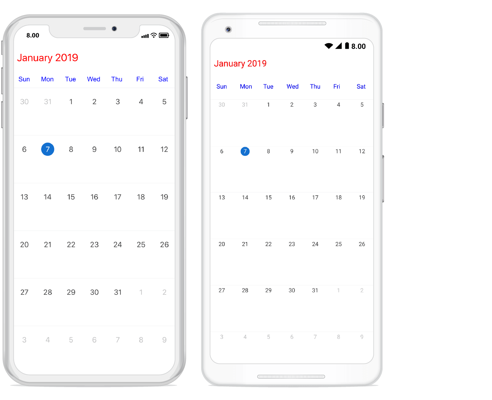
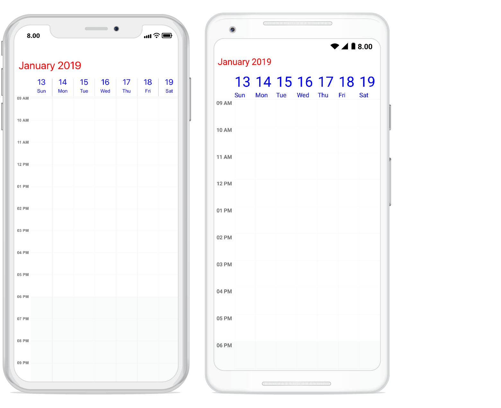
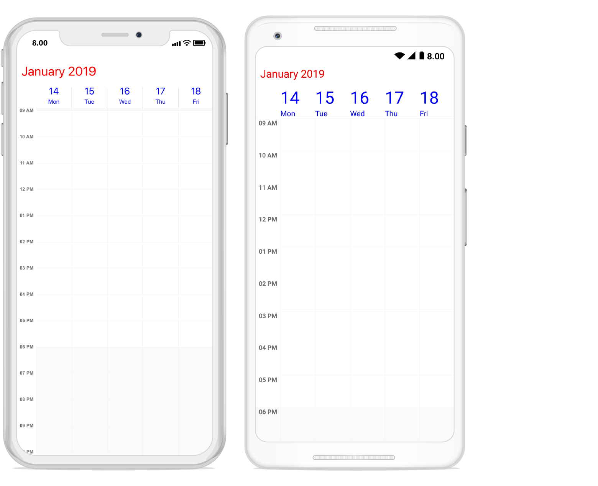

# Theming

Theming is a set of resources which are used to provide the consistency look for schedule.
You can modify the default appearance of schedule using this support. By default schedule have default theme resources and it’s located in `Syncfusion.Xamarin.Core` assembly. You need to merge them in your application’s resource to apply the theme.

In the below code you can see the default color and key value for the default resources.



<!--DayViewSettings-->
    <Color x:Key="SfScheduleDayViewNonWorkingHoursTimeSlotColor">#FAFAFA</Color>
    <Color x:Key="SfScheduleDayViewNonWorkingHoursTimeSlotBorderColor">#F0F0F0</Color>
    <Color x:Key="SfScheduleDayViewTimeSlotColor">#FFFFFF</Color>
    <Color x:Key="SfScheduleDayViewTimeSlotBorderColor">#F0F0F0</Color>
    <Color x:Key="SfScheduleDayViewVerticalLineColor">#F0F0F0</Color>
    <Color x:Key="SfScheduleDayViewAllDayAppointmentLayoutColor">#FFFFFF</Color>
    <!--WeekViewSettings-->
    <Color x:Key="SfScheduleWeekViewNonWorkingHoursTimeSlotColor">#FAFAFA</Color>
    <Color x:Key="SfScheduleWeekViewNonWorkingHoursTimeSlotBorderColor">#F0F0F0</Color>
    <Color x:Key="SfScheduleWeekViewTimeSlotColor">#FFFFFF</Color>
    <Color x:Key="SfScheduleWeekViewTimeSlotBorderColor">#F0F0F0</Color>
    <Color x:Key="SfScheduleWeekViewVerticalLineColor">#F0F0F0</Color>
    <Color x:Key="SfScheduleWeekViewAllDayAppointmentLayoutColor">#FFFFFF</Color>
    <!--WorkWeekViewSettings-->
    <Color x:Key="SfScheduleWorkWeekViewNonWorkingHoursTimeSlotColor">#FAFAFA</Color>
    <Color x:Key="SfScheduleWorkWeekViewNonWorkingHoursTimeSlotBorderColor">#F0F0F0</Color>
    <Color x:Key="SfScheduleWorkWeekViewTimeSlotColor">#FFFFFF</Color>
    <Color x:Key="SfScheduleWorkWeekViewTimeSlotBorderColor">#F0F0F0</Color>
    <Color x:Key="SfScheduleWorkWeekViewVerticalLineColor">#F0F0F0</Color>
    <Color x:Key="SfScheduleWorkWeekViewAllDayAppointmentLayoutColor">#FFFFFF</Color>
    <!--TimelineViewSettings-->
    <Color x:Key="SfScheduleTimelineViewTimeSlotColor">#FFFFFF</Color>
    <Color x:Key="SfScheduleTimelineViewTimeSlotBorderColor">#F0F0F0</Color>
    <!--MonthViewSettings-->
    <Color x:Key="SfScheduleMonthViewTodayBackground">#1470D0</Color>
    <Color x:Key="SfScheduleMonthViewSelectionTextColor">#000000</Color>
    <!--DayLabelSettings-->
    <Color x:Key="SfScheduleDayViewLabelTimeLabelColor">#707070</Color>
    <!--WeekLabelSettings-->
    <Color x:Key="SfScheduleWeekViewLabelTimeLabelColor">#707070</Color>
    <!--WorkWeekLabelSettings-->
    <Color x:Key="SfScheduleWorkWeekViewLabelTimeLabelColor">#707070</Color>
    <!--TimelineLabelSettings-->
    <Color x:Key="SfScheduleTimelineViewLabelTimeLabelColor">#707070</Color>
    <!--HeaderStyle-->
    <Color x:Key="SfScheduleHeaderBackgroundColor">#FFFFFF</Color>
    <Color x:Key="SfScheduleHeaderTextColor">#707070</Color>
    <!--ViewHeaderStyle-->
    <Color x:Key="SfScheduleViewHeaderDayTextColor">#707070</Color>
    <Color x:Key="SfScheduleViewHeaderBackgroundColor">#FFFFFF</Color>
    <Color x:Key="SfScheduleViewHeaderDateTextColor">#707070</Color>
    <!--SelectionStyle-->
    <Color x:Key="SfScheduleSelectionBackgroundColor">#F5F5F5</Color>
    <Color x:Key="SfScheduleSelectionBorderColor">#F0F0F0</Color>
    <!--AppointmentStyle-->
    <Color x:Key="SfScheduleAppointmentTextColor">#FFFFFF</Color>
    <Color x:Key="SfScheduleAppointmentBorderColor">#FFFFFF</Color>
    <Color x:Key="SfScheduleAppointmentSelectionBorderColor">#424242</Color>
    <Color x:Key="SfScheduleAppointmentSelectionTextColor">#FFFFFF</Color>
    <!--MonthViewCellStyle-->
    <Color x:Key="SfScheduleMonthCellTextColor">#414141</Color>
    <Color x:Key="SfScheduleMonthCellBackgroundColor">#FFFFFF</Color>
    <Color x:Key="SfScheduleMonthCellTodayBackgroundColor">#FFFFFF</Color>
    <Color x:Key="SfScheduleMonthCellTodayTextColor">#FFFFFF</Color>
    <Color x:Key="SfScheduleMonthCellPreviousMonthTextColor">#C2C2C2</Color>
    <Color x:Key="SfScheduleMonthCellPreviousMonthBackgroundColor">#FFFFFF</Color>
    <Color x:Key="SfScheduleMonthCellNextMonthBackgroundColor">#FFFFFF</Color>
    <Color x:Key="SfScheduleMonthCellNextMonthTextColor">#C2C2C2</Color>
    <!--WeekNumberStyle-->
    <Color x:Key="SfScheduleMonthViewWeekNumberTextColor">#707070</Color>
    <Color x:Key="SfScheduleMonthViewWeekNumberBackgroundColor">#FFFFFF</Color>
    <!--AgendaViewStyle-->
    <Color x:Key="SfScheduleMonthAgendaViewSubjectFontColor">#414141</Color>
    <Color x:Key="SfScheduleMonthAgendaViewBackgroundColor">#F5F5F5</Color>
    <Color x:Key="SfScheduleMonthAgendaViewTimeFontColor">#707070</Color>
    <Color x:Key="SfScheduleMonthAgendaViewDateFontColor">#707070</Color>
    <!--TimeIndicatorStyle-->
    <Color x:Key="SfScheduleTimeIndicatorTextColor">#6D25E8</Color>

 

You can apply the default theme (light theme) or customized theme to schedule.

## Default theme (light theme)

You need to apply the syncfusion theme dictionaries in your application to view the default theme (light theme).



<?xml version="1.0" encoding="utf-8"?>
<ContentPage xmlns="http://xamarin.com/schemas/2014/forms" xmlns:x="http://schemas.microsoft.com/winfx/2009/xaml" xmlns:local="clr-namespace:ScheduleTheme" x:Class="ScheduleTheme.MainPage" xmlns:syncfusion="clr-namespace:Syncfusion.SfSchedule.XForms;assembly=Syncfusion.SfSchedule.XForms"
              xmlns:syncTheme="clr-namespace:Syncfusion.XForms.Themes;assembly=Syncfusion.Core.XForms">
    <ContentPage.Resources>
        <syncTheme:SyncfusionThemeDictionary>
            <syncTheme:SyncfusionThemeDictionary.MergedDictionaries>
                <syncTheme:LightTheme x:Name="LightTheme" />
            </syncTheme:SyncfusionThemeDictionary.MergedDictionaries>
        </syncTheme:SyncfusionThemeDictionary>
    </ContentPage.Resources>   
    <syncfusion:SfSchedule x:Name="schedule">
    </syncfusion:SfSchedule>
</ContentPage>  

 

Month view

Week view

Work Week view

Day view

## Customizing the default theme

You can customize the default theme by overriding the existing key and set the new value.



<?xml version="1.0" encoding="utf-8"?>
<ContentPage xmlns="http://xamarin.com/schemas/2014/forms" xmlns:x="http://schemas.microsoft.com/winfx/2009/xaml" xmlns:local="clr-namespace:ScheduleTheme" x:Class="ScheduleTheme.MainPage" xmlns:syncfusion="clr-namespace:Syncfusion.SfSchedule.XForms;assembly=Syncfusion.SfSchedule.XForms"
              xmlns:syncTheme="clr-namespace:Syncfusion.XForms.Themes;assembly=Syncfusion.Core.XForms">
    <ContentPage.Resources>
        <syncTheme:SyncfusionThemeDictionary>
            <syncTheme:SyncfusionThemeDictionary.MergedDictionaries>
                <syncTheme:LightTheme x:Name="LightTheme" />
                <syncfusion:SfScheduleStyles />
                <ResourceDictionary>
                    <Color x:Key="SfScheduleHeaderTextColor">Red</Color>
                    <Color x:Key="SfScheduleViewHeaderDayTextColor">Blue</Color>
                    <Color x:Key="SfScheduleViewHeaderDateTextColor">Blue</Color>
                </ResourceDictionary>
            </syncTheme:SyncfusionThemeDictionary.MergedDictionaries>
        </syncTheme:SyncfusionThemeDictionary>
    </ContentPage.Resources>   
    <syncfusion:SfSchedule x:Name="schedule">
    </syncfusion:SfSchedule>
</ContentPage> 

 

>**NOTE**
`Xamarin.Forms` version should be above 3 while customize the default theme.

Month view

Week view

Work Week view

Day view

You can download the entire source code of this demo for Xamarin.Forms from
here [ScheduleTheme](https://github.com/SyncfusionExamples/xamarin-schedule-theming).