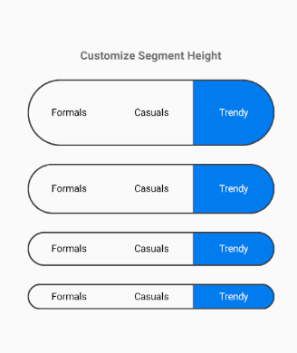

# Customization in Xamarin Segmented Control (SfSegmentedControl)

The segmented control supports customizing segment color, text color, icon size, selection color, and more. This control also allows segments to seamlessly integrate with your application's theme. Below are the areas that can be customized.

## Text Appearance

The text within the segmented control can be tailored by adjusting its font size, color, and font family.

### Font Family

Customize the font family of segmented items using the [`FontFamily`](https://help.syncfusion.com/cr/xamarin/Syncfusion.XForms.Buttons.SfSegmentedControl.html#Syncfusion_XForms_Buttons_SfSegmentedControl_FontFamily) property.





<buttons:SfSegmentedControl>
<buttons:SfSegmentedControl.FontFamily>
        <OnPlatform x:TypeArguments="x:String">
        <On Platform="iOS" Value="Helvetica" />
        <On Platform="Android" Value="Roboto" />
        <On Platform="UWP" Value="Helvetica" />
       </OnPlatform>
</buttons:SfSegmentedControl.FontFamily>
</buttons:SfSegmentedControl >





segmentedControl.FontFamily = Device.RuntimePlatform == Device.iOS ? "Helvetica" :
Device.RuntimePlatform == Device.Android ? "Roboto"  : "Helvetica";





### Font Color

Customize the text color of segmented items using the [`FontColor`](https://help.syncfusion.com/cr/xamarin/Syncfusion.XForms.Buttons.SfSegmentedControl.html#Syncfusion_XForms_Buttons_SfSegmentedControl_FontColor) property.





<buttons:SfSegmentedControl FontColor="Red" />





segmentedControl.SelectionTextColor = Color.Red;





### Font Size

Change the text size of segmented items using the [`FontSize`](https://help.syncfusion.com/cr/xamarin/Syncfusion.XForms.Buttons.SfSegmentedControl.html#Syncfusion_XForms_Buttons_SfSegmentedControl_FontSize) property.





<buttons:SfSegmentedControl FontSize="20" />





segmentedControl.FontSize = 20;





## Border

Customize the border by both color and thickness.

### Border Color

Adjust the border color for all items in the segmented control.





<buttons:SfSegmentedControl BorderColor="Red" />





segmentedControl.BorderColor = Color.Red;





### Border Thickness

Customize the border width using the [`BorderThickness`](https://help.syncfusion.com/cr/xamarin/Syncfusion.XForms.Buttons.SfSegmentedControl.html#Syncfusion_XForms_Buttons_SfSegmentedControl_BorderThickness) property.





<buttons:SfSegmentedControl  BorderThickness="5" />





segmentedControl.BorderThickness = 5;





### Padding

The segmented control can handle padding between items.

#### Segment Padding

Customize the spacing between segmented items with the [`SegmentPadding`](https://help.syncfusion.com/cr/xamarin/Syncfusion.XForms.Buttons.SfSegmentedControl.html#Syncfusion_XForms_Buttons_SfSegmentedControl_SegmentPadding).





<buttons:SfSegmentedControl SegmentPadding="15" />





segmentedControl.SegmentPadding = 15;





### Corner Radius

The segmented control provides corner radius support for segmented items and strips.

#### Item Radius

Customize the corner radius for each segmented item.





<buttons:SfSegmentedControl SegmentCornerRadius="15" />





segmentedControl.SegmentCornerRadius = 15;





#### Selection Strip Radius

Customize the corner radius for the selection strip using the [`CornerRadius`](https://help.syncfusion.com/cr/xamarin/Syncfusion.XForms.Buttons.SfSegmentedControl.html#Syncfusion_XForms_Buttons_SfSegmentedControl_CornerRadius) within the [`SelectionIndicatorSettings`](https://help.syncfusion.com/cr/xamarin/Syncfusion.XForms.Buttons.SfSegmentedControl.html#Syncfusion_XForms_Buttons_SfSegmentedControl_SelectionIndicatorSettings) class.





<buttons:SfSegmentedControl>
<buttons:SfSegmentedControl.SelectionIndicatorSettings>
<buttons:SelectionIndicatorSettings 
    CornerRadius="15">
</buttons:SelectionIndicatorSettings>
</buttons:SfSegmentedControl.SelectionIndicatorSettings>
</buttons:SfSegmentedControl>





SelectionIndicatorSettings selectionIndicator = new SelectionIndicatorSettings();
selectionIndicator.CornerRadius = 15;
segmentedControl.SelectionIndicatorSettings = selectionIndicator;





#### Control Radius

The segmented control also supports the corner radius for the border line enclosing the entire control.





<buttons:SfSegmentedControl CornerRadius="15" />





segmentedControl.CornerRadius = 15;





### Color

The segmented control allows users to customize the background color of segmented items and the control itself.

#### Item Color

Customize the background color of each segmented item using the [`Color`](https://help.syncfusion.com/cr/xamarin/Syncfusion.XForms.Buttons.SfSegmentedControl.html#Syncfusion_XForms_Buttons_SfSegmentedControl_Color) property within the [`SelectionIndicatorSettings`](https://help.syncfusion.com/cr/xamarin/Syncfusion.XForms.Buttons.SfSegmentedControl.html#Syncfusion_XForms_Buttons_SfSegmentedControl_SelectionIndicatorSettings) class.





<buttons:SfSegmentedControl.SelectionIndicatorSettings>
<buttons:SelectionIndicatorSettings 
    Color="#FF355088">
</buttons:SelectionIndicatorSettings>
</buttons:SfSegmentedControl.SelectionIndicatorSettings>





SelectionIndicatorSettings selectionIndicator = new SelectionIndicatorSettings();
selectionIndicator.Color = Color.FromHex("#FF355088");
segmentedControl.SelectionIndicatorSettings = selectionIndicator;





#### Control Color

Customize the background color of the entire control by setting the [`Color`](https://help.syncfusion.com/cr/xamarin/Syncfusion.XForms.Buttons.SfSegmentedControl.html#Syncfusion_XForms_Buttons_SfSegmentedControl_Color) property.





<buttons:SfSegmentedControl Color="#02A0AE" />





segmentedControl.Color = Color.FromHex("#02A0AE");





## Scrolling in Segmented Control Programmatically

The segmented control supports programmatic scrolling using the [`ScrollTo`](https://help.syncfusion.com/cr/xamarin/Syncfusion.XForms.Buttons.SfSegmentedControl.html#Syncfusion_XForms_Buttons_SfSegmentedControl_ScrollTo_System_Int32_Syncfusion_XForms_Buttons_ScrollToPosition_) methods as follows.

### ScrollTo(index, scrollToPosition)

This method scrolls the segment item based on a given index and [`ScrollToPosition`](https://help.syncfusion.com/cr/xamarin/Syncfusion.XForms.Buttons.SfSegmentedControl.html#Syncfusion_XForms_Buttons_SfSegmentedControl_ScrollToPosition) value.





segmentedControl.ScrollTo(5,  Syncfusion.XForms.Buttons.ScrollToPosition.Start);





### ScrollTo(item, scrollToPosition)

Scroll a segment item based on the given data or [`SfSegmentItem`](https://help.syncfusion.com/cr/xamarin/Syncfusion.XForms.Buttons.SfSegmentItem.html) and [`ScrollToPosition`](https://help.syncfusion.com/cr/xamarin/Syncfusion.XForms.Buttons.SfSegmentedControl.html#Syncfusion_XForms_Buttons_SfSegmentedControl_ScrollToPosition) value.





segmentedControl.ScrollTo(viewModel.Items[5], Syncfusion.XForms.Buttons.ScrollToPosition.Start);





## Segment Height

The segmented control height can be customized using the [SegmentHeight](https://help.syncfusion.com/cr/xamarin/Syncfusion.XForms.Buttons.SfSegmentedControl.html#Syncfusion_XForms_Buttons_SfSegmentedControl_SegmentHeight) property as shown below.
 



     
     <? xml version="1.0" encoding="utf-8" ?>
     <ContentPage 
     xmlns = "http://xamarin.com/schemas/2014/forms" 
     xmlns:x="http://schemas.microsoft.com/winfx/2009/xaml" 
     xmlns:buttons="clr-namespace:Syncfusion.XForms.Buttons;assembly=Syncfusion.Buttons.XForms" 
     x:Class="GettingStarted.MainPage">
    <ContentPage.Content>
        <buttons:SfSegmentedControl SegmentHeight="60"/>
    </ContentPage.Content>
    </ContentPage>





    using Syncfusion.XForms.Buttons;
    using Xamarin.Forms;

    namespace GettingStarted
    {
        public partial class MainPage : ContentPage
        {
            private SfSegmentedControl segmentedControl;
            public MainPage()
            {
                InitializeComponent();
                segmentedControl = new SfSegmentedControl();
                segmentedControl.SegmentHeight = 60;
                this.Content = segmentedControl;
            }
        }
    }





A sample demonstrating segment height customization can be downloaded from this [link](https://github.com/SyncfusionExamples/how-to-customize-segment-contol-height-in-xamarin.forms).

