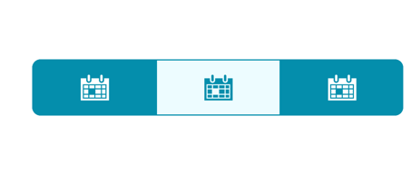
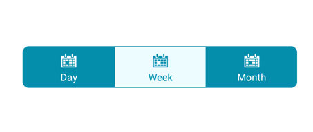

# Display mode in Xamarin Segmented Control (SfSegmentedControl)

Depending on application, different scenarios may require for effective communication. The segmented control supports these three options: icons, text, or a combination of both.

## Text

Items populated in the segmented control will be displayed as text by default.

Add the following namespace for loading data collection in string.



xmlns:segmentCollection="clr-namespace:System.Collections.Generic;assembly=netstandard"







<buttons:SfSegmentedControl 
    x:Name="segmentedControl" 
    Margin="10,0"
    CornerRadius="15"
    SegmentHeight="50"
    BorderColor="Transparent"
    SelectedIndex="1"
    Color="#048EAC"
    FontSize="22"
    DisplayMode="Text"
    VisibleSegmentsCount="3"
    FontColor="#FFFFFF"
    SelectionTextColor="#048EAC"
    VerticalOptions="Center"
    HorizontalOptions="Center">
    <segmentCollection:List x:TypeArguments="x:String">
    <x:String>Day</x:String>
    <x:String>Week</x:String>
    <x:String>Month</x:String>
    </segmentCollection:List>
</buttons:SfSegmentedControl>

   



public partial class SegmentedControlSample : ContentPage
{
SfSegmentedControl segmentedControl;
public SegmentedControlSample()
{
    InitializeComponent();
    segmentedControl = new SfSegmentedControl();

    List<String> periodsList = new List<String>
    {
           "Day","Week","Month"
    };
    segmentedControl.ItemsSource = periodsList;
    segmentedControl.DisplayMode = SegmentDisplayMode.Text;
    segmentedControl.Color = Color.FromHex("#048EAC");
    segmentedControl.SegmentHeight= 50;
    segmentedControl.VisibleSegmentsCount = 3;
    segmentedControl.CornerRadius = 15;
    segmentedControl.HeightRequest = 50;
    segmentedControl.SelectedIndex = 1;
    segmentedControl.BorderColor = Color.Transparent;
    segmentedControl.FontColor = Color.FromHex("#FFFFFF");
    segmentedControl.FontSize = 22;
    segmentedControl.VerticalOptions = LayoutOptions.Center;
    segmentedControl.HorizontalOptions = LayoutOptions.Center;
    segmentedControl.SelectionTextColor = Color.FromHex("#048EAC");
    this.Content = segmentedControl;
}
}





## Image 

Items populated in the segmented control will be displayed as icons.

The data source of the segmented control can be set as follows.



public class ViewModel
{
    private ObservableCollection<SfSegmentItem> imageCollection;
    public ObservableCollection<SfSegmentItem> ImageCollection
    {
        get { return imageCollection; }
        set { imageCollection = value; }
    }

    public ViewModel()
    {
        ImageCollection = new ObservableCollection<SfSegmentItem>
        {
            new SfSegmentItem(){IconFont = "6", FontIconFontColor=Color.FromHex("#FFFFFF"),  FontColor=Color.FromHex     ("#FFFFFF")},          
            new SfSegmentItem(){IconFont = "6",  FontIconFontColor=Color.FromHex("#FFFFFF"),          FontColor=Color.FromHex   ("#FFFFFF")},     
            new SfSegmentItem(){IconFont = "6",  FontIconFontColor=Color.FromHex("#FFFFFF"),          FontColor=Color.FromHex   ("#FFFFFF")},          
        };
    }
}






<buttons:SfSegmentedControl 
    x:Name="segmentedControl" 
    DisplayMode="Image"
    SelectedIndex="1"
    ItemsSource = "{Binding ImageCollection}"
    VisibleSegmentsCount="3"
    SelectionTextColor="#FFFFFF"
</buttons:SfSegmentedControl>





public partial class SegmentedControlSample : ContentPage
{
    private ViewModel viewModel = new ViewModel();
    SfSegmentedControl segmentedControl;

    public SegmentedControlSample()
    {
        segmentedControl = new SfSegmentedControl();
        segmentedControl.ItemsSource = viewModel.ImageCollection;
        segmentedControl.DisplayMode = SegmentDisplayMode.Image;
        segmentedControl.SelectedIndex = 1;
        segmentedControl.VisibleSegmentsCount = 3;
        segmentedControl.SelectionTextColor = Color.FromHex("#FFFFFF");
        this.Content = segmentedControl;
    }
}





## Image with text

Items populated in the segmented control will be displayed as icons with text.

The data source of the segmented control can be set as follows.



public class ViewModel 
{
    private ObservableCollection<SfSegmentItem> imageTextCollection;
    public ObservableCollection<SfSegmentItem> ImageTextCollection
    {
        get { return imageTextCollection; }
        set { imageTextCollection = value; }
    }

    public ViewModel()
    {
        imageTextCollection = new ObservableCollection<SfSegmentItem>
        {
            new SfSegmentItem(){IconFont = "6", FontIconFontColor=Color.FromHex("#FFFFFF"),  FontColor=Color.FromHex     ("#FFFFFF"), Text = "Day"},          
            new SfSegmentItem(){IconFont = "6",  FontIconFontColor=Color.FromHex("#FFFFFF"),          FontColor=Color.FromHex   ("#FFFFFF"), Text = "Week"},     
            new SfSegmentItem(){IconFont = "6",  FontIconFontColor=Color.FromHex("#FFFFFF"),          FontColor=Color.FromHex   ("#FFFFFF"), Text = "Month"          
        };
    }
}







<buttons:SfSegmentedControl 
    x:Name="segmentedControl" 
    Margin="10,0"
    CornerRadius="15"
    SelectedIndex="1"
    SelectedIndex="1"
    ItemsSource = "{Binding ImageTextCollection}"
    DisplayMode="ImageWithText"
    VisibleSegmentsCount="3"
    FontIconFontFamily = "segment.ttf"
</buttons:SfSegmentedControl>





public partial class SegmentedControlSample : ContentPage
{
    private ViewModel viewModel = new ViewModel();
    private SfSegmentedControl segmentedControl;

    public SegmentedControlSample()
    {
        segmentedControl = new SfSegmentedControl();
        segmentedControl.ItemsSource = viewModel.ImageTextCollection;
        segmentedControl.DisplayMode = SegmentDisplayMode.ImageWithText;
        segmentedControl.SelectedIndex = 1;
        segmentedControl.VisibleSegmentsCount = 3;
        segmentedControl.SelectionTextColor = Color.FromHex("#FFFFFF");
        segmentedControl.FontIconFontFamily = "segment.ttf";
        this.Content = segmentedControl;
    }
}





## How to set the font icons using ttf file?

You can refer this [link](https://help.syncfusion.com/metro-studio/export-font-icon) for getting the font icons. Add the font file to your application by using the following steps for each platform:

**Adding font file for iOS**

1. Add the font family inside `Resource` folder iOS project.
2. Add the font file with the following build action: `BundleResource`.
3. Update the `Info.plist` file (fonts that are provided by application, UIAppFonts, or key).

**Adding font file for Android**

Add the font file to the `Assets` folder in the application project, and set the following build action: `AndroidAsset`.

**Adding font file for UWP**

Add the font family inside the application project of UWP.

N> For iOS alone, FontFamily property is declared without succeeding with .ttf and for android and UWP platform font family name is defined followed by .ttf.





 FontIconFontFamily = "segment"





segmentedControl.FontIconFontFamily = "segment";




