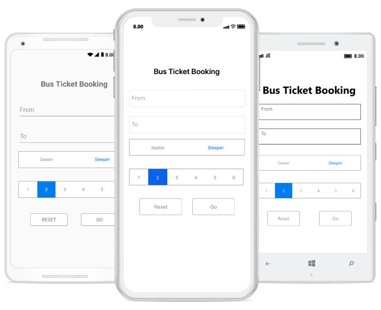

# Getting Started with Xamarin Segmented Control (SfSegmentedControl)

This section provides an overview for working with the segmented control for Xamarin.Forms. It guides you through the process of creating a real-world application using [`SfSegmentedControl`](https://help.syncfusion.com/cr/xamarin/Syncfusion.XForms.Buttons.SfSegmentedControl.html).

## Assembly Deployment

After installing [Essential Studio® for Xamarin](https://www.syncfusion.com/downloads/xamarin), you can find all the required assemblies in the installation folders at {Syncfusion Essential Studio Installed location}\Essential Studio\\{Version #}\Xamarin\lib.

E.g.: C:\Program Files (x86) \Syncfusion\Essential Studio\19.1.0.54\Xamarin\lib

> Note: Assemblies can be found in the unzipped package location (Documents/Syncfusion/{Version #}/Xamarin/lib) on a Mac.

## Adding SfSegmentedControl Reference

You can add the [`SfSegmentedControl`](https://help.syncfusion.com/cr/xamarin/Syncfusion.XForms.Buttons.SfSegmentedControl.html) reference using one of the following methods:

**Method 1: Adding SfSegmentedControl Reference from NuGet.org**

Syncfusion Xamarin components are available on [nuget.org](https://www.nuget.org/). To add [`SfSegmentedControl`](https://help.syncfusion.com/cr/xamarin/Syncfusion.XForms.Buttons.SfSegmentedControl.html) to your project, open the NuGet Package Manager in Visual Studio, search for [Syncfusion.Xamarin.Buttons](https://www.nuget.org/packages/Syncfusion.Xamarin.Buttons), and install it.

> Note:
> - Install the same version of [`SfSegmentedControl`](https://help.syncfusion.com/cr/xamarin/Syncfusion.XForms.Buttons.SfSegmentedControl.html) NuGet in all projects.
> - Additionally, install the [Syncfusion.Xamarin.Buttons.WPF]() package for Xamarin.Forms WPF platform only.

**Method 2: Adding SfSegmentedControl Reference from Toolbox**

Syncfusion also provides a Xamarin Toolbox. By using this toolbox, you can drag the [`SfSegmentedControl`](https://help.syncfusion.com/cr/xamarin/Syncfusion.XForms.Buttons.SfSegmentedControl.html) control to the XAML page. It will automatically install the required NuGet packages and add the namespace to the page. To install the Syncfusion Xamarin Toolbox, refer to the [Toolbox](https://help.syncfusion.com/xamarin/utility#toolbox) documentation.

**Method 3: Adding SfSegmentedControl Assemblies Manually from the Installed Location**

If you prefer to manually reference the assemblies instead of using NuGet, add the following assemblies to the respective projects.

Location: {Installed location}/{version}/Xamarin/lib

<table>
<tr>
<td>PCL</td>
<td>Syncfusion.Buttons.XForms.dll Syncfusion.Core.XForms.dll Syncfusion.Licensing.dll </td>
</tr>
<tr>
<td>Android</td>
<td>Syncfusion.Buttons.XForms.dll Syncfusion.Buttons.XForms.Android.dll Syncfusion.Core.XForms.dll Syncfusion.Core.XForms.Android.dll Syncfusion.Licensing.dll </td>
</tr>
<tr>
<td>iOS</td>
<td>Syncfusion.Buttons.XForms.dll Syncfusion.Buttons.XForms.iOS.dll Syncfusion.Core.XForms.dll Syncfusion.Core.XForms.iOS.dll Syncfusion.Licensing.dll </td>
</tr>
<tr>
<td>UWP</td>
<td>Syncfusion.Buttons.XForms.dll Syncfusion.Buttons.XForms.UWP.dll Syncfusion.Core.XForms.dll Syncfusion.Core.XForms.UWP.dll Syncfusion.Licensing.dll </td>
</tr>
<tr>
<td>WPF</td>
<td>Syncfusion.Buttons.XForms.dll Syncfusion.Buttons.XForms.WPF.dll Syncfusion.Core.XForms.dll Syncfusion.Core.XForms.WPF.dll Syncfusion.Licensing.dll </td>
</tr>
</table>

> Note: For more information on obtaining our components, refer to the following links for [Mac](https://help.syncfusion.com/xamarin/installation/mac-installer/how-to-download) and [Windows](https://help.syncfusion.com/xamarin/installation/web-installer/how-to-download).

> Info: Starting with v16.2.0.x, if you reference Syncfusion assemblies from the trial setup or the NuGet feed, you must include a license key in your projects. Refer to [Syncfusion license key](https://help.syncfusion.com/common/essential-studio/licensing/overview) to learn about registering a Syncfusion license key in your Xamarin application to use our components.

## Launching the SfSegmentedControl on Each Platform

To use the segmented control inside an application, initialize the segmented control renderer for each platform application. Initialization steps vary by platform and are discussed in the following sections:

### Android and UWP

For Android and UWP, you can launch the [`SfSegmentedControl`](https://help.syncfusion.com/cr/xamarin/Syncfusion.XForms.Buttons.SfSegmentedControl.html) without any additional initialization, except for initializing the Xamarin.Forms framework to launch the application.

> Note: If you add references from the toolbox, this step is not needed.

### iOS

To launch the segmented control in iOS, call `SfSegmentedControlRenderer.Init()` in the `FinishedLaunching` overridden method of the `AppDelegate` class after initializing the Xamarin.Forms framework and before calling `LoadApplication`, as shown in the following code example:



    public override bool FinishedLaunching(UIApplication app, NSDictionary options)
    {
         …            
         global::Xamarin.Forms.Forms.Init ();   
         Syncfusion.XForms.iOS.Buttons.SfSegmentedControlRenderer.Init();  
         LoadApplication (new App ());   
         …   
    }
	



### ReleaseMode issue in UWP platform

There is a known Framework issue in UWP platform. The custom controls will not render when deployed the application in `Release Mode`.

The above problem can be resolved by initializing the [`SfSegmentedControl`](https://help.syncfusion.com/cr/xamarin/Syncfusion.XForms.Buttons.SfSegmentedControl.html) assemblies in `App.xaml.cs` in UWP project as in the following code snippet.



// In App.xaml.cs

    protected override void OnLaunched(LaunchActivatedEventArgs e)
    {
        …
    	    rootFrame.NavigationFailed += OnNavigationFailed;
    
        // you'll need to add `using System.Reflection;
        List<Assembly> assembliesToInclude = new List<Assembly>();
    
        //Now, add all the assemblies your app uses                 
        assembliesToInclude.Add(typeof(Syncfusion.XForms.UWP.Buttons.SfSegmentedControlRenderer).GetTypeInfo().Assembly);
    
        // replaces Xamarin.Forms.Forms.Init(e);        
        Xamarin.Forms.Forms.Init(e, assembliesToInclude);	
        …     
    }



### Additional step for WPF

To launch the segmented control in WPF, call the SfSegmentedControlRenderer.Init() method in the MainWindow constructor of the MainWindow class after the Xamarin.Forms framework has been initialized and before the LoadApplication method is called as demonstrated in the following code sample.

 

public partial class MainWindow : FormsApplicationPage
{
     public MainWindow()
     { 
            InitializeComponent();
            
            Forms.Init();
            
            Syncfusion.XForms.WPF.Buttons.SfSegmentedControlRenderer.Init();
            
            LoadApplication(new App());
     }
}



## Creating an application with segmented control.

This section explains how to create a bus ticket booking module by using syncfusion segmented control. The control can be configured entirely in C# code or by using XAML markup. The following screenshot illustrates the output of Segmented control on iOS, Android and UWP devices.

## Creating a project

Create a new BlankApp (Xamarin.Forms.Portable) application in Visual Studio for Xamarin.Forms.

### Adding SfSegmentedControl in Xamarin.Forms

Add the required assembly references to the PCL and renderer projects as discussed in the Assembly Deployment [section](https://help.syncfusion.com/xamarin/introduction/control-dependencies#sfsegmentedcontrol).

Import the control namespace as shown in the following code:





    xmlns:buttons="clr-namespace:Syncfusion.XForms.Buttons;assembly=Syncfusion.Buttons.XForms"
	




    using Syncfusion.XForms.Buttons;





Set the control to content in `ContentPage`.





    <? xml version="1.0" encoding="utf-8" ?>
    <ContentPage xmlns = "http://xamarin.com/schemas/2014/forms"
    
        xmlns:x="http://schemas.microsoft.com/winfx/2009/xaml"
    	xmlns:buttons="clr-namespace:Syncfusion.XForms.Buttons;assembly=Syncfusion.Buttons.XForms"
    	x:Class="GettingStarted.MainPage">
        <ContentPage.Content>
            <buttons:SfSegmentedControl  />
        </ContentPage.Content>
    </ContentPage>  





    using Syncfusion.XForms.Buttons;
    using Xamarin.Forms;
    
    namespace GettingStarted
    {
        public partial class MainPage : ContentPage
        {
            private SfSegmentedControl segmentedControl;
            public MainPage()
            {
                InitializeComponent();
                segmentedControl = new SfSegmentedControl();
                this.Content = segmentedControl;
            }
        }
    }   





### Adding Supportive Views to the Application
 
For the completeness of the ticket booking application, add a few framework controls to get data from the user.

ViewModel class for the Entry, which we have used in our View:





    using Syncfusion.XForms.Buttons;
    using System;
    using System.Collections.ObjectModel;
    using System.ComponentModel;
    using System.Runtime.CompilerServices;
    using Xamarin.Forms;
    
    namespace SegmentGettingStarted
    {
        class ViewModel : INotifyPropertyChanged
        {
            private string fromText="";
            public string FromText
            {
                get { return fromText; }
                set { fromText = value; NotifyPropertyChanged("FromText"); }
            }
            private string toText = "";
            public string ToText
            {
                get { return toText; }
                set { toText = value; NotifyPropertyChanged("ToText"); }
            }
            public ViewModel()
            {
            }
            public event PropertyChangedEventHandler PropertyChanged;
    
            private void NotifyPropertyChanged([CallerMemberName] String propertyName = "")
            {
                if (PropertyChanged != null)
                {
                    PropertyChanged(this, new PropertyChangedEventArgs(propertyName));
                }
            }
        }
    }





View can be created by the following code snippet.





    <? xml version="1.0" encoding="utf-8" ?>
    <ContentPage xmlns = "http://xamarin.com/schemas/2014/forms"
                xmlns:x="http://schemas.microsoft.com/winfx/2009/xaml"
                xmlns:local="clr-namespace:SegmentGettingStarted"
                xmlns:buttons="clr-namespace:Syncfusion.XForms.Buttons;assembly=Syncfusion.Buttons.XForms"
                xmlns:segmentCollection="clr-namespace:System.Collections.Generic;assembly=netstandard"
                x:Class="SegmentGettingStarted.MainPage">
    <ContentPage.BindingContext>
        <local:ViewModel x:Name="viewModel" />
    </ContentPage.BindingContext>
    <StackLayout
        HorizontalOptions = "Center"
        VerticalOptions="Center"
        Padding="20,0,20,0">
         <Label
            Text="Bus Ticket Booking"
            FontSize="Large"
            FontAttributes="Bold"
            HeightRequest="50"
            HorizontalOptions="Center"
            VerticalOptions="Center"/>
        <Entry
            Placeholder="From"
            Text="{Binding FromText,Mode=TwoWay}"
            HeightRequest="50"
            Margin="0,10,0,10"/>
        <Entry
            Placeholder="To"
            Text="{Binding ToText}"
            HeightRequest="50"
            Margin="0,10,0,10"/>
    </StackLayout>
    </ContentPage>





    using Syncfusion.XForms.Buttons;
    using System.Collections.Generic;
    using Xamarin.Forms;
    namespace SegmentGettingStarted
    {
        public partial class MainPage : ContentPage
        {
            StackLayout stack;
            ViewModel viewModel;
            Label headerLabel;
            Entry fromEntry, toEntry;
            public MainPage()
            {
                InitializeComponent();
                stack = new StackLayout();
                viewModel = new ViewModel();
                stack.HorizontalOptions = LayoutOptions.Center;
                stack.VerticalOptions = LayoutOptions.Center;
                stack.Padding = new Thickness(20, 0, 20, 0);
    
                //Label to denote the header part of application
                headerLabel = new Label();
                headerLabel.Text = "Bus Ticket Booking";
                headerLabel.FontAttributes = FontAttributes.Bold;
                headerLabel.HeightRequest = 50;
                headerLabel.FontSize = Device.GetNamedSize(NamedSize.Large, typeof(Label));
                headerLabel.HorizontalOptions = LayoutOptions.Center;
                headerLabel.VerticalOptions = LayoutOptions.Center;

                //Entry to enter the origin location
                fromEntry = new Entry();
                fromEntry.Placeholder = "From";
                fromEntry.Text = viewModel.FromText;
                fromEntry.HeightRequest = 50;
                fromEntry.Margin = new Thickness(0, 10, 0, 10);

                //Entry to enter the destination location
                toEntry = new Entry();
                toEntry.Placeholder = "To";
                toEntry.Text = viewModel.ToText;
                toEntry.HeightRequest = 50;
                toEntry.Margin = new Thickness(0, 10, 0, 10);
    
                stack.Children.Add(headerLabel);
                stack.Children.Add(fromEntry);
                stack.Children.Add(toEntry);
                this.Content = stack;
            }
        }
    }





## Adding Data/Items to SfSegmentedControl

You can add data inside the segmented control in three different ways:

1. String data
2. SfSegmentItem
3. Custom View

Items inside the segmented control can be added using the [`ItemsSource`](https://help.syncfusion.com/cr/xamarin/Syncfusion.XForms.Buttons.SfSegmentedControl.html#Syncfusion_XForms_Buttons_SfSegmentedControl_ItemsSource) property of [`SfSegmentedControl`](https://help.syncfusion.com/cr/xamarin/Syncfusion.XForms.Buttons.SfSegmentedControl.html), which holds the collection/list of items.

### Adding Data as a String

With the help of Xamarin.Forms `System.Collections.Generic`, you can add string data as an [`ItemsSource`](https://help.syncfusion.com/cr/xamarin/Syncfusion.XForms.Buttons.SfSegmentedControl.html#Syncfusion_XForms_Buttons_SfSegmentedControl_ItemsSource) to [`SfSegmentedControl`](https://help.syncfusion.com/cr/xamarin/Syncfusion.XForms.Buttons.SfSegmentedControl.html).



    using Syncfusion.XForms.Buttons;
    using System;
    using System.Collections.ObjectModel;
    using System.ComponentModel;
    using System.Runtime.CompilerServices;
    using Xamarin.Forms;
    
    namespace SegmentGettingStarted
    {
        class ViewModel : INotifyPropertyChanged
        {
            private string fromText="";
            public string FromText
            {
                get { return fromText; }
                set { fromText = value; NotifyPropertyChanged("FromText"); }
            }
            private string toText = "";
            public string ToText
            {
                get { return toText; }
                set { toText = value; NotifyPropertyChanged("ToText"); }
            }
            public ViewModel()
            {
            }
            public event PropertyChangedEventHandler PropertyChanged;
    
            private void NotifyPropertyChanged([CallerMemberName] String propertyName = "")
            {
                if (PropertyChanged != null)
                {
                    PropertyChanged(this, new PropertyChangedEventArgs(propertyName));
                }
            }
        }
    }







    <? xml version="1.0" encoding="utf-8" ?>
    <ContentPage xmlns = "http://xamarin.com/schemas/2014/forms"
                xmlns:x="http://schemas.microsoft.com/winfx/2009/xaml"
                xmlns:local="clr-namespace:SegmentGettingStarted"
                xmlns:buttons="clr-namespace:Syncfusion.XForms.Buttons;assembly=Syncfusion.Buttons.XForms"
                xmlns:segmentCollection="clr-namespace:System.Collections.Generic;assembly=netstandard"
                x:Class="SegmentGettingStarted.MainPage">
    <ContentPage.BindingContext>
        <local:ViewModel x:Name="viewModel" />
    </ContentPage.BindingContext>
    <StackLayout
        HorizontalOptions = "Center"
        VerticalOptions="Center"
        Padding="20,0,20,0">
         <Label
            Text="Bus Ticket Booking"
            FontSize="Large"
            FontAttributes="Bold"
            HeightRequest="50"
            HorizontalOptions="Center"
            VerticalOptions="Center"/>
        <Entry
            Placeholder="From"
            Text="{Binding FromText,Mode=TwoWay}"
            HeightRequest="50"
            Margin="0,10,0,10"/>
        <Entry
            Placeholder="To"
            Text="{Binding ToText}"
            HeightRequest="50"
            Margin="0,10,0,10"/>
        <buttons:SfSegmentedControl
            SelectionTextColor = "White"
            HeightRequest="80"
            VisibleSegmentsCount="6"
            Color="Transparent" 
            BorderColor="#929292"
            SelectedIndex="1"
            FontColor="#929292"
            BackgroundColor="Transparent" >
            <segmentCollection:List x:TypeArguments="x:String">
                <x:String>1</x:String>
                <x:String>2</x:String>
                <x:String>3</x:String>
                <x:String>4</x:String>
                <x:String>5</x:String>
                <x:String>6</x:String>
            </segmentCollection:List>
        </buttons:SfSegmentedControl>
    </StackLayout>
    </ContentPage>





    using Syncfusion.XForms.Buttons;
    using System.Collections.Generic;
    using Xamarin.Forms;
    namespace SegmentGettingStarted
    {
        public partial class MainPage : ContentPage
        {
            SfSegmentedControl segmentedControl;
            StackLayout stack;
            ViewModel viewModel;
            Label headerLabel;
            Entry fromEntry, toEntry;
            public MainPage()
            {
                InitializeComponent();
                stack = new StackLayout();
                viewModel = new ViewModel();
                stack.HorizontalOptions = LayoutOptions.Center;
                stack.VerticalOptions = LayoutOptions.Center;
                stack.Padding = new Thickness(20, 0, 20, 0);
    
                //Label to denote the header part of application
                headerLabel = new Label();
                headerLabel.Text = "Bus Ticket Booking";
                headerLabel.FontAttributes = FontAttributes.Bold;
                headerLabel.HeightRequest = 50;
                headerLabel.FontSize = Device.GetNamedSize(NamedSize.Large, typeof(Label));
                headerLabel.HorizontalOptions = LayoutOptions.Center;
                headerLabel.VerticalOptions = LayoutOptions.Center;

                //Entry to enter the origin location
                fromEntry = new Entry();
                fromEntry.Placeholder = "From";
                fromEntry.Text = viewModel.FromText;
                fromEntry.HeightRequest = 50;
                fromEntry.Margin = new Thickness(0, 10, 0, 10);

                //Entry to enter the destination location
                toEntry = new Entry();
                toEntry.Placeholder = "To";
                toEntry.Text = viewModel.ToText;
                toEntry.HeightRequest = 50;
                toEntry.Margin = new Thickness(0, 10, 0, 10);
    
                //Adding item to the SegmentedControl as String
                segmentedControl = new SfSegmentedControl();
                segmentedControl.SelectionTextColor = Color.White;
                segmentedControl.HeightRequest = 80;
                segmentedControl.Color = Color.Transparent;
                segmentedControl.BorderColor = Color.FromHex("#929292");
                segmentedControl.FontColor = Color.FromHex("#929292");
                segmentedControl.SelectedIndex = 1;
                segmentedControl.BackgroundColor = Color.Transparent;
                segmentedControl.VisibleSegmentsCount = 6;
                segmentedControl.DisplayMode = SegmentDisplayMode.Text;
                List<string> list = new List<string>
                {
                    "1","2","3","4","5","6"
                };
                segmentedControl.ItemsSource = list;
    
                stack.Children.Add(headerLabel);
                stack.Children.Add(fromEntry);
                stack.Children.Add(toEntry);
                stack.Children.Add(segmentedControl);
                this.Content = stack;
            }
        }
    }





### Adding data as a SfSegmentItem

By using [`SfSegmentItem`](https://help.syncfusion.com/cr/xamarin/Syncfusion.XForms.Buttons.SfSegmentItem.html) class, you can add data inside the segmented control.

In ViewModel, add the following code to get the respective items in [`SfSegmentedControl`](https://help.syncfusion.com/cr/xamarin/Syncfusion.XForms.Buttons.SfSegmentedControl.html).



    using Syncfusion.XForms.Buttons;
    using System;
    using System.Collections.ObjectModel;
    using System.ComponentModel;
    using System.Runtime.CompilerServices;
    using Xamarin.Forms;
    
    namespace SegmentGettingStarted
    {
        class ViewModel : INotifyPropertyChanged
        {
            private string fromText="";
            public string FromText
            {
                get { return fromText; }
                set { fromText = value; NotifyPropertyChanged("FromText"); }
            }
            private string toText = "";
            public string ToText
            {
                get { return toText; }
                set { toText = value; NotifyPropertyChanged("ToText"); }
            }
            public ViewModel()
            {
                itemCollection = new ObservableCollection<SfSegmentItem>
                    {
                        new SfSegmentItem() {  Text = "Seater"},
                        new SfSegmentItem() {  Text = "Sleeper"},
                    };
            }
            public event PropertyChangedEventHandler PropertyChanged;
    
            private void NotifyPropertyChanged([CallerMemberName] String propertyName = "")
            {
                if (PropertyChanged != null)
                {
                    PropertyChanged(this, new PropertyChangedEventArgs(propertyName));
                }
            }
    
            private ObservableCollection<SfSegmentItem> itemCollection;

            public ObservableCollection<SfSegmentItem> ItemCollection
            {
                get { return itemCollection; }
                set { itemCollection = value; }
            }
        }
    }







        <?xml version="1.0" encoding="utf-8" ?>
    <ContentPage xmlns="http://xamarin.com/schemas/2014/forms"
                 xmlns:x="http://schemas.microsoft.com/winfx/2009/xaml"
                 xmlns:local="clr-namespace:SegmentGettingStarted"
                  xmlns:buttons="clr-namespace:Syncfusion.XForms.Buttons;assembly=Syncfusion.Buttons.XForms"
                 xmlns:segmentCollection="clr-namespace:System.Collections.Generic;assembly=netstandard"
                 x:Class="SegmentGettingStarted.MainPage">
        <ContentPage.BindingContext>
            <local:ViewModel x:Name="viewModel" />
        </ContentPage.BindingContext>
        <StackLayout 
            HorizontalOptions="Center"
            VerticalOptions="Center"
            Padding="20,0,20,0">
             <Label
            Text="Bus Ticket Booking"
            FontSize="Large"
            FontAttributes="Bold"
            HeightRequest="50"
            HorizontalOptions="Center"
            VerticalOptions="Center"/>
        <Entry
            Placeholder="From"
            Text="{Binding FromText,Mode=TwoWay}"
            HeightRequest="50"
            Margin="0,10,0,10"/>
        <Entry
            Placeholder="To"
            Text="{Binding ToText}"
            HeightRequest="50"
            Margin="0,10,0,10"/>
            <buttons:SfSegmentedControl 
                x:Name="segment" 
                HeightRequest="80"
                VisibleSegmentsCount="2"
                Color="White"
                SelectionTextColor="#007CEE"
                FontColor="#929292"
                BorderColor="#929292"
                SelectedIndex="1"
                ItemsSource="{Binding ItemCollection,Mode=TwoWay}"
                BackgroundColor="Transparent">
            </buttons:SfSegmentedControl>
            <buttons:SfSegmentedControl
                SelectionTextColor="White"
                HeightRequest="80"
                VisibleSegmentsCount="6"
                Color="Transparent" 
                BorderColor="#929292"
                SelectedIndex="1"
                FontColor="#929292"
                BackgroundColor="Transparent" >
                <segmentCollection:List x:TypeArguments="x:String">
                    <x:String>1</x:String>
                    <x:String>2</x:String>
                    <x:String>3</x:String>
                    <x:String>4</x:String>
                    <x:String>5</x:String>
                    <x:String>6</x:String>
                </segmentCollection:List>
            </buttons:SfSegmentedControl>
        </StackLayout>
    </ContentPage>





    using Syncfusion.XForms.Buttons;
    using System.Collections.Generic;
    using Xamarin.Forms;
    namespace SegmentGettingStarted
    {
        public partial class MainPage : ContentPage
        {
            SfSegmentedControl segmentedControl, segment;
            StackLayout stack;
            ViewModel viewModel;
            Label headerLabel;
            Entry fromEntry, toEntry;
            public MainPage()
            {
                InitializeComponent();
                stack = new StackLayout();
                viewModel = new ViewModel();
                stack.HorizontalOptions = LayoutOptions.Center;
                stack.VerticalOptions = LayoutOptions.Center;
                stack.Padding = new Thickness(20, 0, 20, 0);
    
                //Label to denote the header part of application
                headerLabel = new Label();
                headerLabel.Text = "Bus Ticket Booking";
                headerLabel.FontAttributes = FontAttributes.Bold;
                headerLabel.HeightRequest = 50;
                headerLabel.FontSize = Device.GetNamedSize(NamedSize.Large, typeof(Label));
                headerLabel.HorizontalOptions = LayoutOptions.Center;
                headerLabel.VerticalOptions = LayoutOptions.Center;

                //Entry to enter the origin location
                fromEntry = new Entry();
                fromEntry.Placeholder = "From";
                fromEntry.Text = viewModel.FromText;
                fromEntry.HeightRequest = 50;
                fromEntry.Margin = new Thickness(0, 10, 0, 10);

                //Entry to enter the destination location
                toEntry = new Entry();
                toEntry.Placeholder = "To";
                toEntry.Text = viewModel.ToText;
                toEntry.HeightRequest = 50;
                toEntry.Margin = new Thickness(0, 10, 0, 10);
    
                //Adding item to the SegmentedControl as String
                segmentedControl = new SfSegmentedControl();
                segmentedControl.SelectionTextColor = Color.White;
                segmentedControl.HeightRequest = 80;
                segmentedControl.Color = Color.Transparent;
                segmentedControl.BorderColor = Color.FromHex("#929292");
                segmentedControl.FontColor = Color.FromHex("#929292");
                segmentedControl.SelectedIndex = 1;
                segmentedControl.BackgroundColor = Color.Transparent;
                segmentedControl.VisibleSegmentsCount = 6;
                segmentedControl.DisplayMode = SegmentDisplayMode.Text;
                List<string> list = new List<string>
                {
                    "1","2","3","4","5","6"
                };
                segmentedControl.ItemsSource = list;

                //Adding item to SegmentedControl as SegmentItem
                segment = new SfSegmentedControl();
                segment.SelectionTextColor = Color.FromHex("#007CEE");
                segment.VisibleSegmentsCount = 2;
                segment.Color = Color.White;
                segment.BorderColor = Color.FromHex("#929292");
                segment.SelectedIndex = 1;
                segment.FontColor = Color.FromHex("#929292");
                segment.BackgroundColor = Color.Transparent;

                segment.BindingContext = viewModel;
                segment.ItemsSource = viewModel.ItemCollection;
    
                SelectionIndicatorSettings select = new SelectionIndicatorSettings();
                select.Color = Color.White;

                segment.SelectionIndicatorSettings = select;
    
                stack.Children.Add(headerLabel);
                stack.Children.Add(fromEntry);
                stack.Children.Add(toEntry);
                stack.Children.Add(segment);
                stack.Children.Add(segmentedControl);
                this.Content = stack;
            }
        }
    }





### Adding data as Custom View

You can add any custom view to the segmented control.

In ViewModel add the below given code to get the respective items/collection in [`SfSegmentedControl`](https://help.syncfusion.com/cr/xamarin/Syncfusion.XForms.Buttons.SfSegmentedControl.html).



    using Syncfusion.XForms.Buttons;
    using System;
    using System.Collections.ObjectModel;
    using System.ComponentModel;
    using System.Runtime.CompilerServices;
    using Xamarin.Forms;
    
    namespace SegmentGettingStarted
    {
        class ViewModel : INotifyPropertyChanged
        {
            private string fromText="";
            public string FromText
            {
                get { return fromText; }
                set { fromText = value; NotifyPropertyChanged("FromText"); }
            }
            private string toText = "";
            public string ToText
            {
                get { return toText; }
                set { toText = value; NotifyPropertyChanged("ToText"); }
            }
            public ViewModel()
            {
                itemCollection = new ObservableCollection<SfSegmentItem>
                    {
                        new SfSegmentItem() {  Text = "Seater"},
                        new SfSegmentItem() {  Text = "Sleeper"},
                    };
                ViewCollection = new ObservableCollection<View>
                    {
                       ResetViewButton,
                       GoViewButton
                    };
            }
            public event PropertyChangedEventHandler PropertyChanged;
    
            private void NotifyPropertyChanged([CallerMemberName] String propertyName = "")
            {
                if (PropertyChanged != null)
                {
                    PropertyChanged(this, new PropertyChangedEventArgs(propertyName));
                }
            }
    
            private ObservableCollection<SfSegmentItem> itemCollection = new ObservableCollection<SfSegmentItem>();
            private ObservableCollection<View> viewCollection = new ObservableCollection<View>();
            public ObservableCollection<SfSegmentItem> ItemCollection
            {
                get { return itemCollection; }
                set { itemCollection = value; }
            }
            public ObservableCollection<View> ViewCollection
            {
                get { return viewCollection; }
                set { viewCollection = value; }
            }
            private Button ResetViewButton = new Button
            {
                Text = "Reset",
                TextColor = Color.FromHex("#979797"),
                BackgroundColor = Color.White,
                BorderColor = Color.FromHex("#979797"),
                BorderWidth = 1,
                CornerRadius = 4,
                HeightRequest = 50,
                VerticalOptions = LayoutOptions.Center
            };
            private Button GoViewButton = new Button
            {
                Text = "Go",
                TextColor = Color.FromHex("#979797"),
                BackgroundColor = Color.White,
                BorderColor = Color.FromHex("#979797"),
                BorderWidth = 1,
                CornerRadius = 4,
                HeightRequest = 50,
                VerticalOptions = LayoutOptions.Center
            };
        }
    }







   
    <?xml version="1.0" encoding="utf-8" ?>
    <ContentPage xmlns="http://xamarin.com/schemas/2014/forms"
                 xmlns:x="http://schemas.microsoft.com/winfx/2009/xaml"
                 xmlns:local="clr-namespace:SegmentGettingStarted"
                  xmlns:buttons="clr-namespace:Syncfusion.XForms.Buttons;assembly=Syncfusion.Buttons.XForms"
                 xmlns:segmentCollection="clr-namespace:System.Collections.Generic;assembly=netstandard"
                 x:Class="SegmentGettingStarted.MainPage">
    
        <ContentPage.BindingContext>
            <local:ViewModel x:Name="viewModel" />
        </ContentPage.BindingContext>
        <StackLayout 
            HorizontalOptions="Center"
            VerticalOptions="Center"
            Padding="20,0,20,0">
        <Label
            Text="Bus Ticket Booking"
            FontSize="Large"
            FontAttributes="Bold"
            HeightRequest="50"
            HorizontalOptions="Center"
            VerticalOptions="Center"/>
        <Entry
            Placeholder="From"
            Text="{Binding FromText,Mode=TwoWay}"
            HeightRequest="50"
            Margin="0,10,0,10"/>
        <Entry
            Placeholder="To"
            Text="{Binding ToText}"
            HeightRequest="50"
            Margin="0,10,0,10"/>
        <buttons:SfSegmentedControl 
                x:Name="segment" 
                HeightRequest="80"
                VisibleSegmentsCount="2"
                Color="White"
                SelectionTextColor="#007CEE"
                FontColor="#929292"
                BorderColor="#929292"
                SelectedIndex="1"
                ItemsSource="{Binding ItemCollection,Mode=TwoWay}"
                BackgroundColor="Transparent">
        </buttons:SfSegmentedControl>
        <buttons:SfSegmentedControl
                SelectionTextColor="White"
                HeightRequest="80"
                VisibleSegmentsCount="6"
                Color="Transparent" 
                BorderColor="#929292"
                SelectedIndex="1"
                FontColor="#929292"
                BackgroundColor="Transparent" >
                <segmentCollection:List x:TypeArguments="x:String">
                    <x:String>1</x:String>
                    <x:String>2</x:String>
                    <x:String>3</x:String>
                    <x:String>4</x:String>
                    <x:String>5</x:String>
                    <x:String>6</x:String>
                </segmentCollection:List>
        </buttons:SfSegmentedControl>
        <buttons:SfSegmentedControl
                BorderColor="Transparent" 
                HeightRequest="80"
                HorizontalOptions="Center"
                x:Name="segmentView"
                VisibleSegmentsCount="2"
                Color="Transparent"
                ItemsSource="{Binding ViewCollection}"
                SegmentPadding="30">
            </buttons:SfSegmentedControl>
        </StackLayout>
    </ContentPage>
    





    using Syncfusion.XForms.Buttons;
    using System.Collections.Generic;
    using Xamarin.Forms;
    
    namespace SegmentGettingStarted
    {
        public partial class MainPage : ContentPage
        {
            SfSegmentedControl segmentedControl, segment, segmentView;
            StackLayout stack;
            ViewModel viewModel;
            Label headerLabel;
            Entry fromEntry, toEntry;
            public MainPage()
            {
                InitializeComponent();
                stack = new StackLayout();
                viewModel = new ViewModel();
                stack.HorizontalOptions = LayoutOptions.Center;
                stack.VerticalOptions = LayoutOptions.Center;
                stack.Padding = new Thickness(20, 0, 20, 0);

                //Label to denote the header part of application
                headerLabel = new Label();
                headerLabel.Text = "Bus Ticket Booking";
                headerLabel.FontAttributes = FontAttributes.Bold;
                headerLabel.HeightRequest = 50;
                headerLabel.FontSize = Device.GetNamedSize(NamedSize.Large, typeof(Label));
                headerLabel.HorizontalOptions = LayoutOptions.Center;
                headerLabel.VerticalOptions = LayoutOptions.Center;

                //Entry to enter the origin location
                fromEntry = new Entry();
                fromEntry.Placeholder = "From";
                fromEntry.Text = viewModel.FromText;
                fromEntry.HeightRequest = 50;
                fromEntry.Margin = new Thickness(0, 10, 0, 10);

                //Entry to enter the destination location
                toEntry = new Entry();
                toEntry.Placeholder = "To";
                toEntry.Text = viewModel.ToText;
                toEntry.HeightRequest = 50;
                toEntry.Margin = new Thickness(0, 10, 0, 10);
    
                //Adding item to the segmented control as String
                segmentedControl = new SfSegmentedControl();
                segmentedControl.SelectionTextColor = Color.White;
                segmentedControl.HeightRequest = 80;
                segmentedControl.Color = Color.Transparent;
                segmentedControl.BorderColor = Color.FromHex("#929292");
                segmentedControl.FontColor = Color.FromHex("#929292");
                segmentedControl.SelectedIndex = 1;
                segmentedControl.BackgroundColor = Color.Transparent;
                segmentedControl.VisibleSegmentsCount = 6;
                segmentedControl.DisplayMode = SegmentDisplayMode.Text;
                List<string> list = new List<string>
                {
                    "1","2","3","4","5","6"
                };
                segmentedControl.ItemsSource = list;

                //Adding item to segmented control as SegmentItem
                segment = new SfSegmentedControl();
                segment.SelectionTextColor = Color.FromHex("#007CEE");
                segment.VisibleSegmentsCount = 2;
                segment.Color = Color.White;
                segment.BorderColor = Color.FromHex("#929292");
                segment.SelectedIndex = 1;
                segment.FontColor = Color.FromHex("#929292");
                segment.BackgroundColor = Color.Transparent;

                segment.BindingContext = viewModel;
                segment.ItemsSource = viewModel.ItemCollection;
    
                SelectionIndicatorSettings select = new SelectionIndicatorSettings();
                select.Color = Color.White;

                segment.SelectionIndicatorSettings = select;
    
                //Adding item to the segmented control as View
                segmentView = new SfSegmentedControl();
                segmentView.BindingContext = viewModel;
                segmentView.ItemsSource = viewModel.ViewCollection;
                segmentView.BorderColor = Color.Transparent;
                segmentView.HeightRequest = 80;
                segmentView.HorizontalOptions = LayoutOptions.Center;
                segmentView.VisibleSegmentsCount = 2;
                segmentView.Color = Color.Transparent;
                segmentView.SegmentPadding = 30;
    
                SelectionIndicatorSettings selectionIndicator = new SelectionIndicatorSettings();
                selectionIndicator.Color = Color.Transparent;
                selectionIndicator.Position = SelectionIndicatorPosition.Fill;
                selectionIndicator.StrokeThickness = 10;
    
                segmentView.SelectionIndicatorSettings = selectionIndicator;
    
                stack.Children.Add(headerLabel);
                stack.Children.Add(fromEntry);
                stack.Children.Add(toEntry);
                stack.Children.Add(segment);
                stack.Children.Add(segmentedControl);
                stack.Children.Add(segmentView);
                this.Content = stack;
            }
        }
    }





## Customizing segmented control appearance

### Share space equally to all the items

To share the item space equally to the segmented control, set the number of segment item that has to be visible on the available screen width and that can be distributed in the available space using the [`VisibleSegmentsCount`](https://help.syncfusion.com/cr/xamarin/Syncfusion.XForms.Buttons.SfSegmentedControl.html#Syncfusion_XForms_Buttons_SfSegmentedControl_VisibleSegmentsCount) property of [`SfSegmentedControl`](https://help.syncfusion.com/cr/xamarin/Syncfusion.XForms.Buttons.SfSegmentedControl.html).





    <buttons:SfSegmentedControl VisibleSegmentsCount="5">
	




    SegmentedControl.VisibleSegmentsCount = 5;





### Display mode

You can change the appearance of the segmented control by using the [`DisplayMode`](https://help.syncfusion.com/cr/xamarin/Syncfusion.XForms.Buttons.SfSegmentedControl.html#Syncfusion_XForms_Buttons_SfSegmentedControl_DisplayMode) property of [`SfSegmentedControl`](https://help.syncfusion.com/cr/xamarin/Syncfusion.XForms.Buttons.SfSegmentedControl.html). You can set the [`DisplayMode`](https://help.syncfusion.com/cr/xamarin/Syncfusion.XForms.Buttons.SfSegmentedControl.html#Syncfusion_XForms_Buttons_SfSegmentedControl_DisplayMode) to either Image or Text or ImageWithText.





    <buttons:SfSegmentedControl DisplayMode="Text"/>
	




    SegmentedControl.DisplayMode = SegmentDisplayMode.Text;




## Customizing selection indicator appearance

The Selection indicator can be used to indicate the selected index of the segmented control. It can be customized with the built-in APIs that are available in the [`SelectionIndicatorSettings`](https://help.syncfusion.com/cr/xamarin/Syncfusion.XForms.Buttons.SfSegmentedControl.html#Syncfusion_XForms_Buttons_SfSegmentedControl_SelectionIndicatorSettings) property of [`SfSegmentedControl`](https://help.syncfusion.com/cr/xamarin/Syncfusion.XForms.Buttons.SfSegmentedControl.html).

To learn more about customizing selection indicator, refer to this [feature link](https://help.syncfusion.com/xamarin/sfsegmentedcontrol/indicating-the-selected-item)

## Handle click events

[`SfSegmentedControl`](https://help.syncfusion.com/cr/xamarin/Syncfusion.XForms.Buttons.SfSegmentedControl.html) has [`SelectionChanged`](https://help.syncfusion.com/cr/xamarin/Syncfusion.XForms.Buttons.SfSegmentedControl.html#Syncfusion_XForms_Buttons_SfSegmentedControl_SelectionChanged) event, using this, you can perform operation based on your needs.





     <buttons:SfSegmentedControl 
     x:Name="SegmentedControl" 
     SelectionChanged="SegmentedControl_SelectionChanged" />





    SegmentedControl.SelectionChanged += SegmentedControl_SelectionChanged;









        private void SegmentedControl_SelectionChanged(object sender, Syncfusion.XForms.Buttons.SelectionChangedEventArgs e)
        {
                var currentValue = e.Index; //To get the value of current selected index.
        }





N> For custom view user, need to handle the click event manually for the view which have been used.
eg. For Button we have to use its "Click" event.

The below given code can be included on the Custom view viewModel to get the click event output.





        public ViewModel()
        {
            ResetViewButton.Clicked += ResetViewButton_Clicked;
            GoViewButton.Clicked += GoViewButton_Clicked;
        }

         private void GoViewButton_Clicked(object sender, EventArgs e)
        {
                if (FromText == "")
                {
                    SendMessage("Please enter your origin city.");
                }
                else if (ToText == "")
                {
                    SendMessage("Please enter your destination city.");
                }
                else
                    SendMessage("Your ticket has been booked.");
        }

        private void ResetViewButton_Clicked(object sender, EventArgs e)
        {
            FromText = "";
            ToText = "";
            Application.Current.MainPage.DisplayAlert("Status", "Fields has been refreshed", null, "Ok");
        }

         internal void SendMessage(string message)
        {
            Application.Current.MainPage.DisplayAlert(message, null, "Ok");
        }





Note: Getting started sample can be downloaded from this [link](https://github.com/SyncfusionExamples/xamarin-forms-sfsegment)
