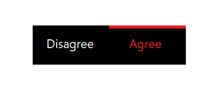
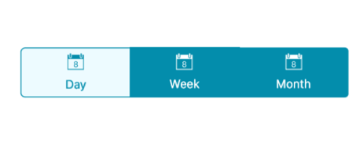
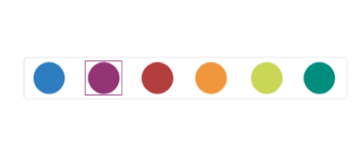

# Indicating the selected item

The segmented control indicates the selected item by differentiating it with text color of the item or using selection strip.

## Selection text color

You can change the text color of the selected item to desired color. The selected item's text color can be customized using the `SelectionTextColor` property.





<buttons:SfSegmentedControl SelectionTextColor="#02A0AE"/> 





segmentedControl.SelectionTextColor = Color.FromHex("#02A0AE");





## Selection strip

A selection strip is used to indicate the selected item in the segmented control. The selection strip can be customized in many forms.

#### Position

The position of the selection indicator can be customized in different ways.

##### Top

The selection strip can be displayed as a line with customizable color and thickness. It can be positioned at the top of an item.





<buttons:SfSegmentedControl.SelectionIndicatorSettings>
    <buttons:SelectionIndicatorSettings 
        Position="Top">
    </buttons:SelectionIndicatorSettings>
</buttons:SfSegmentedControl.SelectionIndicatorSettings>





SelectionIndicatorSettings selectionIndicator = new SelectionIndicatorSettings();
selectionIndicator.Position = Position.Top;
segmentedControl.SelectionIndicatorSettings = selectionIndicator;





##### Bottom

Like top placement, selection strip can be customized by its color and thickness and can be positioned at the bottom of an item.





<buttons:SfSegmentedControl.SelectionIndicatorSettings>
    <buttons:SelectionIndicatorSettings 
        Position="Bottom">
    </buttons:SelectionIndicatorSettings>
</buttons:SfSegmentedControl.SelectionIndicatorSettings>





SelectionIndicatorSettings selectionIndicator = new SelectionIndicatorSettings();
selectionIndicator.Position = Position.Bottom;
segmentedControl.SelectionIndicatorSettings = selectionIndicator;





##### Fill

The selection strip can be placed over a segment item to indicate the selection. You can customize its color to highlight the item.





<buttons:SfSegmentedControl.SelectionIndicatorSettings>
    <buttons:SelectionIndicatorSettings 
        Position="Fill">
    </buttons:SelectionIndicatorSettings>
</buttons:SfSegmentedControl.SelectionIndicatorSettings>





SelectionIndicatorSettings selectionIndicator = new SelectionIndicatorSettings();
selectionIndicator.Position = Position.Fill;
segmentedControl.SelectionIndicatorSettings = selectionIndicator;





##### Border

The selection strip can be set as a border to highlight the selected item.





<buttons:SfSegmentedControl.SelectionIndicatorSettings>
    <buttons:SelectionIndicatorSettings 
        Position="Border">
    </buttons:SelectionIndicatorSettings>
</buttons:SfSegmentedControl.SelectionIndicatorSettings>





SelectionIndicatorSettings selectionIndicator = new SelectionIndicatorSettings();
selectionIndicator.Position = Position.Border;
segmentedControl.SelectionIndicatorSettings = selectionIndicator;





#### Color

The background color of the selection strip can be customized using the `Color` property of `SelectionIndicatorSettings`.





<buttons:SfSegmentedControl.SelectionIndicatorSettings>
<buttons:SelectionIndicatorSettings 
    Color="#2C7BBC">
</buttons:SelectionIndicatorSettings>
</buttons:SfSegmentedControl.SelectionIndicatorSettings>





SelectionIndicatorSettings selectionIndicator = new SelectionIndicatorSettings();
selectionIndicator.Color = Color.FromHex("#2C7BBC");
segmentedControl.SelectionIndicatorSettings = selectionIndicator;





#### Thickness

The border thickness of the selection strip can be customized using the `Thickness` property of `SelectionIndicatorSettings`.





<buttons:SfSegmentedControl.SelectionIndicatorSettings>
<buttons:SelectionIndicatorSettings 
    StrokeThickness="10">
</buttons:SelectionIndicatorSettings>
</buttons:SfSegmentedControl.SelectionIndicatorSettings>





SelectionIndicatorSettings selectionIndicator = new SelectionIndicatorSettings();
selectionIndicator.StrokeThickness = 10;
segmentedControl.SelectionIndicatorSettings = selectionIndicator;





