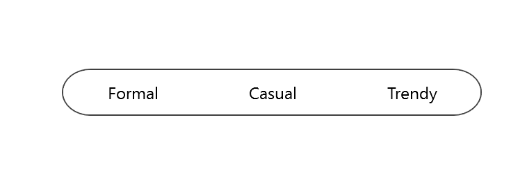

# Clear the Default Selection in SfSegmentedControl

The [`SfSegmentedControl`](https://help.syncfusion.com/cr/xamarin/Syncfusion.XForms.Buttons.SfSegmentedControl.html) allows you to clear the default selection by setting the [`SelectedIndex`](https://help.syncfusion.com/cr/xamarin/Syncfusion.XForms.Buttons.SfSegmentedControl.html#Syncfusion_XForms_Buttons_SfSegmentedControl_SelectedIndex) property to a negative value or one beyond the collection's count.

> **Note**: By default, the control selects the item at index 0.




Namespace:

xmlns:sys="clr-namespace:System.Collections.Generic;assembly=netstandard"
...
   <buttons:SfSegmentedControl
        SelectedIndex="-1"
        BorderColor="#3F3F3F"
        FontColor="Black"
        HorizontalOptions="Center"
        VerticalOptions="Center"
        SegmentHeight="32"
        CornerRadius="20"
        VisibleSegmentsCount="3">
        <buttons:SfSegmentedControl.ItemsSource>
            <sys:List x:TypeArguments="x:String">
                <x:String>Formal</x:String>
                <x:String>Casual</x:String>
                <x:String>Trendy</x:String>
            </sys:List>
        </buttons:SfSegmentedControl.ItemsSource>
    </buttons:SfSegmentedControl>





    SfSegmentedControl segmentedControl = new SfSegmentedControl()
    {
        SelectedIndex = -1,
        BorderColor = Color.FromHex("#3F3F3F"),
        FontColor = Color.Black,
        HorizontalOptions = LayoutOptions.Center,
        VerticalOptions = LayoutOptions.Center,
        SegmentHeight = 32,
        CornerRadius = 20,
        VisibleSegmentsCount = 3,
    };

    segmentedControl.ItemsSource = new List<String>()
    {
        "Formal","Casual","Trendy"
    };





