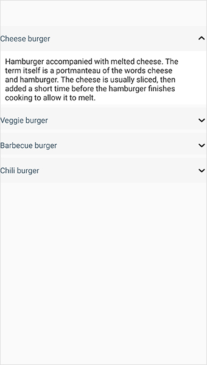

# Getting started

The Accordion control allows content to be organized in a vertically stacked list of items that is collapsible. Each item can also be expanded to reveal the content associated with that item. This section provides a quick overview for working with the `SfAccordion` for Xamarin.Forms.

## Assembly deployment

After installing Essential Studio for Xamarin, you can find all the required assemblies in the installation folders, {Syncfusion Essential Studio Installed location} \Essential Studio\16.x.x.x\Xamarin\lib

Eg: C:\Program Files (x86) \Syncfusion\Essential Studio\16.1.0.24\Xamarin\lib

N> Assemblies can be found in unzipped package location in Mac. 

## Adding SfAccordion reference 

You can add SfAccordion reference using one of the following methods: 

**Method 1: Adding SfAccordion reference from nuget.org**

Syncfusion Xamarin components are available in [nuget.org](https://www.nuget.org/). To add SfAccordion to your project, open the NuGet package manager in Visual Studio, search for [Syncfusion.Xamarin.Expander](https://www.nuget.org/packages/Syncfusion.Xamarin.Expander), and then install it. 

N> Install the same version of Expander NuGet in all the projects. 

**Method 2: Adding SfAccordion reference from toolbox**

Syncfusion also provides Xamarin Toolbox. Using this toolbox, you can drag the SfAccordion control to the XAML page. It will automatically install the required NuGet packages and add the namespace to the page. To install Syncfusion Xamarin Toolbox, refer to [Toolbox](https://help.syncfusion.com/xamarin/utility#toolbox). 

**Method 3: Adding SfAccordion assemblies manually from the installed location**

If you prefer to manually reference the assemblies instead referencing from NuGet, add the following assemblies in respective projects. 

Location: {Installed location}/{version}/Xamarin/lib 

<table>
<tr>
<td>PCL</td>
<td>
Syncfusion.Expander.XForms.dll 
Syncfusion.Core.XForms.dll 
Syncfusion.Licensing.dll </td>
</tr>
<tr>
<td>Android</td>
<td>
Syncfusion.Expander.XForms.dll 
Syncfusion.Expander.XForms.Android.dll 
Syncfusion.Core.XForms.dll 
Syncfusion.Core.XForms.Android.dll 
Syncfusion.Licensing.dll 
</td>
</tr>
<tr>
<td>iOS</td>
<td>
Syncfusion.Expander.XForms.dll 
Syncfusion.Expander.XForms.iOS.dll 
Syncfusion.Core.XForms.dll 
Syncfusion.Core.XForms.iOS.dll 
Syncfusion.Licensing.dll 
</td>
</tr>
<tr>
<td>UWP</td>
<td>
Syncfusion.Expander.XForms.dll 
Syncfusion.Expander.XForms.UWP.dll 
Syncfusion.Core.XForms.dll 
Syncfusion.Core.XForms.UWP.dll 
Syncfusion.Licensing.dll 
</td>
</tr>
</table>

N> To know more about obtaining our components, refer to these links for [Mac](https://help.syncfusion.com/xamarin/introduction/download-and-installation/mac/) and [Windows](https://help.syncfusion.com/xamarin/introduction/download-and-installation/windows/).

I> Starting with v16.2.0.x, if you reference Syncfusion assemblies from the trial setup or from the NuGet feed, you also have to include a license key in your projects. Please refer to [Syncfusion license key](https://help.syncfusion.com/common/essential-studio/licensing/license-key/) to know about registering Syncfusion license key in your Xamarin application to use our components.

## Launching the accordion on each platform

To use the accordion in an application, each platform application must initialize the accordion renderer. This initialization step varies from platform to platform and is discussed in the following sections: 

### Android

The Android launches the accordion without any initialization and is enough to only initialize the Xamarin.Forms Framework to launch the application.

N> If you are adding the references from toolbox, this step is not needed.

### iOS

To launch the accordion in iOS, call the `SfAccordionRenderer.Init()` in the `FinishedLaunching` overridden method of the AppDelegate class after the Xamarin.Forms Framework initialization and before the LoadApplication is called, as demonstrated in the following code example: 



public override bool FinishedLaunching(UIApplication app, NSDictionary options)
{
    …
    global::Xamarin.Forms.Forms.Init ();
    Syncfusion.XForms.iOS.Accordion.SfAccordionRenderer.Init(); 
    LoadApplication (new App ());
    …
}
 


### Universal Windows Platform (UWP)

The UWP launches the accordion without any initialization and is enough to only initialize the Xamarin.Forms Framework to launch the application. 

### ReleaseMode issue in UWP platform

The known Framework issue in UWP platform is that the custom controls will not render when deployed the application in `Release Mode`. 

The above problem can be resolved by initializing the accordion assemblies in `App.xaml.cs` file in UWP project as in the following code snippet: 



// In App.xaml.cs

protected override void OnLaunched(LaunchActivatedEventArgs e)
{
    …
    
    rootFrame.NavigationFailed += OnNavigationFailed;
        
    // you'll need to add `using System.Reflection;`
    List<Assembly> assembliesToInclude = new List<Assembly>();

    //Now, add all the assemblies your app uses assembliesToInclude.Add(typeof(Syncfusion.XForms.UWP.Accordion.SfAccordionRenderer).GetTypeInfo().Assembly); 

    // replaces Xamarin.Forms.Forms.Init(e);        
    Xamarin.Forms.Forms.Init(e, assembliesToInclude);
        
    …     
}



## Creating the Accordion 

This section explains how to create a simple Xamarin.Forms application with [SfAccordion](https://help.syncfusion.com/cr/cref_files/xamarin/Syncfusion.Expander.XForms~Syncfusion.XForms.Accordion.SfAccordion.html). The control should be configured entirely in C# code or by using XAML markup. 

* Creating the project.
* Adding accordion in Xamarin.Forms. 
* Defining accordion Items.

### Creating the project

Create a new blank (.Net Standard) application in Xamarin Studio or Visual Studio for Xamarin.Forms. 

### Adding accordion in Xamarin.Forms: 

To add the accordion to your application, follow the steps: 

1. Add required assemblies as discussed in assembly deployment section. 
2.  Import the control namespace as `xmlns:accordion="clr-namespace:Syncfusion.XForms. Accordion;assembly=Syncfusion.Expander.XForms` in XAML Page. 
3. Create an instance of accordion control and add as content for content page. 




<?xml version="1.0" encoding="utf-8" ?>
<ContentPage xmlns="http://xamarin.com/schemas/2014/forms"
             xmlns:x="http://schemas.microsoft.com/winfx/2009/xaml"
             xmlns:local="clr-namespace:GettingStarted"
             x:Class="GettingStarted.MainPage"
             xmlns:syncfusion="clr-namespace:Syncfusion.XForms.Accordion;assembly=Syncfusion.Expander.XForms">
             <ContentPage.Content> 
                <syncfusion:SfAccordion x:Name="accordion"/> 
             </ContentPage.Content>
</ContentPage>



using Syncfusion.XForms.Accordion;
using Xamarin.Forms;

namespace GettingStarted
{
    public partial class MainPage : ContentPage
    {
        SfAccordion accordion;
        public MainPage()
        {            
            InitializeComponent();
            accordion = new SfAccordion();
        }
    }
}




### Defining accordion Items 

`SfAccordion` is a layout control with vertically stacked list of accordion [Items](https://help.syncfusion.com/cr/cref_files/xamarin/Syncfusion.Expander.XForms~Syncfusion.XForms.Accordion.SfAccordion~Items.html) that comprise of [Header](https://help.syncfusion.com/cr/cref_files/xamarin/Syncfusion.Expander.XForms~Syncfusion.XForms.Accordion.AccordionItem~Header.html) and [Content](https://help.syncfusion.com/cr/cref_files/xamarin/Syncfusion.Expander.XForms~Syncfusion.XForms.Accordion.AccordionItem~Content.html). You can load any View in Header and Content. User can expand or collapse the Content view by tapping Header. 

Here, Labels are loaded in Header and Content of accordion items. 




<?xml version="1.0" encoding="utf-8" ?>
<ContentPage xmlns="http://xamarin.com/schemas/2014/forms"
             xmlns:x="http://schemas.microsoft.com/winfx/2009/xaml"
             xmlns:local="clr-namespace:GettingStarted"
             x:Class="GettingStarted.MainPage"
             xmlns:syncfusion="clr-namespace:Syncfusion.XForms.Accordion;assembly=Syncfusion.Expander.XForms">
           <ContentPage.Content> 
                <syncfusion:SfAccordion Grid.Row="1"> 
                    <syncfusion:SfAccordion.Items> 
                        <syncfusion:AccordionItem> 
                            <syncfusion:AccordionItem.Header> 
                                <Label TextColor="#495F6E" Text="Cheese burger" HeightRequest="50" VerticalTextAlignment="Center"/> 
                            </syncfusion:AccordionItem.Header> 
                            <syncfusion:AccordionItem.Content> 
                                <Grid Padding="10,10,10,10" BackgroundColor="#FFFFFF"> 
                                    <Label TextColor="#303030" Text="Hamburger accompanied with melted cheese. The term itself is a portmanteau of the words cheese and hamburger. The cheese is usually sliced, then added a short time before the hamburger finishes cooking to allow it to melt." HeightRequest="50" VerticalTextAlignment="Center"/> 
                                </Grid> 
                            </syncfusion:AccordionItem.Content>     
                        </syncfusion:AccordionItem> 
                        <syncfusion:AccordionItem> 
                            <syncfusion:AccordionItem.Header> 
                                <Label TextColor="#495F6E" Text="Veggie burger" HeightRequest="50" VerticalTextAlignment="Center"/> 
                            </syncfusion:AccordionItem.Header> 
                            <syncfusion:AccordionItem.Content> 
                                <Grid Padding="10,10,10,10" BackgroundColor="#FFFFFF"> 
                                    <Label TextColor="#303030" Text="Veggie burger, garden burger, or tofu burger uses a meat analogue, a meat substitute such as tofu, textured vegetable protein, seitan (wheat gluten), Quorn, beans, grains or an assortment of vegetables, which are ground up and formed into patties." HeightRequest="50" VerticalTextAlignment="Center"/> 
                                </Grid> 
                            </syncfusion:AccordionItem.Content> 
                        </syncfusion:AccordionItem> 
                        <syncfusion:AccordionItem> 
                            <syncfusion:AccordionItem.Header> 
                                <Label TextColor="#495F6E" Text="Barbecue burger" HeightRequest="50" VerticalTextAlignment="Center"/> 
                            </syncfusion:AccordionItem.Header> 
                            <syncfusion:AccordionItem.Content> 
                                <Grid Padding="10,10,10,10" BackgroundColor="#FFFFFF"> 
                                    <Label TextColor="#303030" Text="Prepared with ground beef, mixed with onions and barbecue sauce, and then grilled. Once the meat has been turned once, barbecue sauce is spread on top and grilled until the sauce caramelizes." HeightRequest="50" VerticalTextAlignment="Center"/> 
                                </Grid> 
                            </syncfusion:AccordionItem.Content> 
                        </syncfusion:AccordionItem> 
                        <syncfusion:AccordionItem> 
                            <syncfusion:AccordionItem.Header> 
                                <Label TextColor="#495F6E" Text="Chili burger" HeightRequest="50" VerticalTextAlignment="Center"/> 
                            </syncfusion:AccordionItem.Header> 
                            <syncfusion:AccordionItem.Content> 
                                <Grid Padding="10,10,10,10" BackgroundColor="#FFFFFF"> 
                                    <Label TextColor="#303030" Text="Consists of a hamburger, with the patty topped with chili con carne." HeightRequest="50" VerticalTextAlignment="Center"/> 
                                </Grid> 
                            </syncfusion:AccordionItem.Content> 
                        </syncfusion:AccordionItem> 
                    </syncfusion:SfAccordion.Items> 
                </syncfusion:SfAccordion> 
            </ContentPage.Content>    
</ContentPage>




Now, run the application to render the following output.

You can download accordion sample for Xamarin.Forms from here [AccordionGettingStarted](https://github.com/SyncfusionExamples/xamarin_accordion_getting_started).

## Animation duration

`SfAccordion` allows to customize the expanding and collapsing of accordion item by using [AnimationDuration](https://help.syncfusion.com/cr/cref_files/xamarin/Syncfusion.Expander.XForms~Syncfusion.XForms.Accordion.SfAccordion~AnimationDuration.html) property. By default, the animation duration is 250 milliseconds. 



    <syncfusion:SfAccordion x:Name="accordion" AnimationDuration="150" /> 


    accordion.AnimationDuration = 150;



## Animation easing

`SfAccordion` allows to customize the rate of change of parameter over time or animation style of accordion item by using [AnimationEasing](https://help.syncfusion.com/cr/cref_files/xamarin/Syncfusion.Expander.XForms~Syncfusion.XForms.Accordion.SfAccordion~AnimationEasing.html) property. By default, the animation easing is `Linear`.  



         <syncfusion:SfAccordion x:Name="accordion" AnimationEasing="SinOut" />        


    accordion.AnimationEasing = Syncfusion.XForms.Expander.AnimationEasing.SinOut;



## Auto scroll position

`SfAccordion` allows to customize the scroll position of the expanded accordion item by using [AutoScrollPosition](https://help.syncfusion.com/cr/cref_files/xamarin/Syncfusion.Expander.XForms~Syncfusion.XForms.Accordion.SfAccordion~AutoScrollPosition.html) property. By default, the auto scroll position is `MakeVisible`.  



    <syncfusion:SfAccordion x:Name="accordion" AutoScrollPosition="Top"/>    


    accordion.AutoScrollPosition = Syncfusion.XForms.Accordion.AutoScrollPosition.Top;



## Expand mode

`SfAccordion` allows to expand single or multiple items by using the [ExpandMode](https://help.syncfusion.com/cr/cref_files/xamarin/Syncfusion.Expander.XForms~Syncfusion.XForms.Accordion.SfAccordion~ExpandMode.html) property. By default, the expand mode is `Single`.  



    <syncfusion:SfAccordion x:Name="accordion" ExpandMode="Multiple" />         


    accordion.ExpandMode = Syncfusion.XForms.Accordion.ExpandMode.Multiple;



## Header icon position 

`SfAccordion` allows to customize the position of the header icon in accordion item by using [HeaderIconPosition](https://help.syncfusion.com/cr/cref_files/xamarin/Syncfusion.Expander.XForms~Syncfusion.XForms.Accordion.SfAccordion~HeaderIconPosition.html) property. By default, the header Icon position is `End`.  



    <syncfusion:SfAccordion x:Name="accordion" HeaderIconPosition="Start" />       


    accordion.HeaderIconPosition = Syncfusion.XForms.Expander.IconPosition.Start;



## Item spacing

`SfAccordion` allows to customize the vertical spacing between the accordion items by using [ItemSpacing](https://help.syncfusion.com/cr/cref_files/xamarin/Syncfusion.Expander.XForms~Syncfusion.XForms.Accordion.SfAccordion~ItemSpacing.html) property. The default value is `6.0d`. 



    <syncfusion:SfAccordion x:Name="accordion" ItemSpacing="8.0d" />        


    accordion.ItemSpacing = 8.0d;


