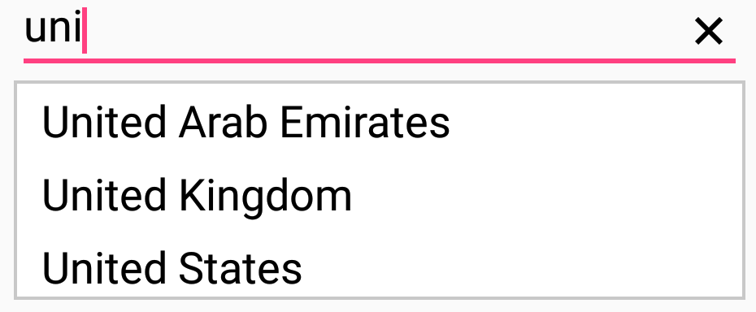
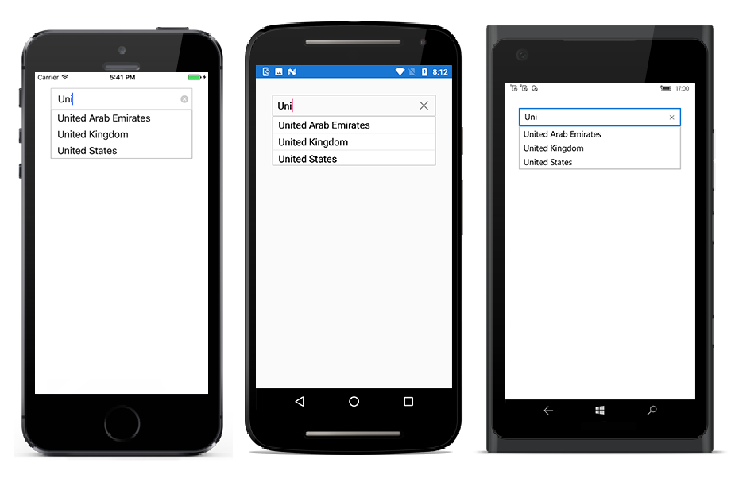
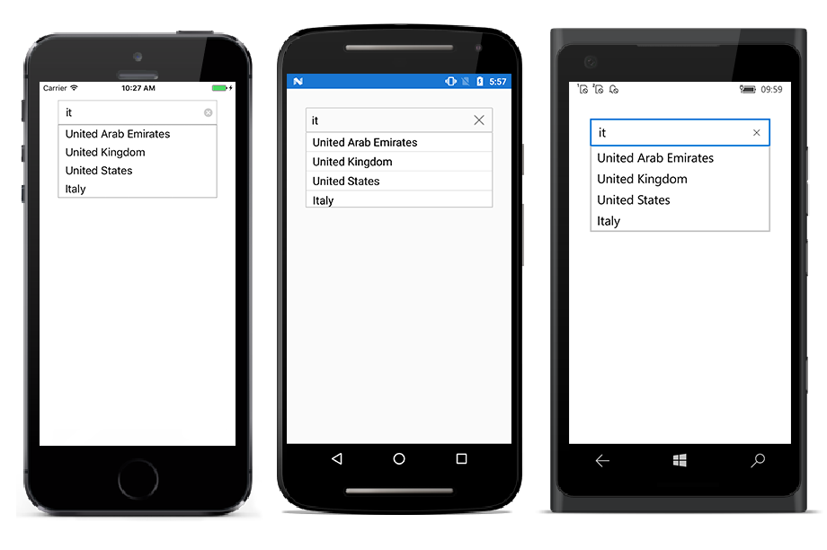
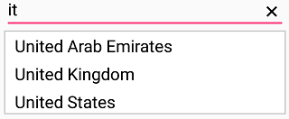
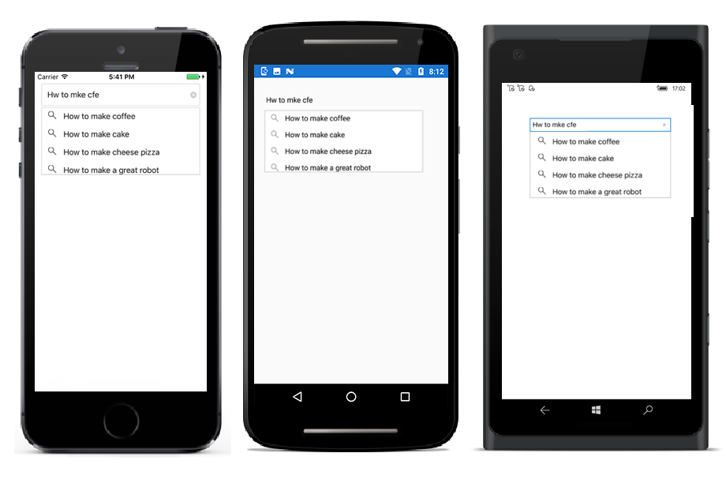
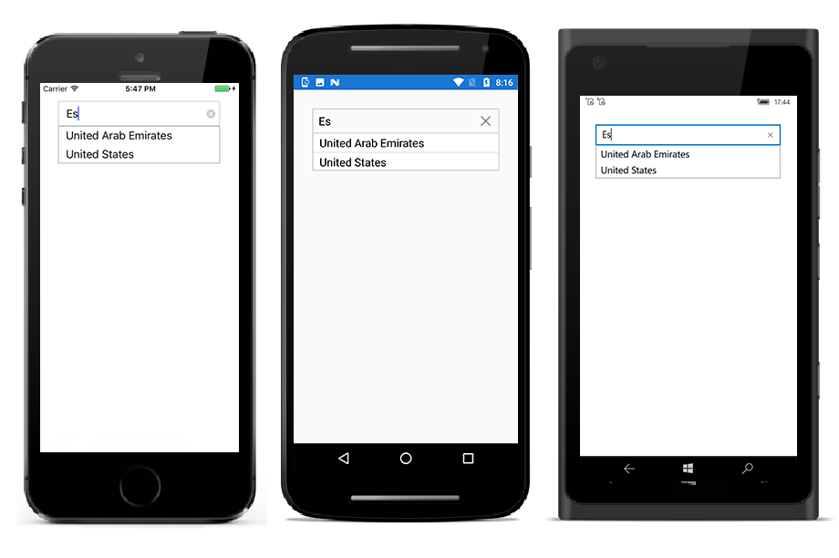
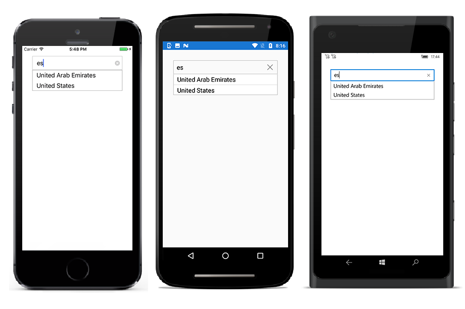

# AutoComplete Filtering Options

The phenomenon of string comparison for filtering suggestions can be changed using the `SuggestionMode` property. The default filtering strategy is “StartsWith” and it is case insensitive. The available filtering modes are

* StartsWith

* StartsWithCaseSensitive

* Contains

* ContainsWithCaseSensitive

* Equals

* EqualsWithCaseSensitive

* EndsWith

* EndsWithCaseSensitive

* Custom

## Filtering Words that Starts with Input Text

Displays all the matches that starts with the typed characters in control. This strategy is case in-sensitive.
	
	



<StackLayout VerticalOptions="Start" HorizontalOptions="Start" Padding="30">
	<autocomplete:SfAutoComplete HeightRequest="40" x:Name="autoComplete" SuggestionMode="StartsWith"/>                            
</StackLayout>


	

	
List<String> countryNames = new List<String>();
countryNames.Add("Uganda");
countryNames.Add("Ukraine");
countryNames.Add("United Arab Emirates");
countryNames.Add("United Kingdom");
countryNames.Add("United States");
autoComplete.DataSource = countryNames;
autoComplete.SuggestionMode= SuggestionMode.StartsWith;
	 




### Filtering Words that Starts with Input Text - CaseSensitive

Displays all the matches that starts with the typed characters in control. This strategy is case sensitive.





<StackLayout VerticalOptions="Start" HorizontalOptions="Start" Padding="30">
	<autocomplete:SfAutoComplete HeightRequest="40" x:Name="autoComplete" SuggestionMode="StartsWithCaseSensitive"/>                            
</StackLayout>




	
List<String> countryNames = new List<String>();
countryNames.Add("Uganda");
countryNames.Add("Ukraine");
countryNames.Add("United Arab Emirates");
countryNames.Add("United Kingdom");
countryNames.Add("United States");
autoComplete.DataSource = countryNames;
autoComplete.SuggestionMode= SuggestionMode.StartsWithCaseSensitive;





## Filtering Words that Contains the Input Text

Displays all the matches that contains the typed characters in control. This strategy is case in-sensitive.
	




<StackLayout VerticalOptions="Start" HorizontalOptions="Start" Padding="30">
	<autocomplete:SfAutoComplete HeightRequest="40" x:Name="autoComplete" SuggestionMode="Contains"/>                            
</StackLayout>




	
List<String> countryNames = new List<String>();
countryNames.Add("Uganda");
countryNames.Add("Ukraine");
countryNames.Add("United Arab Emirates");
countryNames.Add("United Kingdom");
countryNames.Add("United States");
countryNames.Add("Italy");
autoComplete.DataSource = countryNames;
autoComplete.SuggestionMode= SuggestionMode.Contains;
	 




### Filtering Words that Contains the Input Text - CaseSensitive

Displays all the matches that contains the typed characters in control. This strategy is case sensitive.





<StackLayout VerticalOptions="Start" HorizontalOptions="Start" Padding="30">
	<autocomplete:SfAutoComplete HeightRequest="40" x:Name="autoComplete" SuggestionMode="ContainsWithCaseSensitive"/>                            
</StackLayout>





List<String> countryNames = new List<String>();
countryNames.Add("Uganda");
countryNames.Add("Ukraine");
countryNames.Add("United Arab Emirates");
countryNames.Add("United Kingdom");
countryNames.Add("United States");
countryNames.Add("Italy");
autoComplete.DataSource = countryNames;
autoComplete.SuggestionMode= SuggestionMode.ContainsWithCaseSensitive;





## Filtering Words that Equals the Input Text

Displays all the words that completely matches with the typed characters in control. This strategy is case in-sensitive.
	




<StackLayout VerticalOptions="Start" HorizontalOptions="Start" Padding="30">
	<autocomplete:SfAutoComplete HeightRequest="40" x:Name="autoComplete" SuggestionMode="Equals"/>                            
</StackLayout>




	
List<String> countryNames = new List<String>();
countryNames.Add("Uganda");
countryNames.Add("Ukraine");
countryNames.Add("United Arab Emirates");
countryNames.Add("United Kingdom");
countryNames.Add("United States");
autoComplete.DataSource = countryNames;
autoComplete.SuggestionMode= SuggestionMode.Equals;





### Filtering Words that Equals the Input Text - CaseSensitive

Displays all the words that completely matches with the typed characters in control. This strategy is case sensitive.
	




<StackLayout VerticalOptions="Start" HorizontalOptions="Start" Padding="30">
	<autocomplete:SfAutoComplete HeightRequest="40" x:Name="autoComplete" SuggestionMode="EqualsWithCaseSensitive"/>                            
</StackLayout>




	
List<String> countryNames = new List<String>();
countryNames.Add("Uganda");
countryNames.Add("Ukraine");
countryNames.Add("United Arab Emirates");
countryNames.Add("United Kingdom");
countryNames.Add("United States");
autoComplete.DataSource = countryNames;
autoComplete.SuggestionMode= SuggestionMode.EqualsWithCaseSensitive;





### Custom

Filter items in the suggestion list based on a custom search by the user. This will help to apply our typo toleration functionality to the control.





<StackLayout VerticalOptions="Start" HorizontalOptions="Start" Padding="30">
	<autocomplete:SfAutoComplete HeightRequest="40" DropDownTextSize="20" x:Name="autoComplete" AutoCompleteMode="Suggest" MaximumDropDownHeight="200" SuggestionMode="Custom"/>                        
</StackLayout>





    public AutoCompletePage()
    {
        InitializeComponent();
        List<string> list = new List<string>();
        list.Add("Albania");
        list.Add("Algeria");
        list.Add("American Samoa");
        list.Add("Andorra");
        list.Add("Angola");
        list.Add("Anguilla");
        autocomplete.AutoCompleteSource = list;
        autocomplete.Filter = ContainingSpaceFilter;
    }
    public bool ContainingSpaceFilter(string search, object item)
    {
        string text = item.ToString().ToLower();
        if (item != null)
        {
            try
            {
                var split = search.Split(' ');
                foreach (var results in split)
                {
                    if (!text.Contains(results.ToLower()))
                    {
                        return true;
                    }
                    else
                        return false;
                }
                return true;
            }
            catch (Exception)
            {
                return (text.Contains(search));
            }
        }
        else
            return false;
    }

	

    

## Filtering Words that Ends with the Input Text

Displays all the matches that ends with the typed characters in control. This strategy is case in-sensitive.


	


<StackLayout VerticalOptions="Start" HorizontalOptions="Start" Padding="30">
	<autocomplete:SfAutoComplete HeightRequest="40" WidthRequest="180" x:Name="autoComplete" SuggestionMode="EndsWith"/>                            
</StackLayout>




	
List<String> countryNames = new List<String>();
countryNames.Add("Uganda");
countryNames.Add("Ukraine");
countryNames.Add("United Arab Emirates");
countryNames.Add("United Kingdom");
countryNames.Add("United States");
autoComplete.DataSource = countryNames;
autoComplete.SuggestionMode= SuggestionMode.EndsWith;
 




### Filtering Words that Ends with the Input Text - CaseSensitive 

Displays all the matches that ends with the typed characters in control. This strategy is case sensitive.
	




<StackLayout VerticalOptions="Start" HorizontalOptions="Start" Padding="30">
	<autocomplete:SfAutoComplete HeightRequest="40" x:Name="autoComplete" SuggestionMode="EndsWithCaseSensitive"/>                            
</StackLayout>




	
List<String> countryNames = new List<String>();
countryNames.Add("Uganda");
countryNames.Add("Ukraine");
countryNames.Add("United Arab Emirates");
countryNames.Add("United Kingdom");
countryNames.Add("United States");
autoComplete.DataSource = countryNames;
autoComplete.SuggestionMode= SuggestionMode.EndsWithCaseSensitive;





