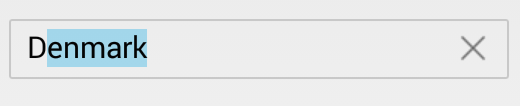

# AutoCompleteMode

The `AutocompleteMode` property is used to decide the suggestion pattern for displaying the filtered data according to the text entered. 

N> By default, three types of autocomplete mode such as `Append`, `Suggest` and `SuggestAppend` are provided.

## Append
Appends the first matching string with the entered character.
	

	
	countryAutoComplete.AutoCompleteMode = AutoCompleteMode.Append;
	 


## Suggest 
Displays the suggestion in the dropdown.


	
	countryAutoComplete.AutoCompleteMode = AutoCompleteMode.Suggest;
	 


## SuggestAppend
Displays the suggestion in the dropdown along with appending the first matching string.
	

	
	countryAutoComplete.AutoCompleteMode = AutoCompleteMode.SuggestAppend;
	 


 
