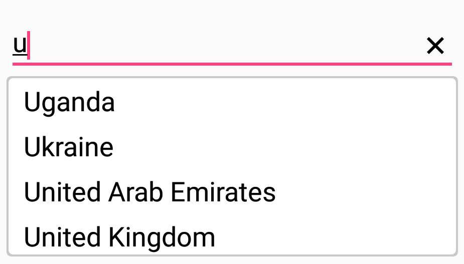

# Customizing AutoComplete

AutoComplete provides user friendly customizing options for both entry part and drop down part. In this section, customizing entire AutoComplete control is explained.

## Customizing the Entry

[`TextColor`](https://help.syncfusion.com/cr/cref_files/xamarin/Syncfusion.SfAutoComplete.XForms~Syncfusion.SfAutoComplete.XForms.SfAutoComplete~TextColor.html), [`TextSize`](https://help.syncfusion.com/cr/cref_files/xamarin/Syncfusion.SfAutoComplete.XForms~Syncfusion.SfAutoComplete.XForms.SfAutoComplete~TextSize.html), [`FontAttributes`](https://help.syncfusion.com/cr/cref_files/xamarin/Syncfusion.SfAutoComplete.XForms~Syncfusion.SfAutoComplete.XForms.SfAutoComplete~FontAttributes.html), [`FontFamily`](https://help.syncfusion.com/cr/cref_files/xamarin/Syncfusion.SfAutoComplete.XForms~Syncfusion.SfAutoComplete.XForms.SfAutoComplete~FontFamily.html) and [`BorderColor`](https://help.syncfusion.com/cr/cref_files/xamarin/Syncfusion.SfAutoComplete.XForms~Syncfusion.SfAutoComplete.XForms.SfAutoComplete~BorderColor.html) are the properties used to customize the foreground color, font size, font attribute, font family and border color of the entry part.





<StackLayout VerticalOptions="Start" HorizontalOptions="Start" Padding="30">
	<autocomplete:SfAutoComplete HeightRequest="45" x:Name="autoComplete" Text="Sample text" TextColor="#1976d2" TextSize="20" BorderColor="#1976d2"/>
</StackLayout>





StackLayout stackLayout = new StackLayout() 
{ 
VerticalOptions = LayoutOptions.Start, 
HorizontalOptions = LayoutOptions.Start,
Padding = new Thickness(30) 
};
SfAutoComplete autoComplete = new SfAutoComplete() 
{ 
HeightRequest = 45,  
Text = "Sample text", 
TextColor = Color.FromHex("1976d2"), 
TextSize = 20, 
BorderColor = Color.FromHex("1976d2")
};
stackLayout.Children.Add(autoComplete);
this.Content = stackLayout;





## Custom Template for Suggestion Items

[`ItemTemplate`](https://help.syncfusion.com/cr/cref_files/xamarin/Syncfusion.SfAutoComplete.XForms~Syncfusion.SfAutoComplete.XForms.SfAutoComplete~ItemTemplate.html) property helps to decorate suggestion items with custom templates. The following code explains the steps to add an image to the suggestion list item.





<StackLayout VerticalOptions="Start" HorizontalOptions="Start" Padding="30">
<autocomplete:SfAutoComplete HeightRequest="40" x:Name="autoComplete" DisplayMemberPath="Name" DataSource="{Binding PersonCollection}">
	<autocomplete:SfAutoComplete.ItemTemplate>
	<DataTemplate>
		<StackLayout Orientation="Horizontal" Padding="2,0,0,0">
		<Image Source="User.png" WidthRequest="12"/>
		<Label Text="{Binding Name}" VerticalOptions="Center"/>
		</StackLayout>
	</DataTemplate>
	</autocomplete:SfAutoComplete.ItemTemplate>
</autocomplete:SfAutoComplete>
</StackLayout>





public class Person
{
private int age;
public int Age
{
	get { return age; }
	set { age = value; }
}

private string name;
public string Name
{
	get { return name; }
	set { name = value; }
}
}

public class PersonViewModel
{
private ObservableCollection<Person> personCollection;
public ObservableCollection<Person> PersonCollection
{
	get { return personCollection; }
	set { personCollection = value; }
}

public PersonViewModel()
{
	personCollection = new ObservableCollection<Person>();
	personCollection.Add(new Person() { Age = 21, Name = "Aldan" });
	personCollection.Add(new Person() { Age = 25, Name = "Clara" });
	personCollection.Add(new Person() { Age = 23, Name = "Aldrin" });            
	personCollection.Add(new Person() { Age = 25, Name = "Mark" });
	personCollection.Add(new Person() { Age = 25, Name = "Lucas" });
	personCollection.Add(new Person() { Age = 24, Name = "Alan" });
	personCollection.Add(new Person() { Age = 25, Name = "James" });
	personCollection.Add(new Person() { Age = 22, Name = "Aaron" });
}
}

public partial class SamplePage : ContentPage
{
public SamplePage()
{
	InitializeComponent();       
	autoComplete.BindingContext = new PersonViewModel();
}
}





## Customizing the Suggestion Box

### Changing suggestion item height

[`DropDownItemHeight`](https://help.syncfusion.com/cr/cref_files/xamarin/Syncfusion.SfAutoComplete.XForms~Syncfusion.SfAutoComplete.XForms.SfAutoComplete~DropDownItemHeight.html) property is used to modify the height of suggestion items in drop down list. The code example is given below:





<StackLayout Padding="30">
    <autoComplete:SfAutoComplete x:Name="autoComplete" HeightRequest="40" DropDownItemHeight="45">
        <autoComplete:SfAutoComplete.AutoCompleteSource>
            <ListCollection:List x:TypeArguments="x:String">
                <x:String>Uganda</x:String>
                <x:String>Ukraine</x:String>
                <x:String>United Arab Emirates</x:String>
                <x:String>United Kingdom</x:String>
            </ListCollection:List>
        </autoComplete:SfAutoComplete.AutoCompleteSource>
    </autoComplete:SfAutoComplete>
</StackLayout> 





StackLayout mainLayout = new StackLayout()
{
    Padding = new Thickness(30)
};

SfAutoComplete autoComplete = new SfAutoComplete();
List<String> countryNames = new List<String>();
countryNames.Add("Uganda");
countryNames.Add("Ukraine");
countryNames.Add("United Arab Emirates");
countryNames.Add("United Kingdom");
countryNames.Add("United States");
autoComplete.DataSource = countryNames;
autoComplete.DropDownCornerRadius = 3;
autoComplete.DropDownItemHeight = 45;
mainLayout.Children.Add(autoComplete);
this.Content = mainLayout;





### Changing suggestion box corner radius

The [`DropDownCornerRadius`](https://help.syncfusion.com/cr/cref_files/xamarin/Syncfusion.SfAutoComplete.XForms~Syncfusion.SfAutoComplete.XForms.SfAutoComplete~DropDownCornerRadius.html) property is used to modify the corner radius of suggestion box. The following code example demonstrates how to change the suggestion box corner radius. 





<StackLayout Padding="30">
    <autoComplete:SfAutoComplete  x:Name="autoComplete" HeightRequest="40" DropDownCornerRadius="3">
        <autoComplete:SfAutoComplete.AutoCompleteSource>
            <ListCollection:List x:TypeArguments="x:String">
                <x:String>Uganda</x:String>
                <x:String>Ukraine</x:String>
                <x:String>United Arab Emirates</x:String>
                <x:String>United Kingdom</x:String>
            </ListCollection:List>
        </autoComplete:SfAutoComplete.AutoCompleteSource>
    </autoComplete:SfAutoComplete>
</StackLayout> 





StackLayout mainLayout = new StackLayout()
{
    Padding = new Thickness(30)
};

SfAutoComplete autoComplete = new SfAutoComplete();
List<String> countryNames = new List<String>();
countryNames.Add("Uganda");
countryNames.Add("Ukraine");
countryNames.Add("United Arab Emirates");
countryNames.Add("United Kingdom");
countryNames.Add("United States");
autoComplete.DataSource = countryNames;
autoComplete.DropDownCornerRadius = 3;
mainLayout.Children.Add(autoComplete);
this.Content = mainLayout;





### Changing suggestion box background color

The [`DropDownBackgroundColor`](https://help.syncfusion.com/cr/cref_files/xamarin/Syncfusion.SfAutoComplete.XForms~Syncfusion.SfAutoComplete.XForms.SfAutoComplete~DropDownBackgroundColor.html) property is used to modify the background color of suggestion box. The following code example demonstrates how to change the suggestion box background color. 





<StackLayout Padding="30">
    <autoComplete:SfAutoComplete x:Name="autoComplete" HeightRequest="40"  DropDownBackgroundColor="Red">
        <autoComplete:SfAutoComplete.AutoCompleteSource>
            <ListCollection:List x:TypeArguments="x:String">
                <x:String>Uganda</x:String>
                <x:String>Ukraine</x:String>
                <x:String>United Arab Emirates</x:String>
                <x:String>United Kingdom</x:String>
            </ListCollection:List>
        </autoComplete:SfAutoComplete.AutoCompleteSource>
    </autoComplete:SfAutoComplete>
</StackLayout> 





StackLayout mainLayout = new StackLayout()
{
    Padding = new Thickness(30)
};

SfAutoComplete autoComplete = new SfAutoComplete();
List<String> countryNames = new List<String>();
countryNames.Add("Uganda");
countryNames.Add("Ukraine");
countryNames.Add("United Arab Emirates");
countryNames.Add("United Kingdom");
countryNames.Add("United States");
autoComplete.DataSource = countryNames;
autoComplete.DropDownBackgroundColor = Color.Red;
mainLayout.Children.Add(autoComplete);





### Customizing suggestion items

Suggestion box items can be customized using [`DropDownItemFontAttributes`](https://help.syncfusion.com/cr/cref_files/xamarin/Syncfusion.SfAutoComplete.XForms~Syncfusion.SfAutoComplete.XForms.SfAutoComplete~DropDownItemFontAttributes.html), [`DropDownItemFontFamily`](https://help.syncfusion.com/cr/cref_files/xamarin/Syncfusion.SfAutoComplete.XForms~Syncfusion.SfAutoComplete.XForms.SfAutoComplete~DropDownItemFontFamily.html), [`DropDownTextSize`](https://help.syncfusion.com/cr/cref_files/xamarin/Syncfusion.SfAutoComplete.XForms~Syncfusion.SfAutoComplete.XForms.SfAutoComplete~DropDownTextSize.html) and [`DropDownTextColor`](https://help.syncfusion.com/cr/cref_files/xamarin/Syncfusion.SfAutoComplete.XForms~Syncfusion.SfAutoComplete.XForms.SfAutoComplete~DropDownTextColor.html) properties.





<StackLayout Padding="30">
    <autoComplete:SfAutoComplete HeightRequest="40" DropDownTextSize="16" DropDownTextColor="#1976d2"  x:Name="autoComplete">
            <autoComplete:SfAutoComplete.AutoCompleteSource>
                <ListCollection:List x:TypeArguments="x:String">
                    <x:String>Uganda</x:String>
                    <x:String>Ukraine</x:String>
                    <x:String>United Arab Emirates</x:String>
                    <x:String>United Kingdom</x:String>
                </ListCollection:List>
            </autoComplete:SfAutoComplete.AutoCompleteSource>
    </autoComplete:SfAutoComplete>
</StackLayout> 





StackLayout mainLayout = new StackLayout()
{
    Padding = new Thickness(30)
};

SfAutoComplete autoComplete = new SfAutoComplete();
List<String> countryNames = new List<String>();
countryNames.Add("Uganda");
countryNames.Add("Ukraine");
countryNames.Add("United Arab Emirates");
countryNames.Add("United Kingdom");
countryNames.Add("United States");
autoComplete.DataSource = countryNames;
autoComplete.DropDownTextColor = Color.FromHex("#1976d2");
autoComplete.DropDownTextSize = 16;
mainLayout.Children.Add(autoComplete);





### Show clear button

The autocomplete provided the user to show or hide the clear button using [`ShowClearButton`](https://help.syncfusion.com/cr/cref_files/xamarin/Syncfusion.SfAutoComplete.XForms~Syncfusion.SfAutoComplete.XForms.SfAutoComplete~ShowClearButton.html) property.





	<autocomplete:SfAutoComplete  x:Name="autoComplete" ShowClearButton="true"/>





autoComplete.ShowClearButton = true;





### Customizing clear button

The user can customize the clear button color in the autocomplete using [`ClearButtonColor`]( https://help.syncfusion.com/cr/cref_files/xamarin/Syncfusion.SfAutoComplete.XForms~Syncfusion.SfAutoComplete.XForms.SfAutoComplete~ClearButtonColor.html) Property.

N> `ClearButtonColor` property is available only on iOS and Android platform.





	<autocomplete:SfAutoComplete  x:Name="autoComplete" ClearButtonColor="Red"/>





autoComplete.ClearButtonColor = Color.Red;





### Changing border visibility

The [`ShowBorder`](https://help.syncfusion.com/cr/cref_files/xamarin/Syncfusion.SfAutoComplete.XForms~Syncfusion.SfAutoComplete.XForms.SfAutoComplete~ShowBorder.html) property is used to modify the visibility of border. The following code example demonstrates how to change the border visibility. 





<StackLayout Padding="30">
    <autoComplete:SfAutoComplete HeightRequest="40" ShowBorder="False" x:Name="autoComplete">
        <autoComplete:SfAutoComplete.AutoCompleteSource>
            <ListCollection:List x:TypeArguments="x:String">
                <x:String>Uganda</x:String>
                <x:String>Ukraine</x:String>
                <x:String>United Arab Emirates</x:String>
                <x:String>United Kingdom</x:String>
            </ListCollection:List>
        </autoComplete:SfAutoComplete.AutoCompleteSource>
    </autoComplete:SfAutoComplete>
</StackLayout> 





StackLayout mainLayout = new StackLayout()
{
    Padding = new Thickness(30)
};

SfAutoComplete autoComplete = new SfAutoComplete();
List<String> countryNames = new List<String>();
countryNames.Add("Uganda");
countryNames.Add("Ukraine");
countryNames.Add("United Arab Emirates");
countryNames.Add("United Kingdom");
countryNames.Add("United States");
autoComplete.DataSource = countryNames;
autoComplete .ShowBorder = false;
mainLayout.Children.Add(autoComplete);





