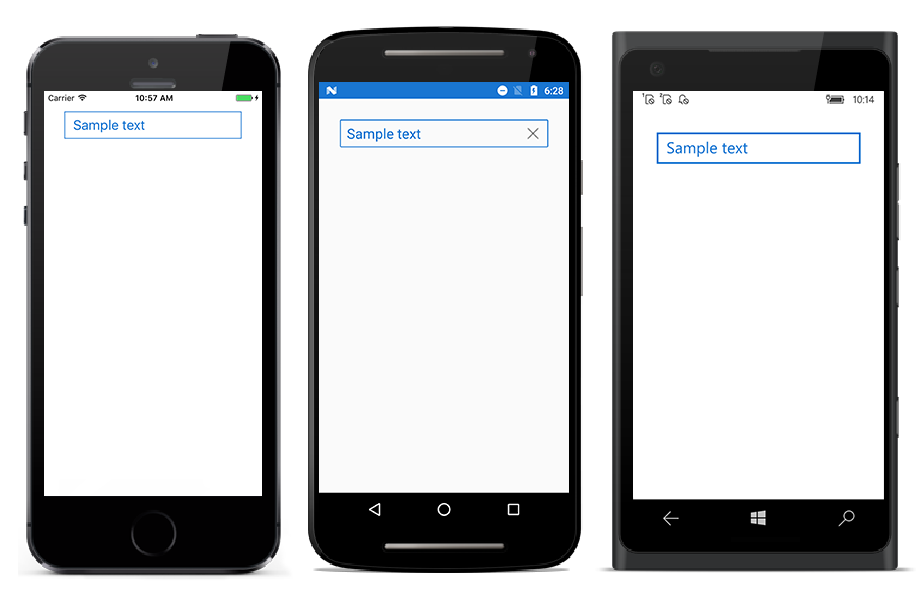
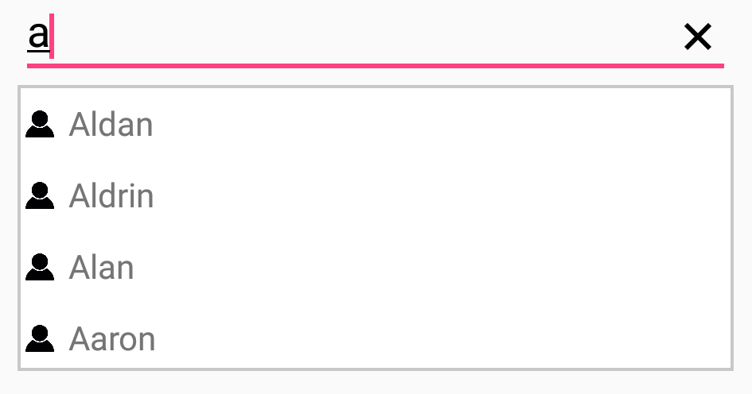
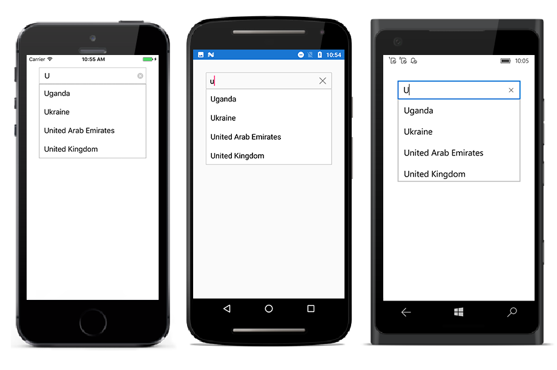
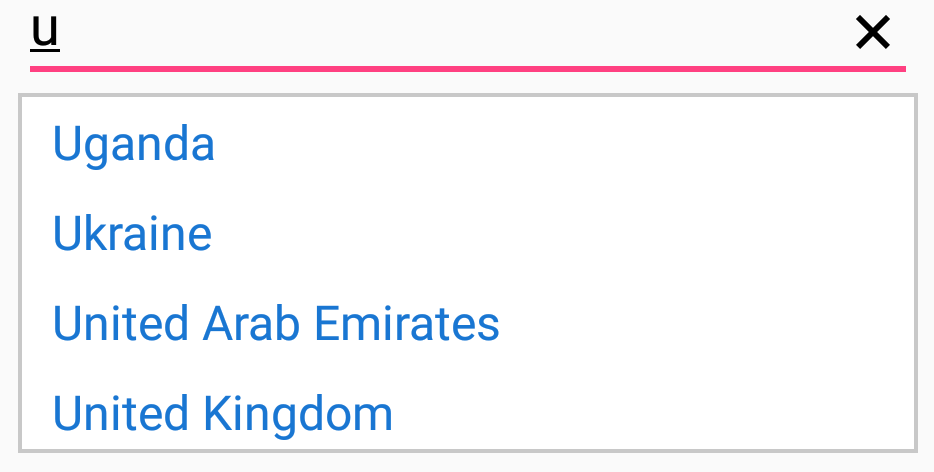

# Customizing AutoComplete

AutoComplete provides user friendly customizing options for both entry part and drop down part. In this section, customizing entire AutoComplete control is explained.

## Customizing the Entry

`TextColor`, `TextSize`, `FontAttributes`, `FontFamily` and `BorderColor` are the properties used to customize the foreground color, font size, font attribute, font family and border color of the entry part.





<StackLayout VerticalOptions="Start" HorizontalOptions="Start" Padding="30">
	<autocomplete:SfAutoComplete HeightRequest="40" x:Name="autoComplete" Text="Sample text" TextColor="#1976d2" TextSize="20" BorderColor="#1976d2"/>
</StackLayout>





StackLayout stackLayout = new StackLayout() 
{ 
VerticalOptions = LayoutOptions.Start, 
HorizontalOptions = LayoutOptions.Start,
Padding = new Thickness(30) 
};
SfAutoComplete autoComplete = new SfAutoComplete() 
{ 
HeightRequest = 40,  
Text = "Sample text", 
TextColor = Color.FromHex("1976d2"), 
TextSize = 20, 
BorderColor = Color.FromHex("1976d2")
};
stackLayout.Children.Add(autoComplete);
this.Content = stackLayout;





## Custom template for Suggestion items

`ItemTemplate` property helps to decorate suggestion items with custom templates. The following code explains the steps to add an image to the suggestion list item.





<StackLayout VerticalOptions="Start" HorizontalOptions="Start" Padding="30">
<autocomplete:SfAutoComplete HeightRequest="40" x:Name="autoComplete" DisplayMemberPath="Name" DataSource="{Binding PersonCollection}">
	<autocomplete:SfAutoComplete.ItemTemplate>
	<DataTemplate>
		<StackLayout Orientation="Horizontal">
		<Image Source="User.png" WidthRequest="12"/>
		<Label Text="{Binding Name}" />
		</StackLayout>
	</DataTemplate>
	</autocomplete:SfAutoComplete.ItemTemplate>
</autocomplete:SfAutoComplete>
</StackLayout>





public class Person
{
private int age;
public int Age
{
	get { return age; }
	set { age = value; }
}

private string name;
public string Name
{
	get { return name; }
	set { name = value; }
}
}

public class PersonViewModel
{
private ObservableCollection<Person> personCollection;
public ObservableCollection<Person> PersonCollection
{
	get { return personCollection; }
	set { personCollection = value; }
}

public PersonViewModel()
{
	personCollection = new ObservableCollection<Person>();
	personCollection.Add(new Person() { Age = 21, Name = "Aldan" });
	personCollection.Add(new Person() { Age = 25, Name = "Clara" });
	personCollection.Add(new Person() { Age = 23, Name = "Aldrin" });            
	personCollection.Add(new Person() { Age = 25, Name = "Mark" });
	personCollection.Add(new Person() { Age = 25, Name = "Lucas" });
	personCollection.Add(new Person() { Age = 24, Name = "Alan" });
	personCollection.Add(new Person() { Age = 25, Name = "James" });
	personCollection.Add(new Person() { Age = 22, Name = "Aaron" });
}
}

public partial class SamplePage : ContentPage
{
public SamplePage()
{
	InitializeComponent();       
	autoComplete.BindingContext = new PersonViewModel();
}
}





## Customizing the Suggestion Box

### Changing Suggestion Item Height

`DropDownItemHeight` property is used to modify the height of suggestion items in drop down list. The code example is given below:





<StackLayout VerticalOptions="Start" HorizontalOptions="Start" Padding="30">
	<autocomplete:SfAutoComplete HeightRequest="40" x:Name="autoComplete" DropDownItemHeight="45"/>
</StackLayout>





List<String> countryNames = new List<String>();
countryNames.Add("Uganda");
countryNames.Add("Ukraine");
countryNames.Add("United Arab Emirates");
countryNames.Add("United Kingdom");
autoComplete.DataSource = countryNames;
autoComplete.DropDownItemHeight = 45;





### Customizing Suggestion Items

Suggestion box items can be customized using `DropDownItemFontAttributes`, `DropDownItemFontFamily`, `DropDownTextSize` and `DropDownTextColor` properties.





<StackLayout VerticalOptions="Start" HorizontalOptions="Start" Padding="30">
	<autocomplete:SfAutoComplete HeightRequest="40" x:Name="autoComplete" DropDownTextSize="16" DropDownTextColor="#1976d2"/>
</StackLayout>





List<String> countryNames = new List<String>();
countryNames.Add("Uganda");
countryNames.Add("Ukraine");
countryNames.Add("United Arab Emirates");
countryNames.Add("United Kingdom");
countryNames.Add("United States");
autoComplete.DataSource = countryNames;
autoComplete.DropDownTextColor = Color.FromHex("#1976d2");
autoComplete.DropDownTextSize = 16;





### Show clear button

The autocomplete provided the user to show or hide the clear button using `ShowClearButton` property.





	<autocomplete:SfAutoComplete  x:Name="autoComplete" ShowClearButton="true"/>





autoComplete.ShowClearButton = true;





### Customizing clear button

The user can customize the clear button color in the autocomplete using `ClearButtonColor` Property.

N> `ClearButtonColor` property is available only on iOS and Android platform.





	<autocomplete:SfAutoComplete  x:Name="autoComplete" ClearButtonColor="Red"/>





autoComplete.ClearButtonColor = Color.Red;




