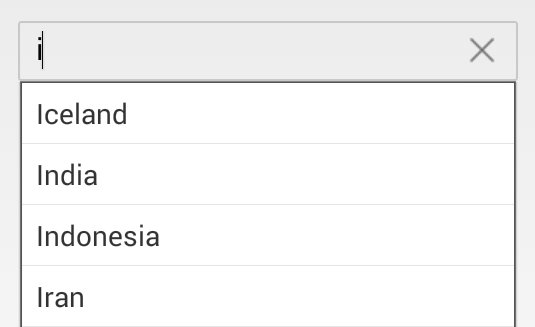

# DataBinding

SfAutoComplete control, supports binding to different data sources such as IList Data Source, XML Data Source, Observable Collection Data Source. This section explains 
about setting AutoComplete source, Item Source and applying template to the data.

## Setting AutoComplete Source

The `AutoCompleteSource` property is used to populate the list of data to the suggestions dropdown.
	
	
	

	
	List<String> countryList = new List<String>(); 
	countryList.Add ("Iceland");
	countryList.Add ("India");
	countryList.Add ("Indonesia");
	countryList.Add ("Iran");
	countryAutoComplete.AutoCompleteSource=countryList;
	 




  		<autocomplete:SfAutoComplete  x:Name="countryAutoComplete" HeightRequest="40" AutoCompleteSource="{Binding }" />




	

## ItemSource

ItemSource is a collection of SfAutoComplete items which holds the ImageName and TextProperties that to be displayed in suggestions.

The SfAutoComplete model looks as follows.



	public AutoCompleteModel(string label,string imagestr)
	{        
         Label = label;
	     Image = imagestr;
        
    	 private string _label;

        public string Label
        {
            get { return _label; }
            set { _label = value; }
        }
		 private string _image;

        public string Image
        {
            get { return _image; }
            set { _image = value; }
        }
	}



Create and populate autocomplete collection as follows



	autoComplete.DataSource = GetItemSource();
	List<AutoCompleteModel> GetItemSource()
    {
	List<AutoCompleteModel> list = new List<AutoCompleteModel>();

	list.Add(new AutoCompleteModel("Label1","image1.png"));
    list.Add(new AutoCompleteModel("Label2","image2.png"));
	list.Add(new AutoCompleteModel("Label3","image3.png"));
    list.Add(new AutoCompleteModel("Label4","image4.png"));
    list.Add(new AutoCompleteModel("Label5","image5.png"));
	return list;
	}



## Applying Template to Data 

SfAutoComplete contents can be customized by using `ItemTemplate` property. Through the ItemTemplate user can set up data bindings to the user objects.



	<ResourceDictionary>
      <DataTemplate x:Key="itemTemplate">
        <StackLayout Orientation="Horizontal">
            <Label Text="{Binding Text}" />
            <Image Source="{Binding Image}"  Aspect="AspectFit"/>
         <StackLayout>
      </DataTemplate>
    </ResourceDictionary>
	
	<autocomplete:SfAutoComplete x:Name="autocomplete" ItemTemplate="{StaticResource itemTemplate}" HeightRequest="600" WidthRequest="400" />



