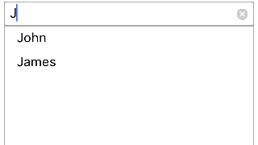

# DataBinding

## DataSource

The `DataSource` property is used to set list of objects to the SfAutoComplete control. 

* Create a Student class with two properties Name and Age.

* Create Student collection using Student class and assign the collection to DataSource property of SfAutoComplete.



	public class StudentViewModel
		{
			public StudentViewModel()
			{
				this.StudentDetails = new ObservableCollection<StudentDetail>();
				StudentDetails.Add(new StudentDetail() { Name = "John", Age = "24" });
				StudentDetails.Add(new StudentDetail() { Name = "James", Age = "37" });
			}

			public ObservableCollection<StudentDetail> StudentDetails
			{
				get;
				set;
			}

			public class StudentDetail
			{
				public string Name { get; set; }
				public string Age { get; set; }
			}
		}



* Here student collection has two properties so we should tell the control, by which property, it has to provide suggestions. In this case, let us make the control to provide suggestions based on Name.



			studentAutoComplete= new SfAutoComplete();
			studentAutoComplete.DataSource = new StudentViewModel().StudentDetails;
			studentAutoComplete.DisplayMemberPath = "Name";
			studentAutoComplete.SelectedValuePath = "Age";



* `DisplayMemberPath` decides the suggestions to be shown in dropdown. Setting the `SelectedValuePath` property will make `SelectedValue` property to return the value you have selected here. 

## Item Template

SfAutoComplete contents can be customized by using `ItemTemplate` property. Through the ItemTemplate user can set up data bindings to the user objects.



	<ResourceDictionary>
      <DataTemplate x:Key="itemTemplate">
        <StackLayout Orientation="Horizontal">
            <Label Text="{Binding Text}" />
            <Image Source="{Binding Image}"  Aspect="AspectFit"/>
         <StackLayout>
      </DataTemplate>
    </ResourceDictionary>
	
	<autocomplete:SfAutoComplete x:Name="autocomplete" ItemTemplate="{StaticResource itemTemplate}" HeightRequest="600" WidthRequest="400" />



