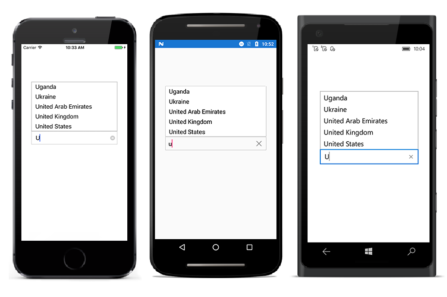
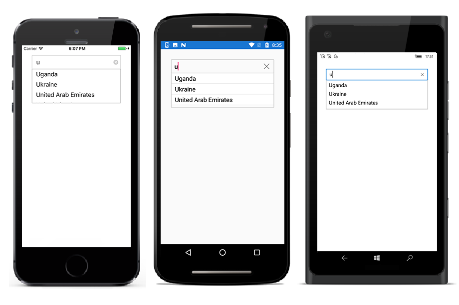
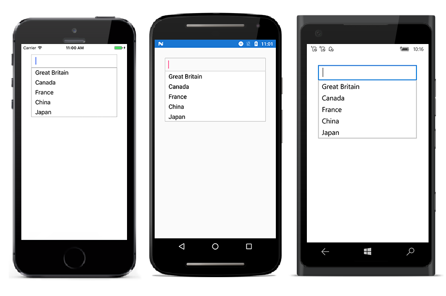

# Dealing with Suggestion Box

Suggestion box is the drop-down list box, which displays the filtered suggestions inside a popup. This section explains the properties that deals with drop-down list in the SfAutoComplete control.

## Suggestion box placement mode

Suggestion box can be placed either at the top or bottom using the `SuggestionBoxPlacement` property. By default, it is placed at the bottom.





<StackLayout VerticalOptions="Center" HorizontalOptions="Center" Padding="30">
	<autocomplete:SfAutoComplete HeightRequest="40" SuggestionBoxPlacement="Top" x:Name="autoComplete" />
</StackLayout>





List<String> countryNames = new List<String>();
countryNames.Add("Uganda");
countryNames.Add("Ukraine");
countryNames.Add("United Arab Emirates");
countryNames.Add("United Kingdom");
countryNames.Add("United States");
autoComplete.DataSource = countryNames;
autoComplete.SuggestionBoxPlacement = SuggestionBoxPlacement.Top;





## Maximum suggestion box height

The maximum height of the suggestion box in the SfAutocomplete control can be varied using the `MaximumDropDownHeight` property.





<StackLayout VerticalOptions="Start" HorizontalOptions="Start" Padding="30">
	<autocomplete:SfAutoComplete HeightRequest="40" x:Name="autoComplete" MaximumDropDownHeight="100" />                     
</StackLayout> 





List<String> countryNames = new List<String>();
countryNames.Add("Great Britain");
countryNames.Add("Uganda");
countryNames.Add("Ukraine");
countryNames.Add("Canada");
countryNames.Add("United Arab Emirates");
countryNames.Add("France");
countryNames.Add("United Kingdom");
countryNames.Add("China");
countryNames.Add("United States");
countryNames.Add("Japan");
autoComplete.DataSource = countryNames;
autoComplete.MaximumDropDownHeight = 100;





## Opening suggestion box on focus

Suggestion box can be shown whenever the control receives focus using the `ShowSuggestionsOnFocus` property. At this time, suggestion list is the complete list of data source.





<StackLayout VerticalOptions="Start" HorizontalOptions="Start" Padding="30">
	<autocomplete:SfAutoComplete HeightRequest="40" x:Name="autoComplete" ShowSuggestionsOnFocus="true" />                        
</StackLayout> 





List<String> countryNames = new List<String>();
countryNames.Add("Great Britain");
countryNames.Add("Canada");
countryNames.Add("France");
countryNames.Add("China");
countryNames.Add("Japan");
autoComplete.DataSource = countryNames;
autoComplete.ShowSuggestionsOnFocus = true;





## Delay opening suggestion box

The `PopupDelay` property is used to delay the suggestion box opening process. It gets milliseconds as input in integer data type.
In this example, a time duration of 3 seconds is set to popup delay.





<StackLayout VerticalOptions="StartAndExpand" HorizontalOptions="StartAndExpand" Padding="30">
	<autocomplete:SfAutoComplete HeightRequest="40" x:Name="autoComplete" PopupDelay="3000" />                            
</StackLayout> 





List<String> countryNames = new List<String>();
countryNames.Add("Uganda");
countryNames.Add("Ukraine");
countryNames.Add("United Arab Emirates");
countryNames.Add("United Kingdom");
countryNames.Add("United States");
autoComplete.DataSource = countryNames;
autoComplete.PopupDelay = 3000;





## Delay before searching algorithm starts

The `SearchDelay` property is used to delay the searching algorithm process. It gets milliseconds as input in integer data type.

In this example, a time duration of 3 seconds is set to search delay.





    <StackLayout VerticalOptions="StartAndExpand" HorizontalOptions="StartAndExpand" Padding="30">
	<autocomplete:SfAutoComplete HeightRequest="40" x:Name="autoComplete" SearchDelay="3000" />                            
</StackLayout> 





    List<String> countryNames = new List<String>();
    countryNames.Add("Uganda");
    countryNames.Add("Ukraine");
    countryNames.Add("United Arab Emirates");
    countryNames.Add("United Kingdom");
    countryNames.Add("United States");
    autoComplete.DataSource = countryNames;
    autoComplete.SearchDelay = 3000;





## Avoid opening suggestion box

APIs are available to avoid pop-ups and retrieve filtered suggestion items that help you arrange lists or items control. 





<StackLayout VerticalOptions="StartAndExpand" HorizontalOptions="StartAndExpand" Padding="30">
	<autocomplete:SfAutoComplete HeightRequest="40" x:Name="autoComplete" SuggestionBoxPlacement="None" />                            
</StackLayout> 





List<String> countryNames = new List<String>();
countryNames.Add("Uganda");
countryNames.Add("Ukraine");
countryNames.Add("United Arab Emirates");
countryNames.Add("United Kingdom");
countryNames.Add("United States");
autoComplete.SuggestionBoxPlacement=SuggestionBoxPlacement.None;
autoComplete.DataSource = countryNames;




