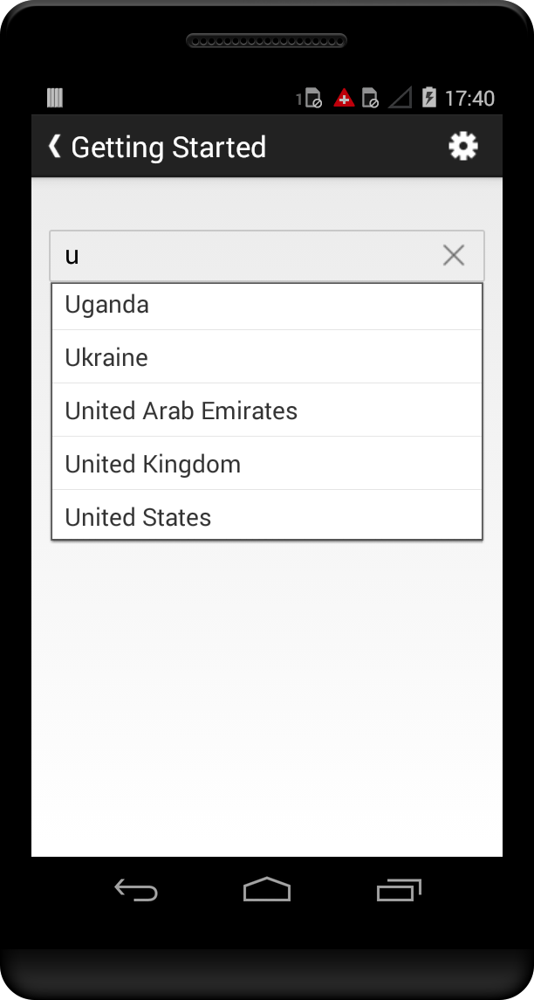
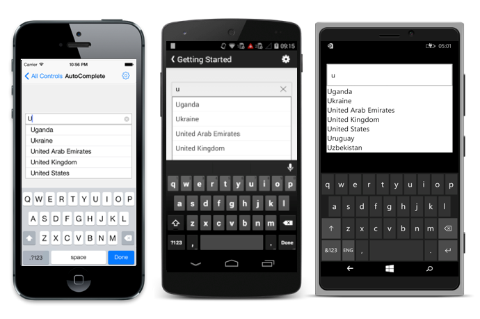

# Getting Started

This section explains how to configure an AutoComplete in the following three platforms.

* Create your first AutoComplete in Xamarin.Android
* Create your first AutoComplete in Xamarin.iOS
* Create your first AutoComplete in Xamarin.Forms

## Create your first AutoComplete in Xamarin.Android

This section provides a quick overview for working with AutoComplete in Android Studio. This example explains how to create an AutoComplete with different AutoCompleteModes and SuggestionModes.

### Reference Essential Studio components in your solution

After installing the Essential Studio for Xamarin, you can find all the required assemblies in the installation folders,

{Syncfusion Installed location}\Essential Studio\13.2.0.29\lib

N> Assemblies are available in unzipped package location in Mac.

Add the following assembly references to the Xamarin project.

android\Syncfusion.SfAutoComplete.Andriod.dll

To develop an application with the Xamarin AutoComplete is simple.

Create an instance for the SfAutoComplete in the constructor and set that AutoComplete as content view of Activity.

  

SfBusyIndicator sfBusyIndicator = new SfBusyIndicator(this);

setContentView(sfBusyIndicator);

 

### Setting the AutoCompleteSource to AutoComplete

You can set the suggestion list to the AutoComplete by using the AutoCompleteSource property and assign by using a DataAdapter. 

   

List<String> cList = new List<String>(); 

cList.Add ("Afghanistan"); 

cList.Add ("Akrotiri");

cList.Add ("Albania");

cList.Add ("Algeria"); 

ArrayAdapter<String> adapters = new ArrayAdapter<String>(con,
     Android.Resource.Layout.SimpleListItem1, new Countrylist().Country);

autoComplete1.SetAutoCompleteSource(adapters);  

 

### Setting AutoComplete Customizations

AutoComplete is customized by setting the properties as explained in the following code example.

  

 autoComplete1.SuggestionMode = SuggestionMode.StartsWith;
 
 autoComplete1.MaximumDropDownHeight = 200;

 autoComplete1.Watermark = "Enter a country name";

 autoComplete1.PopUpDelay = 100;

 autoComplete1.AutoCompleteMode = AutoCompleteMode.Append;

 autoComplete1.MinimumPrefixCharacters = 2; 

 

## Create your first AutoComplete in Xamarin.Forms

This section provides a quick overview for working with Essential AutoComplete for Xamarin.Forms.

### Add Syncfusion assembly reference

Add the required Syncfusionassembly references to the respective projects as follows. Refer to the following installed 
location for the required assemblies.

{Syncfusion Installed location}\Essential Studio\13.2.0.29\lib

For example: C:\Program Files (x86)\Syncfusion\Essential Studio\13.2.0.29\lib

#### PCL project

XForms\Syncfusion. SfAutoComplete.XForms.dll 

#### Android project

Android\Syncfusion. SfAutoComplete.Andriod.dll

Android\Syncfusion. SfAutoComplete. XForms.Andriod.dll

#### iOS project

iOS\Syncfusion. SfAutoComplete.iOS.dll  

iOS\Syncfusion. SfAutoComplete.XForms.iOS.dll

#### Windows Phone project

WinPhone\Syncfusion. SfInput.WP8.dll

WinPhone\Syncfusion. SfShared.WP8.dll

WinPhone\Syncfusion. SfAutoComplete.XForms.WinPhone.dll

N> Essential AutoComplete for Xamarin is compatible with Xamarin Forms 1.3.

An additional step is required for Windows Phone and iOS projects.

Create an instance of the SfAutoCompleteRenderer in MainPage constructor of Windows Phone project as follows.

 

public MainPage()

    {

        new SfAutoCompleteRenderer ();

        ...    

    }

 

Create an instance of the SfAutoCompleteRenderer in FinishedLaunching overridden method of AppDelegate class in iOS Project as follows.

 

public override bool FinishedLaunching(UIApplication app, NSDictionary options)

    {

        ...

        new SfAutoCompleteRenderer ();

        ...

    }

 

### Add and configure the AutoComplete

The AutoComplete control is configured entirely in C# code or by using XAML markup.

Create an instance of SfAutoComplete.



// Update App.cs source in this file.

using Syncfusion.XForms.SfAutoComplete;

…

…

public class App : Application
	{
        public App()
        {
            MainPage = new AutoCompletePage ();
        }

    }

public class AutoCompletePage : ContentPage

{
        SfAutoComplete sfautocomplete;

        public AutoCompletePage ()
        {
            sfautocomplete = new SfAutoComplete();
        }
}

 

 

// Use this in App.CS source.

<?xml version="1.0" encoding="UTF-8"?>

<ContentPage xmlns="http://xamarin.com/schemas/2014/forms"  
xmlns:x="http://schemas.microsoft.com/winfx/2009/xaml"    
        
x:Class="AutoCompleteGettingStarted.AutoCompleteGettingStarted " 
	BackgroundColor="White"            
xmlns:syncfusion="clr-namespace:Syncfusion.SfAutoComplete.XForms;
	assembly=Syncfusion. SfAutoComplete.XForms"          
xmlns:picker="clr-namespace: AutoCompleteGettingStarted;
	assembly= AutoCompleteGettingStarted ">
    
<ContentPage.Content> x:Class=" AutoCompleteGettingStarted.Sample">

<ContentPage.Content>
        <syncfusion:SfAutoComplete    
</ContentPage.Content>

</ContentPage>



### Configure the AutoComplete Properties

Add the AutoComplete properties in your application.

   

   

SfAutoComplete sfautocomplete = new SfAutoComplete  ();

sfautocomplete .AutoCompleteSource= list1;

sfautocomplete .MinimumPrefixCharacter= 2;

sfautocomplete .MaximumDropDownHeight= 200;

sfautocomplete .PopUpelay= 100;



  

<syncfusion:SfAutoComplete x:Name="sfautocomplete" BackgroundColor="White" MinimumPrefixCharacter="2" MaximumDropDownHeight="200" PopUpDelay="100">



 

The following screenshot illustrates the output.

## Create your first AutoComplete in Xamarin.iOS

This section provides a quick overview to work with the AutoComplete in Objective C. This example explains how to create an AutoComplete with different AutoCompleteModes and SuggestionModes.

### Add Framework reference to the project

You can refer to the following link to learn how to refer to the framework to your project. 

<http://help.syncfusion.com/ios/introduction/add-framework-reference-to-the-project>

### Create an AutoComplete

To develop an application with iOS AutoComplete is simple. 

Create an AutComplete object in the View Controller and add the AutoComplete as subview in viewdidload override method.

You can create an AutoComplete object by using the following code example.

  

@interface ViewController ()

{

    SFAutoComplete *autocomplete;

}

- (void)viewDidLoad

{

    [super viewDidLoad];

    autocomplete=[[ SFAutoComplete alloc]init];

    [self.view addSubview:autocomplete];

}



### Setting the AutoCompleteSource to AutoComplete

You can set the suggestion list to the AutoComplete by using the property AutoCompleteSource.

 

-(NSMutableArray*) countryArray{

    NSMutableArray * array= [NSMutableArray array];

    [array addObject:[[AutoCompleteSource alloc]init:@"Afghanistan"]];

    [array addObject:[[AutoCompleteSource alloc]init:@"Akrotiri"]];

    [array addObject:[[AutoCompleteSource alloc]init:@"Albania"]];

    [array addObject:[[AutoCompleteSource alloc]init:@"Algeria"]];

}

@property (nonatomic, strong) AutoCompleteSource *source;

_source=[[AutoCompleteSource alloc]init];

autoComplete1.autoCompleteSource=[_source countryArray];

 

### Setting AutoComplete Customizations

AutoComplete is customized by setting the properties as explained in the following code example.

  

_autoComplete1.suggestionMode=SFAutoCompleteSuggestionModeStartsWith;

_autoComplete1.autoCompleteSource=[_source countryArray];

_autoComplete1.tableViewStyle=UITableViewCellStyleDefault;

_autoComplete1.watermark=@"Enter country name";

_autoComplete1.autoCompleteMode=SFAutoCompleteAutoCompleteModeSuggest;

_autoComplete1.popUpDelay = 100;



