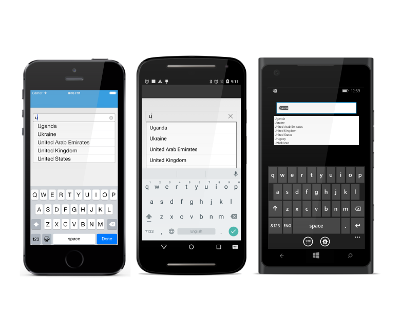

# Getting Started

This section explains you the steps to configure a AutoComplete control in a real-time scenario and also provides a walk-through on some of the customization features available in AutoComplete control.

## Referencing Essential Studio Components in Your Solution	

If you had acquired Essential Studio components through the Xamarin component store interface from within your IDE, then after adding the components to your Xamarin.iOS, Xamarin.Android and Windows Phone projects through the Component manager, you will still need to manually reference the PCL (Portable Class Library) assemblies in the Xamarin.Forms PCL project in your solution. You can do this by manually adding the relevant PCL assembly references to your PCL project contained in the following path inside of your solution folder.

Components/syncfusionessentialstudio-version/lib/pcl/

Alternatively, if you had downloaded Essential Studio from Syncfusion.com or through the Xamarin store web interface then all assembly references need to be added manually.

After installing Essential Studio for Xamarin, all the required assemblies found in the installation folders, typically

{Syncfusion Installed location}\Essential Studio\syncfusionessentialstudio-version\lib

Eg: C:\Program Files (x86)\Syncfusion\Essential Studio\12.2.0.40\lib

Or after downloading through the Xamarin store web interface, all the required assemblies can be found in the below folder
{download location}\syncfusionessentialstudio-version\lib

You can then add the assembly references to the respective projects as shown below

<table>
<tr>
<th>Project</th>
<th>Required assemblies</th>
</tr>
<tr>
<td>Pcl</td>
<td>pcl\Syncfusion.SfAutoComplete.XForms.dll</td>
</tr>
<tr>
<td>Android Renderer</td>
<td>android\Syncfusion.SfAutoComplete.Android.dll android\Syncfusion.SfAutoComplete.XForms.Android.dll</td>
</tr>
<tr>
<td>iOS (Classic) Renderer</td>
<td>ios\Syncfusion.SfAutoComplete.iOS.dll ios\Syncfusion.SfAutoComplete.XForms.iOS.dll ios\Syncfusion.SfAutoComplete.XForms.dll</td>
</tr>
<tr>
<td>iOS (Unified)  Renderer</td>
<td>ios-unified\Syncfusion.SfAutoComplete.iOS.dll ios-unified\Syncfusion.SfAutoComplete.XForms.iOS.dll ios-unified\Syncfusion.SfAutoComplete.XForms.dll</td>
</tr>
<tr>
<td>WindowsPhone Renderer</td>
<td>wp8\Syncfusion.SfInput.WP8.dll wp8\Syncfusion.SfShared.WP8.dll wp8\Syncfusion.SfAutoComplete.XForms.dll wp8\Syncfusion.SfAutoComplete.XForms.WinPhone.dll</td>
</tr>
<tr>
<td>WindowsPhone 8.1 Renderer</td>
<td>wp81\Syncfusion.SfInput.WP.dll wp81\Syncfusion.SfShared.WP.dll wp81\Syncfusion.SfAutoComplete.XForms.dll wp81\Syncfusion.SfAutoComplete.XForms.WinPhone.dll</td>
</tr>
<tr>
<td>WinRT Renderer</td>
<td>winrt\Syncfusion.SfInput.WinRT.dll winrt\Syncfusion.SfShared.WinRT.dll winrt\Syncfusion.SfAutoComplete.XForms.dll winrt\Syncfusion.SfAutoComplete.XForms.WinRT.dll</td>
</tr>
</table>

Currently an additional step is required for Windows Phone and iOS projects. We need to create an instance of the autocomplete custom renderer as shown below. 

Create an instance of SfAutoCompleteRenderer in MainPage constructor in of the Windows Phone project as shown 



public MainPage()

{

    new SfAutoCompleteRenderer();

    ...    

}



Create an instance of SfAutoCompleteRenderer in FinishedLaunching overridden method of AppDelegate class in iOS Project as shown below



public override bool FinishedLaunching(UIApplication app, NSDictionary options)

{

    ...

    new SfAutoCompleteRenderer ();

    ...

}	



## Add and Configure AutoComplete

* Adding reference to autocomplete.



	using Syncfusion.SfAutoComplete.XForms;



* Create an instance for autocomplete control and adding to application.



	SfAutoComplete countryAutoComplete= new SfAutoComplete ();
	SetContentView(countryAutoComplete);



## Setting AutoCompleteSource

You can set the suggestion list to the AutoComplete using the `AutoCompleteSource` property.



	private List<String> countryName = new List<String>();
	countryName.add("Afghanistan");
	countryName.add("Akrotiri");
	countryName.add("Albania");
	sfAutoComplete.AutoCompleteSource = countryName;



