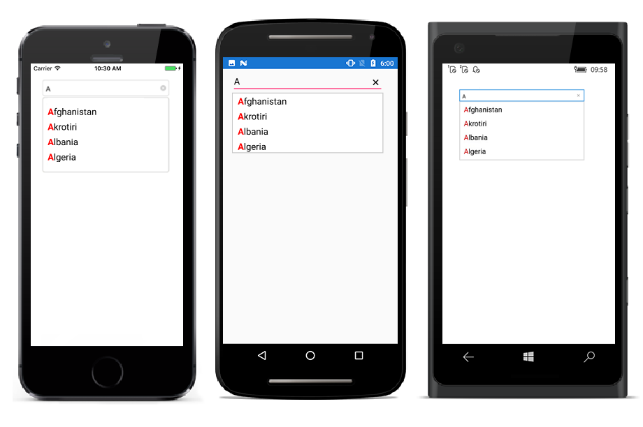
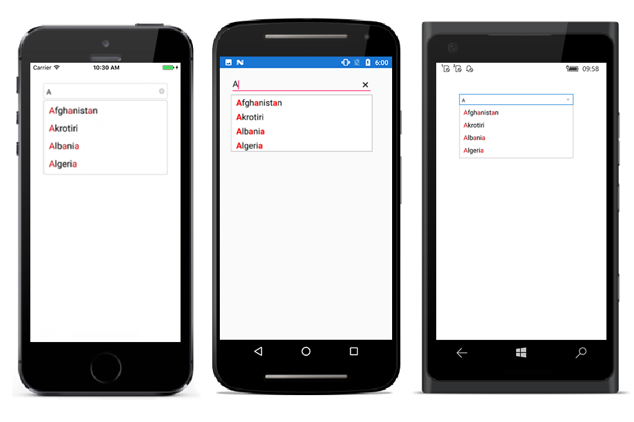

# Highlighting matched text

Highlight matching characters in a suggestion list to pick an item with more clarity. There are two ways to highlight the matching text:

* FirstOccurrence

* MultipleOccurrence

The text higlight can be indicated with various customising styles by enabling the below properties. They are

* HighlightedTextColor -  sets the color of the highlighted text for differentiating the highlighted characters.

* HighlightTextFontAttributes - sets the FontAttributes of the highlighted text.

## FirstOccurrence

It highlights the first position of the matching characters in the suggestion list.





<StackLayout VerticalOptions="Start" HorizontalOptions="Start" Padding="30">
	<autocomplete:SfAutoComplete HeightRequest="40" x:Name="autoComplete" TextHighlightMode="FirstOccurrence" HighlightedTextColor="Red" HighlightTextFontAttributes="Bold" SuggestionMode="StartsWith"/>                    
</StackLayout> 





List<String> countryNames = new List<String>();
countryNames.Add("Uganda");
countryNames.Add("Ukraine");
countryNames.Add("United Arab Emirates");
countryNames.Add("United Kingdom");
countryNames.Add("United States");
autoComplete.SuggestionMode= SuggestionMode.StartsWith;
autoComplete.TextHighlightMode=OccurrenceMode.FirstOccurrence;
autoComplete.HighlightedTextColor= Color.Red;
autoComplete.HighlightedTextFontAttributes = FontAttributes.Bold;
autoComplete.DataSource = countryNames;





## MultipleOccurrence

It higlights the matching character that are present everywhere in the suggestionlist for Contains case in SuggestionMode..





<StackLayout VerticalOptions="Start" HorizontalOptions="Start" Padding="30">
	<autocomplete:SfAutoComplete HeightRequest="40" x:Name="autoComplete" TextHighlightMode="MultipleOccurrence" HighlightedTextColor="Red" HighlightTextFontAttributes="Bold" SuggestionMode="Contains"/>                    
</StackLayout> 





List<String> countryNames = new List<String>();
countryNames.Add("Uganda");
countryNames.Add("Ukraine");
countryNames.Add("United Arab Emirates");
countryNames.Add("United Kingdom");
countryNames.Add("United States");
autoComplete.SuggestionMode= SuggestionMode.Contains;
autoComplete.TextHighlightMode=OccurrenceMode.MultipleOccurrence;
autoComplete.HighlightedTextColor= Color.Red;
autoComplete.HighlightedTextFontAttributes = FontAttributes.Bold;
autoComplete.DataSource = countryNames;




