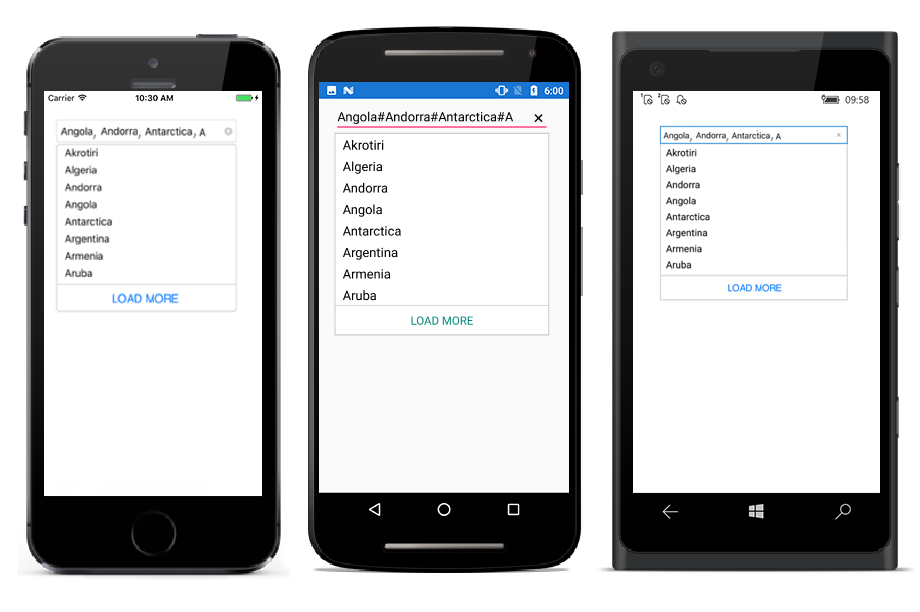

# Maximum Display Item with Expander

Restrict the number of suggestions displayed and have the remaining items loaded by selecting LoadMore. We can also set the maximum suggestion to be displayed using LoadMore method.





<StackLayout VerticalOptions="Start" HorizontalOptions="Start" Padding="30">
	<autocomplete:SfAutoComplete HeightRequest="40" x:Name="autoComplete" MaximumSuggestion="3"  />                    
</StackLayout> 





List<String> countryNames = new List<String>();
countryNames.Add("Uganda");
countryNames.Add("Ukraine");
countryNames.Add("United Arab Emirates");
countryNames.Add("United Kingdom");
countryNames.Add("United States");
autoComplete.MaximumSuggestion=3;
autoComplete.DataSource = countryNames;





