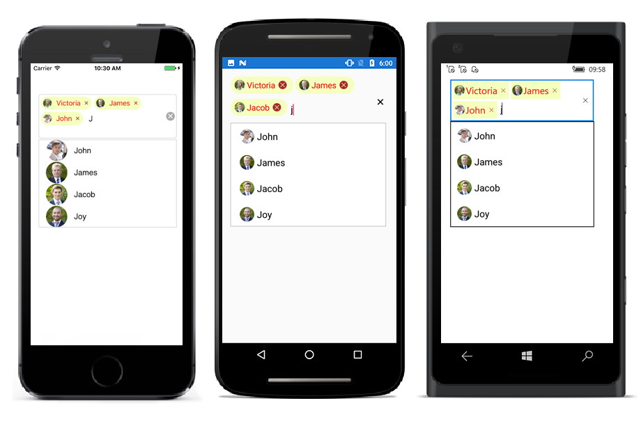
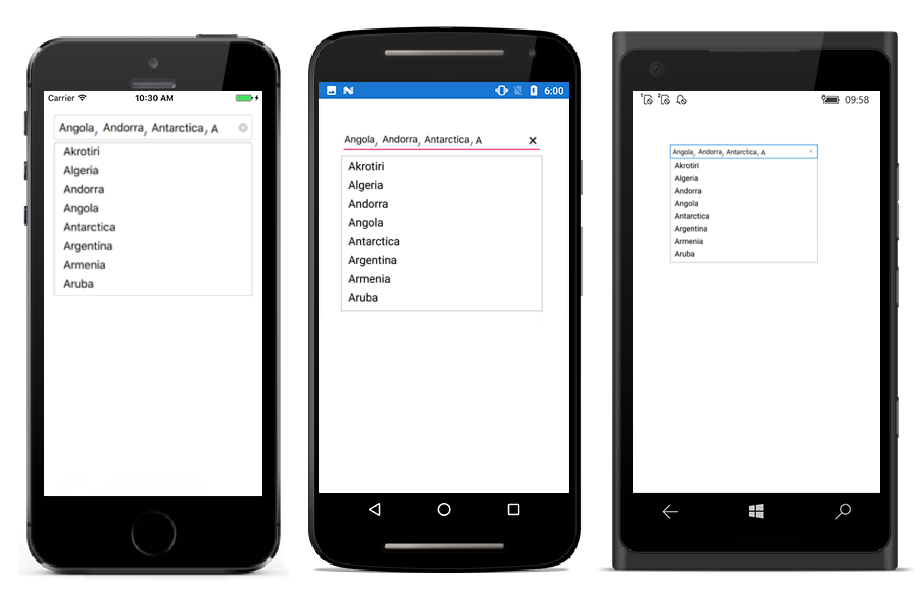

# Multiple Selection

Select multiple items from a suggestion list. There are two ways to perform multi selection in autocomplete.

* Token Representation

*  Delimiter

## Token Representation

Selected items will be displayed with a customizable token representation and the users can remove each tokenized item with the close button.





<StackLayout VerticalOptions="Start" HorizontalOptions="Start" Padding="30">
	<autocomplete:SfAutoComplete HeightRequest="40" x:Name="autoComplete" MultiSelectMode="Token" TokensWrapMode="Wrap" IsSelectedItemsVisibleInDropDown="false" />                    
</StackLayout> 





autoComplete.MultiSelectMode=MultiSelectMode.Token;
autoComplete.TokensWrapMode=TokensWrapMode.Wrap;
autoComplete.IsSelectedItemsVisibleInDropDown=false;





### Wrap Mode of Token

The selected item can be displayed as token inside SfAutoComplete in two ways. They are

* `Wrap` - When `TokensWrapMode` is set to `Wrap` the selected items will be wrap to the next line of the SfAutoComplete.

* `None` - When `TokensWrapMode` is set to `None` the selected item will be wrap in horizontal orientation.





<StackLayout VerticalOptions="Start" HorizontalOptions="Start" Padding="30">
    <autocomplete:SfAutoComplete HeightRequest="40" x:Name="autoComplete" DropDownItemHeight="50" DisplayMemberPath="Name" ImageMemberPath="Image" MultiSelectMode="Token" DataSource="{Binding EmployeeCollection}">
    </autocomplete:SfAutoComplete>
</StackLayout>




namespace autocomplete
{
public partial class autocompletePage : ContentPage
{
EmployeeViewModel view = new EmployeeViewModel();
public autocompletePage()
{
InitializeComponent();
// Set TokensWrapMode to Wrap
autoComplete.TokensWrapMode = TokensWrapMode.Wrap;
this.BindingContext = view;
}
}
// Create a Employee Class which holds the Name and image.

public class Employee
{
private string image;
public string Image
{
get { return image; }
set { image = value; }
}
private string name;
public string Name
{
get { return name; }
set { name = value; }
}
}
// Create EmployeeViewModel class holds the collection of employee data.

public class EmployeeViewModel :INotifyPropertyChanged
{
private ObservableCollection<Employee> employeeCollection;
public ObservableCollection<Employee> EmployeeCollection
{
get { return employeeCollection; }
set { employeeCollection = value; }
}
public EmployeeViewModel()
{
employeeCollection = new ObservableCollection<Employee>();
employeeCollection.Add(new Employee() { Image = "John.png", Name = "John" });
employeeCollection.Add(new Employee() { Image = "James.png", Name = "James" });
employeeCollection.Add(new Employee() { Image = "Jacob.png", Name = "Jacob" });
employeeCollection.Add(new Employee() { Image = "Joy.png", Name = "Joy" });
employeeCollection.Add(new Employee() { Image = "Justin.png", Name = "Justin" });
employeeCollection.Add(new Employee() { Image = "Jerome.png", Name = "Jerome" });
employeeCollection.Add(new Employee() { Image = "Jessica.png", Name = "Jessica" });
employeeCollection.Add(new Employee() { Image = "Victoria.png", Name = "Victoria" });

}

public int GetHeight(bool value)
{
if (value)
return 80;
}

private int toHeight = 40;
public int ToHeight
{
get { return toHeight; }
set
{
toHeight = value;
RaisePropertyChanged("ToHeight");
}
}
private bool isToFocused = false;
public bool IsToFocused
{
get { return isToFocused; }
set
{
isToFocused = value;
ToHeight = GetHeight(value);
RaisePropertyChanged("IsToFocused");
}
}
public event PropertyChangedEventHandler PropertyChanged;
private void RaisePropertyChanged(String name)
{
if (PropertyChanged != null)
this.PropertyChanged(this, new PropertyChangedEventArgs(name));
}
}
}

}




 
### Token Customization

Customization can be done for Token. There are various ways to customize the tokens. They are as follows.

* `TextColor` - sets the color of the text inside the token.

* `FontSize` - sets the size of the Font inside the token.

* `FontFamily` - sets the Font family for the text inside the token.

* `BackgroundColor` - sets the background color of the token.

* `SelectedBackgroundColor` - sets the background color of the token when it is selected.

* `IsCloseButtonVisible` - Enables and disables the close button inside SfAutoComplete.

* `DeleteButtonColor` - sets the color of the close button inside SfAutoComplete.

* `CornerRadius` - sets the corner radius for the token.

* `DeleteButtonPlacement` - sets the placement of delete button. `Left` and `Right` are the placement options. By default, it is set placed at right side of the token. 





<?xml version="1.0" encoding="utf-8"?>
<ContentPage 
    xmlns="http://xamarin.com/schemas/2014/forms"
    xmlns:autocomplete="clr-namespace:Syncfusion.SfAutoComplete.XForms;assembly=Syncfusion.SfAutoComplete.XForms"
    xmlns:x="http://schemas.microsoft.com/winfx/2009/xaml" 
    xmlns:local="clr-namespace:GettingStarted"
    x:Class="GettingStarted.MainPage">
    
    <ContentPage.BindingContext>
         <local:EmployeeViewModel/>
    </ContentPage.BindingContext>
    <ContentPage.Content>
        <StackLayout>
        <autocomplete:SfAutoComplete
            DisplayMemberPath="Name" 
            MultiSelectMode="Token" 
            ImageMemberPath="Image"
            TokensWrapMode="Wrap" 
            DataSource="{Binding EmployeeCollection}" />
             <autocomplete:SfAutoComplete.TokenSettings>
                 <autocomplete:TokenSettings
                        FontSize="16"
                        BackgroundColor="#66ccff"
                        TextColor="White" 
                        SelectedBackgroundColor="#ffffe0"
                        DeleteButtonColor="#993300"
                        FontFamily="Times New Roman"
                        DeleteButtonPlacement="Right
                        IsCloseButtonVisible="true"
                        CornerRadius="15"/>
            </autocomplete:SfAutoComplete.TokenSettings>
        </autocomplete:SfAutoComplete>
        </StackLayout> 
    </ContentPage.Content>

</ContentPage>         




namespace GettingStarted
{
    public partial class MainPage : ContentPage
    {
        public MainPage()
        {
            InitializeComponent();
            this.BindingContext = new EmployeeViewModel();
            StackLayout stackLayout = new StackLayout();
            var autoComplete = new SfAutoComplete()
            {
                MultiSelectMode = MultiSelectMode.Token,
                DisplayMemberPath = "Name",
                ImageMemberPath = "Image",
                TokensWrapMode = TokensWrapMode.Wrap,
            };
            autoComplete.SetBinding(SfAutoComplete.DataSourceProperty, "EmployeeCollection");
            autoComplete.TokenSettings = new TokenSettings()
            {
                FontSize = 16,
                BackgroundColor = Color.FromHex("#66ccff"),
                TextColor = Color.White,
                SelectedBackgroundColor = Color.FromHex("#ffffe0"),
                DeleteButtonColor = Color.FromHex("#993300"),
                FontFamily = "Times New Roman",
                IsCloseButtonVisible = true,
                DeleteButtonPlacement = DeleteButtonPlacement.Right,
                CornerRadius = 15
            };
            stackLayout.Children.Add(autoComplete);
            this.Content = stackLayout;
        }
    }
}
 






namespace GettingStarted
{
    public class Employee
    {
        private string image;

        private string name;

        public string Image
        {
            get
            {
                return image;
            }

            set
            {
                image = value;
            }
        }

        public string Name
        {
            get
            {
                return name;
            }

            set
            {
                name = value;
            }
        }
    }

    public class EmployeeViewModel
    {
        private ObservableCollection<Employee> employeeCollection;

        public ObservableCollection<Employee> EmployeeCollection
        {
            get
            {
                return employeeCollection;
            }

            set
            {
                employeeCollection = value;
            }
        }
        public EmployeeViewModel()
        {
            employeeCollection.Add(new Employee() { Image = "John.png", Name = "John" });
            employeeCollection.Add(new Employee() { Image = "James.png", Name = "James" });
            employeeCollection.Add(new Employee() { Image = "Jacob.png", Name = "Jacob" });
            employeeCollection.Add(new Employee() { Image = "Joy.png", Name = "Joy" });
            employeeCollection.Add(new Employee() { Image = "Justin.png", Name = "Justin" });
            employeeCollection.Add(new Employee() { Image = "Jerome.png", Name = "Jerome" });
            employeeCollection.Add(new Employee() { Image = "Jessica.png", Name = "Jessica" });
            employeeCollection.Add(new Employee() { Image = "Victoria.png", Name = "Victoria" });
        }
    }
}


## Delimiter

When selecting the multiple items, the selected items can be divided with a desired character given for a delimiter. We can set delimiter character with the `Delimiter` property.




<StackLayout VerticalOptions="Start" HorizontalOptions="Start" Padding="30">
	<autocomplete:SfAutoComplete HeightRequest="40" x:Name="autoComplete" MultiSelectMode="Delimiter"  Delimiter="," />                    
</StackLayout> 

N> The optimal value for Delimiter property is any single character.





autoComplete.MultiSelectMode=MultiSelectMode.Delimiter;
autoComplete.Delimiter=",";





### Selection indicator

The autocomplete enables the user to indicate the selected item from the datasource when selecting multiple items from the dropdown. It can be performed by enabling `EnableSelectionIndicator` property.

N> Selection Indicator support has enhanced only on iOS and Android platform.




 <autocomplete:SfAutoComplete HeightRequest="40" ShowSuggestionsOnFocus="true" IsSelectedItemsVisibleInDropDown="true" IndicatorText="A" IndicatorTextSize="sample.ttf" IndicatorTextColor="Red" EnableSelectionIndicator="true" MultiSelectMode="Token"  x:Name="autoComplete" DataSource="{Binding EmployeeCollection}"/>
       




autoComplete.MultiSelectMode=MultiSelectMode.Token;
autoComplete.ShowSuggestionsOnFocus=true;
autoComplete.IsSelectedItemsVisibleInDropDown=true;
autoComplete.IndicatorText= "A";
autoComplete.IndicatorTextSize= "sample.ttf";
autoComplete.IndicatorTextColor = Color.Red;
autoComplete.EnableSelectionIndicator= true;





### Item padding

The autocomplete enables the user to provide padding for the items inside dropdown using `ItemPadding` property.

N> `ItemPadding` property is available only on iOS and Android platform.




 <autocomplete:SfAutoComplete ShowSuggestionsOnFocus="true" ItemPadding="20,10,0,0" MultiSelectMode="Token"  x:Name="autoComplete" DataSource="{Binding EmployeeCollection}"/>
       




autoComplete.MultiSelectMode=MultiSelectMode.Token;
autoComplete.ShowSuggestionsOnFocus=true;
autoComplete.ItemPadding= new Thickness(20,10,0,0);;




