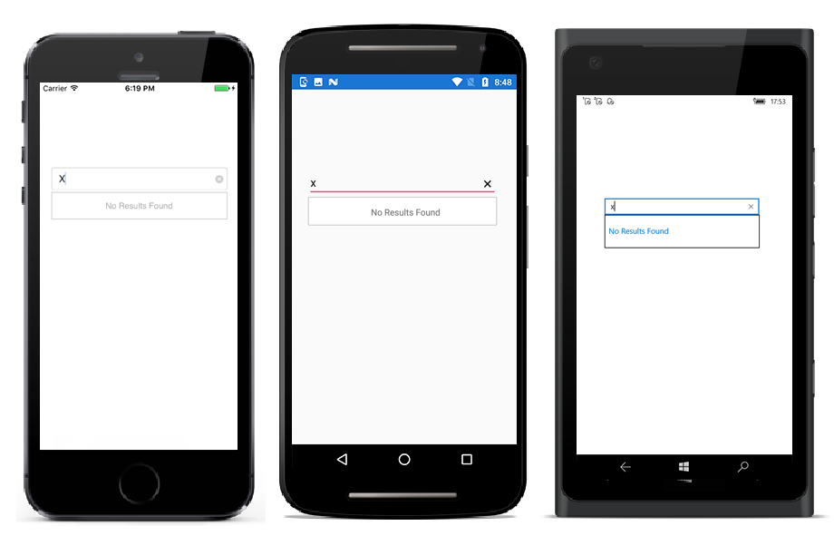
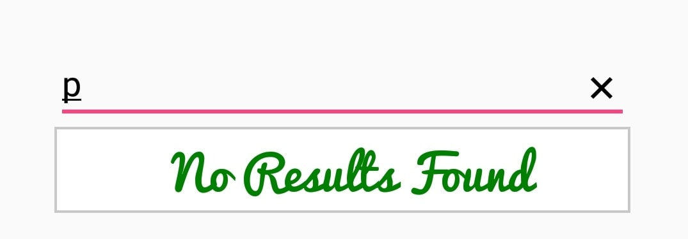

# No Results Found

When the entered item is not in the suggestion list, SfAutoComplete displays a text indicating there is no search results found. We can set the desire text to be displayed for indicating no results found with the `NoResultsFoundText` property.





<StackLayout VerticalOptions="Start" HorizontalOptions="Start" Padding="30">
	<autocomplete:SfAutoComplete HeightRequest="40" x:Name="autoComplete" NoResultsFoundText="No Results Found" />                    
</StackLayout> 





autoComplete.NoResultsFoundText="No Results Found";
autoComplete.DataSource = countryNames;





## Customizing NoResultsFoundText

The `NoResultsFoundTextColor`, `NoResultsFoundFontSize`, `NoResultsFoundFontAttributes`, and `NoResultsFoundFontFamily` properties are used to customize the foreground color, font size, font attribute, and font family of NoResultsFoundText.




<StackLayout VerticalOptions="Start" HorizontalOptions="Start" Padding="30">
	<autocomplete:SfAutoComplete HeightRequest="40" x:Name="autoComplete" NoResultsFoundText="No Results Found" NoResultsFoundTextColor="DarkGreen" NoResultsFoundFontSize="20" NoResultsFoundFontAttributes="Bold" NoResultsFoundFontFamily="Pacifico.ttf" />                    
</StackLayout> 





autoComplete.NoResultsFoundText="No Results Found";
autoComplete.NoResultsFoundTextColor = Color.DarkGreen;
autoComplete.NoResultsFoundFontSize = 20;
autoComplete.NoResultsFoundFontAttributes = FontAttributes.Bold;
autoComplete.NoResultsFoundFontFamily = "Pacifico.ttf"
autoComplete.DataSource = countryNames;





