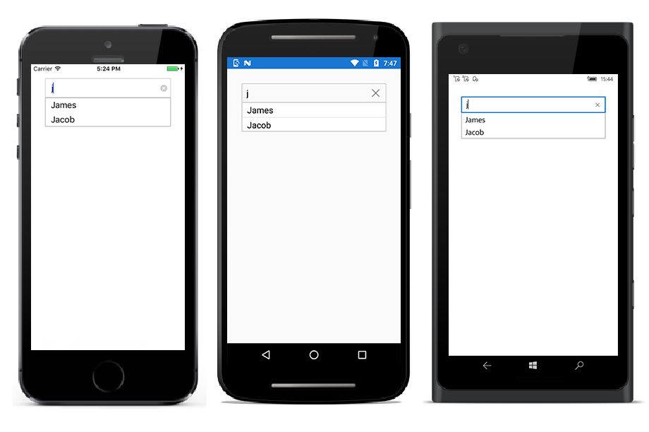

# Populating Data

SfAutoComplete control can be populated with a list of string or business objects, which assists the user while typing. Users can choose one item from the filtered suggestion list. For example, let us populate AutoComplete with list of string and list of Employee details.

## Populating String Data

Create an instance of string list and populate items as shown below: 





	<StackLayout VerticalOptions="StartAndExpand" HorizontalOptions="StartAndExpand" Padding="30">
	<autocomplete:SfAutoComplete HeightRequest="40" x:Name="autoComplete" />
	</StackLayout>
	




	List<String> countryNames = new List<String>();
	countryNames.Add("Great Britain");
	countryNames.Add("Uganda");
	countryNames.Add("Ukraine");
	countryNames.Add("Canada");
	countryNames.Add("United Arab Emirates");
	countryNames.Add("France");
	countryNames.Add("Italy");
	countryNames.Add("United Kingdom");
	countryNames.Add("China");
	countryNames.Add("United States");
	countryNames.Add("Japan");
	autoComplete.DataSource = countryNames;





## Populating Business Objects

Apart from string data, SfAutoComplete can deal with business object data also. Now let us create Model and ViewModel classes to populate AutoComplete with Employee details.

### Create and Initialize Business Models 

Define a simple model class Employee with fields ID, Name and populate employee data in ViewModel.





	public class Employee
	{
	private int id;
	public int ID
	{
		get { return id; }
		set { id = value; }
	}
	private string name;
	public string Name
	{
		get { return name; }
		set { name = value; }
	}
	}
	public class EmployeeViewModel
	{
	private ObservableCollection<Employee> employeeCollection;
	public ObservableCollection<Employee> EmployeeCollection
	{
	get { return employeeCollection; }
	set { employeeCollection = value; }
	}
	public EmployeeViewModel()
	{
	employeeCollection = new ObservableCollection<Employee>();
	employeeCollection.Add(new Employee() { ID = 1, Name = "Eric" });
	employeeCollection.Add(new Employee() { ID = 2, Name = "James" });
	employeeCollection.Add(new Employee() { ID = 3, Name = "Jacob" });
	employeeCollection.Add(new Employee() { ID = 4, Name = "Lucas" });
	employeeCollection.Add(new Employee() { ID = 5, Name = "Mark" });
	employeeCollection.Add(new Employee() { ID = 6, Name = "Aldan" });
	employeeCollection.Add(new Employee() { ID = 7, Name = "Aldrin" });
	employeeCollection.Add(new Employee() { ID = 8, Name = "Alan" });
	employeeCollection.Add(new Employee() { ID = 9, Name = "Aaron" });
	}
	}





### Populate data in AutoComplete

Now populate this ViewModel data in SfAutoComplete control by binding with DataSource property. 





	<StackLayout VerticalOptions="StartAndExpand" HorizontalOptions="StartAndExpand" Padding="30">
	<autocomplete:SfAutoComplete HeightRequest="40" x:Name="autoComplete" DataSource="{Binding EmployeeCollection}"/>
	</StackLayout> 





	autoComplete.BindingContext = new EmployeeViewModel();





### Setting DisplayMemberPath

At this point, the control is populated with the list of employees. But the Employee model contains two properties ID and Name so it is necessary to intimate by which property it should filter suggestions. DisplayMemberPath property specifies the property path with which filtering is done on business objects.


	
	autoComplete.DisplayMemberPath = "Name";
	


### Setting ItemTemplate

ItemTemplate property helps to decorate suggestion items with custom templates. The following code explains the steps to add an image to the suggestion list item.



	<StackLayout VerticalOptions="Center" HorizontalOptions="Center" Padding="30">
	<autocomplete:SfAutoComplete HeightRequest="40" x:Name="autoComplete" DataSource="{Binding EmployeeCollection}">
	<autocomplete:SfAutoComplete.ItemTemplate>
	<DataTemplate>
	<StackLayout Orientation="Horizontal">
	<Image Source="User.png" Width="12"/>
	<Label Text="{Binding Name}" />
	</StackLayout>
	</DataTemplate>
	</autocomplete:SfAutoComplete.ItemTemplate>
	</autocomplete:SfAutoComplete>
	</StackLayout>



