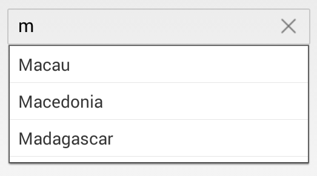
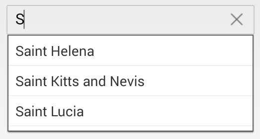
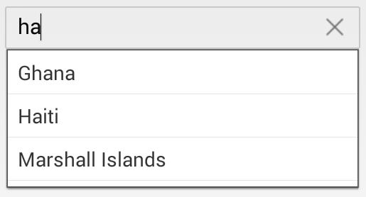
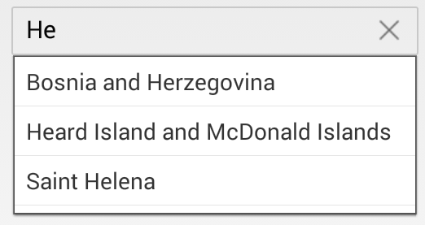
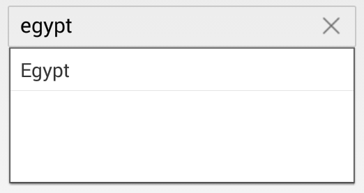
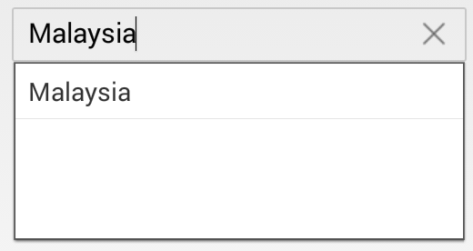
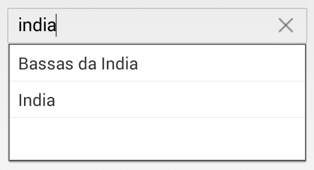
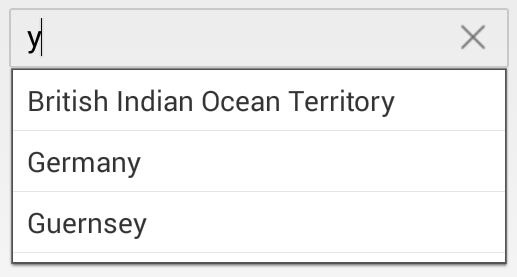

# SuggestionMode

The `SuggestionMode` property is used to decide the filtered data to be displayed. 

N> By default, there are eight types of suggestion modes.

## StartsWith

Display the list of suggestions based on starting letter.
	
	
	

	
	countryAutoComplete.SuggestionMode = SuggestionMode.StartsWith;
	 




  		<autocomplete:SfAutoComplete  x:Name="countryAutoComplete" SuggestionMode="StartsWith" />





## StartsWithCaseSensitive

Display the list of suggestions based on starting letter with case sensitive.




	
	countryAutoComplete.SuggestionMode = SuggestionMode.StartsWithCaseSensitive;
	 




  		<autocomplete:SfAutoComplete  x:Name="countryAutoComplete" SuggestionMode="StartsWithCaseSensitive" />





## Contains

Display the list of suggestions, if autocomplete list contains that words.
	



	
	countryAutoComplete.SuggestionMode = SuggestionMode.Contains;
	 




  		<autocomplete:SfAutoComplete  x:Name="countryAutoComplete" SuggestionMode="Contains" />





## ContainsWithCaseSensitive

Display the list of suggestions, if autoComplete list contains that words with case sensitive.




	
	countryAutoComplete.SuggestionMode = SuggestionMode.ContainsWithCaseSensitive;
	 




  		<autocomplete:SfAutoComplete  x:Name="countryAutoComplete" SuggestionMode="ContainsWithCaseSensitive" />





## Equals

Displays the word that matches.
	



	
	countryAutoComplete.SuggestionMode = SuggestionMode.Equals;
	 




  		<autocomplete:SfAutoComplete  x:Name="countryAutoComplete" SuggestionMode="Equals" />





## EqualsWithCaseSensitive

Displays the word that matches with case sensitive.
	



	
	countryAutoComplete.SuggestionMode = SuggestionMode.EqualsWithCaseSensitive;
	 




  		<autocomplete:SfAutoComplete  x:Name="countryAutoComplete" SuggestionMode="EqualsWithCaseSensitive" />





## EndsWith

Display the list of suggestions based on ending word.


	

	
	countryAutoComplete.SuggestionMode = SuggestionMode.EndsWith;
	 




  		<autocomplete:SfAutoComplete  x:Name="countryAutoComplete" SuggestionMode="EndsWith" />





## EndsWithCaseSensitive

Display the list of suggestions based on the ending word with case sensitive.
	



	
	countryAutoComplete.SuggestionMode = SuggestionMode.EndsWithCaseSensitive;
	 




  		<autocomplete:SfAutoComplete  x:Name="countryAutoComplete" SuggestionMode="EndsWithCaseSensitive" />





