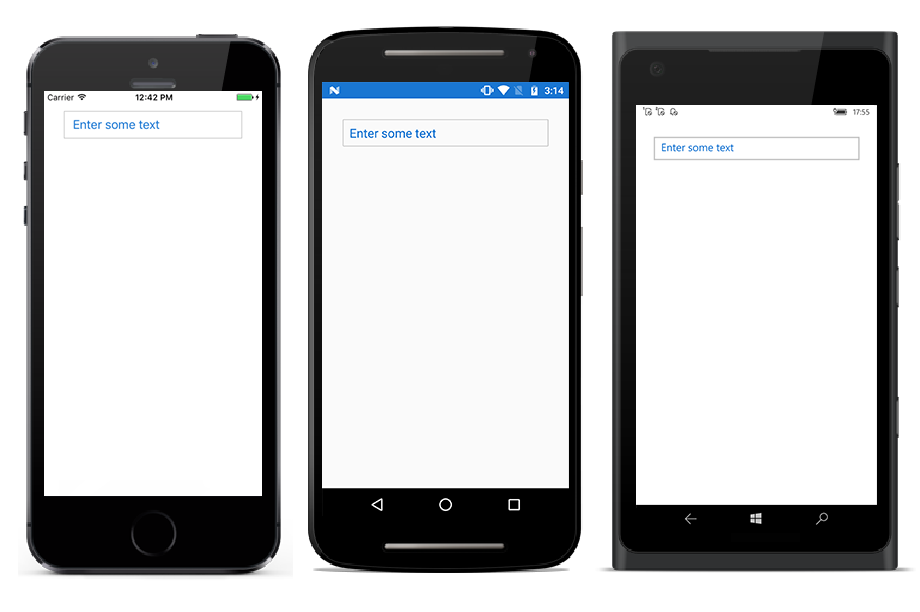

# Watermark

Watermark provides a short note about the type of input to enter in the editor control. Watermarks are visible only if the text is empty. Also it will reappear if the text is cleared.
The following example, explains the usability of watermark which hints user to start with the character “U”.





<StackLayout VerticalOptions="Start" HorizontalOptions="Start" Padding="30">
<autocomplete:SfAutoComplete HeightRequest="40" Watermark="Enter 'U' to filter suggestions" x:Name="autoComplete" />
</StackLayout>





autoComplete.Watermark = "Enter 'U' to filter suggestions"; 





# Changing Watermark Text Color

Text color of watermark can be customized using [`WatermarkColor`] property.





<StackLayout VerticalOptions="Start" HorizontalOptions="Start" Padding="30">
<autocomplete:SfAutoComplete HeightRequest="40" Watermark="Enter some text" WatermarkColor="#1976d2" x:Name="autoComplete" />
</StackLayout>





autoComplete.WatermarkColor = Color.FromHex("1976d2");





## Focus the control

The autocomplete sets the user to focus the autocomplete textbox initially after the control gets rendered using `IsFocused` property.





<StackLayout VerticalOptions="Start" HorizontalOptions="Start" Padding="30">
<autocomplete:SfAutoComplete Watermark="Enter some text" IsFocused="true" x:Name="autoComplete" />
</StackLayout>





autoComplete.Watermark= "Enter some text";
autoComplete.IsFocused = true;



