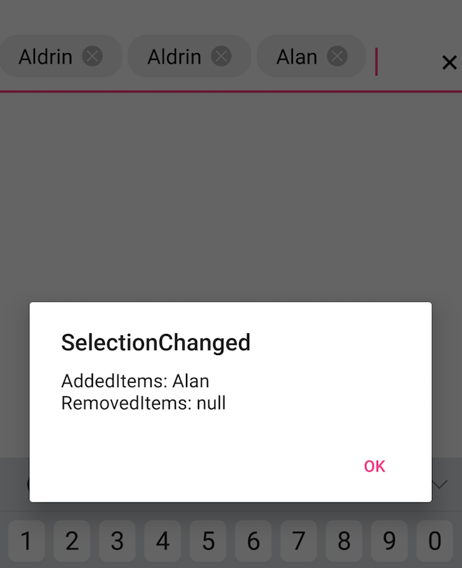

# How to perform an operation while selecting a item from dropdown items?

We can perform an operation while selecting an item among the filtered suggestions using `SelectionChanged` event. SelectionChanged event returns the following arguments

<table>
<tr>
<th>Members</th>
<th>Description</th>
</tr>
<tr>
<td>AddedItems</td>
<td>It shows recently added item in AutoComplete.</td>
</tr>
<tr>
<td>RemovedItems</td>
<td>It shows recently removed items in AutoComplete.</td>
</tr>
</tr>
<tr>
<td>Value</td>
<td>It holds all added items in AutoComplete</td>
</tr>
</table>


[XAML]
<?xml version="1.0" encoding="utf-8"?>
<ContentPage
    xmlns="http://xamarin.com/schemas/2014/forms"
    xmlns:autocomplete="clr-namespace:Syncfusion.SfAutoComplete.XForms;assembly=Syncfusion.SfAutoComplete.XForms"
    xmlns:x="http://schemas.microsoft.com/winfx/2009/xaml" 
    xmlns:local="clr-namespace:Events"
    x:Class="Events.MainPage">
    <ContentPage.BindingContext>
        <local:EmployeeViewModel/>
    </ContentPage.BindingContext>
    <ContentPage.Content>
        <StackLayout>
            <autocomplete:SfAutoComplete
                DisplayMemberPath="Name"
                DataSource="{Binding EmployeeCollection}" 
                SelectionChanged="Handle_SelectionChanged"/>
        </StackLayout> 
    </ContentPage.Content>
</ContentPage>



[C#]
	
using System;
using System.Collections;
using System.Collections.Generic;
using System.Collections.ObjectModel;
using System.Linq;
using System.Text;
using System.Threading.Tasks;
using Xamarin.Forms;

namespace Events
{
    public class Employee
    {
        private int id;
        private string name;

        public int ID
        {
            get
            {
                return this.id;
            }

            set
            {
                this.id = value;
            }
        }

        public string Name
        {
            get
            {
                return this.name;
            }

            set
            {
                this.name = value;
            }
        }
    }

    public class EmployeeViewModel
    {
        private ObservableCollection<Employee> employeeCollection;

        public ObservableCollection<Employee> EmployeeCollection
        {
            get
            {
                return this.employeeCollection;
            }

            set
            {
                this.employeeCollection = value;
            }
        }

        public EmployeeViewModel()
        {
            employeeCollection = new ObservableCollection<Employee>();
            employeeCollection.Add(new Employee() { ID = 1, Name = "Eric" });
            employeeCollection.Add(new Employee() { ID = 2, Name = "James" });
            employeeCollection.Add(new Employee() { ID = 3, Name = "Jacob" });
            employeeCollection.Add(new Employee() { ID = 4, Name = "Lucas" });
            employeeCollection.Add(new Employee() { ID = 5, Name = "Mark" });
            employeeCollection.Add(new Employee() { ID = 6, Name = "Aldan" });
            employeeCollection.Add(new Employee() { ID = 7, Name = "Aldrin" });
            employeeCollection.Add(new Employee() { ID = 8, Name = "Alan" });
            employeeCollection.Add(new Employee() { ID = 9, Name = "Aaron" });
        }
    }

    public partial class MainPage : ContentPage
    {
        void Handle_SelectionChanged(object sender, Syncfusion.SfAutoComplete.XForms.SelectionChangedEventArgs e)
        {
            var addedEmployee = e.AddedItems as Employee;
            string addedItems =  addedEmployee != null ? addedEmployee.Name : "null";
            var removedEmployee = e.RemovedItems as Employee;
            string removedItems = removedEmployee != null ? removedEmployee.Name : "null";
            DisplayAlert("SelectionChanged", "AddedItems: " + addedItems + "\n" + "RemovedItems: " + removedItems, "Ok");
        }

        public MainPage()
        {
            InitializeComponent();
        }
    }
}



While adding the items

While removing the item

