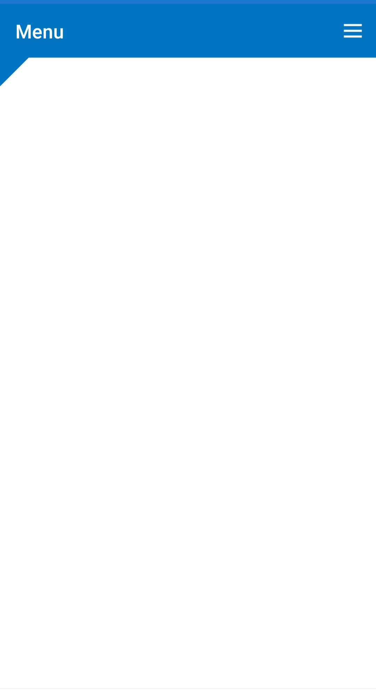

# Corner Shape Customization

Backdrop allows to customize the shapes on the top corners of the front layer. Curved and cut (flat) shape options are available , it can be switched by setting [`EdgeShape`](https://help.syncfusion.com/cr/xamarin/Syncfusion.SfBackdrop.XForms~Syncfusion.XForms.Backdrop.BackdropFrontLayer~EdgeShape.html) property of the front layer.

>**NOTE**
The backdrop can only be shaped on the top left and top right corners.

Both the side of the corner radius can be customized separately by setting [LeftCornerRadius](https://help.syncfusion.com/cr/xamarin/Syncfusion.SfBackdrop.XForms~Syncfusion.XForms.Backdrop.BackdropFrontLayer~LeftCornerRadius.html) and [RightCornerRadius](https://help.syncfusion.com/cr/xamarin/Syncfusion.SfBackdrop.XForms~Syncfusion.XForms.Backdrop.BackdropFrontLayer~RightCornerRadius.html) properties of [BackdropFrontLayer](https://help.syncfusion.com/cr/xamarin/Syncfusion.SfBackdrop.XForms~Syncfusion.XForms.Backdrop.BackdropFrontLayer.html).

 

 

<backdrop:SfBackdropPage.FrontLayer>
        <backdrop:BackdropFrontLayer LeftCornerRadius="30" RightCornerRadius="0" EdgeShape="Flat">
            <Grid />
        </backdrop:BackdropFrontLayer>
</backdrop:SfBackdropPage.FrontLayer> 



 

this.FrontLayer = new BackdropFrontLayer()
{
	Content = new Grid(),
	LeftCornerRadius = 0,
	RightCornerRadius = 30,
	EdgeShape = EdgeShape.Flat
};





>**NOTE**
Flat type shape is not currently available for UWP platform.

