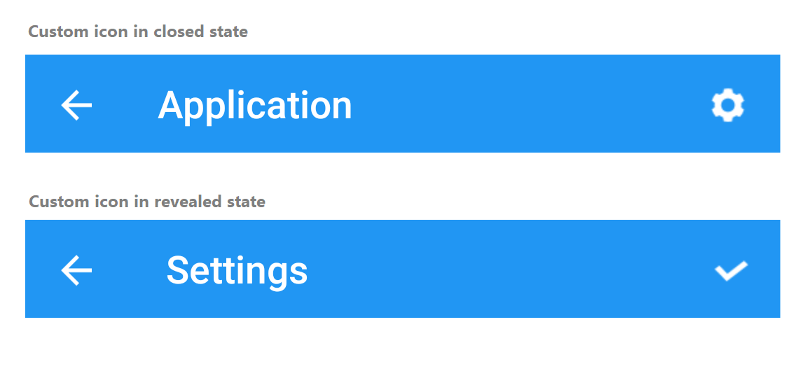

# Header Configuration

Add backdrop page as a children of [`NavigationPage`](https://docs.microsoft.com/en-us/dotnet/api/xamarin.forms.navigationpage?view=xamarin-forms) in App.xaml.cs class. Also, [`BarBackgroundColor`](https://docs.microsoft.com/en-us/dotnet/api/xamarin.forms.navigationpage.barbackgroundcolor?view=xamarin-forms), [`BarTextColor`](https://docs.microsoft.com/en-us/dotnet/api/xamarin.forms.navigationpage.bartextcolor?view=xamarin-forms) and other properties of [`NavigationPage`](https://docs.microsoft.com/en-us/dotnet/api/xamarin.forms.navigationpage?view=xamarin-forms) can be set to customize the default appearance of header.
 
 

// In App.xaml.cs 
#region Constructor

public App()
{ 
   … 
  MainPage = new NavigationPage(new BackdropSamplePage());
   … 
}

#endregion 



>**NOTE**
Page header for the backdrop will appear only when adding backdrop as a children of [`NavigationPage`](https://docs.microsoft.com/en-us/dotnet/api/xamarin.forms.navigationpage?view=xamarin-forms).
 
## Icon customization

The default icons in the navigation header can be customized using the following ways:

### Default icons in navigation page

When the backdrop page is placed within the [NavigationPage](https://docs.microsoft.com/en-us/dotnet/api/xamarin.forms.navigationpage?view=xamarin-forms), the Hamburger icon will be used as Menu icon, and the Close icon (X mark) will be used as Close icon.

### Default icons in MasterDetailsPage

When the backdrop page is placed in the [MasterDetailPage](https://docs.microsoft.com/en-us/dotnet/api/xamarin.forms.masterdetailpage?view=xamarin-forms), the Down arrow icon will be used as Menu icon, and the Up arrow will be used as Close icon.

### Custom icons

You can customize the default icons in the navigation header by setting the OpenIcon and CloseIcon properties in SfBackdropPage.

 

 

<?xml version="1.0" encoding="UTF-8"?>
<backdrop:SfBackdropPage
    xmlns="http://xamarin.com/schemas/2014/forms"
    xmlns:x="http://schemas.microsoft.com/winfx/2009/xaml"
    xmlns:backdrop="clr-namespace:Syncfusion.XForms.Backdrop;assembly=Syncfusion.SfBackdrop.XForms"
    x:Class="BackdropGettingStarted.BackdropSamplePage"
    OpenIcon="open.png"
    CloseIcon="close.png"
    Title="Menu">
</backdrop:SfBackdropPage>



 

using Syncfusion.XForms.Backdrop;	
namespace BackdropGettingStarted
{
    public partial class BackdropSamplePage : SfBackdropPage
    {
        public BackdropSamplePage()
        {
            InitializeComponent();
            this.OpenIcon = "open.png";
            this.CloseIcon = "close.png";
	    this.Title = "Menu";
        }
    }
}





 
 
