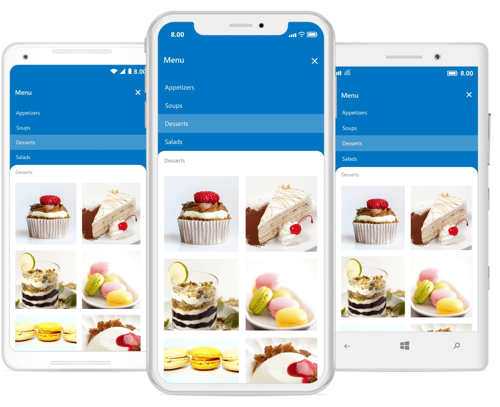

# Overview

The new backdrop page is composed of two surfaces, a back layer and a front layer. The back layer displays actions, which updates the front layer’s content.

## Key features
* Allows to integrate with the Xamarin.Forms [`ContentPage`](https://docs.microsoft.com/en-us/dotnet/api/xamarin.forms.contentpage?view=xamarin-forms) and supports seamless navigation and toolbar customizations.
* Adjusts the height of back layer automatically based on its content and provides an option to expand the content to fit the screen.
* Supports curved and flat edge shapes for the front layer with corner radius customization options.
* Provides smooth animations for revealing and concealing the back layer content.

