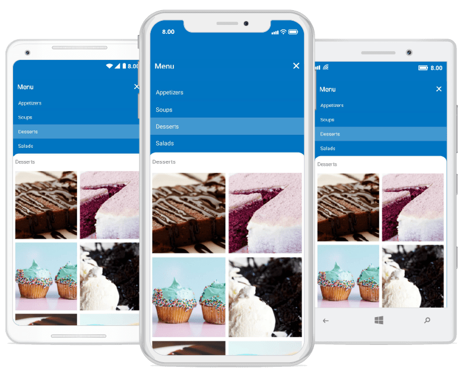

# Overview

The new backdrop page composed of two surfaces, a back layer and a front layer. The back layer displays actions which will update the front layer’s content.

## Key features
* Integrates with the Xamarin.Forms [`ContentPage`](https://docs.microsoft.com/en-us/dotnet/api/xamarin.forms.contentpage?view=xamarin-forms) and supports seamless navigation and toolbar customizations.
* Back layer height automatically adjusts based on its content, and provides an option to expand the content to fit the screen.
* Curved and flat edge shapes for the front layer with corner radius customization options.
* Smooth animations for revealing and concealing the back layer content.
