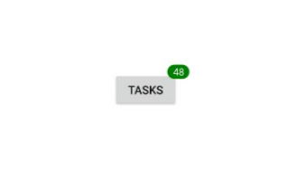
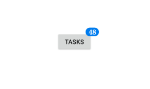
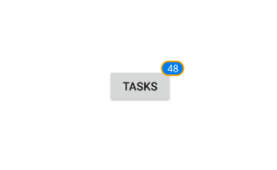
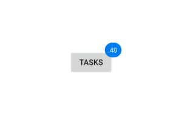
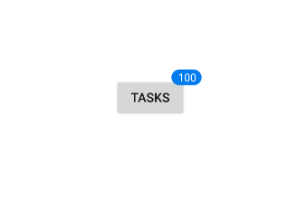

---

layout: post
title: Badge settings with Syncfusion Badge View control for Xamarin.Forms
description: Learn how to set Syncfusion badge view settings in Xamarin.Forms platform
platform: xamarin
control: SfBadgeView
documentation: ug

---

# Badge Settings

The [`BadgeSettings`](https://help.syncfusion.com/cr/cref_files/xamarin/Syncfusion.SfBadgeView.XForms~Syncfusion.XForms.BadgeView.SfBadgeView~BadgeSettings.html) property helps you customize the basic look and feel of the badge view. 
[`BadgeSettings`](https://help.syncfusion.com/cr/cref_files/xamarin/Syncfusion.SfBadgeView.XForms~Syncfusion.XForms.BadgeView.SfBadgeView~BadgeSettings.html) contains the sub elements such as badge types, positions, icons, colors, and alignments. You can customize the background color, text color, stroke color, width, offset, and font attributes.

## Badge background customization

Set the [`BadgeType`](https://help.syncfusion.com/cr/cref_files/xamarin/Syncfusion.SfBadgeView.XForms~Syncfusion.XForms.BadgeView.BadgeSetting~BadgeType.html) to `None`. You can customize the color of the badge view using the [`BackgroundColor`](https://help.syncfusion.com/cr/cref_files/xamarin/Syncfusion.SfBadgeView.XForms~Syncfusion.XForms.BadgeView.BadgeSetting~BackgroundColor.html) property.





<badge:SfBadgeView BadgeText="48" >
    <badge:SfBadgeView.Content>
        <Button Text ="Tasks" />
    </badge:SfBadgeView.Content>
    <badge:SfBadgeView.BadgeSettings>
        <badge:BadgeSetting BadgeType="None" BackgroundColor="Green" />
    </badge:SfBadgeView.BadgeSettings>
</badge:SfBadgeView>





SfBadgeView sfBadgeView = new SfBadgeView();
sfBadgeView.BadgeText = "48";
Button button = new Button();
button.Text = "Tasks";
sfBadgeView.Content = button;
BadgeSetting badgeSetting = new BadgeSetting();
badgeSetting.BadgeType = BadgeType.None;
badgeSetting.BackgroundColor = Color.Green;
sfBadgeView.BadgeSettings = badgeSetting;
    




## Font customization

The font can be customized using the [`FontSize`](https://help.syncfusion.com/cr/cref_files/xamarin/Syncfusion.SfBadgeView.XForms~Syncfusion.XForms.BadgeView.BadgeSetting~FontSize.html), [`FontAttributes`](https://help.syncfusion.com/cr/cref_files/xamarin/Syncfusion.SfBadgeView.XForms~Syncfusion.XForms.BadgeView.BadgeSetting~FontAttributes.html), and [`FontFamily`](https://help.syncfusion.com/cr/cref_files/xamarin/Syncfusion.SfBadgeView.XForms~Syncfusion.XForms.BadgeView.BadgeSetting~FontFamily.html) properties.





<badge:SfBadgeView BadgeText="48">
    <badge:SfBadgeView.Content>
        <Button Text ="Tasks" />
    </badge:SfBadgeView.Content>
    <badge:SfBadgeView.BadgeSettings>
        <badge:BadgeSetting FontSize="15" FontAttributes="Bold">
            <badge:BadgeSetting.FontFamily>
                <OnPlatform x:TypeArguments="x:String" iOS="Chalkduster" Android="serif" WinPhone="Chiller" />
            </badge:BadgeSetting.FontFamily>
        </badge:BadgeSetting>
    </badge:SfBadgeView.BadgeSettings>
</badge:SfBadgeView>





SfBadgeView sfBadgeView = new SfBadgeView();
sfBadgeView.BadgeText = "48";
Button button = new Button();
button.Text = "Tasks";
sfBadgeView.Content = button;
BadgeSetting badgeSetting = new BadgeSetting();
badgeSetting.FontAttributes = FontAttributes.Bold;
badgeSetting.FontSize = 15;
badgeSetting.FontFamily = Device.RuntimePlatform == Device.iOS ? "Chalkduster" : Device.RuntimePlatform == Device.Android ? "serif" : "Chiller";
sfBadgeView.BadgeSettings = badgeSetting;
    




## Stroke customization

The stroke color and stroke width of the badge view can be customized using the [`Stroke`](https://help.syncfusion.com/cr/cref_files/xamarin/Syncfusion.SfBadgeView.XForms~Syncfusion.XForms.BadgeView.BadgeSetting~Stroke.html) and [`StrokeWidth`](https://help.syncfusion.com/cr/cref_files/xamarin/Syncfusion.SfBadgeView.XForms~Syncfusion.XForms.BadgeView.BadgeSetting~StrokeWidth.html) properties, respectively.





<badge:SfBadgeView BadgeText="48">
    <badge:SfBadgeView.Content>
        <Button Text ="Tasks"/>
    </badge:SfBadgeView.Content>
    <badge:SfBadgeView.BadgeSettings>
        <badge:BadgeSetting Stroke="Orange" StrokeWidth="2" />
    </badge:SfBadgeView.BadgeSettings>
</badge:SfBadgeView>
              




SfBadgeView sfBadgeView = new SfBadgeView();
sfBadgeView.BadgeText = "48";
Button button = new Button();
button.Text = "Tasks";
sfBadgeView.Content = button;
BadgeSetting badgeSetting = new BadgeSetting();
badgeSetting.Stroke = Color.Orange;
badgeSetting.StrokeWidth = 2;
sfBadgeView.BadgeSettings = badgeSetting;
    




## Text customization

The text color and margin of badge view can be changed using the [`TextColor`](https://help.syncfusion.com/cr/cref_files/xamarin/Syncfusion.SfBadgeView.XForms~Syncfusion.XForms.BadgeView.BadgeSetting~TextColor.html) and [`TextPadding`](https://help.syncfusion.com/cr/cref_files/xamarin/Syncfusion.SfBadgeView.XForms~Syncfusion.XForms.BadgeView.BadgeSetting~TextPadding.html) properties, respectively.





<badge:SfBadgeView BadgeText="48">
    <badge:SfBadgeView.Content>
        <Button Text ="Tasks" />
    </badge:SfBadgeView.Content>
    <badge:SfBadgeView.BadgeSettings>
        <badge:BadgeSetting TextColor="LightYellow" TextPadding="10"/>
    </badge:SfBadgeView.BadgeSettings>
</badge:SfBadgeView>      





SfBadgeView sfBadgeView = new SfBadgeView();
sfBadgeView.BadgeText = "48";
Button button = new Button();
button.Text = "Tasks";
sfBadgeView.Content = button;
BadgeSetting badgeSetting = new BadgeSetting();
badgeSetting.TextColor = Color.LightYellow;
badgeSetting.TextPadding = 10;
sfBadgeView.BadgeSettings = badgeSetting;
    




## Alignment of badge

You can align the badge view using the `Center`, `Start`, and `End` properties of [`BadgeAlignment`](https://help.syncfusion.com/cr/cref_files/xamarin/Syncfusion.SfBadgeView.XForms~Syncfusion.XForms.BadgeView.BadgeSetting~BadgeAlignment.html) property. Set the control size as same as the content size to enable alignment work for badge view.





<badge:SfBadgeView BadgeText="48" HeightRequest="100" WidthRequest="100">
    <badge:SfBadgeView.Content>
        <Image Source="BadgeWhatsApp.png" HeightRequest="100" WidthRequest="100"/>
    </badge:SfBadgeView.Content>
    <badge:SfBadgeView.BadgeSettings>
        <badge:BadgeSetting BadgeAlignment="Start"/>
    </badge:SfBadgeView.BadgeSettings>
</badge:SfBadgeView>         





SfBadgeView sfBadgeView = new SfBadgeView();
sfBadgeView.HeightRequest = 100;
sfBadgeView.WidthRequest = 100;
sfBadgeView.BadgeText = "48";
Image image = new Image();
image.Source = "BadgeWhatsApp.png";
image.HeightRequest = 100;
image.WidthRequest = 100;
sfBadgeView.Content = image;
BadgeSetting badgeSetting = new BadgeSetting();
badgeSetting.BadgeAlignment = BadgeAlignment.Start;
sfBadgeView.BadgeSettings = badgeSetting;
    




## Setting badge types

You can change the colors of the badge using the [`BadgeType`](https://help.syncfusion.com/cr/cref_files/xamarin/Syncfusion.SfBadgeView.XForms~Syncfusion.XForms.BadgeView.BadgeSetting~BadgeType.html) property. The badge supports the following eight different essential colors for various situations:

 * Dark
 * Error
 * Info
 * Light
 * None
 * Primary
 * Secondary
 * Success
 * Warning





<badge:SfBadgeView BadgeText="8" HeightRequest="60" WidthRequest="50">
    <badge:SfBadgeView.Content>
        <Image Source="BadgeFacebook.png" HeightRequest="60" WidthRequest="50"/>
    </badge:SfBadgeView.Content>
    <badge:SfBadgeView.BadgeSettings>
        <badge:BadgeSetting BadgeType="Error" Offset="-5,10"/>
    </badge:SfBadgeView.BadgeSettings>
</badge:SfBadgeView>





SfBadgeView sfBadgeView = new SfBadgeView();
sfBadgeView.HeightRequest = 60;
sfBadgeView.WidthRequest = 50;
sfBadgeView.BadgeText = "8";
Image image = new Image();
image.Source = "BadgeFacebook.png";
image.HeightRequest = 60;
image.WidthRequest = 50;
sfBadgeView.Content = image;
BadgeSetting badgeSetting = new BadgeSetting();
badgeSetting.BadgeType = BadgeType.Error;
badgeSetting.Offset = new Point(-5, 10);
sfBadgeView.BadgeSettings = badgeSetting;
    




## Setting badge position

The default position of notification is `TopRight`. You can change the position to the `TopLeft`, `BottomLeft`, and `BottomRight` using the [`BadgePosition`](https://help.syncfusion.com/cr/cref_files/xamarin/Syncfusion.SfBadgeView.XForms~Syncfusion.XForms.BadgeView.BadgeSetting~BadgePosition.html) properties. After set the badge position, you can adjust the badge text using the [`Offset`](https://help.syncfusion.com/cr/cref_files/xamarin/Syncfusion.SfBadgeView.XForms~Syncfusion.XForms.BadgeView.BadgeSetting~Offset.html) property.





<badge:SfBadgeView BadgeText="8" HeightRequest="60" WidthRequest="50">
    <badge:SfBadgeView.Content>
        <Image Source="BadgeImage9.png" HeightRequest="60" WidthRequest="50"/>
    </badge:SfBadgeView.Content>
    <badge:SfBadgeView.BadgeSettings>
        <badge:BadgeSetting BadgeType="Success"  Offset="0, -10" BadgePosition="BottomRight"/>
    </badge:SfBadgeView.BadgeSettings>
</badge:SfBadgeView>





SfBadgeView sfBadgeView = new SfBadgeView();
sfBadgeView.BadgeText = "8";
sfBadgeView.HeightRequest = 60;
sfBadgeView.WidthRequest = 50;
Image image = new Image();
image.Source = "BadgeImage9.png";
image.HeightRequest = 60;
image.WidthRequest = 50;
sfBadgeView.Content = image;
BadgeSetting badgeSetting = new BadgeSetting();
badgeSetting.BadgeType = BadgeType.Success;
badgeSetting.BadgePosition = BadgePosition.BottomRight;
badgeSetting.Offset = new Point(0, -10);
sfBadgeView.BadgeSettings = badgeSetting; 
    




## Setting badge icon

You can change the badge icon using the [`BadgeIcon`](https://help.syncfusion.com/cr/cref_files/xamarin/Syncfusion.SfBadgeView.XForms~Syncfusion.XForms.BadgeView.BadgeSetting~BadgeIcon.html) property. The badge supports the following types of [`BadgeIcon`](https://help.syncfusion.com/cr/cref_files/xamarin/Syncfusion.SfBadgeView.XForms~Syncfusion.XForms.BadgeView.BadgeSetting~BadgeIcon.html):

* Add
* Available
* Away
* Busy
* Delete 
* Dot
* None
* Prohibit1
* Prohibit2





<badge:SfBadgeView HeightRequest="60" WidthRequest="50">
    <badge:SfBadgeView.Content>
        <Image Source="BadgeImage9.png" HeightRequest="60" WidthRequest="50"/>
    </badge:SfBadgeView.Content>
    <badge:SfBadgeView.BadgeSettings>
        <badge:BadgeSetting BadgeType="Warning"  Offset="0, -10" BadgePosition="BottomRight" BadgeIcon="Away"/>         
    </badge:SfBadgeView.BadgeSettings>
</badge:SfBadgeView>





SfBadgeView sfBadgeView = new SfBadgeView();
sfBadgeView.HeightRequest = 60;
sfBadgeView.WidthRequest = 50;
Image image = new Image();
image.Source = "BadgeImage9.png";
image.HeightRequest = 60;
image.WidthRequest = 50;
sfBadgeView.Content = image;
BadgeSetting badgeSetting = new BadgeSetting();
badgeSetting.BadgeType = BadgeType.Warning;
badgeSetting.BadgeIcon = BadgeIcon.Away;
badgeSetting.BadgePosition = BadgePosition.BottomRight;
badgeSetting.Offset = new Point(0, -10);
sfBadgeView.BadgeSettings = badgeSetting;
    




## Setting corner radius of the badge

The [`CornerRadius`](https://help.syncfusion.com/cr/cref_files/xamarin/Syncfusion.SfBadgeView.XForms~Syncfusion.XForms.BadgeView.BadgeSetting~CornerRadius.html) property is used to reduce the radius of the corners.





  <badge:SfBadgeView BadgeText="100">
    <badge:SfBadgeView.Content>
        <Button Text="Tasks"/>
    </badge:SfBadgeView.Content>
    <badge:SfBadgeView.BadgeSettings>
                <badge:BadgeSetting CornerRadius="10"/>
    </badge:SfBadgeView.BadgeSettings>
</badge:SfBadgeView>





SfBadgeView sfBadgeView = new SfBadgeView();
sfBadgeView.BadgeText = "100";
Button button = new Button();
button.Text = "Tasks";
sfBadgeView.Content = button;
BadgeSetting badgeSetting = new BadgeSetting();
badgeSetting.CornerRadius = 10;
sfBadgeView.BadgeSettings = badgeSetting;
    




